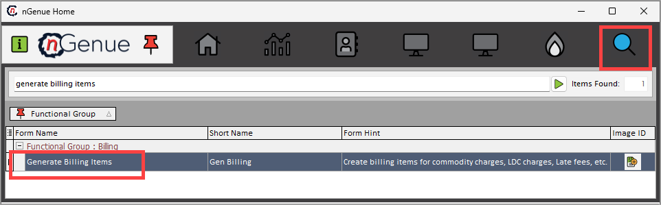
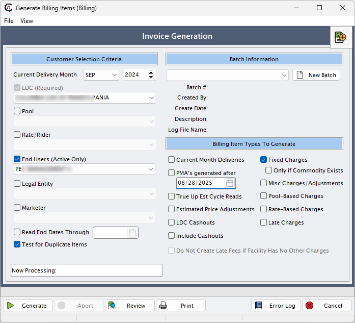
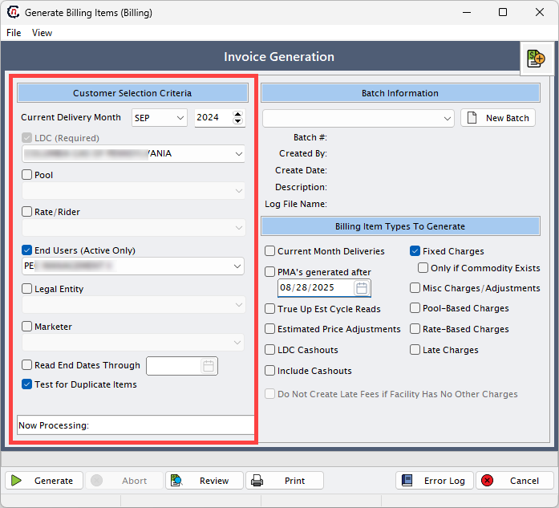
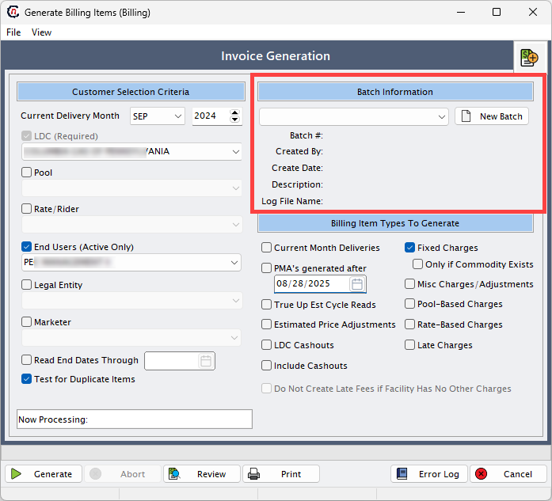
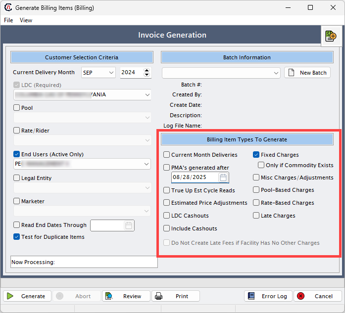
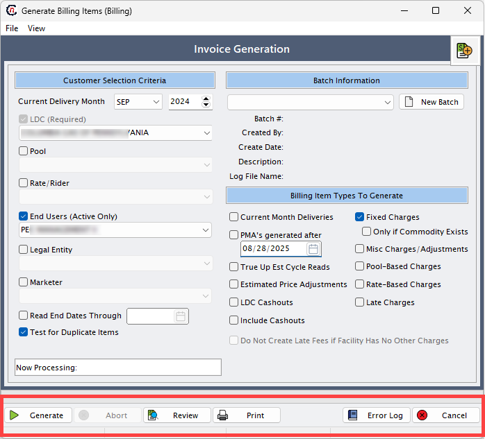

# Understanding billing generation

**Billing generation** is the process of creating billing batches for end users based on their usage, pricing agreements, and applicable charges. This function ensures that bills are calculated accurately and consistently for the selected delivery month. It is one of the most critical activities in the billing cycle because it not only drives invoicing but also impacts financial reporting, revenue recognition, and customer satisfaction. A well-structured billing generation process ensures that all required charges are included, errors are identified before finalization, and the results are transparent for review and correction.

The billing generation purpose can be summarized as follows:

* Automates the calculation of billing charges, reducing the need for manual invoice preparation.  
* Ensures that customer-specific price agreements, riders, and pools are applied accurately to each billing run.  
* Provides flexibility by allowing administrators to select which types of charges (for example, fixed charges, rate-based charges, late fees, or LDC cashouts) should be included in the billing batch.  
* Generates detailed billing line items that can be reviewed for validation before final approval.  
* Reduces manual errors by enforcing structured data entry and system-driven calculations.     
* Provides transparency into billing results so that discrepancies can be caught early and corrected.  

## Generate and review billing batches
The following article will help you understand the process to generate and review billing batches in nGenue.

### Step 1: Access the Billing generation screen

The **Billing generation** screen can be accessed directly from the application home page. To navigate, the user types *generate billing items* into the quick search bar. From the search results, the **Generate billing items** option can be selected.

This opens the **Generate billing items** screen where all parameters and options for creating a batch are available. 

!!!note "Note"
    Access to this screen is generally restricted to users with appropriate billing or administrative roles because of its financial significance.

### Step 2: Fill the key fields in the Generate billing items screen

The **Generate billing items** screen contains several important fields and options. Each field plays a specific role in defining how the billing batch will be generated. A detailed description of each field is provided below:

#### Customer selection criteria

This section defines which customer accounts and associated records will be included in the billing generation process. Fields allow filtering by delivery month, LDC, pool, rate/rider, and other identifiers.

| Field | Description |
|---|---|
| Current delivery month | Defines the delivery month for which billing is being generated. All usage, charges, and price agreements will be calculated for this specific month. For example, if the current delivery month is set to *August 2025*, all billing items generated will relate to that month’s consumption and pricing terms. |
| [LDC (required)](../ldcs/ldcs_overview.md) | Refers to the LDC for which billing is being prepared. Since different LDCs may have unique billing structures, selecting the correct LDC ensures that the right pricing, riders, and charges are applied to the end users under that service territory. |
| [Pool](../ldcs/pool_management/understand_pool_management.md) | A pool is a grouping of end users under a particular LDC. Pools often represent a specific service area, load group, or delivery arrangement. Selecting the right pool ensures that the system applies charges correctly to the intended customer group. |
| [Rate/rider](../ldcs/ldcs_rider/configure_ldcs_riders.md) | Determines which pricing structure or rider should be applied to the billing. A rider may include special surcharges, discounts, or additional fees. This field ensures that customer contracts tied to specific rates are billed according to their agreed terms. |
| [End users (active only)](../getting_started/end_users/overview.md) | Specifies the active end users to include in billing. Only customers with active contracts for the chosen delivery month will be billed. |
| [Legal entity](../getting_started/inbook_structure.md#understanding-book-structure-legal-entity-business-unit-strategy-and-portfolio) | Represents the registered company that owns the billing relationship. This allows billing to be tied to a specific legal entity in multi-entity organizations. |
| Marketer | Identifies the marketer or supplier responsible for the gas supply. This field allows billing runs to be filtered by marketer, if applicable. |
| Read end dates through | Sets an end date for including meter reads or usage records. Only reads with dates on or before the selected value are considered. |
| Test for duplicate items | Ensures that billing does not generate duplicate line items for the same customer, contract, and delivery month. This is a safeguard against billing errors. |

#### Batch information

This section allows the creation and management of billing batches. A batch acts as a container for billing results and can be tracked, audited, and reprocessed if needed.

| Field | Description |
|-------|-------------|
| New batch | Allows the creation of a new billing batch. A batch acts as a container for all billing records generated in a single run. Each batch can be uniquely identified, stored, and re-run if needed. This helps track billing activities separately by time period, customer group, or LDC. |
| Batch # | The unique identifier for the billing batch. It helps track and retrieve batches in future processing. |
| Created by | Displays the username of the person who initiated the billing batch. Useful for audit and accountability. |
| Create date | The system-generated timestamp when the batch was created. |
| Description | An optional text field for describing the purpose of the batch, such as *“September 2024 Retail Billing”*. |
| Log file name | Stores the name of the log file generated during billing. This log contains system messages and helps troubleshoot issues. |

#### Billing item types to generate

This section provides checkboxes to select which types of charges should be included when generating billing items. Each option controls a different category of fees or adjustments.

##### Current month deliveries
When the **Current month deliveries** checkbox is selected, billing is calculated based on the customer’s usage for the selected delivery month.

* For **daily customers**, billing is processed using daily meter readings.  
* For **monthly customers**, billing is processed using monthly meter readings.

##### Fixed charges
If a recurring fee is configured in the [**Price agreements**](../getting_started/end_users/add_price_agreement.md) screen, select this checkbox to include the fee in billing.  

!!!note "Note"
    1. If the **Fixed fee** checkbox is selected, the **Only if commodity exists** checkbox gets enabled.  
    2. Select the **Only if commodity exists** checkbox if the fixed fee should apply only to customers who have usage.  

##### Pool-based charges
Select this checkbox to include charges that apply uniformly to all end users who belong to a specific LDC pool.  
For example: If a transportation fee or administrative fee needs to be charged to every customer in a particular pool, instead of adding this fee manually for each customer, assign the charge to the pool.

**Steps to configure pool-based charges**:

1. Go to the [**LDC Pool**](../ldcs/pool_management/understand_pool_management.md) screen and select a pool.  
2. Click on **View or assign LDC charges to this pool** icon.  
3. Assign charges to the pool from this screen.  
4. These charges will be applied to all end users under the selected pool when the **Pool-based charge** checkbox is selected.  

##### Rate-based charges
Select this checkbox to include charges that apply to all end users assigned to a specific rate or tariff. 
For example: If a service or regulatory fee is applicable to every customer under a particular rate plan, the charge can be configured at the rate level instead of assigning it individually to each end user. 

**Steps to configure rate-based charges**:

1. Go to the [**LDC Rate class**](../ldcs/ldcs_rider/configure_ldcs_riders.md) screen and define the rate/rider.  
2. Click on the **Assign LDC charges to this tariff** icon.  
3. Add charges at the rate level.  
4. These charges are assigned to all end users linked to the selected rate or rider.  
5. The charge will be included in billing if the **Rate-based charge** checkbox is selected.  

##### Late charges
Select this checkbox to include late fees when payment is made after the invoice due date.  

**Steps to configure late charges**:

1. Configure the effective date for late fee calculation in the **Finance charge type** screen.  
2. The charge will be applied based on the configured rate and effective date.  
3. The calculation method can be set from the **Finance method** dropdown in the **A/R tab** on the [**End user**](../getting_started/end_users/overview.md) screen.  

    !!!note "Note"  
        1. If the **Late charges** checkbox is selected, the **Do not create late fee if facility has no other charges** checkbox gets enabled.  
        2. Selecting this option prevents late fees when no other charges exist for the facility.  

##### Cashout
Select this checkbox to include **cashouts** configured at the price agreements level. Cashouts represent adjustments made when actual usage differs from scheduled or contracted volumes.  

!!!note "Note"
    These cashouts can be set up in the **Retail cashouts** tab within the [**Price agreements**](../getting_started/end_users/add_price_agreement.md) screen.  

##### LDC cashouts *(currently not in use)*
This checkbox applies when cashouts are settled at the **LDC level** instead of with individual end users.  
For example: The LDC settles imbalances for an entire delivery pool.  

!!!note "Note"
    These charges can be set up in the **Other cashouts** tab in the [**Price agreements**](../getting_started/end_users/add_price_agreement.md) screen.  

##### Misc charges / adjustments
Select this checkbox to generate invoice items for miscellaneous charges or adjustments within a valid date range. These charges are **non-standard fees or credits**, outside of regular billing items.  

For examples:  
1. Manual adjustment to correct a previous billing error  
2. Refunds or credits.

!!!note "Note"
    Miscellaneous charges can be set up in the **Miscellaneous daily charges** screen.

##### True-up est cycle reads *(currently not in use)*
This checkbox is used to handle billing adjustments when an actual meter reading is received after a bill was previously generated using an estimated read. When an actual meter reading comes in, it reverses previous invoiced items.

For example: A bill was generated with an estimated read of `1200 MMBtu` for July. Later, the actual read shows `1100 MMBtu`. Selecting this checkbox will automatically reverse the `1200 MMBtu` billing and generate corrected billing for `1100 MMBtu`.

##### Do not create late fee if facility has no other charges
This checkbox is enabled only when the **Late charges** checkbox is selected. It prevents late fees from being applied if the facility has no usage or other charges for billing.

##### PMAs generated after *(currently not in use)*
This option was intended to filter price management agreements (PMAs) created after a specified date.

##### Estimated price adjustments *(currently not in use)*
This option was designed to adjust billing when estimated prices were used earlier and need to be corrected with actual values.  

#### Action buttons

At the bottom of the screen, action buttons allow users to process and review billing runs.

| Button | Description |
|--------|-------------|
| Generate | Initiates the billing process with the selected parameters and options. |
| Abort | Stops the billing process if it is currently running. |
| Review | Displays the detailed billing output, including usage, rates, amounts, taxes, and adjustments. |
| Print | Prints the batch results or review screen for offline validation. |
| Error log | Opens a log of all errors encountered during billing generation, helping users resolve issues before finalizing. |
| Cancel | Closes the billing generation screen without saving or processing. |

<!-- | Field | Description |
|-------|-------------|
| **Current delivery month** | Defines the delivery month for which billing is being generated. All usage, charges, and price agreements will be calculated for this specific month. For example, if the current delivery month is set to *August 2025*, all billing items generated will relate to that month’s consumption and pricing terms. |
| **New batch** | Allows the creation of a new billing batch. A batch acts as a container for all billing records generated in a single run. Each batch can be uniquely identified, stored, and re-run if needed. This helps track billing activities separately by time period, customer group, or LDC. |
| **Select LDC** | Refers to the LDC for which billing is being prepared. Since different LDCs may have unique billing structures, selecting the correct LDC ensures that the right pricing, riders, and charges are applied to the end users under that service territory. |
| **Pool** | A pool is a grouping of end users under a particular LDC. Pools often represent a specific service area, load group, or delivery arrangement. Selecting the right pool ensures that the system applies charges correctly to the intended customer group. |
| **Rate/Rider** | Determines which pricing structure or rider should be applied to the billing. A rider may include special surcharges, discounts, or additional fees. This field ensures that customer contracts tied to specific rates are billed according to their agreed terms. |
| **Billing items to generate** | This field allows users to select the types of charges that should be included in the billing run. Options may include:   - **Fixed charges**: Recurring charges independent of usage.   - **Rate-based charges**: Charges calculated based on actual usage and rates.   - **Late charges**: Penalties applied for overdue payments.   - **LDC cashouts**: Adjustments related to imbalances or true-ups with the LDC.   - **Current month deliveries**: Charges for gas delivered during the selected delivery month. By selecting these items, users can control the scope of charges included in the batch. | -->

### Step 3: Generate billing

Once the required parameters are filled, the user can generate the billing batch. The mandatory fields that must be entered before generation are: local distribution company (LDC), batch, delivery month, end user, and pool. After filling these, click on the **Generate** button to initiate the billing process.  

When the system runs billing, it calculates charges based on usage, price agreements, and any tiered pricing structures. The output is a set of detailed billing line items, which can be reviewed before invoices are finalized. The **Review invoice item batch** function allows the user to see exactly what the system has calculated, including:  

* Usage recorded for the delivery month.  
* Price per unit as defined in the rate or rider.  
* Final billing amount after calculations.  
* Sales tax applied based on jurisdiction.  
* Tier-wise breakdown if the pricing agreement includes multiple usage tiers.  

This review step is critical because it acts as a validation checkpoint and confirm that charges are calculated as expected before moving forward to invoice generation.  

## Error handling in billing generation

Sometimes errors occur during the billing generation, often due to missing or mismatched data. When this happens, the system displays a warning message:  

> *“There are errors while generating billing. Do you want to view them?”*  

If the user selects **Yes**, an error log is displayed. The error log lists all issues that prevented billing from completing successfully. Typical errors include:  

* Effective date of a charge does not match the delivery month.  
* Required fields missing in the price agreement (for example, missing tier rates).  
* Incomplete tier configuration where usage tiers are defined but not mapped correctly.  

Billing cannot be finalized until all errors are resolved. This ensures that no inaccurate invoices are created, protecting both the company and the customer from disputes.  

If billing completes without errors, the system displays a confirmation message:  

> *“Process complete.”*  

This indicates that billing items have been successfully generated and are ready for invoicing. 

---

<!-- Billing generation is more than just a technical process. It is the bridge between raw operational data (usage, contracts, and prices) and the financial outcomes (invoices, revenue, and compliance). By automating calculations, validating results, and ensuring error-free records, the billing generation process strengthens financial accuracy and operational efficiency across the business.   -->
