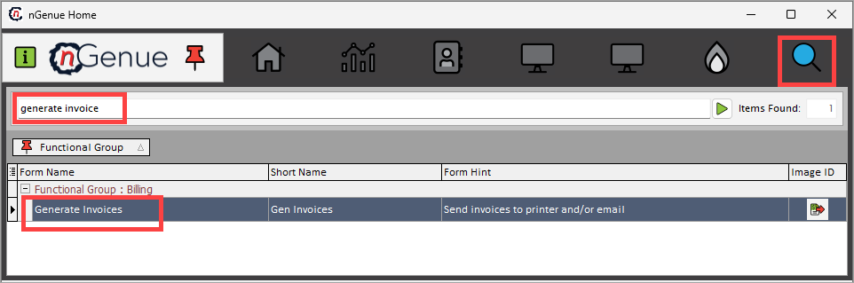
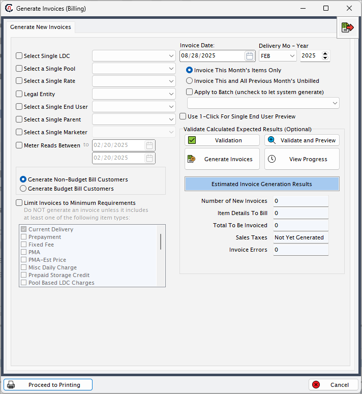
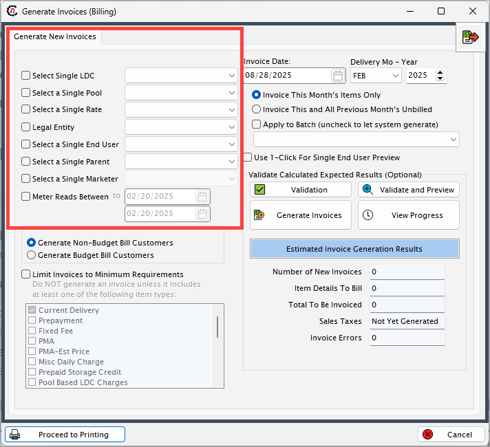
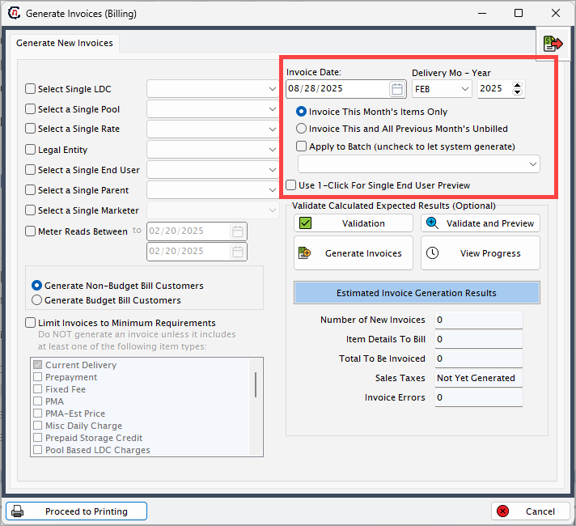
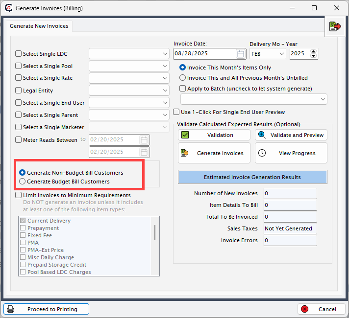
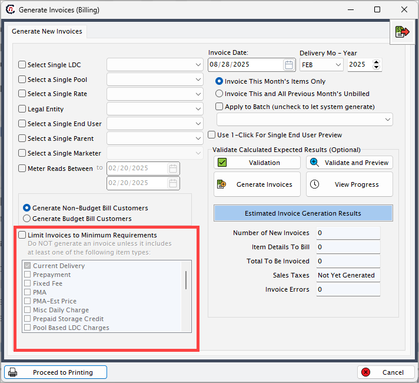
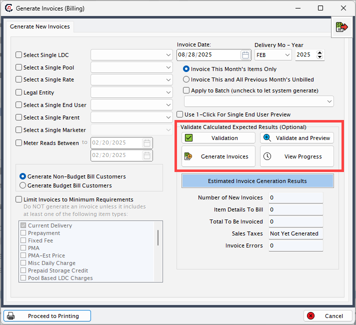
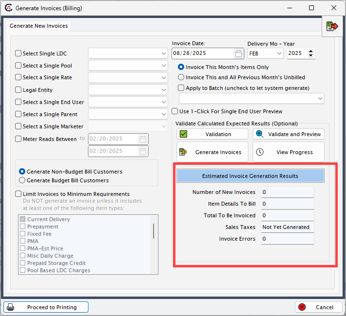

# Generate an invoice

Invoice generation is the process of creating formal invoices for end users based on validated billing data. It compiles all eligible billing items for the selected delivery month, ensuring accuracy, compliance, and transparency in customer communication.

The purpose of invoice generation is to ensure that all eligible billing items are compiled into accurate and complete invoices for the selected delivery month. This process supports:  

* Clear communication of charges to end users  
* Accurate revenue recognition for the company  
* Validation of billing data before creating invoices  
* Timely preparation of invoices for printing or distribution.  

By automating invoice creation, the process reduces manual effort, minimizes errors, and ensures that invoices comply with customer-specific billing rules.

## Procedure to generate an invoice
The following section provides step-by-step instructions for generating invoices in nGenue. 

### Step 1: Accessing the Generate invoices (Billing) screen

The **Generate invoices (Billing)** screen can be accessed directly from the application home page. To navigate, the user types *generate invoice* into the quick search bar. From the search results, the **Generate invoice (Billing)** option can be selected.

### Step 2: Fill in the key fields

The **Generate invoices (Billing)** screen is used to create invoices for end users after billing items have been successfully validated. This screen provides various filters and options to control how invoices are generated, who they are generated for, and what details appear in them.

#### Invoice parameters

These fields define the scope of invoice generation.

| Field | Description |
|-------|-------------|
| Select single LDC | Choose the local distribution company (LDC) for which invoices should be generated. This is a primary filter. If left blank, invoices will be generated for all available LDCs. |
| Select a single pool | Filters invoices for customers associated with a specific pool within the selected LDC. Useful for targeted invoice generation. |
| Select a single rate | Restricts invoice generation to customers under a specific rate or tariff class. Helpful when invoices need to be prepared based on regulatory rates. |
| Legal entity | Option to filter invoice generation based on a legal entity within the organization. |
| Select a single end user | Generates invoices for only one specific end user. Typically used for testing, spot-checking, or resolving invoice errors. |
| Select a single parent | Restricts invoice generation to a parent customer account and its associated child accounts. |
| Select a single marketer | Filters invoice generation for a specific marketer (useful when multiple marketers are associated with the same LDC). |
| Meter reads between | Allows users to define a start and end date range for meter reads to be considered during invoice generation. This ensures that invoices reflect only usage within the selected date range. |

#### Invoice settings

These options define the invoice date, billing period, and specific rules for how charges are included.

| Field | Description |
|-------|-------------|
| Invoice date | The date that will appear on the generated invoice. Typically represents the invoice issue date. |
| Delivery month – year | Defines the billing period (month and year) for which invoices are being generated. |
| Invoice this month’s items only | Restricts invoice content to billing items created for the current delivery month only. |
| Invoice this and all previous month’s unbilled | Includes both the current month’s billing items and any previous unbilled charges, ensuring customers are not missing older charges. |
| Apply to batch | Assigns invoice generation to a specific batch. If unchecked, the system automatically generates a new batch. |
| Use 1-click for single end user preview | Enables quick preview for one end user’s invoice before running full invoice generation. Helpful for testing and validation. |

#### Customer type selection

These radio button options determine which customer group invoices are generated for.

| Option | Description |
|--------|-------------|
| Generate non-budget bill customers | Generates invoices only for customers who are not enrolled in budget billing plans (i.e., customers billed on actual usage). |
| Generate budget bill customers | Generates invoices for customers enrolled in budget billing plans (i.e., customers billed based on average or pre-determined amounts). |

#### Limit invoices to minimum requirements checkbox

This checkbox allows you to restrict invoice generation so that only customers meeting specific charge criteria are included. If the checkbox is selected, the system does not generate an invoice unless at least one of the listed item types is included.  
A list of charge categories (such as current delivery, prepayment, fixed fee, PMA, miscellaneous daily charge, prepaid storage credit, pool-based LDC charges). At least one selected item must be present in a customer’s billing data for the invoice to be generated.

#### Validation calculated expected results (optional)

This section manages validation, invoice generation, and progress tracking.

| Field | Description |
|-------|-------------|
| Validation | Runs a pre-check to confirm billing items are complete and valid before invoice generation. Displays results in the estimated invoice generation results panel. |
| Validate and preview | Runs validation and immediately displays a preview of the invoices that would be generated. |
| Generate invoices | Starts the invoice generation process for the selected parameters. A background process runs, and the user can continue working while it completes. |
| View progress | Displays real-time progress of the invoice generation job. |

#### Estimated invoice generation results

This panel provides an overview of the expected results after validation.

| Field | Description |
|-------|-------------|
| Number of new invoices | Displays how many new invoices will be generated. |
| Item details to bill | Shows the total number of billing items that will be included in the invoices. |
| Total to be invoiced | Displays the total dollar amount of all invoices to be generated. |
| Sales taxes | Indicates whether sales tax calculations have been applied. Displays “Not yet generated” until the process is complete. |
| Invoice errors | Shows the number of errors detected during validation or generation. If greater than zero, the process must be reviewed before final invoice creation. |

### Step 3: Validate and generate invoice

1. Fill in the mandatory fields such as **Delivery month**, **LDC** and optional fields such as **Pool** or **Marketer**. 
2. Click **Validate**. The system runs a pre-check and displays a message for successful validation:

    > *“Statistics successfully completed”*  

3. Click **Generate invoices** to initiate the invoice generation process begins. A message appears:  
     
    > *“This process is running in a separate thread. You may continue other work while it completes.”*  

4. Once the process completes, a confirmation message displays:  
    
    > *“Invoice generation process completed at [timestamp]”*  

5. You will be redirected to the **Review invoice item batch** screen where the invoice is generated and can be reviewed, printed, or exported as required.

This step marks the completion of the billing cycle and ensures that customer communication and accounting processes remain consistent and accurate.  

---
