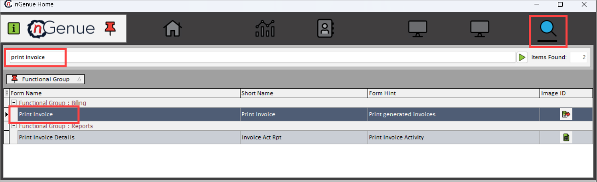
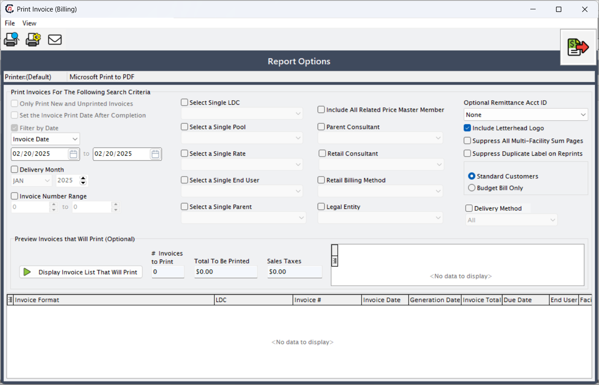

# Print invoice

The **print invoice** step is designed to either print or preview invoices that have already been generated for end users. It enables billing administrators to view finalized invoices in a chosen format, verify invoice details, and prepare them for customer distribution. Users can filter invoices by **Local Distribution Company (LDC)**, **delivery month**, or **invoice number** to ensure accuracy and relevance.  

By completing this step, invoices are properly formatted, validated, and ready for distribution, closing the billing lifecycle.

<!-- The print invoice functionality supports:  

* Viewing invoices for a specific delivery month and LDC  
* Previewing invoices before printing to ensure correctness  
* Printing invoices individually or in bulk  
* Selecting from different invoice formats, depending on business and customer requirements  

This ensures invoices are accurately represented, reducing manual handling errors and ensuring compliance with financial reporting needs. -->

## Procedure to print an invoice
The following section provides step-by-step instructions for printing invoices in nGenue. 

### Step 1: Identifying the invoice number

Before proceeding printing an invoice, you will need to the correct invoice number must be identified. To do this:  

1. Navigate to the **Review invoice item batch details** screen.  
2. Select the **end user**, **delivery month**, and any other applicable filters.  
3. The system will display the **invoice number** associated with the chosen criteria.  

This ensures that invoices generated during billing are accurately selected for printing.

### Step 2: Fill in the key fields in the Print invoice screen

1. Go to the **Print invoice** screen in nGenue. 
    
    !!!note "Note"
        Access the **Print invoice** screen from the **nGenue** application home page. To navigate, the user types *print invoice* into the quick search bar. From the search results, select the **Print invoice** option.
        
    

2. The following are the fields and options available on the **Print Invoice (Billing)** screen, along with their detailed descriptions. The users can apply filters and manage invoice printing on this screen.

    **Search criteria filters** 
    These fields help narrow down the invoices to be printed or previewed.

    | Field | Description |
    |-------|-------------|
    | Only print new and unprinted invoices | Ensures that only invoices that have not been previously printed are included in the print job. Prevents duplicate printing. |
    | Set the invoice print date after completion | Updates the invoice record with a “print date” once the printing process is completed, allowing tracking of when invoices were actually printed. |
    | Filter by date | Enables filtering of invoices by a specified invoice date range. |
    | Invoice date (From–To) | Defines the exact date range for invoice selection. Only invoices generated within the given range will be displayed or printed. |
    | Delivery month | Filters invoices by the delivery month and year for which the billing was generated. Useful for selecting invoices belonging to a particular billing cycle. |
    | Invoice number range | Allows you to print invoices within a specific invoice number range. Useful for reprinting or reviewing a subset of invoices in numerical sequence. |

    **Customer and organizational filters** 
    These fields let users filter invoices by customer type, utility, consultant, or legal entity.

    | Field | Description |
    |-------|-------------|
    | Select single LDC | Filters invoices belonging to a single Local Distribution Company (LDC). Helps when invoices are associated with multiple LDCs but you want only one. |
    | Select a single pool | Filters invoices for a specific pool of customers/contracts. A pool groups end users under a marketer or contract. |
    | Select a single rate | Filters invoices by rate class. Useful for printing invoices that fall under a specific pricing or tariff category (e.g., industrial, commercial, residential). |
    | Select a single end user | Filters invoices for one specific end user. Allows you to preview or print invoices for a single customer instead of an entire batch. |
    | Select a single parent | Filters invoices linked to a parent account. Useful for consolidated billing scenarios where multiple child accounts roll up to a parent. |
    | Include all related price master member | Ensures invoices include all accounts tied to a specific price master member, even if not explicitly selected. |
    | Parent consultant | Filters invoices associated with a parent consultant who manages customer accounts under a hierarchy. |
    | Retail consultant | Filters invoices linked to a specific retail consultant responsible for managing customer relationships. |
    | Retail billing method | Filters invoices by billing method (e.g., budget billing, standard billing). Helps segment invoice generation based on billing approach. |
    | Legal entity | Filters invoices tied to a specific legal entity within the organization. Useful when multiple entities operate under the same platform. |

    **Print and formatting options** 
    These fields control how invoices will appear when printed.

    | Field | Description |
    |-------|-------------|
    | Optional remittance acct ID | Dropdown to select an alternative remittance account ID that should appear on invoices for payment purposes. |
    | Include letterhead logo | When checked, the invoice is printed with the company’s letterhead/logo. Unchecking may be useful for draft or internal copies. |
    | Suppress all multi-facility sum pages | Suppresses the summary page that lists totals across multiple facilities. This is helpful when detailed invoices per facility are sufficient. |
    | Suppress duplicate label on reprints | Removes the “Duplicate” watermark/label when reprinting invoices. Ensures reprints look identical to originals if required for official use. |
    | Standard customers / Budget bill only | Radio button that lets you choose whether to print invoices for standard customers (regular billing) or only budget bill customers (equalized monthly billing). |
    | Delivery method | Allows filtering invoices by delivery method (e.g., email, print, electronic file). Determines how the invoice is distributed to the end user. |

    **Invoice list preview** 
    This section displays the list of invoices that match the selected filters. It allows users to review details before printing.

    | Field | Description |
    |-------|-------------|
    | Display invoice list that will print | Button that generates and displays the list of invoices matching the selected filters. |
    | # Invoices to print | Shows the total number of invoices that will be printed based on the selected filters. |
    | Total to be printed | Displays the combined invoice amount of all invoices selected for printing. |
    | Sales taxes | Displays the total sales tax amount across all invoices to be printed. |

    **Invoice details (preview section)** 
    When invoices are displayed, the following fields appear in the preview grid:

    | Field | Description |
    |-------|-------------|
    | Invoice format | Defines the template or layout used to generate the invoice (RDL format). Different formats may group or display charges differently. |
    | LDC | The Local Distribution Company associated with the invoice. |
    | Invoice # | Unique number assigned to each invoice for tracking and reference. |
    | Invoice date | The official date on which the invoice was generated. |
    | Generation date | The system date on which the invoice was created. May differ from the invoice date. |
    | Invoice total | The total amount due on the invoice, including charges and taxes. |
    | Due date | The payment due date specified on the invoice. |
    | End user | The customer or account name associated with the invoice. |
    | Facility | The facility or service location tied to the invoice. |
    | City & state | The geographical details (city and state) of the end user facility receiving the invoice. |

### Step 3: Printing or previewing invoices

Once on the **Print Invoice (Billing)** screen, follow these steps:  

1. Select the Delivery month, LDC and any additional filters if required.  
2. Click **Display Invoice List That Will Print**. The system populates the bottom section of the screen with matching invoices, showing key details like invoice format, LDC, Invoice number, Invoice date, Total amount due, End user, facility, city and state.  
3. Click the **Print Preview** icon (first icon in the top toolbar).  
   1. The invoice is displayed in **PDF format** and can be downloaded if needed.  
   1. The invoice opens in a browser window for review, provided an RDL (report definition language file) is available.
   1. Each RDL defines a specific invoice format. Different formats present invoice content differently. For example: A simple customer name and charge list, and Grouping charges by LDC. This allows flexibility in presenting invoice data for different customers or reporting needs.  

5. After preview, invoices can be printed individually or in batches.  

This step completes the invoice lifecycle, ensuring that billing data is formally communicated to end users.

---
