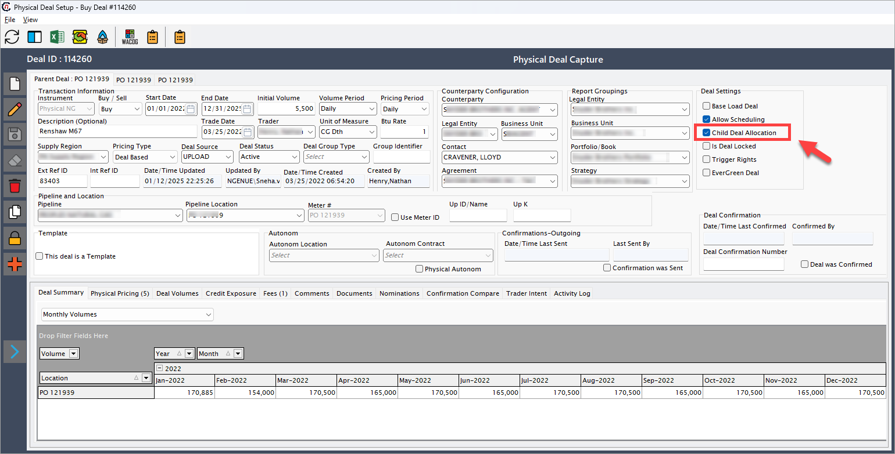
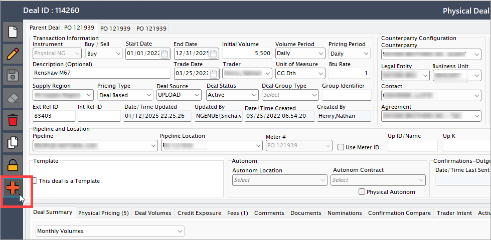
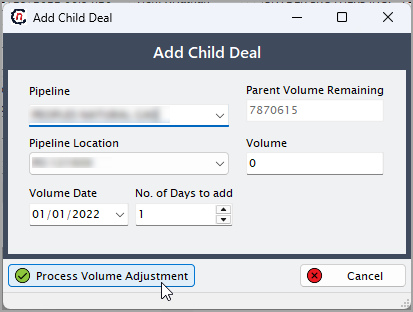
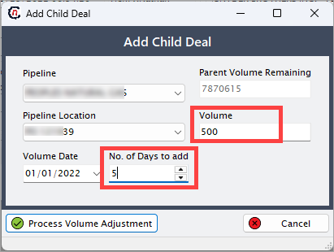
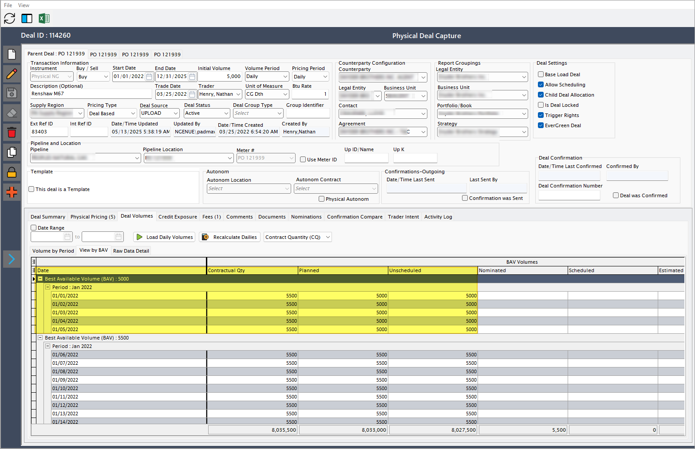
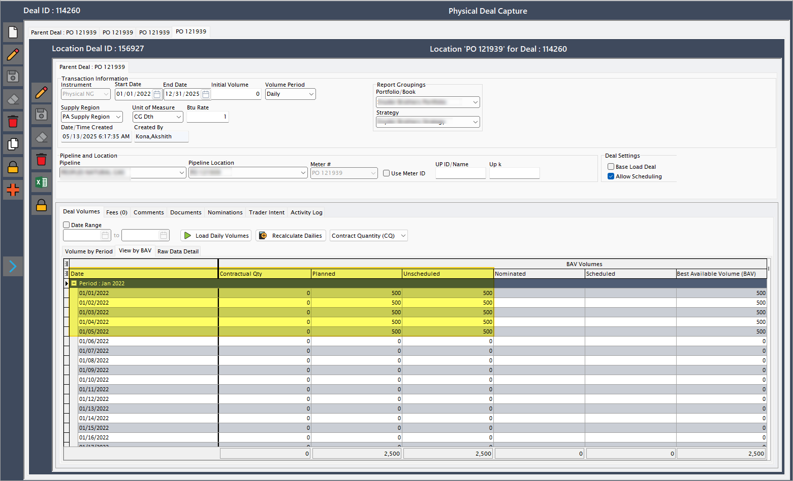

# Child deal allocation

The child deal allocation feature allows users to allocate gas volumes from a parent deal into multiple child deals. This is typically used to divide a larger contract into smaller allocations based on buyers, delivery locations, or specific time periods.

Child deal allocation helps ensure precise operational execution, proper billing, and accurate volume tracking at a granular level. It is especially useful in natural gas trading scenarios where multiple parties or delivery points are involved in a single contract.

!!!note "Note"
    Child deal allocation is applicable only for **physical deals.**

## Business context

In natural gas trading or distribution, a physical supply contract (parent deal) often needs to be broken down into smaller segments (child deals) for various reasons:

* Separate allocations for different buyers or clients  
* Allocation based on pipeline delivery locations  
* Volume distribution over specific date ranges.  

This segmentation allows natural gas businesses to:

* Track volumes more precisely  
* Manage delivery operations efficiently  
* Simplify reconciliation and invoicing  
* Ensure compliance with contractual obligations. 

<!-- ## Business flow: child deal allocation

### Flow steps

| Step | Action | System behavior |
|------|--------|------------------|
| 1 | Enable child deal allocation for a physical deal | Flags the deal to allow creation of child deals |
| 2 | Add new child deal | Opens a form to input allocation details |
| 3 | Enter child deal info (pipeline, volume, etc.) | Captures allocation parameters |
| 4 | Process volume adjustment | Subtracts volume from parent and assigns it to child deals | -->

<!-- ### Understanding child deal allocation using examples

#### Example 1: Allocating to different locations

**Parent deal**

- Contracted volume: 5,500 MMBtu  
- Delivery: Generic pipeline  
- Period: 01/01/2022 to 01/31/2022  

**Requirement:** Split the delivery between two locations: Houston and Dallas.

**Child deal A**

- Pipeline: ABC pipeline  
- Location: Houston  
- Volume: 3,000  
- Dates: 01/01/2022 to 01/10/2022  
- Days: 10  
→ 300 units/day from 01/01 to 01/10  

**Child deal B**

- Pipeline: ABC pipeline  
- Location: Dallas  
- Volume: 2,000  
- Dates: 01/11/2022 to 01/20/2022  
- Days: 10  
→ 200 units/day from 01/11 to 01/20  

**Result:**  
Parent deal shows 5,000 units allocated to child deals. Remaining 500 MMBtu is available for future allocation.

#### Example 2: Allocating by buyer

**Parent deal**

- Total volume: 10,000 MMBtu  
- Buyer: Broker A  

**Requirement:** Broker A needs allocations for two clients: Company X and Company Y.

**Child deal X**

- Buyer: Company X  
- Volume: 6,000  
- Dates: 01/01/2022 to 01/06/2022  
- Days: 6  
→ 1,000 units/day  

**Child deal Y**

- Buyer: Company Y  
- Volume: 4,000  
- Dates: 01/07/2022 to 01/10/2022  
- Days: 4  
→ 1,000 units/day  

**Result:**  
Parent volume is fully distributed. Each child deal can now be tracked and reported independently. -->

### Understanding child deal allocation using examples

Child deal allocation is a crucial feature used to manage the subdivision of a parent deal into smaller, trackable components based on specific business requirements such as delivery locations or buyers. This ensures greater transparency, accuracy, and flexibility in operational execution. The following examples illustrate how child deal allocation works in different scenarios.

#### Example 1: Allocating to different delivery locations

This scenario demonstrates how a single parent deal can be split into multiple child deals based on delivery points. This is particularly useful when a supplier needs to deliver to different cities or facilities using the same contract.

**Parent deal configuration**

* **Contracted volume**: 5,500 MMBtu  
* **Pipeline**: Generic pipeline  
* **Delivery period**: 01-Jan-2022 to 31-Jan-2022  

The objective is to deliver part of the contracted volume to **Houston** and the remainder to **Dallas** during two different periods within the contract term.

##### Child deal A - Allocation to Houston

* **Pipeline**: ABC pipeline  
* **Location**: Houston  
* **Allocated volume**: 3,000 MMBtu  
* **Delivery dates**: 01-Jan-2022 to 10-Jan-2022  
* **Number of days**: 10  
* **Daily allocation**: 300 MMBtu per day  

==This child deal ensures that **3,000 MMBtu** is delivered evenly over **10 days** to the **Houston** delivery point using the ABC pipeline.==

##### Child deal B - Allocation to Dallas

- **Pipeline**: ABC pipeline  
- **Location**: Dallas  
- **Allocated volume**: 2,000 MMBtu  
- **Delivery dates**: 11-Jan-2022 to 20-Jan-2022  
- **Number of days**: 10  
- **Daily allocation**: 200 MMBtu per day  

==This deal facilitates delivery to **Dallas** immediately following the **Houston** allocation, using the same pipeline but at a different location.==

##### Result and system behavior

* The total allocated volume is **5,000 MMBtu**, broken down between two child deals.  
* The system deducts these volumes from the parent deal accordingly.  
* The **remaining 500 MMBtu** in the parent deal is still unallocated and can be used later for additional child deals or volume adjustments.  
* Users can view these allocations in the **Deal volumes** section to verify that each child deal has received its respective volumes.

#### Example 2: Allocating by buyer

In this scenario, the parent deal is associated with a broker who wishes to allocate the purchased volume to two different end clients. This is common in wholesale energy transactions where brokers operate on behalf of multiple customers.

**Parent deal configuration**

* **Total volume**: 10,000 MMBtu  
* **Primary buyer**: Broker A  
* **Delivery period**: 01-Jan-2022 to 10-Jan-2022 

Broker A wants to distribute this volume between two of their clients, **Company X** and **Company Y**, over specific timeframes.

##### Child deal X - Allocation to Company X

* **Buyer**: Company X  
* **Allocated volume**: 6,000 MMBtu  
* **Delivery dates**: 01-Jan-2022 to 06-Jan-2022  
* **Number of days**: 6  
* **Daily allocation**: 1,000 MMBtu per day  

==This child deal ensures that Company X receives the first part of the delivery, evenly spread over the first six days of the contract.==

##### Child deal Y - Allocation to Company Y

* **Buyer**: Company Y  
* **Allocated volume**: 4,000 MMBtu  
* **Delivery dates**: 07-Jan-2022 to 10-Jan-2022  
* **Number of days**: 4  
* **Daily allocation**: 1,000 MMBtu per day  

==This deal guarantees Company Y receives their volume immediately after the delivery to Company X is completed.==

##### Result and system behavior

* The **entire 10,000 MMBtu** from the parent deal is distributed across two child deals.  
* The system updates the parent deal to reflect zero remaining volume.  
* Each child deal is now independently manageable, allowing for separate scheduling, billing, and reporting activities.  
* The allocations can be reviewed and verified in the **Deal Management** dashboard.

## How to add a child deal

### Step 1: Enable child deal allocation

1. Navigate to the **deal management** screen.  
2. Open the relevant physical deal.  
3. Check the box labeled **Child Deal Allocation**.
    
4. Click **Save** to enable the feature.

### Step 2: Add a new child deal

1. After saving the physical deal, click on **Add a new child deal** button. 
     
2. A popup window titled **Add Child Deal** will appear.  

3. Fill in the required information:
    4. **Pipeline**: Select the appropriate pipeline.
    4. **Pipeline location**: Choose the delivery or receipt point. 
    4. **Volume**: Enter the gas volume to allocate.  
    4. **Volume date**: Enter the start date for allocation. 
    4. **Number of days**: Specify how many days the volume should be distributed.
        

    !!!example "Example"
        If the volume is 500 MMBtu, start date is 01-Jan-2022, and number of days is 5:  
        → 500 units/day will be allocated from 01-Jan-2022 to 05-Jan-2022  
        → A total of 2,500 MMBtu will be subtracted from the parent deal and assigned to the child deal.
        
        

    <!-- ### Step 3: Process volume adjustment -->

1. After entering all the child deal details, click **Process volume adjustment**.  
2. The system updates the parent deal volume and reflects the assigned amount in the child deal section.  

    !!!Note "Note" 
        The system deducts the total allocated volume from the parent deal and logs it under each child deal accordingly.

### Step 3: Verify allocation

1. Check both the parent and child deal volumes using the **View by BAV** tab in the **Deal Volumes** section.  
2. Ensure the total volume adjustments match your allocation entries.  

#### Parent deal verification

As shown in the screenshot below, under the **View by BAV** tab in the **Deal volumes** section, the Contractual quantity is **5500.** Out of this, **5000** has been allocated as *planned and unscheduled Volume,* and the remaining volume has been transferred to the child deal.

#### Child deal verification

Displays each child deal along with its volume and allocation parameters.

!!!Note "Note" 
    1. All mandatory fields must be completed before clicking **Process volume adjustment** on the **Add child deal** popup screen.  
    1. Allocation changes are applied only after the adjustment process is executed.    
    1. Child deal allocation is applicable only for **physical deals**.

## Summary

The above scenarios and examples illustrate how child deal allocation enables granular control and transparency over physical gas deals. Whether allocating based on delivery points or client-specific requirements, the system ensures:

* Accurate volume tracking  
* Clear audit trails  
* Flexibility in operations  
* Seamless integration with downstream billing and reporting systems

Proper setup and execution of child deals ultimately support better contract management and operational efficiency.

<!-- ### Business benefits

* Enables precise tracking and reporting of deliveries  
* Supports complex contracts involving multiple parties or locations  
* Simplifies reconciliation and auditing  
* Enhances downstream processes like billing and scheduling. -->

### Business benefits of child deal allocation

Child deal allocation offers several operational and strategic benefits for organizations involved in natural gas trading, distribution, or brokerage. By segmenting a parent deal into smaller, manageable child deals, businesses can gain better control and visibility over contractual obligations and deliveries.

#### Enables precise tracking and reporting of deliveries

Allocating gas volumes into child deals makes it easier to monitor delivery performance against specific segments of the contract. This allows users to track:

* How much volume is allocated to each location or buyer
* The daily breakdown of scheduled volumes
* Delivery status across different periods.

With clearly defined allocations, reporting becomes more structured and enables real-time insights into contract execution.

#### Supports complex contracts involving multiple parties or locations

Natural gas contracts often span across multiple clients, delivery points, or timeframes. Child deal allocation simplifies the management of such complex deals by:

* Breaking down the parent volume into client-specific or location-specific segments
* Allowing flexibility in setting different pipelines or delivery schedules for each child deal
* Supporting brokers, marketers, and suppliers in handling multi-party obligations efficiently.

This ensures each party involved in the deal has clear visibility into their share of the contract.

#### Simplifies reconciliation and auditing

Accurate volume allocation helps reconcile delivery records against what was committed in the contracts. This reduces the risk of errors and streamlines the auditing process by:

* Providing a clear trail of volume adjustments
* Enabling volume-based comparison between planned and actual deliveries
* Reducing manual intervention in allocation-related disputes.

Auditors can review each child deal independently, making the verification process simpler and faster.

#### Enhances downstream processes like billing and scheduling

When allocations are precise and properly defined, downstream processes become easier to manage. With child deal allocation:

* Billing teams can generate client-specific invoices based on the allocated volumes and delivery schedules
* Scheduling teams can plan pipeline nominations more accurately
* Operational discrepancies are reduced due to clear volume segregation.

This leads to improved coordination across departments and better customer service.

By incorporating child deal allocation into deal management workflows, companies can operate with increased agility, accuracy, and confidence in their delivery commitments.

---