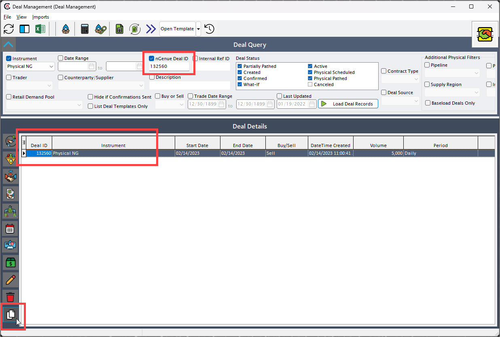
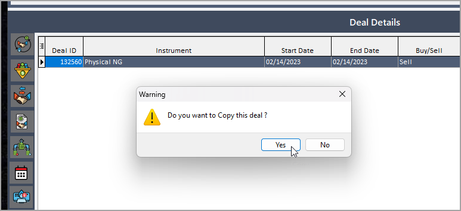
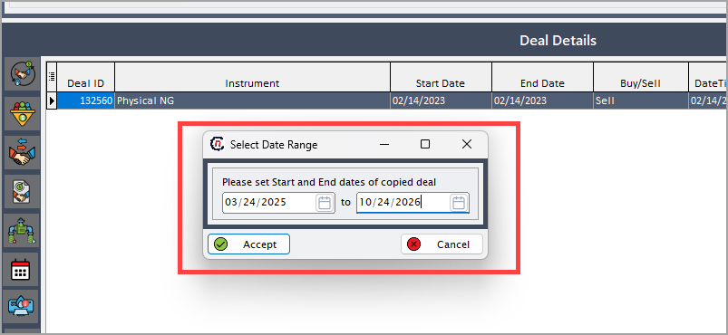
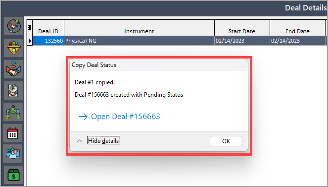

# Copy a deal

The copy a deal functionality allows you to quickly duplicate an existing deal and make necessary adjustments without starting from scratch. This is especially useful when creating similar deals for the same customer, LDC, or contract structure with only minor changes in dates, quantities, or pricing terms. By copying a deal, you save time, reduce manual errors, and ensure consistency in deal setups across multiple contracts or renewals. This feature is particularly valuable for handling repetitive deal structures and streamlining the contract management process.

Follow these steps to copy an existing deal:

1. Navigate to the **Deal management** screen from the nGenue application dashboard.

2. Use the available filters on the **Deal query** screen to search for the deal you wish to copy.

3. Once the deal is located, click the **Copy deal** icon  from the left-hand navigation panel.
   

4. When the confirmation popup appears, review the warning and click **Yes** to proceed.
   

5. In the next prompt, select the **Start date** and **End date** for the copied deal.  
   By default, these fields will pre-populate with the dates from the deal being copied, but you can adjust them as needed.
   

6. After submission, a confirmation popup will display the new **Deal ID** along with a clickable link that redirects you to the deal summary page.
   

    !!!note "Note"
        The copied deal will always be created in the **Pending** status, allowing you to review and make necessary adjustments before proceeding further.

## Best practices and recommendations before copying any deal

* **Review key fields**: After copying, ensure all date fields, quantities, and pricing terms are updated according to the new contract requirements.
* **Validate LDC configurations**: Double-check that the appropriate LDC rate schedules and contract rules are current and applicable to the new deal.
* **Audit for accuracy**: Before submitting the copied deal for approval, perform a thorough review to ensure there are no unintended carryovers from the original deal.

## Post deal activities



---