# Create a deal

A deal involves the actual delivery of natural gas from one party to another, often including specific terms for volume, location, and timing. These transactions typically occur between producers, marketers, and end-users, and they require coordination of storage and transportation logistics to ensure fulfilment. Physical deals are foundational to the natural gas market as they provide the movement of energy resources from supply points to areas of demand.

 
> On this page, you will be able to understand:

> 1. [The prerequisites required before creating a deal.](./create_deal.md#prerequisites)
> 2. [How to configure a new deal.](./create_deal.md#procedure)
> 3. [An overview of the different tabs and related fields to configure after deal creation.](./create_deal.md#additional-tabs-in-the-physical-deal-capture-screen)
> 4. [Post-deal activities to complete after configuration.](./create_deal.md#post-deal-activities)
 

## Prerequisites



## Procedure

For the below procedures, I would take the scenario where I need to add a physical deal in nGenue. Follow the instructions below to create and manage physical deals effectively.

### Step 1: Navigate to the Deal management section

1. Log in to the nGenue application using your credentials.
2. Click the **Search** icon and enter *deal management* in the search bar.
3. Select **Deal management.**
    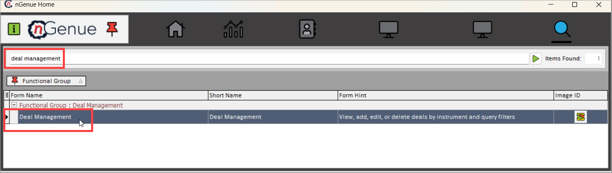
4. The next screen is divided into two sections: **Deal query** and **Deal details.** For detailed information and a list of fields available in both sections, refer to the [navigating deal management screen](./navigate.md#main-body) article.

<!-- **Available fields in Deal query**

| Field | Description |
|------------|------------|
| Instrument | Displays the list of different deals available in the system. Options include:   - **Physical NG**: Physical natural gas contracts   - **Futures**: Future contracts for gas   - **Swap**: Financial agreements to exchange cash flows   - **Physical NG - Option**: Gas options for future transactions   - **Retail Demand Requirements**: Gas supply agreements based on demand   - **Wellhead NG**: Gas purchased directly from a production well   - **Production**: Deals related to gas production   - **Cash**: Spot market gas purchases or sales |
| Date Range | Allows users to specify a **start date** and **end date** to filter deals based on their effective period. |
| nGenue Deal ID | Allows users to enter a **unique deal ID** to search for a specific deal in the system. |
| Internal Ref ID | A reference ID used internally within the organization for tracking deals. |
| Trader | Displays the trader responsible for managing the deal. |
| Counterparty/Supplier | The counterparty or supplier with whom the deal is being made. |
| Description | A brief description of the deal, providing relevant details as required. |
| Retail demand pool | Specifies the **demand pool** where the retail gas requirements are grouped for trading and supply. |
| ‘Hide if confirmations sent’ Checkbox | If checked, deals for which confirmations have already been sent will be **hidden** from the query results. |
| ‘List deal templates only’ Checkbox | If checked, the **Deal Management Screen** will display **only deal templates**, excluding executed deals. |
| Buy or sell | Indicates whether the deal is a **BUY** deal (purchase of gas) or a **SELL** deal (sale of gas). |
| Trade date range | Filters deals based on the trade execution date, allowing users to enter a **start date** and **end date**. |
| Last updated | Displays the **last updated date** of the deal, indicating when it was last modified. |
| Contract type | Specifies the type of contract associated with the deal (e.g., **Firm, Interruptible, Indexed, Fixed Price**). |
| Deal source | Identifies the origin of the deal, whether it was **imported, manually created, or auto-generated** by the system. |

**Additional physical filters section**

| Field | Description |
|------------|------------|
| Pipeline | Displays the **pipeline** associated with the deal, which is responsible for gas transportation. |
| Supply region | The **geographical region** from which the gas is supplied. |
| Baseload deals only | If selected, the system will filter deals that are **Baseload** (steady supply contracts without fluctuations). |
| Pipeline location | Specifies the **exact location** on the pipeline where the gas is injected or withdrawn. |
| Index type/group | Defines the **pricing index or group** used for setting gas prices (e.g., **NYMEX, Henry Hub, Chicago Citygate**). |
| Meter# | The **meter number** associated with the deal, which is used for measuring gas consumption and delivery. |

**Deal status section**

This section displays the current status of the deal, which can include the following states:

| Deal Status | Description |
|------------|------------|
| Partially pathed | The deal is in progress but has not been fully assigned to a pipeline path. |
| Created | The deal has been **entered into the system** but is not yet confirmed. |
| Confirmed | The deal has been **finalized and approved** by all parties. |
| What-if | A **hypothetical deal** used for analysis without committing to execution. |
| Active | The deal is currently **valid and operational**. |
| Physical scheduled | The gas deliveries for this deal have been scheduled for physical transport. |
| Physical pathed | The deal has been fully assigned to a **pipeline path** for execution. |
| Canceled | The deal has been **voided and is no longer active**. | -->

<!-- #### Deal details

Once you select the relevant filters in the **Deal query** section and click on the **Load deals record** button, the system retrieves and displays the corresponding deals in the **Deal details** section.
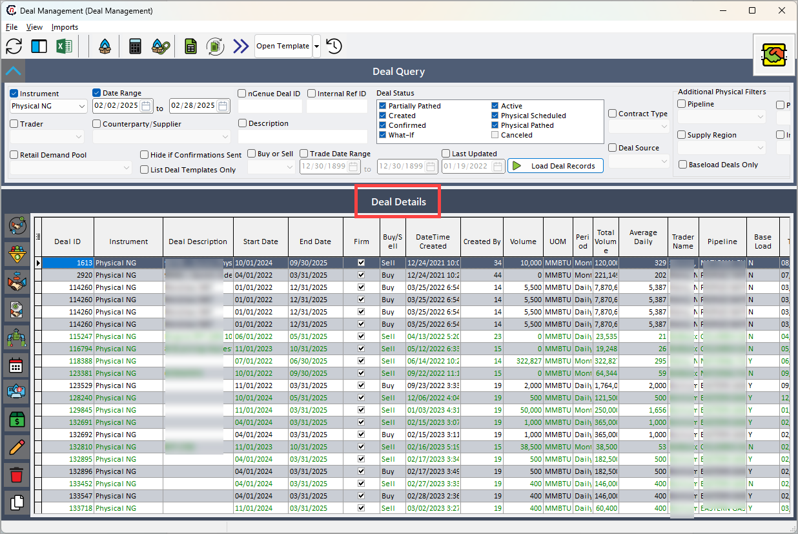 -->

### Step 2: Create a new physical deal

1. Click on **Add physical deal** or use the **(Alt+A)** keyboard shortcut.
2. You'll be navigated to the **Physical deal capture** screen, where you need to fill in the details as mentioned in the table below:
    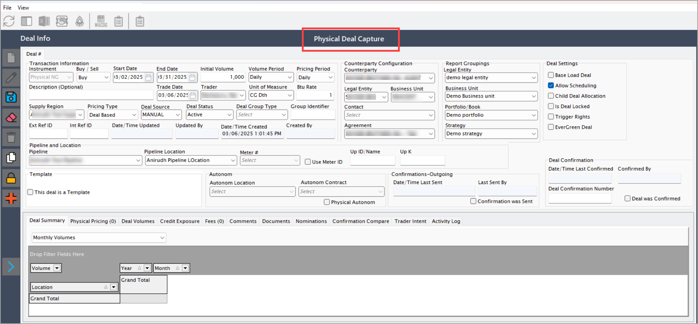

    #### Transaction information fields
    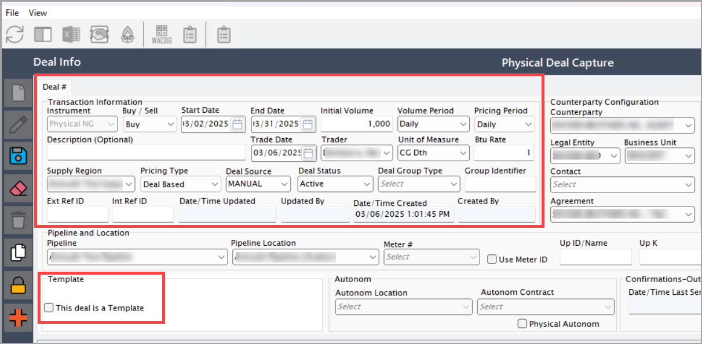

    | Fields | Description |
    |---|---|
    | Instrument | Defines the type of deal being created. In this case, **Physical NG (Natural Gas)** is selected as it involves the physical delivery of natural gas. Selecting the correct instrument ensures the deal is processed under the appropriate market rules and contract terms. | Dropdown | Y | Predefined list | Deal configuration screen |
    | Buy/sell | Specifies whether the deal is a **buy** (purchase of gas) or a **sell** (sale of gas). This is crucial for financial accounting and tracking gas flow. It also determines whether the company is acquiring gas from a supplier or selling it to an end user. | Dropdown | Y | Manual selection | Deal configuration screen |
    | Start date and end date | Defines the duration of the deal. The **start date** indicates when the deal becomes active, and the **end date** marks its expiration. Setting the correct date range ensures that contractual obligations, pricing periods, and gas deliveries align correctly. | Date picker | Y | Manual input | Deal configuration screen |
    | Initial volume | Specifies the **total amount of natural gas** committed under this deal. The volume is important for **scheduling deliveries**, ensuring compliance with contract terms, and forecasting supply needs. Underestimating or overestimating this value can impact financial and operational planning. | Numeric | Y | Manual input | Deal configuration screen |
    | Volume period | Determines whether the **initial volume** is distributed on a **daily** or **monthly** basis. This selection affects **billing calculations**, **scheduling logistics**, and **contract fulfilment**. Daily volumes are used in short-term contracts, while monthly volumes are common in long-term agreements. | Dropdown | Y | Predefined list | Deal configuration screen |
    | Pricing period | Specifies whether the **price** for the volume is set on a **daily** or **monthly** basis. This aligns with the pricing model agreed upon with the counterparty. Daily pricing is typically used for volatile markets, whereas monthly pricing provides stability. | Dropdown | Y | Predefined list | Deal configuration screen |
    | Description | A brief **summary or identifier** for the deal. Helps users quickly understand the **nature, purpose, or special conditions** of the deal. Typically includes relevant details like deal type, counterparty, or special pricing conditions. | Text | N | Manual input | Deal configuration screen |
    | Trade date | The **date when the deal was executed**. Important for **historical tracking, regulatory reporting, and risk assessment**. Trade dates impact financial reporting, as well as compliance with market regulations. | Date | Y | Manual input | Deal configuration screen |
    | Trader | The **person or entity responsible for executing the deal**. Ensures accountability and allows for tracking individual traders’ activity for **audit and risk management** purposes. | Dropdown | Y | Predefined list | Deal configuration screen |
    | Unit of measure | Defines how the gas volume is measured (e.g., **MMBtu, Therms, Dekatherms**). Ensures accurate calculations for **billing, transportation, and reporting**. Different pipelines or markets may require specific units. | Dropdown | Y | Predefined list | Deal configuration screen |
    | Btu rate | The **heat content conversion factor** for natural gas. Used to **standardize gas pricing and volume conversions** across different suppliers, pipelines, and contracts. Ensures accurate valuation of gas energy content. | Numeric | Y | Manual input or auto-calculated | Deal configuration screen |
    | [Supply region](../getting_started/configure_supply_region.md) | Identifies the **geographical region** from which the gas is sourced. This field is necessary for **logistics**, **regulatory compliance**, and **pricing calculations**, as gas costs vary by location due to transportation fees and supply availability. | Dropdown | Y | Predefined list | Deal configuration screen |
    | Pricing type | Specifies whether pricing is **deal-based** or **location-based**:  1. **Deal-Based Pricing:** The price is set at the deal level, meaning the cost remains fixed for that particular deal regardless of location.  2. **Location-Based Pricing:** The price is determined by the **pipeline location** or **market hub**. This allows for **variable pricing** based on regional price fluctuations, market demand, or LDC rules. | Dropdown | Y | Predefined list | Deal configuration screen |
    | Deal source | Specifies how the deal was created (e.g., **manually entered, imported from an external system, or generated via an API**). Helps in **data validation and troubleshooting** by tracking deal origins. | Dropdown | Y | Predefined list | Deal configuration screen |
    | Deal status | Indicates the **current lifecycle stage** of the deal, such as **Created, Confirmed, Partially Pathed, Canceled, Active, or Scheduled**. Essential for **workflow management and tracking deal progress**. | Dropdown | Y | System-generated based on deal progress | Deal configuration screen |
    | Deal group type | Defines the **category under which the deal falls** (e.g., **wholesale, retail, physical, financial**). Helps in **grouping and filtering deals** based on their nature and purpose. | Dropdown | N | Predefined list | Deal configuration screen |
    | Group identifier | A unique **grouping ID** used to link related deals together. Helps in **tracking multiple deals** that are part of a larger transaction, such as **parent-child deal structures**. | Text | N | Auto-generated or manually entered | Deal configuration screen |
    | Ext ref ID | An **external reference identifier** used when deals are imported from **third-party trading systems or market platforms**. Helps in cross-referencing deals with external data sources. | Text | N | Manual input or auto-generated | Deal configuration screen |
    | Int ref ID | An **internal reference ID** used within nGenue for **tracking and linking deals** across different modules. Helps in ensuring data consistency across deal management and financial reporting. | Text | N | Auto-generated | Deal configuration screen |
    | Date/time updated | The **timestamp of the last modification** made to the deal. Useful for **audit tracking and version control**, ensuring transparency in deal modifications. | Date & Time | N | Auto-updated | Deal configuration screen |
    | Updated by | The **user who last modified the deal**. Ensures accountability by tracking changes made by different users. Useful in audits and internal reviews. | Text | N | Auto-updated based on user actions | Deal configuration screen |
    | Date/time created | The **timestamp when the deal was initially created**. Used for **tracking deal history, financial reporting, and auditing purposes**. | Date & Time | Y | Auto-generated | Deal configuration screen |
    | Created by | The **user who originally created the deal**. Important for **audit trails and compliance reporting**, ensuring transparency in deal creation. | Text | Y | Auto-generated based on user login | Deal configuration screen |
    | This deal is a template | If the checkbox is checked, the deal is **saved as a template**, allowing users to quickly create similar deals in the future. This is useful for standardized contract structures that are frequently reused. | Checkbox | N | Manual selection | Deal configuration screen |

    
    #### Counterparty configuration fields
    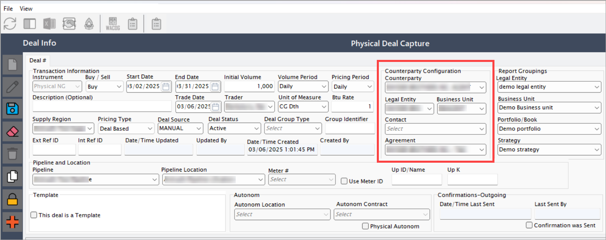

    | Fields | Description |
    |---|---|
    | [Counterparty](../getting_started/counterparty/create_counterparty.md) | The **entity (supplier or customer)** with whom the deal is being made. This could be a wholesale supplier, marketer, or retail customer. Correct selection ensures accurate contract execution, billing, and risk management. | Dropdown | Y | Predefined list | Deal configuration screen |
    | [Legal entity](../getting_started/configure_book_structure.md#step-2-create-a-new-legal-entity) | The **registered business entity** of the counterparty. Some counterparties operate under multiple legal entities, so selecting the correct one ensures compliance with contracts and legal requirements. | Dropdown | Y | Predefined list | Deal configuration screen |
    | [Business unit](../getting_started/configure_book_structure.md#configure-a-book-structure) | The internal **division of the company** managing this deal. Different business units handle wholesale, retail, or trading operations. Proper selection ensures accounting and reporting accuracy. | Dropdown | Y | Predefined list | Deal configuration screen |
    | Contact | The **point of contact** for the selected counterparty. This information is useful for communication regarding contract negotiations, scheduling, and issue resolution. | String | N | Auto-populated from counterparty details | Deal configuration screen |
    | Agreement | The **contract governing the deal**. Specifies the terms and conditions, pricing structures, penalties, and obligations between the supplier and buyer. Ensures compliance and minimizes disputes. | Dropdown | N | Predefined list | Deal configuration screen |

    #### Report groupings fields
    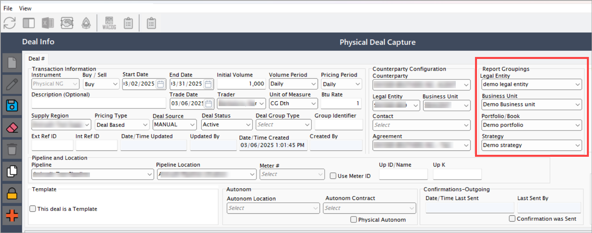

    | Fields | Description |
    |---|---|
    | [Legal entity](../getting_started/configure_book_structure.md#step-2-create-a-new-legal-entity) | The **company division** responsible for the deal. This helps in financial reporting, compliance, and taxation. | Dropdown | Y | Predefined list | Deal configuration screen |
    | [Business unit](../getting_started/configure_book_structure.md#step-3-add-a-business-unit-to-the-legal-entity) | The internal business segment handling the transaction. Used for operational control and profit/loss allocation. | Dropdown | Y | Predefined list | Deal configuration screen |
    | [Portfolio/book](../getting_started/configure_book_structure.md#step-4-add-a-portfolio) | The **portfolio or trading book** where the deal is recorded. This is important for risk management and financial analysis. | Dropdown | N | Predefined list | Deal configuration screen |
    | [Strategy](../getting_started/configure_book_structure.md#step-5-add-a-strategy) | Categorizes the deal based on the company's **market strategy**, such as hedging, speculative trading, or customer supply. Helps in risk assessment and profitability tracking. | Dropdown | N | Predefined list | Deal configuration screen |
    
    #### Deal settings fields
    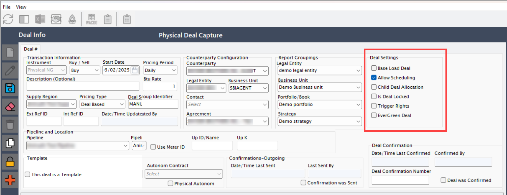

    | Fields | Description |
    |---|---|
    | Base load deal | If checked, the deal follows a **base load contract**, meaning a fixed quantity of gas is delivered daily/monthly. Used in long-term supply contracts for consistent gas flow. | Checkbox | N | Manual selection | Deal configuration screen |
    | Allow scheduling | If checked, **pipeline scheduling** is enabled. Required for deals where gas deliveries need pre-approval from the pipeline operator. | Checkbox | N | Manual selection | Deal configuration screen |
    | Child deal allocation | Allows gas allocation to **sub-deals**. Used for dividing a large contract into smaller units for different buyers or locations. | Checkbox | N | Manual selection | Deal configuration screen |
    | Is deal locked | If checked, prevents further modifications to the deal. Used for finalized contracts that shouldn't be altered after approval. | Checkbox | N | Manual selection | Deal configuration screen |
    | Triggers rights | If enabled, this setting allows triggering rights such as the ability to call upon specific contract options, like adjusting volumes, extending terms, or initiating optional deliveries, based on predefined conditions in the deal. It enables contract flexibility based on market conditions or counterparty agreements. | Checkbox | N | Manual selection | Deal configuration screen |
    | [Evergreen deal](./evergreen_deal.md) | If checked, this enables the deal to function as an evergreen contract, which automatically renews at the end of its term unless explicitly terminated by either party. This is useful for ongoing supply arrangements without the need to re-negotiate terms each period. | Checkbox | N | Manual selection | Deal configuration screen |

    #### Pipeline and location fields
    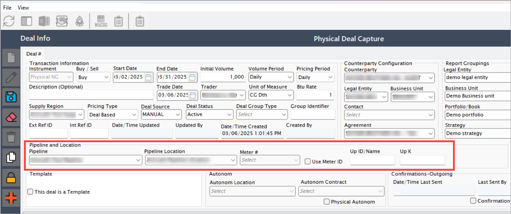

    | Fields | Description |
    |---|---|
    | [Pipeline](../getting_started/configure_pipeline.md) | The **transportation system** used to move the gas from the supplier to the end user. Selecting the correct pipeline ensures proper scheduling, tracking, and delivery coordination. Pipelines have capacity constraints and require scheduling approvals, making this a critical field. | Dropdown | Y | Predefined list | Deal configuration screen |
    | [Pipeline location](../getting_started/configure_pipeline.md#configure-pipeline-zone-and-location) | A more specific designation within the pipeline system where the gas transaction occurs. This could be a receipt point (where gas enters the pipeline) or a delivery point (where gas is delivered to the end user). This ensures accurate transportation and delivery tracking. | Dropdown | Y | Predefined list | Deal configuration screen |
    | Use meter ID | If checked, the **meter#** field is enabled, allowing users to specify a unique meter for tracking gas flow. This is used when tracking gas consumption at specific locations is required. | Checkbox | N | Manual selection | Deal configuration screen |
    | Meter# | The **unique identifier** for the meter measuring gas flow for this deal. This ensures that actual usage data is captured for accurate billing and reconciliation. Essential for tracking consumption at a facility level. | String | Y (if 'Use meter ID' is checked) | Manual input | Deal configuration screen |
    | Up/id name | A **unique identifier** for the upstream entity or deal. This helps in tracking related deals and transactions efficiently, especially when multiple deals are linked. | String | N | Manual input | Deal configuration screen |
    | Up k | A **reference field** used for internal tracking of upstream transactions within nGenue. Useful for linking deals with parent transactions or supplier agreements. | String | N | System-generated or manual input | Deal configuration screen |
    
    #### Autonom fields
    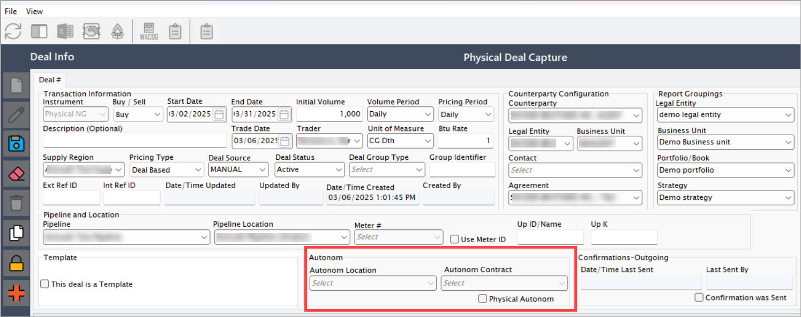

    | Fields | Description |
    |---|---|
    | Autonom location | Specifies the **location under an Autonom agreement**, where gas transactions are managed automatically. Helps in automating scheduling and settlements based on predefined contract terms. | Dropdown | Y (if part of an Autonom deal) | Predefined list | Deal configuration screen |
    | Autonom contract | Defines the **contract governing Autonom transactions**. Ensures that gas movement and pricing align with pre-negotiated terms, reducing manual intervention. | Dropdown | Y (if part of an Autonom deal) | Predefined list | Deal configuration screen |

    #### Confirmations-outgoing fields
    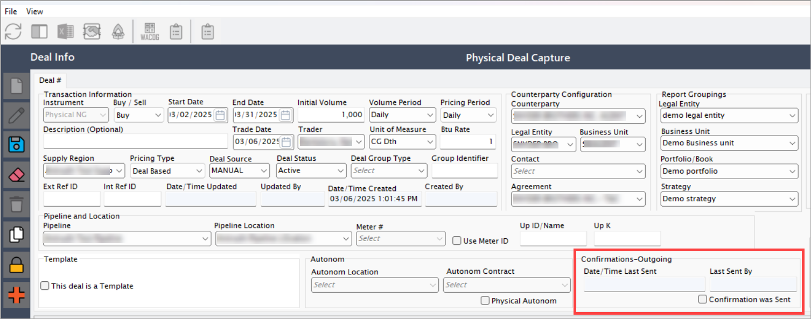

    | Fields | Description |
    |---|---|
    | Date/time last sent | Displays the **most recent date and time** when the deal confirmation was sent. This helps track the communication status between counterparties. | Date/Time | N | System-generated | Confirmations - Outgoing section |
    | Last sent by | The **username of the person** who last sent the deal confirmation. This allows for accountability and tracking of confirmations. | String | N | System-generated | Confirmations - Outgoing section |
    | Confirmation was sent | If checked, it indicates that the **deal confirmation was successfully sent** to the counterparty. This helps in verifying transaction status. | Checkbox | N | System-generated | Confirmations - Outgoing section |
    
    #### Deal confirmation fields
    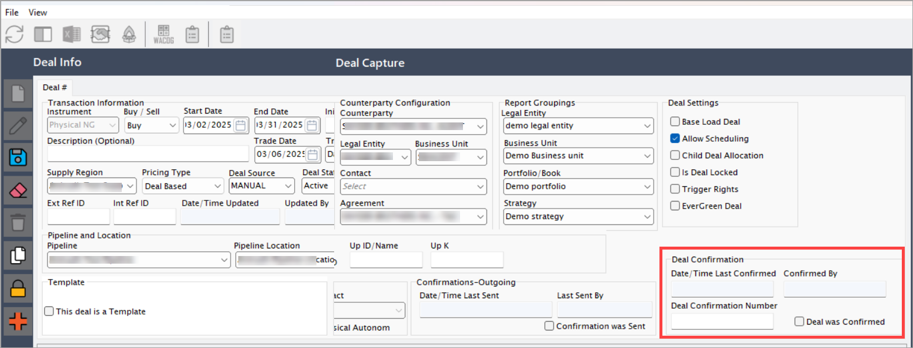

    | Fields | Description |
    | --- | --- |
    | Date/time last confirmed | Displays the **most recent date and time** when the deal was confirmed. This ensures that the transaction is officially recorded. |
    | Confirmed by | The **name of the user** who confirmed the deal. This is important for tracking who approved and finalized the transaction. |
    | Deal confirmation number | A **unique identifier** assigned to each confirmed deal. The number increases sequentially with each confirmation, making it easy to track past confirmations. |
    | Deal was confirmed | If checked, it indicates the **deal is officially confirmed.** This helps ensure that the deal is finalized and cannot be modified without further action. |

### Step 3: Saving the deal

Once all **mandatory** fields are filled, click on **Save** to finalize the deal. This ensures that all details are stored and processed correctly. You will navigate to the **Deal summary** tab where a concise overview of the deal is displayed.
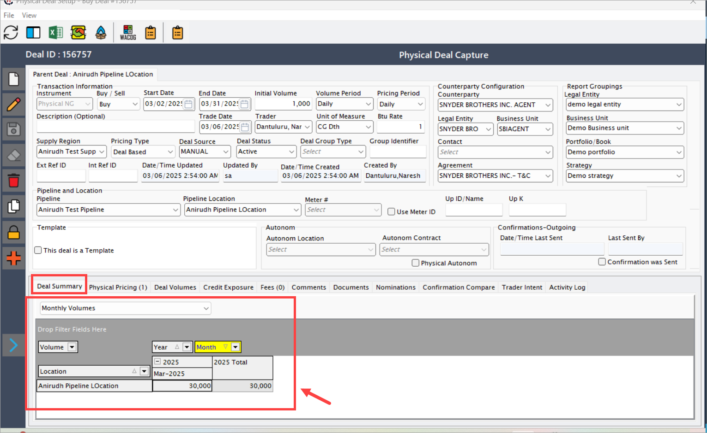

<!-- ### Additional tabs in the Physical deal capture screen

The **Physical deal capture** screen provides multiple tabs that allow you to view detailed insights and analysis related to a specific deal. Each tab serves a specific purpose to help users monitor deal performance, projections, and financial exposure.

### 1. Deal summary tab
This tab shows a comprehensive summary of the deal. It provides an overview of the volume utilized and financial projections based on the selected view options.

The following view options are available within this tab:

| Fields | Description |
| --- | --- |
| Monthly volumes       | Displays the monthly volume usage for the selected year. This helps you analyze how much volume has been used on a month-by-month basis compared to the contracted volumes.             |
| Projected cashflow    | Provides an estimate of expected cash inflows and outflows for the duration of the deal, based on the deal’s pricing and volume consumption patterns. Useful for financial forecasting. |
| Mark to market        | Displays the unrealized gain or loss based on current market prices compared to the contracted deal price. This helps measure financial exposure and market risk at a given point.      |

**Example usage:**

* If you want to review how much gas volume was used in **March 2025**, select **Monthly volumes**, choose the year, and review the breakdown by month.  
* To check expected revenue or expense over the next few months, switch to **Projected cashflow**.  
* To assess your exposure to current market fluctuations, refer to **Mark to market**, which shows gains or losses based on market price changes.

### 2. Physical pricing tab

This tab allows to configure the pricing tiers for the deal. When a **Physical NG deal** is created, the pricing tier is automatically created by default. Click on **Add a new tier** button, to add new pricing tier for the deal. The detailed explanation is available at a separate article, refer to [How to configure a pricing deal](../pricing/configure_pricing.md) page.

### 3. Deal volumes tab

This tab displays the volume distribution and the best available volume to be used/billed by the deal. It consists of below tabs:

* **Volume by period:** This tab will be displayed only when the **Volume source** is selected as **Volume by Period w/ Tolerance.** This tab displays the volume distribution per month or per each day based on the pricing period and the volume period of the deal. This volume will be based on the initial volume of the deal.

* **View by BAV:** This tab displays the volume distribution at each stage i.e., Contractual Qty, Planned, Unscheduled, Nominated, Scheduled, Estimated Actual, Actual, and the Best Available Volume (BAV) for the deal. This tab consists of the below fields:
* **Date Range:** Allows to enter start and end date and view the BAV volumes between the specified date range.
* **Load Daily Volumes:** When specified a particular date range and clicking on this button, loads the BAV volumes within the specified date range.
* **Recalculate dailies** using **Contractual Quantity (CQ), Planned (PV) and Both CQ and PV** dropdown: Selecting any of the value from the dropdown and clicking on Recalculate Dailies button, re calculates the best available volumes based on the dropdown value selected.

### 4. Credit exposure tab

### 5. Fees tab

This tab allows to configure and manage different types of fees for the deal. Clicking on **Add a new deal expense** button allows to create fee records. Below are the fields available on this tab: 

| Fields | Description |
| --- | --- |
| Pay/Receive type | Whether the fee is a Pay type or receive. |
|Fee type | There are different types of Fees which include:
-	Broker Fee
-	Demand
-	Sleeve
-	Transfer
-	Fuel Loss
-	Margin
-	Nom Mgmt
-	AMA Opt
-	Pipe Fee
-	Premium |
| Calc Period | Allows to specify the Fee Calculation period, whether Daily/Monthly/One-Time fee. |
| Calc Method | Allows to specify the Fee Calculation method whether Volume based fee/Flat fee. |
| Per Unit Price | Allows to enter the price per unit. Since, the price configured here will be based on the volume, this field will be editable only when the Calc method is selected as Volume. |
| Amount | Amount is calculated based on the given price and volume. Flat calc method means the Amount will be directly applied without considering any volume, so the Amount field will be editable only when the Calc method is selected as Flat. |

### 6. Comments tab

Allows to add any additional comments regarding the deal.

### 7. Documents tab

This tab allows to add any documents to the created deal. 
	By clicking on ‘Add New End User Document’ button, system navigates to ‘Store Customer Document’ screen, where user can add the Document Description, Document Category, Original Document’s file name

### 8. Nominations

Displays the Nominations for the deal. Also, when clicked on ‘Physical Autonom’ checkbox, the nominations will be automatically created based on the Nominated volumes present in ‘View by BAV’ tab.

### 9. Confirmation Compare

### 10. Trader Intent

### 11. Activity log

This tab displays the track of history of changes in deals. It consists of below fields:
•	Date Range
•	Load Deal Activity Log button

By entering the **Date range** and clicking on **Load Deal Activity** Log button, this tab displays the history of all the changes made in the deal with clear description regarding the changes made, between the specified date range. -->

## Additional tabs in the Physical deal capture screen

The **Physical deal capture** screen provides multiple tabs, each serving a specific function to manage, review, and analyze a physical deal effectively. Below is a detailed explanation of each tab and its functionality.

### 1. Deal summary tab

This tab provides a comprehensive summary of the deal and helps monitor deal performance across different dimensions. It includes three view options:

| Field                | Description |
|----------------------|-------------|
| Monthly volumes      | Displays monthly volume usage for the selected year. Helps track consumption against contracted volumes on a month-by-month basis. |
| Projected cashflow   | Shows estimated cash inflows and outflows over the deal’s duration based on pricing and consumption patterns. Useful for financial forecasting. |
| Mark to market       | Reflects unrealized gain or loss by comparing the contracted deal price with current market prices. Helps assess financial exposure and market risk. |

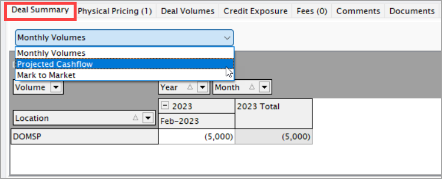

**Example usage:**

* If you want to review how much gas volume was used in **March 2025**, select **Monthly volumes**, choose the year, and review the breakdown by month.  
* To check expected revenue or expense over the next few months, switch to **Projected cashflow**.  
* To assess your exposure to current market fluctuations, refer to **Mark to market**, which shows gains or losses based on market price changes.

### 2. Physical pricing tab
This tab allows users to configure pricing tiers for the deal. By default, pricing tiers are auto-generated when a physical NG deal is created. Users can click **add a new tier** to configure additional pricing structures. Refer to [How to configure a pricing deal](../pricing/configure_pricing.md).

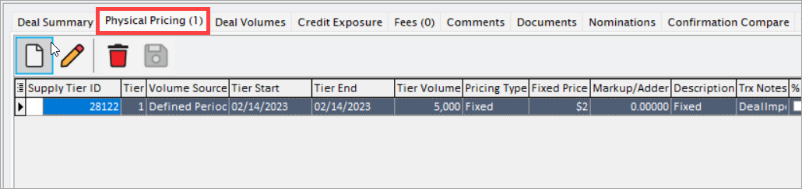

### 3. Deal volumes tab

This tab provides detailed distribution of deal volumes and available volumes for billing and nominations. It contains the following sub-tabs:

| Sub-tab            | Description |
|--------------------|-------------|
| Volume by period   | Visible only if the volume source is selected as volume by period w/ tolerance. Displays volume distribution either by month or daily, based on pricing and volume period settings. |
| View by BAV        | Displays volume details across stages: contractual quantity, planned, unscheduled, nominated, scheduled, estimated actual, actual, and best available volume (BAV). |

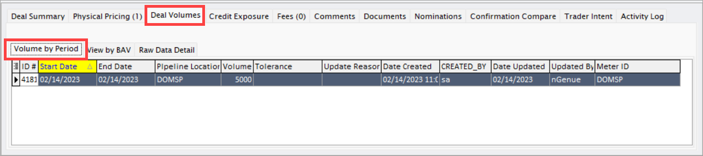

Key features in **View by BAV** tab:  

* **Date range**: specify start and end dates to filter BAV data.  
* **Load daily volumes**: load volume data for the defined date range.  
* **Recalculate dailies** using dropdown options: contractual quantity (CQ), planned volumes (PV), or both CQ and PV.

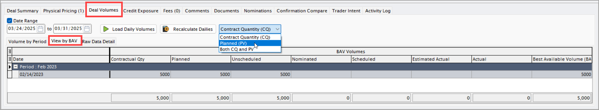

### 4. Credit exposure tab

This tab displays credit exposure for the deal, showing financial exposure against the customer’s credit limits. It helps monitor risk and ensure deal execution within approved credit lines.

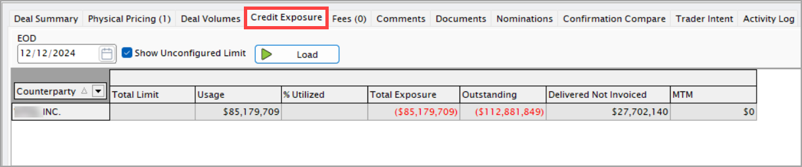

### 5. Fees tab

This tab allows users to add and manage various deal-related fees. Click **add a new deal expense** to configure fees.

| Field             | Description |
|-------------------|-------------|
| Pay/receive type  | Indicates whether the fee is a pay or receive type. |
| Fee type          | Includes broker fee, demand, sleeve, transfer, fuel loss, margin, nom mgmt, AMA opt, pipe fee, premium. |
| Calc period       | Specifies the calculation period for the fee (daily, monthly, or one-time). |
| Calc method       | Defines whether the fee is calculated based on volume or as a flat amount. |
| Per unit price    | Editable when volume-based calculation is selected; specifies price per unit volume. |
| Amount            | Editable when flat calculation is selected; displays or allows manual entry of the total fee amount. |

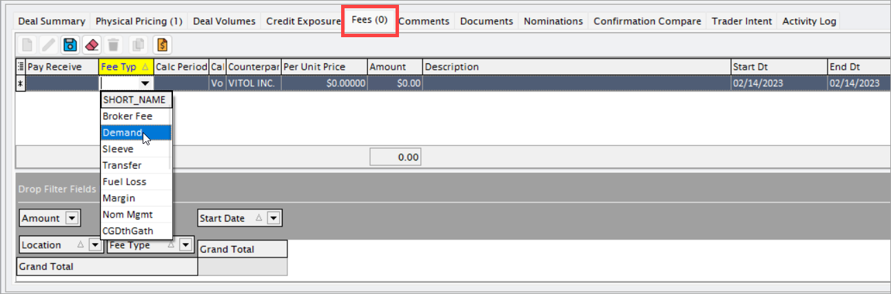

#### Supported calc period and calc method combinations

Currently, nGenue supports the following valid combinations of **calc period** and **calc method**, along with their detailed functionality:

##### ✅ True combinations

**1. Monthly — Volume**

   * The fee is applied for the provided date range as:
      ==**Fee = Volume × Price**==
   * The calculated fee is displayed in the **Fee** section.
   * For settlements that are based on the **flow month**, the system calculates the fee as:
      ==**Volume for that flow month × Price**==

This ensures that the applied fee corresponds accurately to monthly volume-based transactions.

**2. Monthly — Flat**

   * The fee is applied for the provided date range.
   * The user directly provides the **amount**, which is displayed in the **Fee** section.
   * For settlements, the fees are reflected as:  
       ==**Amount × fee date range (in months)**==

This combination allows applying a flat amount fee for monthly periods without volume calculations.

**3. Daily — Volume**

   * The fee is applied for the provided date range as:
      ==**Fee = Volume × Price**==
   * The calculated fee is displayed in the **Fee** section.
   * For settlements based on the **flow month**, the fees are calculated as:
      ==**Volume for that flow month × Price**==

This ensures daily volume-based fees are properly accounted for during monthly settlements.

**4. One time — Flat**

   * The fee is applied for the provided date range.
   * The user directly provides the **amount**, which is displayed in the **Fee** section.
   * For settlements, if the **flow month** falls between the fee and deal date range, the fee is directly reflected in the settlement as is, with **no additional calculation performed.**

This combination is ideal for applying one-time, fixed fees without ongoing calculations.

##### ❌ False combinations (not supported)

**1. Daily — Flat**

This combination is not supported, as daily flat-rate fees are not calculated or displayed by the system.

**2. One time — Volume**

This combination is not supported, since applying a volume-based fee for a one-time period is not handled by the system.

#### Summary

| Calc period | Calc method | Supported | Functionality overview |
|-------------|-------------|-----------|------------------------|
| Monthly     | Volume      | ✅        | Fee = volume × price; settlement based on flow month volumes. |
| Monthly     | Flat        | ✅        | Flat amount applied; settlement as amount × fee date range (months). |
| Daily       | Volume      | ✅        | Daily volume-based fee applied and displayed; monthly settlement based on flow month. |
| One time    | Flat        | ✅        | One-time flat fee; settlement includes fee if flow month falls in date range. |
| Daily       | Flat        | ❌        | Not supported. |
| One time    | Volume      | ❌        | Not supported. |

### 6. Comments tab

This tab allows users to add any additional remarks or important notes regarding the deal for reference and audit purposes.

### 7. Documents tab

This tab allows users to attach documents related to the deal. Click **add new end user document** to navigate to the store customer document screen. Users can provide document description, document category, and original file name for record keeping.
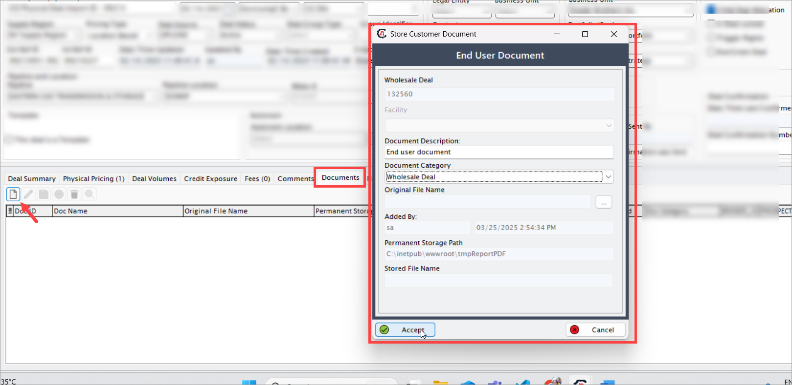

### 8. Nominations tab

This tab displays nominations associated with the deal. When the **physical autonom** checkbox is enabled, the system automatically generates nominations based on the nominated volumes defined in the view by BAV tab.

### 9. Confirmation compare tab

This tab allows users to compare the deal’s captured details with confirmations received from counterparties to ensure accuracy and consistency between internal and external records.

### 10. Trader intent tab

This tab captures the trader’s reasoning or strategy behind executing the deal. It is useful for audit trails and business insights, helping management and risk teams understand deal objectives and context.
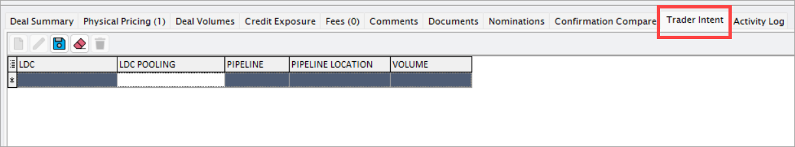

### 11. Activity log tab
The Deal activity log tab provides a complete audit trail of changes made to deals, including the user who made each change and the exact date and time it occurred.

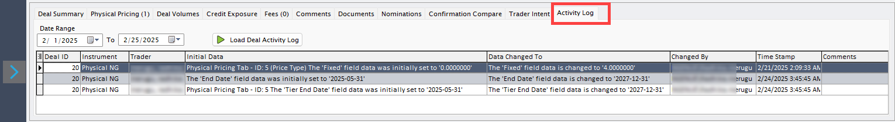

| Field              | Description |
|--------------------|-------------|
| Date range         | Allows the user to specify start and end dates to filter activity logs. |
| Load deal activity log | Clicking this button displays a complete log of all modifications, with descriptions of what changes were made, who made them, and when, for the specified date range. |
| Deal Id | Unique identifier for the deal. |
| Instrument | Type of financial asset or commodity. |
| Trader | User who executed the deal. |
| Initial data | Original deal data before changes. |
| Data changed to | Updated data after modification. |
| Changed by | User who made the change. |
| Timestamp | Date and time of the change. |
| Comments | Notes or reasons for the update. |

## Post deal activities


