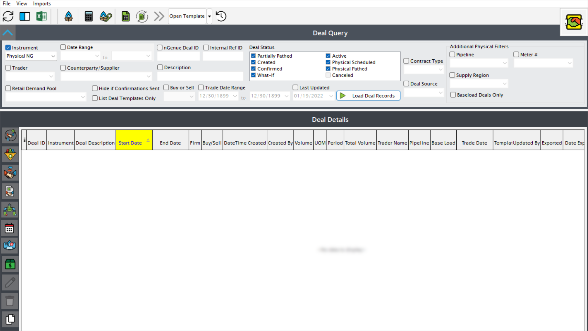
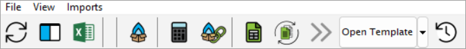
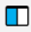
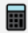

# Deal management overview

Deal management in the natural gas industry refers to the end-to-end process of creating, negotiating, executing, and monitoring contracts and agreements for natural gas transactions. It involves managing the relationships and terms between marketers, and counter parties to ensure the seamless supply and distribution of natural gas. This process is critical for optimizing operational efficiency, mitigating risks, ensuring regulatory compliance, and maintaining profitability.

## Types of deals in nGenue

The different types of deals that you can configure in nGenue are:

### Physical deal

A physical deal involves the actual delivery of natural gas from one party to another, often including specific terms for volume, location, and timing. These transactions typically occur between producers, marketers, and end-users, and they require coordination of storage and transportation logistics to ensure fulfillment. Physical deals are foundational to the natural gas market as they ensure the movement of energy resources from supply points to areas of demand.

### Physical retail deal

A physical retail deal refers to the sale of natural gas directly to end-users, such as residential, commercial, or industrial customers. These deals are typically managed by Local Distribution Companies (LDCs) or retailers and include terms for delivery schedules, pricing structures, and usage metrics. Physical retail deals prioritize reliability and adherence to customer-specific requirements, including regulated pricing in many markets.

### Swap deal

A swap deal is a financial agreement where two parties exchange specific elements of their natural gas transactions, such as delivery locations or pricing mechanisms, to mitigate risk or improve logistical efficiency. For example, one party might trade a commitment to deliver gas at a specific location in exchange for receiving it elsewhere. Swap deals are often used to optimize transportation costs and align with market dynamics.

### Future deal

A future deal in the natural gas market involves an agreement to buy or sell a specified volume of natural gas at a predetermined price on a future date. These deals are typically traded on exchanges and are used as a hedging tool to manage price volatility. Future deals do not necessarily result in physical delivery, as they can be settled financially based on the market price at expiration.

### Physical natural gas (NG) deal

A physical natural gas (NG) deal entails the tangible transfer of natural gas between parties, with specified terms for volume, quality, delivery point, and timing. These deals can occur in wholesale or retail markets and often require coordination with pipelines, storage facilities, and regulatory compliance to fulfill contractual obligations efficiently.

### Production deal

A production deal focuses on transactions directly tied to the output from natural gas wells or fields. These deals are typically made between producers and marketers or midstream companies, covering terms for the purchase, sale, and transportation of natural gas immediately after production. Production deals are critical for monetizing upstream activities and ensuring steady supply to downstream markets.

### Cash deal

A cash deal involves the immediate or near-term purchase and sale of natural gas with the settlement based on current spot market prices. These deals are often executed to address short-term supply or demand imbalances and are typically completed quickly without the need for long-term contractual commitments.

### Physical wellhead deal

A physical wellhead deal refers to the purchase or sale of natural gas directly at the production site or wellhead. These deals often involve producers selling their gas to midstream operators or marketers, with the transaction price influenced by local market conditions and transportation costs to downstream markets. Wellhead deals are fundamental to connecting upstream production with the broader supply chain.

## How to access deal management page

You will be able to access deal management page by typing **"deal"** in the quick search available in the nGenue application homepage. Select **Deal management** and this will redirect you to the **Deal management** page.

## Fields and features on the deal management homepage

You'll see this when you land into the Deal management page.

Let's get to know the main areas of the page:

### The menu

You see a list of icons with the context in the top-left corner.

| Menu/ Icons | Description |
| ----------- | ----------- |
| File | Title |
| View | Text |
| Imports | Text |
|  | Refresh supply deals record |
|  | Configure grid columns |
|  | Open grid data in excel |
|  | Open supply summary |
|  | Run comprehensive calculation of monthly deals cost |
|  | Manage market and supply links |
|  | Print trader report |
|  | Roll current deal to the next period |
|  | Roll all deals to the next period |
|  | Open template |
|  | Deal activity log |

### Left navigation bar

On the left-hand side of the page, you see a list of icons with the context in it. These icons are nothing but different types of deals that you can configure in nGenue application.

| Menu/ Icons | Description |
| ----------- | ----------- |
|  | Add physical deal |
|  | Add physical retail deal |
|  | Add swap deal |
|  | Add future deal |
|  | Add future wellhead deal |
|  | Add physical natural gas deal |
|  | Add production deal |
|  | Add cash deal |
|  | Edit current source deal record |
|  | Delete current deal record |
|  | Copy deal record |

### Main body

The main body is divided into two sections- *Index query* and *Deals details.* 

| Fields       | Description |
| ------------ | ------: |
| **Deal query**   |         |
| Instrument   | Displays the list of different types of deals present in nGenue. |
| Date range   | Fill in the start and the end date of the deal. |
| Trader       | The trader of the deal. |
| Counterparty/ supplier | The  |
| nGenue deal id       |  |
| nGenue deal id       |  |

