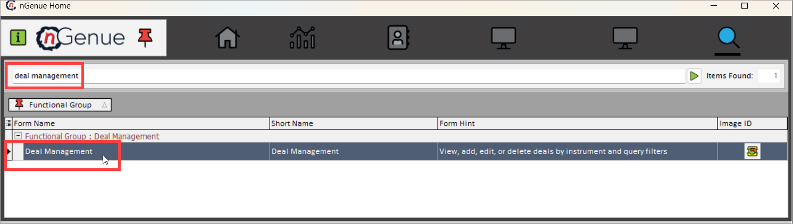
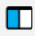
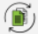
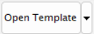

# How to navigate to the deal management screen

You will be able to access deal management page by typing **"Deal management"** in the quick search available in the nGenue application homepage. Select **Deal management** and this will redirect you to the **Deal management** page.

## Fields and features on the Deal management screen

You'll see this when you land into the Deal management page.

Let's get to know the main areas of the page:

### The menu

You see a list of icons with the context in the top-left corner.

| Menu/Icons | Description |
| ----------- | ----------- |
|  | Refresh supply deals record |
|  | Configure grid columns |
|  | Open grid data in excel |
|  | Open supply summary |
|  | Run comprehensive calculation of monthly deals cost |
|  | Manage market and supply links |
|  | Print trader report |
|  | Roll current deal to the next period |
|  | Roll all deals to the next period |
|  | Open template |
|  | Deal activity log |

### Left navigation bar

On the left-hand side of the page, you see a list of icons with the context in it. These icons are nothing but different types of deals that you can configure in nGenue application.

| Menu/ Icons | Description |
| ----------- | ----------- |
|  | Add physical deal |
|  | Add physical retail deal |
|  | Add swap deal |
|  | Add future deal |
|  | Add future wellhead deal |
|  | Add physical natural gas deal |
|  | Add production deal |
|  | Add cash deal |
|  | Edit current source deal record |
|  | Delete current deal record |
|  | Copy deal record |

### Main body

The main body is divided into two sections- **Deal query** and **Deals details.** 

#### Deal query

The **Deal query** section is used for searching, filtering, and retrieving existing deals based on specific criteria. It allows you to efficiently manage and track deals by applying different search parameters.

**Available fields in Deal query**

| Field | Description |
|------------|------------|
| Instrument | Displays the list of different deals available in the system. Options include:   - **Physical NG**: Physical natural gas contracts   - **Futures**: Future contracts for gas   - **Swap**: Financial agreements to exchange cash flows   - **Physical NG - Option**: Gas options for future transactions   - **Retail Demand Requirements**: Gas supply agreements based on demand   - **Wellhead NG**: Gas purchased directly from a production well   - **Production**: Deals related to gas production   - **Cash**: Spot market gas purchases or sales |
| Date Range | Allows users to specify a **start date** and **end date** to filter deals based on their effective period. |
| nGenue Deal ID | Allows users to enter a **unique deal ID** to search for a specific deal in the system. |
| Internal Ref ID | A reference ID used internally within the organization for tracking deals. |
| Trader | Displays the trader responsible for managing the deal. |
| [Counterparty/Supplier](../getting_started/counterparty/create_counterparty.md) | The counterparty or supplier with whom the deal is being made. |
| Description | A brief description of the deal, providing relevant details as required. |
| Retail demand pool | Specifies the **demand pool** where the retail gas requirements are grouped for trading and supply. |
| ‘Hide if confirmations sent’ Checkbox | If checked, deals for which confirmations have already been sent will be **hidden** from the query results. |
| ‘List deal templates only’ Checkbox | If checked, the **Deal Management Screen** will display **only deal templates**, excluding executed deals. |
| Buy or sell | Indicates whether the deal is a **BUY** deal (purchase of gas) or a **SELL** deal (sale of gas). |
| Trade date range | Filters deals based on the trade execution date, allowing users to enter a **start date** and **end date**. |
| Last updated | Displays the **last updated date** of the deal, indicating when it was last modified. |
| Contract type | Specifies the type of contract associated with the deal (e.g., **Firm, Interruptible, Indexed, Fixed Price**). |
| Deal source | Identifies the origin of the deal, whether it was **imported, manually created, or auto-generated** by the system. |

**Additional physical filters section**

| Field | Description |
|------------|------------|
| [Pipeline](../getting_started/configure_pipeline.md) | Displays the **pipeline** associated with the deal, which is responsible for gas transportation. |
| [Supply region](../getting_started/configure_supply_region.md) | The **geographical region** from which the gas is supplied. |
| Baseload deals only | If selected, the system will filter deals that are **Baseload** (steady supply contracts without fluctuations). |
| [Pipeline location](../getting_started/configure_pipeline.md#step-2-create-a-new-pipeline-record) | Specifies the **exact location** on the pipeline where the gas is injected or withdrawn. |
| Index type/group | Defines the **pricing index or group** used for setting gas prices. |
| Meter# | The **meter number** associated with the deal, which is used for measuring gas consumption and delivery. |

**Deal status section**

This section displays the current status of the deal, which can include the following states:

| Deal Status | Description |
|------------|------------|
| Partially pathed | The deal is in progress but has not been fully assigned to a pipeline path. |
| Created | The deal has been **entered into the system** but is not yet confirmed. |
| Confirmed | The deal has been **finalized and approved** by all parties. |
| What-if | A **hypothetical deal** used for analysis without committing to execution. |
| Active | The deal is currently **valid and operational**. |
| Physical scheduled | The gas deliveries for this deal have been scheduled for physical transport. |
| Physical pathed | The deal has been fully assigned to a **pipeline path** for execution. |
| Canceled | The deal has been **voided and is no longer active**. |

#### Deal details

Once you select the relevant filters in the **Deal query** section and click on the **Load deals record** button, the system retrieves and displays the corresponding deals in the **Deal details** section.

---