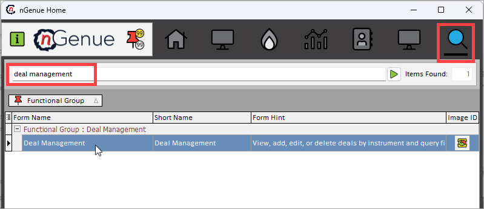

# Create a physical deal

A physical deal involves the actual delivery of natural gas from one party to another, often including specific terms for volume, location, and timing. These transactions typically occur between producers, marketers, and end-users, and they require coordination of storage and transportation logistics to ensure fulfillment. Physical deals are foundational to the natural gas market as they ensure the movement of energy resources from supply points to areas of demand.

## Prerequisites

* **Configure Legal Entity, Business Unit, Strategy, and Portfolio**: Set up organizational and strategic frameworks.

1. **Configure Supply Region**: Define geographic regions for supply management.
1. **Configure Pipeline**: Specify pipelines for transporting natural gas.
1. **Configure Pipeline Location**: Define physical locations along the pipeline.
1. **Configure Pipeline Zone**: Establish zones within the pipeline.
1. **Configure Counterparty**: Create and link trading partner details.
1. **Create Rate Schedule**: Set up pricing terms and conditions.

## Procedure

This guide provides a step-by-step procedure to add a physical deal in nGenue. Follow the instructions below to create and manage physical deals effectively.

### Step 1: Navigate to Deal management module

1. Log in to the nGenue application using your credentials.
2. Search for **"deal management"** in the quick search bar in the nGenue application homepage.
3. Select **Deal management.**

### Step 2: Create a new physical deal

1. Click on **Add Physical deal** or use the **(Alt+A)** keyboard shortcut.
2. Define **Transaction information**:  
    1. Choose the *deal type,* i.e., buy or sell deal.
    1. Input the *start* and the *end date* of the deal.
    1. Select the *trader* from the dropdown list and the trading initiated date.
    1. Define the *delivery schedule*, including start and end dates, and specify *daily* or *monthly* volumes.
    1. Enter the *gas volume* in the appropriate *unit (in MMBtu or other units)* and define the *Btu rate.*
    1. Enter the relevant pricing terms, including pricing type such as *deal based,* or *location based,* and specify *daily* or *monthly pricing period.*
    1. Choose the *supply region* for the pipeline from the dropdown list.
    1. Select the relevant deal terms, including *deal source type, deal status (e.g., active, cancelled), group identifier* and *deal group type* from the dropdown list.

        !!! note "Note"

            The **Deal Source** field defaults to **Manual**. If deals are fetched through an integration, select the appropriate integration type from the dropdown. 

    1.  Enter the last updated date and time and the details of the person who made the changes in the **Date/Time Updated** and **Updated By** fields, respectively.  

    1. The **Date/Time Created** field is automatically populated based on the deal's configuration. If you are creating the deal, enter your name in the **Created By** field, or specify the appropriate person.
    
2. Assign **Pipeline and location**:  
    1. Select the *pipeline* with which the deal is carried out.
    1. Specify the *pipeline path* for gas transportation by selecting from the available options.
    1. Select the **Use meter id** checkbox to enable the **Meter #** field. This will assign a unique identifier at an user location or a point in the distribution network. This is useful to track and manage consumption, billing, and other operational details.

1. Assign **Counterparty configuration**:  
    1. Select the *counterparty* from the dropdown list.
    1. Select the counterparty relevant information such as *legal entity,* and *business unit.*
    2. Select the associated *contract* and *agreement*.

1. Define **Report groupings**:  
    1. Select the relevant report groupings involved in the deal including *legal entity, business unit* and *portfolio.*
    1. Choose the associated *strategy* for the above portfolio selected from the drop down.

1. Additional **Deal configurations**:
    1. Select the **This deal is a template** checkbox to designate the current deal as a template within the nGenue application. When this option is selected, the deal becomes a reusable framework that can be copied or referenced to streamline the creation of similar deals in the future.
    2. Enable the **Physical autonom** checkbox to enable the **Autonom location** and **Autonom contract** fields. These automatically generate and submit nominations based on predefined deal parameters, reducing manual input and associated errors.
    3. Select the relevant deal settings checkboxes from the list, including:  
        * **Base load deal**
        * **Allow scheduling**
        * **Child deal allocation**
        * **Is deal locked**
        * **Trigger rights**
        * **Evergreen deal**

6. Validate and confirm:
    1. Review all entered details for accuracy.
    1. Provide any additional terms or conditions related to the deal including deals confirmation date/time stamp, and confirmation number.
    1. Click **Save.**

7. You will navigate to the **Deal summary** tab where a concise overview of a deal is displayed.

### Post deal activities

After the deal is created, the following post-deal activities are required to ensure proper execution, compliance, and tracking.

1. **Pricing Configuration** 
    1. *Setting up a Physical pricing for the deal*: 
        1. Set up pricing components for transportation or delivery services.
        1. Configure any applicable surcharges or adjustments based on market conditions.

2. **Nominations and Scheduling**
    1. **Submit Nominations**:
        1. Allocate volumes to the chosen pipeline paths or storage facilities as per the deal terms.
        1. Ensure nominations comply with pipeline rules and available capacity.

    2. **Schedule Deliveries**:
        1. Coordinate with counterparties and pipeline operators to set up the delivery timelines.
        2. Update and track the schedules within nGenue for real-time monitoring.

By following this procedure, deals are created, executed, and monitored efficiently in nGenue, with proper post-deal activities ensuring smooth operations and compliance.

## Additional notes

- You can edit or update the deal details at any time by selecting the deal and clicking the **edit** button.
- To track deal performance or generate reports, use the reporting and analytics features in the deal management module.
