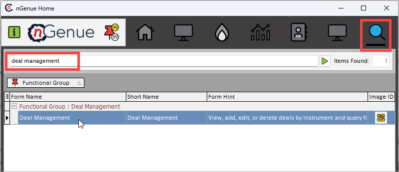

# Create a physical wellhead deal

A physical wellhead deal refers to the purchase or sale of natural gas directly at the production site or wellhead. These deals often involve producers selling their gas to midstream operators or marketers, with the transaction price influenced by local market conditions and transportation costs to downstream markets. Wellhead deals are fundamental to connecting upstream production with the broader supply chain.

## Prerequisites



## Procedure

This guide provides a step-by-step procedure to add a physical wellhead deal in nGenue. Follow the instructions below to create and manage physical wellhead deals effectively.

### Step 1: Navigate to Deal management module

1. Log in to the nGenue application using your credentials.
2. Search for **"Deal management"** in the quick search bar in the nGenue application homepage.
3. Select **Deal management.**

### Step 2: Create a wellhead deal

1. Click on **Add wellhead deal** or use the **(Alt+H)** keyboard shortcut.


## Post deal activities

