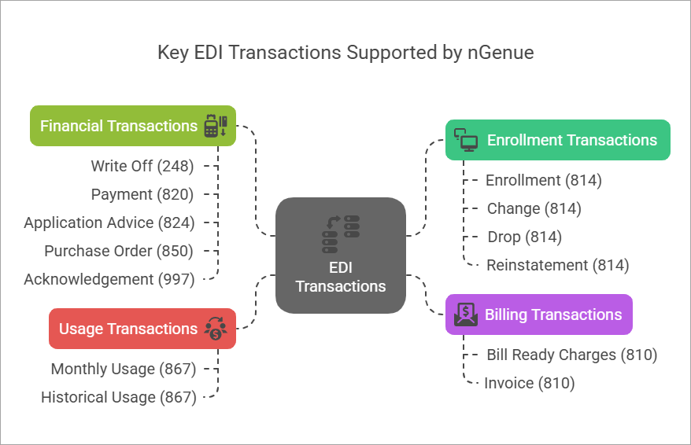

# Key EDI transactions supported  

**Electronic Data Interchange (EDI)** transactions is a system that streamline processes such as enrollment, billing, usage reporting, and payment reconciliation. **nGenue** supports a wide range of EDI transactions tailored specifically for the natural gas trading. It automates transactions, reduces cost and errors and speeds up transaction processes.  

<!--, need confirmation from srini-->

Detailed explanation of the key EDI transactions based on their type, purpose and usage has been provided below:

## EDI 814 transactions 
The **EDI 814 transactions** are implemented to manage customer enrollment, change, termination, reinstatement and provides timely updates to customer accounts. 

| Types | Description |
|--------| -------- |
| [Enrollment (814)](./edi_transactions/edi_814/enrollment/understand_enrollment.md) | The **Enrollment (814) transactions** are used to add new customers to a natural gas service. It is used when a customer selects a new supplier or switches from a utility to a retail gas supplier.|
|  [Change (814)](./edi_transactions/edi_814/change/understand_change.md)  | The **Change (814) transactions** are used to modify existing customer account details, such as service address updates, contract amendments, or rate changes.|
| [Drop (814)](./edi_transactions/edi_814/drop/understand.md)  | The **Drop (814) transactions** are used to terminate a customer's natural gas service with a supplier, either due to customer request, non-payment, or contract expiration.|
| [Reinstatement (814)](./edi_transactions/edi_814/reinstatement/understand_reinstatement.md)  | The **Reinstatement (814) transactions** are used to reinstate a previously dropped or terminated customer account. |
| [Advance notification drop (814)](./edi_transactions/edi_814/advance_drop/edi_advance_notification_drop.md)  | The **Advance notification drop (814) transactions** are used to schedule the future termination of a customer’s gas service.|

## EDI 810 transactions 
The **EDI 810 transactions** are implemented for billing and invoicing between suppliers, utilities, and customers. 

| Type | Description |
|--------| -------- |
| [Invoice (810)](./edi_transactions/edi_810/edi_invoice_810.md)  | The **Invoice (810) transactions** are standardized electronic data used to exchange billing information between suppliers, utilities, and customers.|

## EDI 867 transactions 
The **EDI 867 transactions** are implemented to exchange natural gas usage data between trading partners to ensure reporting and billing accuracy. 

| Types | Description |
|--------| -------- |
| [Monthly usage (867)](./edi_transactions/edi_867/monthly_867/mu_transactions.md)  | The **Monthly usage (867) transactions** refers to the volume of natural gas consumed by a customer or at a specific delivery point during a calendar month. This data is reported using the transaction 867 format. |
|  [Historical usage (867)](./edi_transactions/edi_867/historical_usage_867/hu_transactions.md)  | The **Historical usage (867) transactions** refers to past consumption data reported over previous months or years. This data is often used for forecasting, budgeting, and analyzing consumption trends. |

## EDI 997 transactions 
The **EDI 997 transactions** are implemented to acknowledge the receipt of EDI transactions. It ensures communication integrity by confirming that data has been received and processed. 

| Type | Description |
|--------| -------- |
| [Acknowledgement (997)](./edi_transactions/edi_997/acknowledgment_997.md)  | The **Acknowledgement (997) transactions** serves as a receipt and acknowledgment of an EDI transaction set (for example, transaction 867 for natural gas monthly usage). It confirms that the sender's EDI file was received and provides feedback on whether the file passed or failed validation checks. |

## EDI 248 transactions 
The **EDI 248 transactions** are implemented to process write-offs for outstanding balances in the natural gas trading. 

| Type | Description |
|--------| -------- |
| [Write off (248)](./edi_transactions/edi_248/edi_writeoff_248_transaction.md)  | The **Write-off (248) transactions** are accounting action that reduces the value of an asset to zero or acknowledges that a liability will not be paid.  It is used to:  1. Recognize that an asset (for example, accounts receivable, inventory, or equipment) has lost its value.  2. Acknowledge that a debt or receivable is un-collectible (for example, bad debt).  3. Write-offs are recorded as an expense on the income statement, which reduces net income, and the corresponding asset or receivable is removed from the balance sheet. |

## EDI 820 transactions 
The **EDI 820 transactions** are implemented to exchange payment information between natural gas trading partners. 

| Type | Description |
|--------| -------- |
| [Payment (820)](./edi_transactions/edi_820/payment_820/understand_payment.md)  |The **Payment 820 transactions** are used to communicate payment information and remittance details between a payer (for example, a customer or company) and a payee (for example, a supplier or utility). It serves as both a payment instruction and a remittance advice, providing details about the payment and how it should be applied to specific invoices or accounts. |

---