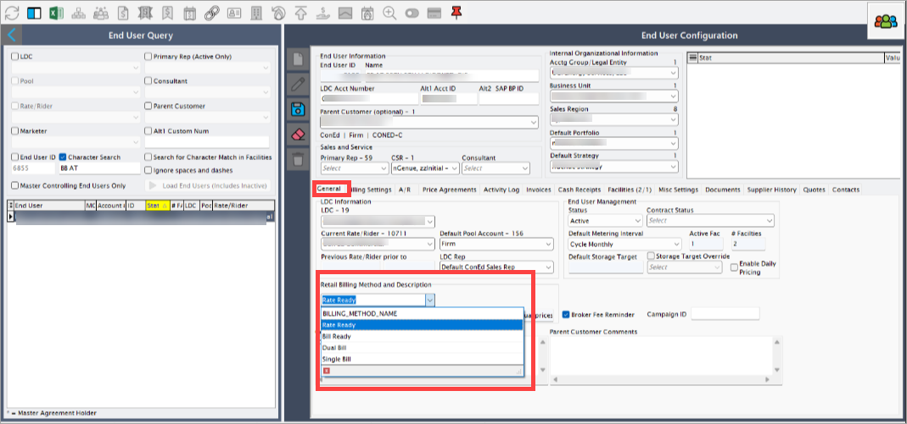
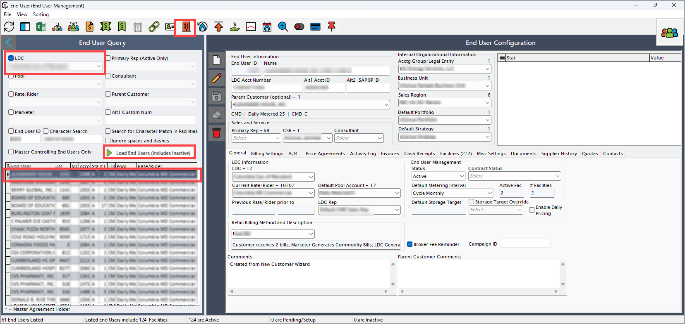
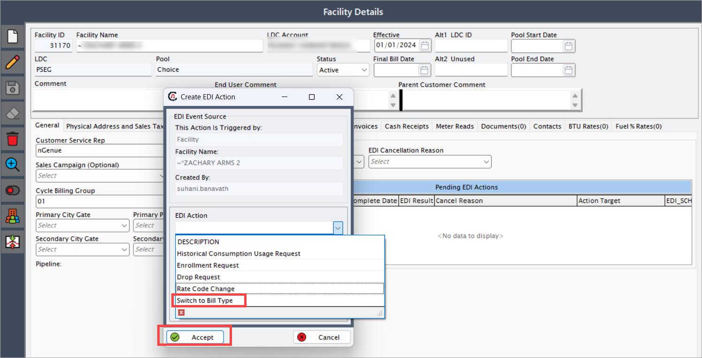

# Configure a bill type

The following article outlines the steps to configure a bill type in the nGenue application and initiate an [**Electronic Data Interchange (EDI)**](../../../index.md) 814 request to switch the bill type with the [**Local Distribution Company (LDC)**](../../../../ldcs/ldcs_overview.md).

## Configuration steps

### Step 1: Select a bill type

1. Log in to the **nGenue** application.
2. Click the **Search** icon and enter _end user_ in the search bar.
3. Double-click **End user** in the search results to open the [**End user**](../../../../getting_started/end_users/overview.md) screen.
 
4. In the **End user** screen, select an end user under **End user query** section. 
5. Click **Edit** to modify the selected end user details.  
6. Go to the **General** tab and select the bill type from **Retail billing method and description**.
7. Click **Save** to apply the changes.
 

### Step 2: Initiate a switch bill type request

1. Navigate to the **End user** screen.
2. Select the **LDC**, then click **Load end users (includes inactive)**.
3. From the results, select the **facility**.
4. Click the **Facility** icon located at the top center of the screen.
 

5. The [**Facility**](../../../../facility_management/overview.md) screen has two main sections: **Facility selection** and **Facility details**.

    * **Facility selection:** Displays a list of existing facilities.
    * **Facility details:** Allow user to add new transactions and displays the status of transaction.
     

6. In the **Facility details** screen, locate the **Pending EDI actions**.
    6. Right-click and select **Add new EDI action for this facility**.
       
    7. Select **Switch to bill type** from the dropdown menu.
     
    8. Schedule the action date and click **Accept**.

7. The EDI service processes the request based on the scheduled date.  
8. The system generates an outbound file and transmits it to the utility for verification.  
9. The **Facility** screen updates the EDI status to **Awaiting response**.

Configuring a bill type in the application updates customer billing preferences accurately and ensures compliance with utility requirements. The **EDI Change 814 request** process validates all changes with the LDC before applying them, minimizing errors and ensuring billing accuracy.

---
