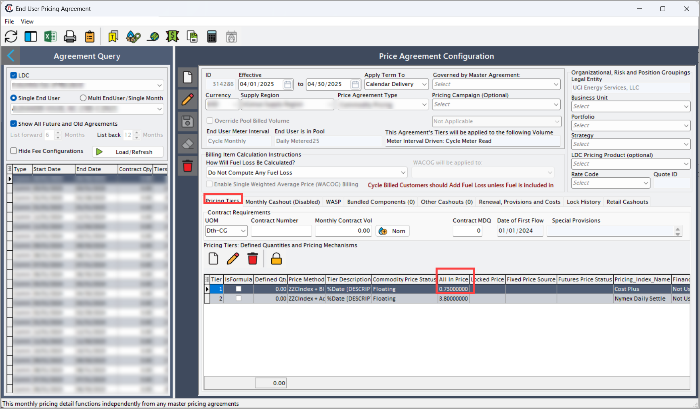
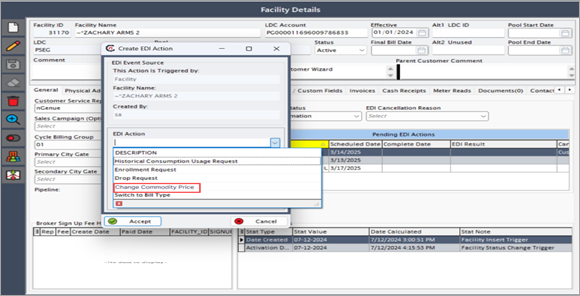

# Configure a commodity price

The following article outlines the steps to update a commodity price in the **nGenue** application and initiate an [**Electronic Data Interchange (EDI)**](../../../index.md) 814 request to communicate the change to the [**Local Distribution Company (LDC)**](../../../../ldcs/ldcs_overview.md).

## Configuration steps

### Step 1: Select a commodity price

1. Navigate to the [**End user**](../../../../getting_started/end_users/overview.md) screen.  
2. Click the **Price agreement** icon located at the top center of the screen to open the [**Price agreement**](../../../../prospect_quote_engine/ldc_pricing_product_configuration.md) screen.
 
3. In the **Price tiers** tab, click **Edit**.  
4. Update the **All-in Price** value to the new price.  
5. Click **Save** to apply the changes.

## Step 2: Initiate a commodity price change request

1. Navigate to the [**End user**](../../../../getting_started/end_users/overview.md) screen.
2. Select **LDC**, then click **Load end users (includes inactive)**.
3. From the results, select the **facility**.
4. Click the **Facility** icon located at the top center of the screen.

5. The [**Facility**](../../../../facility_management/overview.md) screen has two main sections: **Facility selection** and **Facility details**.
       - **Facility selection:** Displays a list of existing facilities.
       - **Facility details:** Allow user to add new transactions and displays the status of transaction.
        

6. In the **Facility details** screen, locate **Pending EDI actions**. 
    7. Right-click and select **Add new EDI action for this facility.**
      
    8. Select **Change commodity price** from the dropdown menu.  
    9. Schedule the action date and click **Accept**.  
        
7. The EDI service processes the request based on the scheduled date.  
8. The system generates an outbound file and transmits it to the utility for verification.  
9. The **Facility** screen updates the EDI status to **Awaiting response**.

Updating the commodity price in the application ensures that customers are billed accurately based on the most current pricing agreements. The 814 EDI request process verifies the change with the LDC before implementation, ensuring compliance, reducing billing discrepancies, and maintaining customer trust.

---