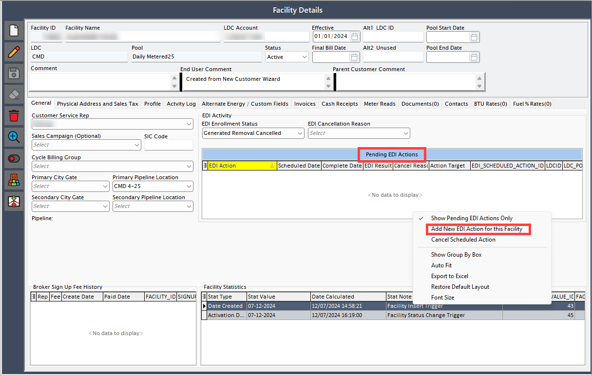

# Configure a customer tax rate

The following article outlines the steps to update a customer tax rate in the **nGenue** application and initiate an [**Electronic Data Interchange (EDI)**](../../../index.md) 814 request to notify the [**Local Distribution Company (LDC)**](../../../../ldcs/ldcs_overview.md).

## Configuration steps

### Step 1: Select a tax rate

1. Navigate to the **Sales tax definition** screen. <!--  -->
2. Go to the **Tax rate history** tab.

3. Click the **Edit** button, enter the new tax rate percentage, and click **Save**.

### Step 2: Initiate a customer tax rate change request

1. Navigate to the [**End user**](../../../../getting_started/end_users/overview.md) screen.
2. Select the **LDC**, then click on the **Load end users (includes inactive)** button.
3. From the results, select the **facility**.
4. Click on the **Facility** icon located at the top center of the screen.

5. The [**Facility**](../../../../facility_management/overview.md) screen has two main sections: **Facility selection** and **Facility details**.

    * **Facility selection**: Displays a list of existing facilities.
    * **Facility details**: Allow user to add new transactions and displays the status of transaction.
      

6. In the **Facility details** screen, locate the **Pending EDI actions**.
    7. Right-click and select **Add new EDI action for this facility.**
    
    8. Select **Change customer tax rate** from the dropdown menu.  
    9. Schedule the action date and click **Accept**. 
      

7. The EDI service processes the request based on the scheduled date.  
8. The system generates an outbound file and transmits it to the utility for verification.  
9. The **Facility** screen updates the EDI status to **Awaiting response**.

Updating the customer tax rate in the application ensures that billing reflects accurate and current tax obligations. The 814 EDI request process confirms the change with the LDC before implementation, ensuring compliance with tax regulations and maintaining billing accuracy.

---