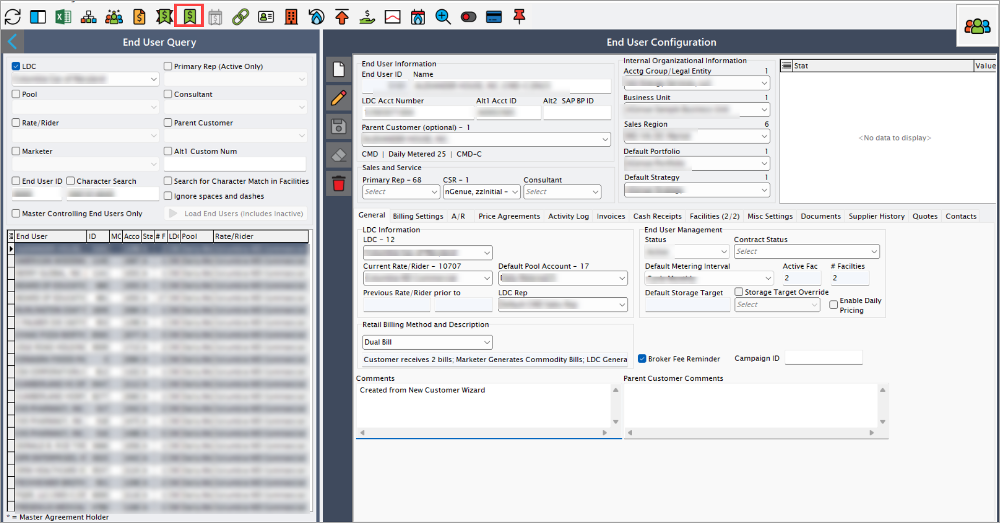

# Configure a rate code

The following article outlines the steps to update a rate code in the **nGenue** application and initiate an [**Electronic Data Interchange (EDI)**](../../../index.md) 814 request to communicate the change to the [**Local Distribution Company (LDC)**](../../../../ldcs/ldcs_overview.md).

## Configuration steps

### Step 1: Select a rate code

1. Navigate to the [**End user**](../../../../getting_started/end_users/overview.md) screen.
2. Click the **Price agreement** icon located at the top center of the screen to open the [**Price agreement**](../../../../prospect_quote_engine/ldc_pricing_product_configuration.md) screen.
    
3. Select the **Price agreement** for which you need to change the rate code.

4. Click **Edit**.  
5. From the **Rate code** dropdown, select the required rate code.  
6. Click **Accept** to apply the changes.

### Step 2: Initiate a rate code Change request

1. Navigate to the **End user** screen.
2. Select the **LDC**, then click **Load end users (includes inactive)**.
3. From the results, choose the desired **facility**.
4. Click the **Facility** icon to open **Facility** screen.

5. The [**Facility**](../../../../facility_management/overview.md) screen has two main sections: **Facility selection** and **Facility details**.
       - **Facility selection:** Displays a list of existing facilities.
       - **Facility details:** Allow the user to add new transactions and displays the status of each transaction.
    
6. In the **Facility details** screen, locate **Pending EDI actions**. 
    7. Right-click and select **Add new EDI action for this facility.**
    
    8. Select **Rate code change** from the dropdown menu.
    9. Schedule the action date and click **Accept**.
      
7. The EDI service processes the request based on the scheduled date.  
8. The system generates an outbound file and transmits it to the utility for verification.  
9. The **Facility** screen updates the EDI status to **Awaiting response**.

Changing the rate code in the application ensures that customer pricing aligns with the correct utility-defined rates. The 814 EDI request process confirms the update with the LDC before it takes effect, ensuring compliance, accuracy, and minimal disruption to billing operations.

---