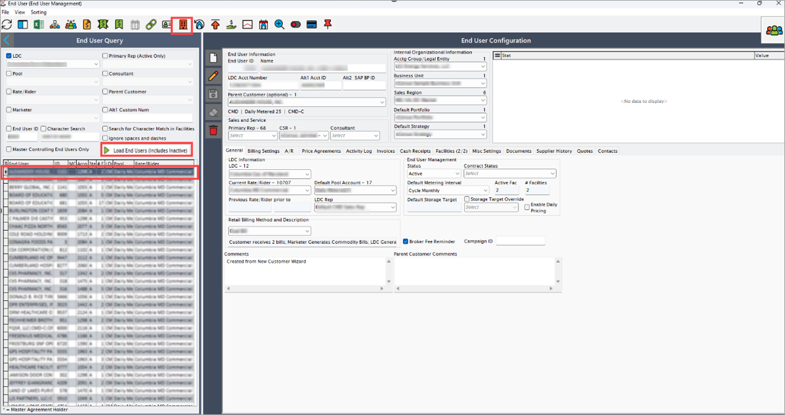
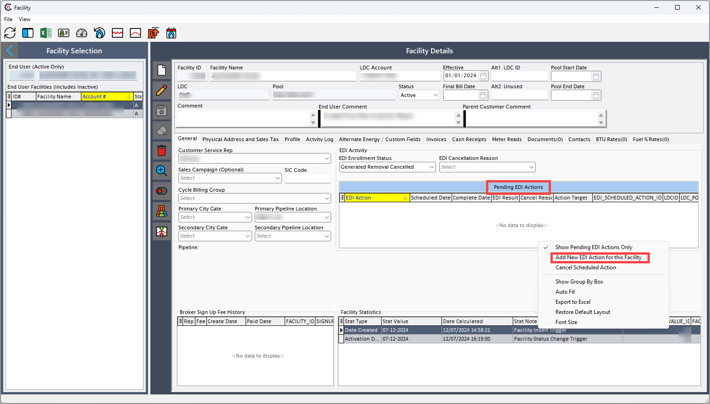
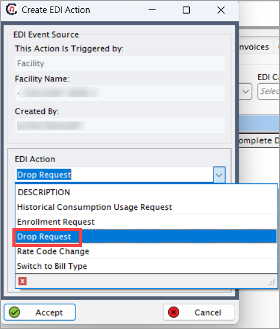
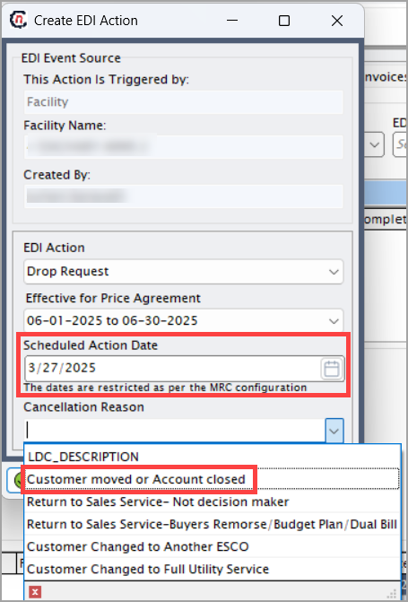

# Configure EDI Drop transactions (814)
The **EDI Drop transactions 814** request is implemented on cancellation of active services, so drop request can be configured either manually or automated on preset conditions. Must have a valid **account number**, **rate code**, **price agreement** to configure a drop request.

## Submitting an EDI Drop request

Follow the given below steps to submit a **drop request** manually: 

1. Log in to the **nGenue** application. 
2. Click **Search** and enter *End user* and double-click on the **End user**.
   
3. In the [**End user**](../../../../getting_started/end_users/overview.md) screen, select **LDC**, then click on the **Load end users** button and select a facility. 
4. Locate and click on the **Facility** icon to open [**Facility**](../../../../facility_management/overview.md) screen. 
   
5. In the **Facility** screen, go to **Facility details** section to add new transactions and to view transaction status. 
6. Find **Pending EDI actions** and right-click on it, then select the **Add new EDI action for this facility**.
   
7. In the **Create EDI action** screen:
    1. Find **EDI action**, then select **Drop request** from the dropdown.
        
    1. Select **Effective for price agreement**, **Scheduled action date** and the **Cancellation reason**.  
        
    1. Click **Accept** to commit.

9. After submission, the request enters the workflow:  
    1. EDI service processes the request based on the scheduled date.  
    1. An outbound file is generated and transmitted to the utility.  
    1. The **Facility** screen shows status as **Awaiting response** in the EDI **Activity log**.  

## Post-submission of EDI Drop request

### Outbound process (Supplier to utility)

1. The request will be logged in the **EDI schedule**, then EDI service executes the request at the scheduled time. 
3. The system generates an outbound file in the desired format. 
4. Files are processed by **15:00** and transmitted to the utility by **16:00** (if set up for FTP shipment). 
5. The file can be shipped through utility FTP, or uploaded to utility website. Also, shipment can be tracked through **Activity log**.
6. The transaction will be displayed in 
    - **Pending EDI Actions** (**Facility** screen). 
    - **Activity log** tab (once request is initiated). 

### Inbound process (Utility to supplier)  

1. The utility provides a **drop response file** upon the request. 
2. EDI service retrieves response file from **nGenue** FTP site.
3. Then the file will be decrypted and processed. 
4. The system fetches the file from the FTP site. 
5. Then the file is validated and decrypted.
     1. If response is accepted:
         1. **Activity log** confirms the drop.
         1. **Effective drop date** is captured and viewed.
         1. In the **Facility** screen, EDI status will be updated to **Drop accepted**.

     1. If rejected:
         1. Rejection will logged in **Activity log**.
         1. Create a **task** for review. 
         1. Once processed, the file is moved to the **archive** for the record. 

Upon submitting the EDI drop request, the request will be logged and processed, the transactions will be recorded and cancellation of active services will be implemented as scheduled. This provides a structured process to ensure accurate and timely cancellation of the services with the provider.

---