# Configure Enrollment (814) transactions

The **nGenue** system follows a structured workflow, generating outbound **Electronic Data Interchange (EDI)** files for utility submission and processing inbound responses to update enrollment status. This outlines the step-by-step procedures for configuring both manual and auto-enrollment transactions, along with the outbound and inbound EDI processes. 

## Configuration steps

### Submit a manual enrollment transactions request

To submit an **enrollment request** manually follow the steps below:  

1. Log in to the **nGenue** application.
2. Click on the **Search** icon and enter _end user_ in the search bar.
3. Double-click **End user** in the search results to open the [**End user**](../../../../getting_started/end_users/overview.md) screen.
    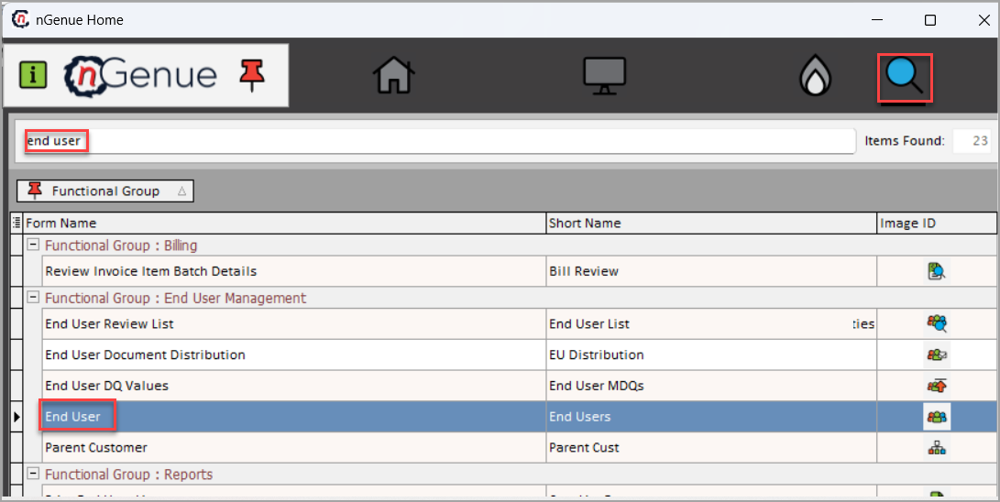
4. Select the [**LDC**](../../../../ldcs/ldcs_overview.md), then click the **Load end users (includes inactive)** button.
5. From the results, choose **Facility**.
6. Click on the **Facility** icon to open the [**Facility**](../../../../facility_management/overview.md) screen.
    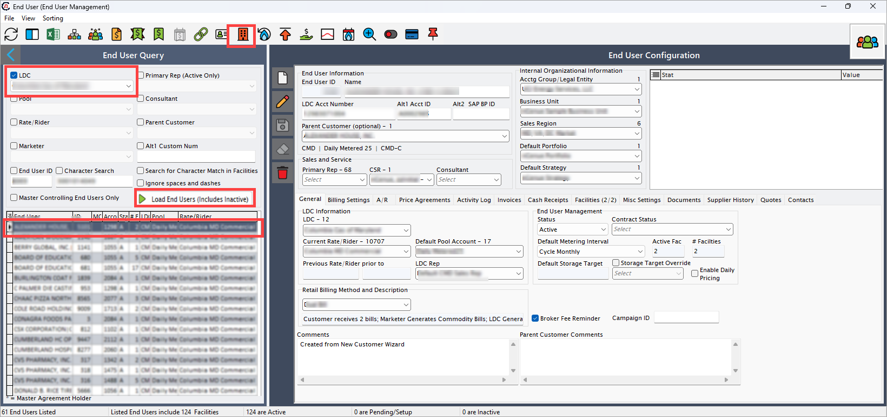
7. The **Facility** screen has two main sections: **Facility selection** and **Facility details**.
    - **Facility selection**: Displays a list of existing facilities.
    - **Facility details**: Allow user to add new transactions and displays the transaction status.
    
8. In the **Facility details** section, locate **Pending EDI actions**.Then, do the following:  
    9. Right-click and choose **Add new EDI action for this facility**.
        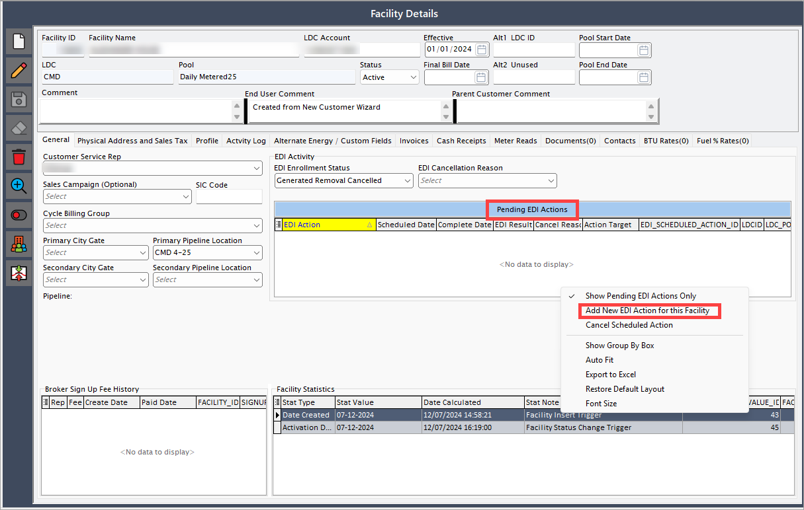
    10. From the dropdown menu, choose **Enrollment request**.
        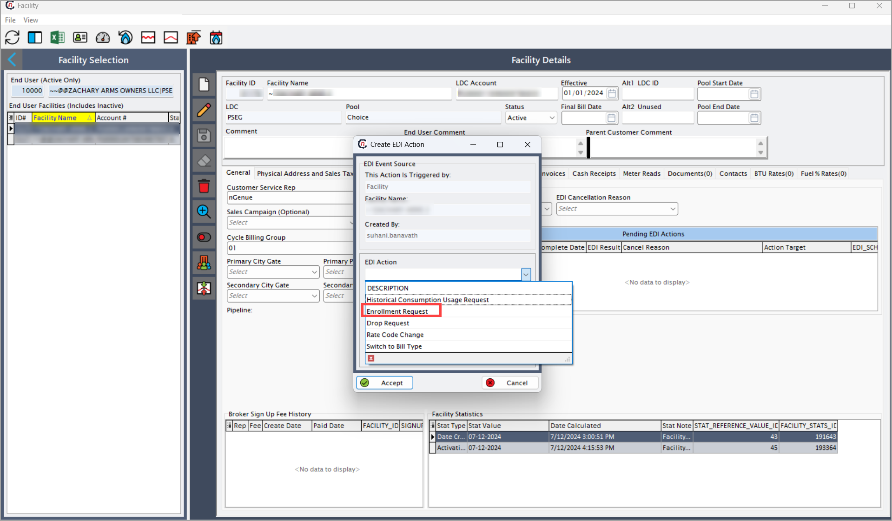
    11. Select the applicable **Price agreement**.
         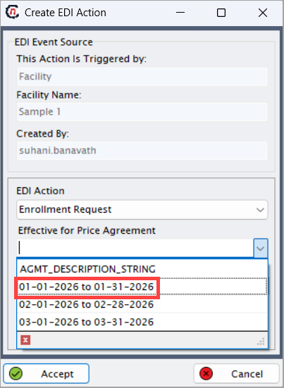
    12. Set the **Scheduled action date** and click **Accept**.
         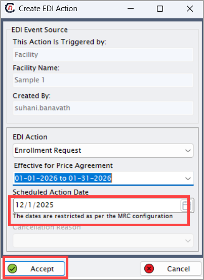
9. The EDI service processes the request based on the scheduled date.
10. The system generates an outbound file and transmits it to the utility for verification.
11. Return to the **Facility** screen, the EDI activity status should now display **Awaiting confirmation**.
    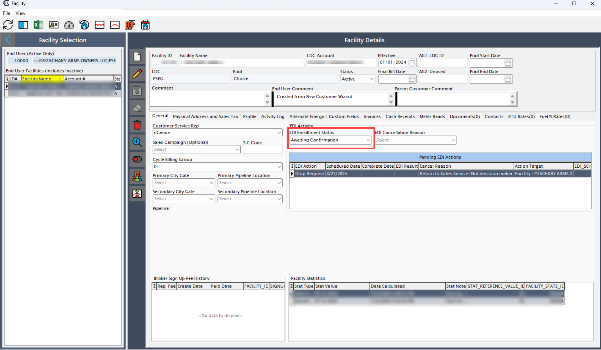

### Auto-enrollment transaction request

A prospect is added in the **Quote engine**, and the quote is accepted. Follow the steps below to complete the auto-enrollment process:

1. Navigate to the [**Quote engine**](../../../../prospect_quote_engine/index.md) screen.
2. In the **Quote engine** screen, accepts the quote on the **Quote** tab.
    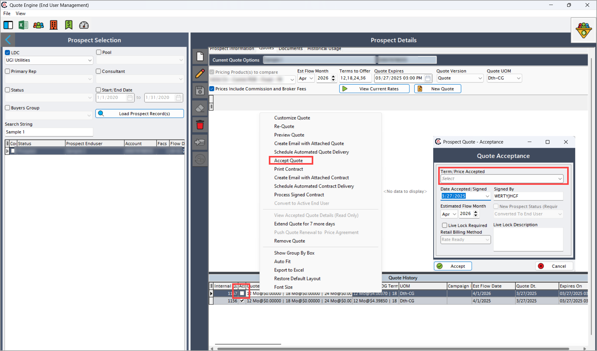
3. Right-click and chooses **Convert to active end user**.
    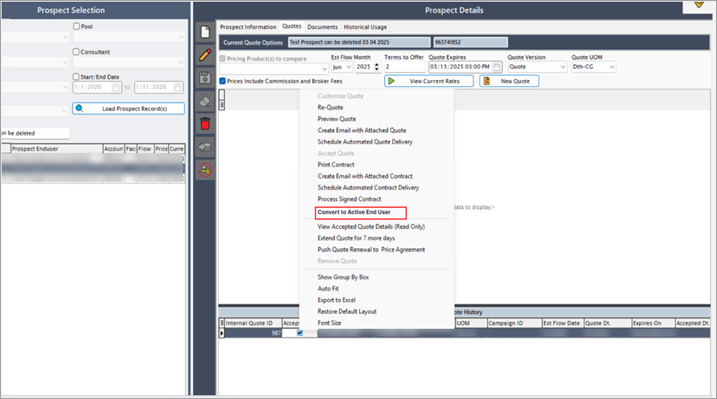
4. In the new customer wizard, ensure the **Requires enrollment** option is checked.
    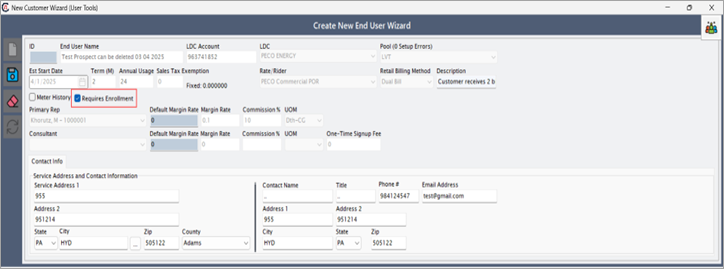
5. The system generates an enrollment request.  
6. The system calculate the scheduled enrollment data based on the MRC.  
7. On the scheduled date, the system runs the standard enrollment workflow and activates the end user.  

## Post enrollment steps

### Enrollment request outbound process (Supplier to utilities)

When an enrollment request is initiated:  

1. The system adds the request to the EDI schedule.  
2. The EDI service process the request at the scheduled time.  
3. The system generates an outbound file (for example, `C/Data/Utility/Outbound/X12`) containing customer enrollment information.  
4. Files are transmitted via **FTP** or  uploaded to the **Utility portal** (usually by 16:00 if scheduled for FTP).  
5. The system creates an activity log entry for tracking.
6. The transaction appears in:  
    - **Pending EDI actions** (after the EDI server picks up the request).  
    - **Activity log tab** (upon request initiation).
   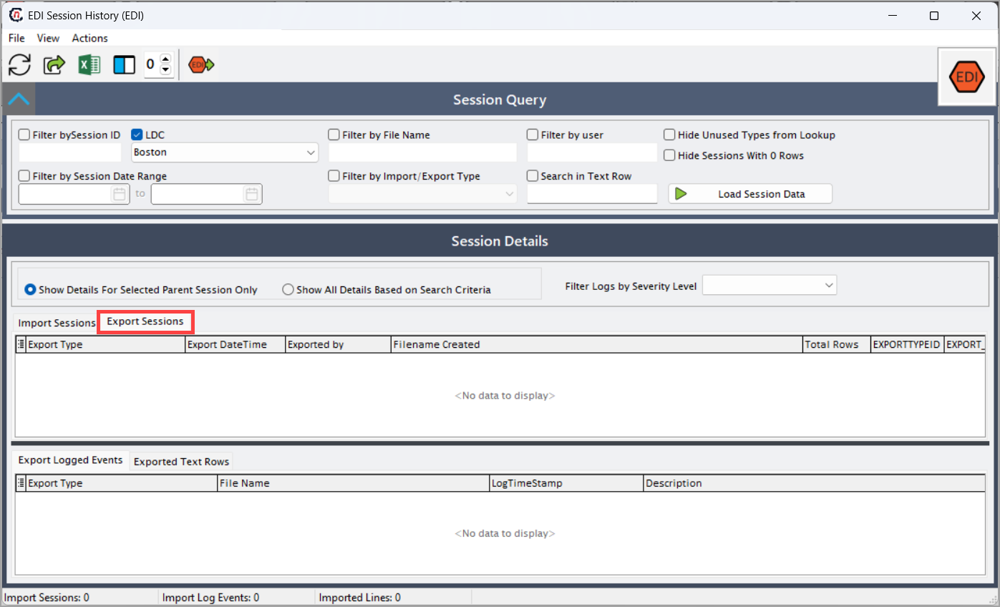

### Enrollment response inbound process (Utilities to supplier)

Once the utility receives the enrollment request:  

1. The utility posts an enrollment response file to the **nGenue** FTP server.  
2. The EDI service downloads and decrypts the incoming file.  
3. The system processes the response and updates the enrollment status.
4. The system retrieves the incoming file from the FTP server and validates and decrypts the file.
    5. If the transaction is successful;
        6. The system records the effective enrollment date in the **Activity log** and displays it to users.
        7. When the utility approves the enrollment request, the **Facility screen** updates the EDI status to **Enrollment accepted**.
    6. If the transaction request is rejected:
        6. The **Activity log** shows the reason for rejection.
        7. The system initiates a task for review.
        8. The system archives all processed files for record-keeping.
            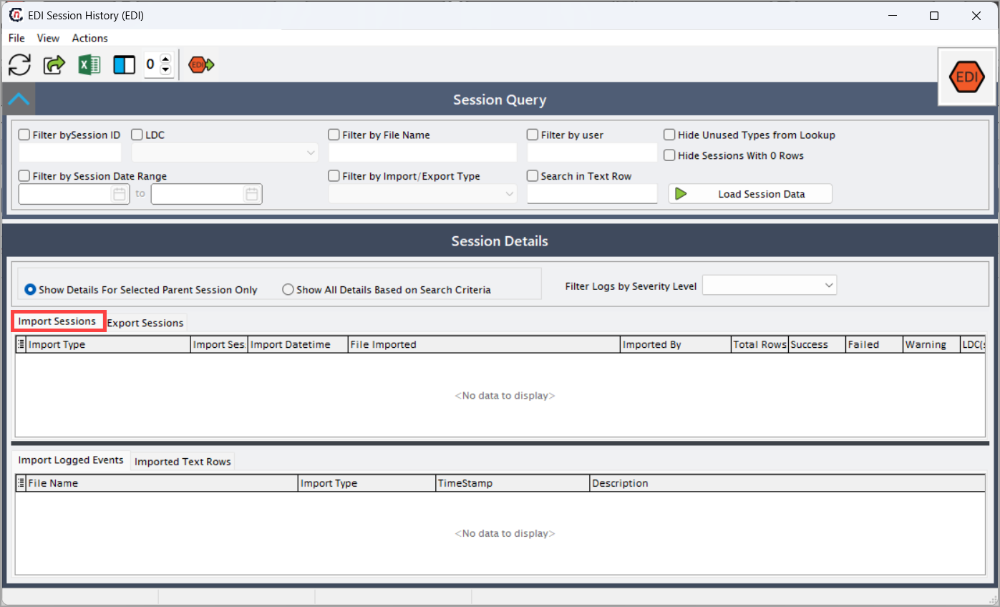

The enrollment process streamlines the submission and tracking of enrollment requests between suppliers and utilities. Whether initiated manually or automatically, the system ensures compliance with mandatory requirements and processes EDI transactions efficiently. Outbound requests are transmitted to utilities, while inbound responses update enrollment statuses, logging approvals or rejections in the **Activity log**. 

By following the outlined steps, users can successfully manage enrollments, track progress, and resolve any issues that may arise. This structured approach enhances accuracy and efficiency in customer onboarding, ensuring smooth integration with utility systems.