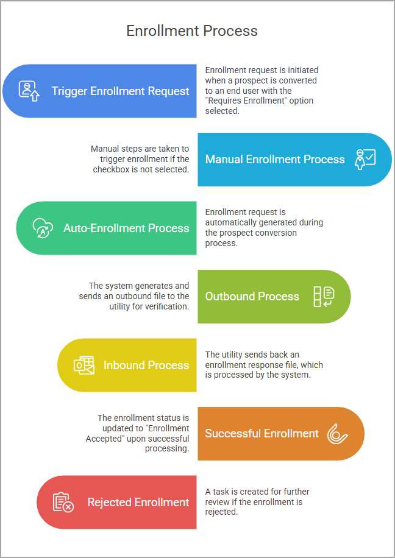

# Understanding Enrollment (814) transactions

Enrollment request is an electronic transaction that allows customer enrollment in a [**Local Distribution Company (LDC)**](../../../../ldcs/ldcs_overview.md). The automated process simplifies submitting customer information, eligibility checking, and initiation of the service setup, ensuring effective communication between energy suppliers and utilities. This transaction process ensures seamless onboarding of end users by submitting enrollment requests to utilities.

<!--  -->

## Enrollment transactions workflow

The **Enrollment transactions** process within the application ensures seamless onboarding of end users by submitting enrollment requests directly to the relevant LDC. The process can be initiated in two ways:  

1. **Automatic initiation**: When converting a prospect into an [**end user**](../../../../getting_started/end_users/overview.md) using the **Create end user** wizard and selecting the **Requires enrollment** checkbox. This method ensures enrollment is triggered immediately after the prospect conversion.  
2. **Manual initiation**: If the **Requires enrollment** checkbox is not selected during prospect conversion, enrollment can be initiated later from the [**Facility**](../../../../facility_management/overview.md) screen.
 

Before submitting an enrollment request, the following information must be provided and correctly configured:  

* **Valid account number**: Ensures the enrollment request is linked to the correct customer account within both the supplier’s system and the LDC system.
* **Correct rate code or price**: Determines the billing rate for the customer. Incorrect values can lead to billing errors or LDC rejections.
* **Meter Read Cycle (MCR)**: Defines the scheduled meter reading period. This must be preconfigured in the **LDC settings** screen for the customer’s LDC.
* **Complete customer address**: Provides the LDC with the precise service location, which is essential for eligibility verification and service setup.

---

<!-- # Understanding the Enrollment Transaction (EDI 814)

The **enrollment transaction** is an electronic process that facilitates the onboarding of a new customer (end user) with a **Local Distribution Company (LDC)**. It is executed using the **EDI 814 transaction set**, which is the industry-standard format for communicating customer information and service requests between energy suppliers and utilities.

This automated process simplifies and accelerates several key steps in customer onboarding:  
- Submitting essential customer information to the LDC.  
- Performing eligibility checks to ensure the customer meets utility requirements.  
- Initiating service setup without the need for manual intervention.  
- Maintaining a complete audit trail of enrollment activities for compliance and reporting.  

By leveraging the enrollment transaction in the application, suppliers can reduce administrative effort, improve accuracy, and enhance coordination with utilities. -->

