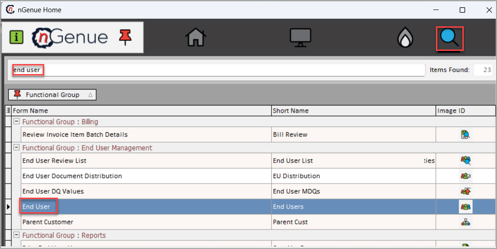

# Configure Reinstatement transactions (814)

The **Reinstatement transactions (814)** is configured when a **cancel pending drop request** is submitted to prevent the termination of a scheduled service drop through the EDI system. A valid **account number**, **price agreement**, and **rate code** are required for the reinstatement process. Once processed, the request notifies the utility to restore service under the existing agreement. The system tracks the request through outbound submission and inbound utility confirmation, ensuring timely status updates and audit logging.

## Submitting a cancel pending drop request

Follow the below steps to manually initiate and submit a reinstatement request:

1. Log in to the **nGenue** application.
2. Click **Search** icon, enter *End user* in the search bar.
3. Double-click **End user**.
   
4. In the [**End user**](../../../../getting_started/end_users/overview.md) screen, select **LDC** and click on the **Load end users** button.
5. Choose the **facility** from the loaded results.
6. Click on the **Facility** icon to open the [**Facility**](../../../../facility_management/overview.md) screen.
   
7. In the **Facility** screen, go to the **Facility details** section and locate **Pending EDI actions**.
   

8. Right-click anywhere on the **Pending EDI actions** section and choose **Add new EDI action for this facility**.
    1. Select **Cancel pending drop request** from the dropdown.
    2. Choose **Price agreement**, **Cancellation reason** and **Schedule action date** if applicable.
    3. Click **Accept**.

9. After submission, the request enters the workflow:
    1. EDI service processes the request as per the scheduled date.
    2. An outbound file is generated and transmitted to the utility.
    4. The **Facility** screen shows status as **Awaiting response** in the EDI **Activity log**.  

## Post-submission of a pending request

### Outbound process (Supplier to utility)

1. Request is logged into **EDI schedule**. 
2. EDI service processes the request at the scheduled time. 
3. An outbound file with customer details will be generated.
4. Files are processed by **15:00** and transmitted to the utility by **16:00** through FTP and web portal and can be tracked in **Activity log** of **EDI schedule**.
5. Transaction will be displayed in **Pending EDI actions** and **Activity log** tab of the EDI schedule.
 

### Inbound process (Utility to supplier)

1. Utility sends a **Drop response** file to the Marketer FTP.
2. EDI server processes the inbound file.
3. File will be decrypted and validated and drop status will be updated.
4. System retrieves file from FTP location which will be decrypted and validated.

    1. If the response is accepted: 

        1. Cancellation will be logged in the **Activity log**.   
        1. Cancellation date will be recorded and displayed.   
        1. In the **Facility** screen, status will be updated to **Cancel pending drop accepted**. 

    1. If the response is rejected: 

        1. Rejection will be recorded in the **Activity log**. 
        1. A review **task** will be created. 
        1. File will be archived for the records. 

    !!!note "Note"

        - Processing times and validations vary based on utility requirements. 
        - Rejected requests require manual review and corrective action before reprocessing. 
        - All transactions are logged in the activity log for record keeping. 

On submitting the **cancel pending drop request**, the request will be logged and processed and the reactivation of previously cancelled services will be implemented as scheduled. It helps maintain seamless operations by ensuring the services is restored correctly and without delay.

---
 
