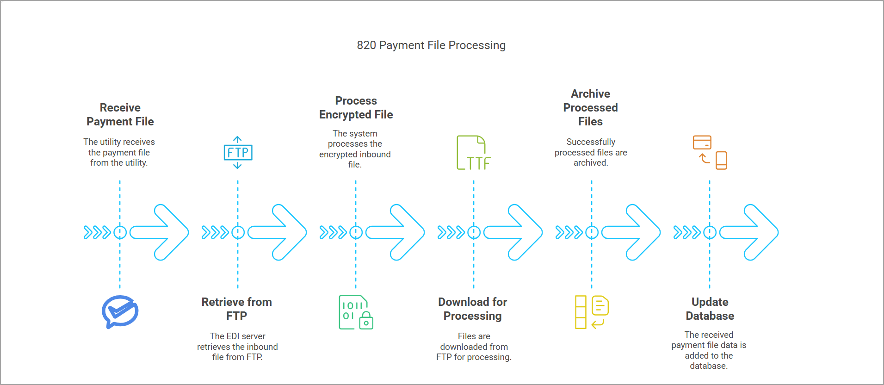

# Understanding Payment transactions (820)

The **Payment transactions (820)** is an inbound file received from the utility upon payment confirmation for the generated invoice. Whenever an inbound payment file is received, the utility transmits the payment files based on the payment done.

To process the inbound file;

1. The EDI server retrieves the inbound file from FTP when it runs.
2. The system processes the decrypted inbound file.
3. Files are downloaded from FTP for processing; once successfully processed, they are archived.
4. The payment file received data then added to the table in the database.  

After receiving the **Payment transactions (820)** file from the utility, marketer sends an [**Acknowledgement- 997 outbound response**](../../edi_997/acknowledgment_997.md) file. 

<!--

!-->

---