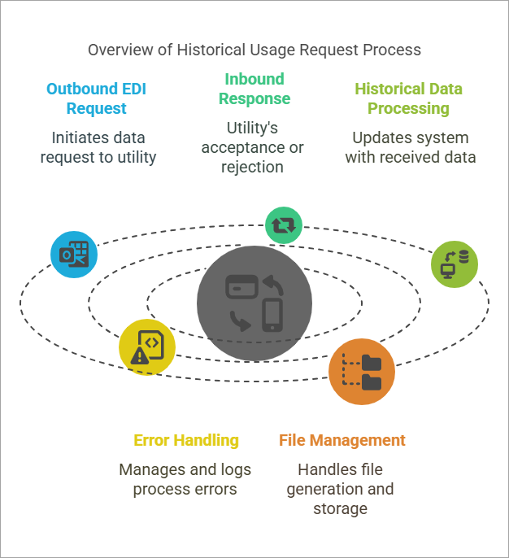
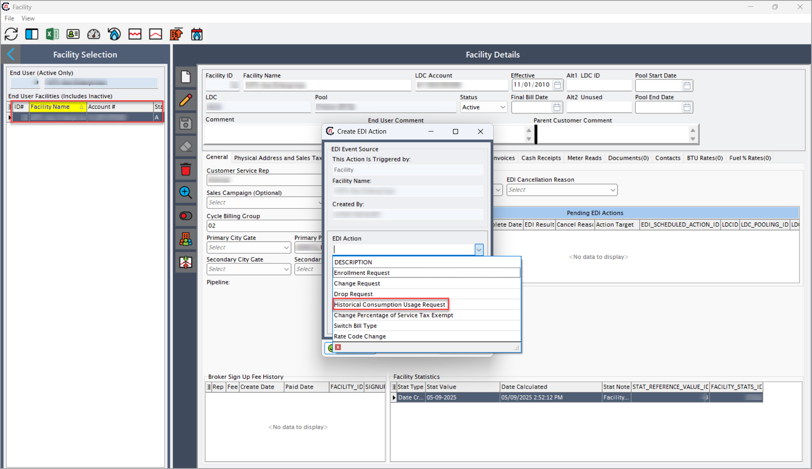
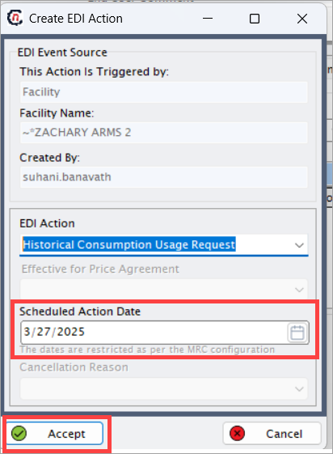
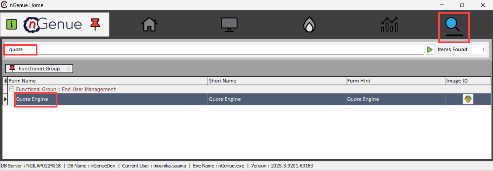
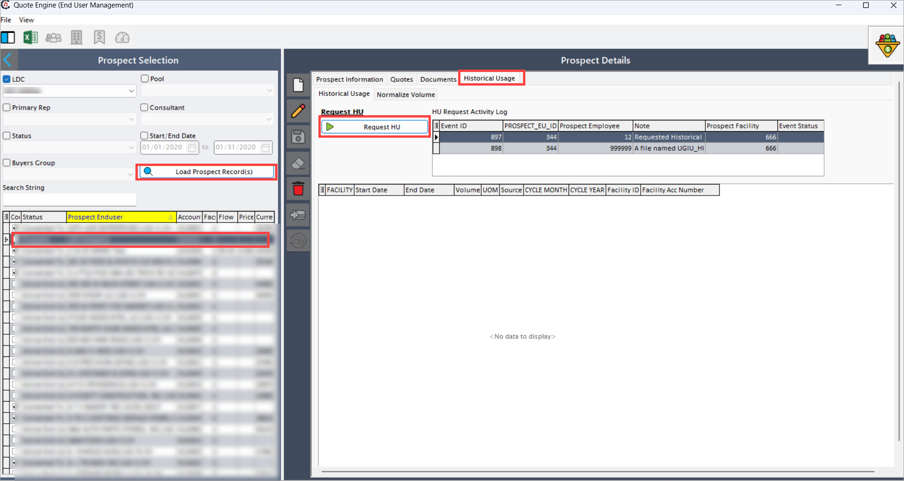

# Understanding Historical Usage (HU) transactions (867)

The **Historical Usage (HU) transactions (867)** file provides past meter usage data for a facility. This data is critical for consumption analysis, billing accuracy, and forecasting. It ensures that the system reflects accurate historical consumption values, enabling effective decision-making and compliance with utility requirements.
<!--

!-->

## Configure and request Historical Usage (867) transactions

It outlines the steps to configure historical usage in the application, ensuring past meter readings are accurately recorded in the system. Proper configuration aligns the system records with utility-provided historical consumption data and supports accurate reporting, billing, and compliance.

### Request historical consumption for an existing end User

Use these steps to manually request historical consumption data for an existing end user:  

1. Log in to the **nGenue** application. 
2. Click the **Search** icon and type _end user_ in the search bar.
3. Double-click **End user** in the search results to open the [**End user**](../../../../getting_started/end_users/overview.md) screen. This screen provides a detailed view of the selected end user’s profile, contracts, facilities, and transaction history.

4. Select the **LDC**, then click **Load end users (includes inactive)** button.
5. From the results, select the **facility**. A facility represents the specific location or meter point where gas consumption is recorded.

6. Click the **Facility** icon at the top center of the screen. This will open the [**Facility**](../../../../facility_management/overview.md) screen linked to the selected end user’s location.

7. The **Facility** screen has two main sections: **Facility selection** and **Facility details**.
    - **Facility selection**: Displays a list of all facilities linked to the end user.
    - **Facility details**: Allows you to add new transactions, view historical data, and monitor the status of pending transactions.  
  
8. In the **Facility details** screen, locate the **Pending EDI actions**.
    9. Right-click and select **Add new EDI action for this facility**. This initiates a new EDI transaction request for the facility.
   
    10. Select **Historical consumption usage request** from the dropdown list. This option tells the system to request past consumption data from the utility.
    
    11. Schedule the action date and click **Accept**. The action date determines when the system will send the request to the utility. Ensure the date is set according to your operational needs.  
    
9. The **EDI service** process the request on the scheduled date. The system automatically packages the request into an EDI-compliant file format.

10. The system generates an **outbound file** and sends it to the utility.
11. The **Facility** screen updates the EDI status to **Awaiting response**. This status indicates that the utility has received the request and the system is waiting for the return EDI file containing the historical consumption data.

### Request historical consumption for a prospect

Follow these steps to request historical usage for a prospect record:

1. Navigate to **Quote engine** screen.

2. Load **Prospect** record.
3. Select **Historical Usage** option.
4. Click **Request HU** button.

5. System automatically:
      - Validates available prospect data
      - Schedules the 814 request
      - Generates a tracking ID

## Historical Usage transaction processing 

The following outlines how the system handles outbound and inbound historical usage requests and responses.

### Outbound process (Supplier to utility)

This process outlines how the system sends historical usage requests to the utility:

1. The request is added to the **EDI Schedule**.
2. The **EDI service** processes it at the scheduled time.
3. The system generates an **outbound file** in the specified format (for example, `C:/Data/Utility/Outbound/X12`).
4. Files are processed by **15:00** and transmitted to the utility by **16:00** (if using FTP).
5. The file is sent via:
      6. **Utility FTP**
      7. **utility website upload** (depending on the communication method).
6. The system creates an **Activity log** entry for tracking.
7. The transaction appears in:
      8. **Pending EDI actions** (once pickup by the EDI server).
      9. **Activity log** (after triggering the request).

### Inbound process (Utility to supplier)

This process explains how the system receives and processes the utility’s response:

1. The utility sends an **inbound 814 response file** (acceptance/rejection).
2. The EDI service processes the inbound file from the FTP by:
      3. Decrypting and validating the file.
      4. If **accepted**:
         5. Updating the **Historical Usage** status to **Accepted.**
         6. Awaiting the **867 file** containing historical data.
      8. If **rejected**:
         9. Recording the rejection in **Activity log**.
         10. Creating a **review task**.

3. The system moves processed files to the **archive**.

### Handling Historical Usage 867 file

These steps describe how the system processes and records historical usage data received from the utility:

1. The utility sends an **inbound 867 file** containing historical usage data.
2. The **EDI service** processes the file:
      3. validating and decrypting it.
      4. Updating the **Monthly usage** screen with the source labeled **History**.
3. If processing succeeds:
      4. The **Activity log** confirms the data.
      5. The **Facility** screen updates the EDI status to **Accepted.**
4. If processing fails
      5. The **Activity log** records the error.
      6. The system creates a review task.

Configuring historical usage ensures that the system maintains accurate past consumption records for each facility. This process supports correct billing, enables reliable forecasting, and maintains compliance with utility data requirements. Proper setup also streamlines future updates and minimizes the need for manual corrections.

---