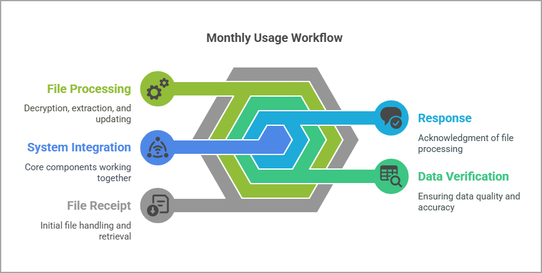

# Understanding Monthly Usage (MU) transactions (867)

The **Monthly Usage (MU) transactions (867)** is an inbound [**Electronic Data Interchange (EDI)**](../../../index.md) file sent by the [**Local Distribution Company (LDC)**](../../../../ldcs/ldcs_overview.md). This transaction contains detailed meter read data collected during a specific **Meter Read Cycle (MRC)**. Its primary purpose is to update the system’s facility consumption records with accurate, time-based usage information for billing, forecasting, and regulatory compliance.  

The **867 MU transactions** is part of the EDI X12 standard and typically includes:

* **Meter identifiers** for the facilities being measured.  
* **Read dates** and **read types** (for example, actual, estimated).  
* **Consumption quantities** and units of measurement (for example, therms, cubic feet, kWh).  
* **LDC metadata** such as service agreement numbers or rate codes.  

This data feeds into the facility’s historical usage profile, ensuring that billing and analytics systems operate with the most up-to-date and verified information.

<!--

!-->

## 867 MU transactions workflow

The **867 MU transactions** workflow includes **receiving the file**, **decrypting and validating it**, **extracting and mapping the usage data**, **updating the database**, **archiving the processed file**, **handling any exceptions**, and finally **sending an acknowledgment** back to the LDC to confirm successful or failed processing.  

1. **File receipt and retrieval** 
      1. The LDC sends the **867 MU file** via FTP according to its MRC schedule.  
      1. The file (EDI X12 867) is placed in the inbound directory (for example, `C:/Data/Utility/Inbound/X12/`) and automatically retrieved by the EDI server.  

2. **Decryption, validation, and data extraction**  
      1. The system decrypts the file using configured keys and validates its EDI structure (ISA/GS/ST/SE segments).  
      1. Usage data (meter readings, consumption values, read dates) is parsed and mapped to the **Facility period history** table.  

3. **Database update and archival**  
      1. The system inserts or updates monthly usage records for each facility.  
      1. Discrepancies (for example, missing intervals, invalid units) are flagged.  
      1. Processed files are archived to `C:/Data/Utility/Archive/X12/`.  

4. **Data verification and exception handling**  
      1. The system performs quality checks against historical consumption patterns, facility thresholds, and LDC-provided metadata.  
      1. Failures trigger an **Activity log** entry and create a **task** for manual review.  

5. **Outbound 997 acknowledgment**  
      1. After processing, the system generates and sends a **997 functional acknowledgment** file via FTP (for example, `C:/Data/Utility/Outbound/X12/997_<Timestamp>.dat`).  
      1. This confirms receipt and acceptance or rejection of the 867 file to the LDC. 

By following this structured process, the system ensures accurate and timely integration of **867 MU** data into the database. Automated validations, archival, and exception handling help maintain high data quality while reducing manual intervention. The outbound **997 acknowledgement** closes the communication loop, confirming to the LDC that the usage file has been successfully received and processed in compliance with EDI transaction protocols.