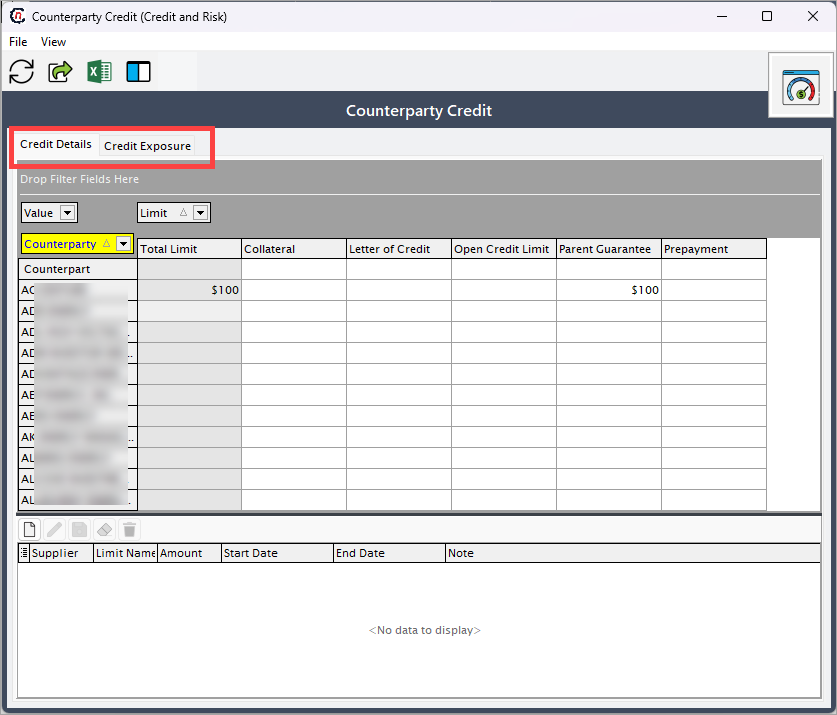
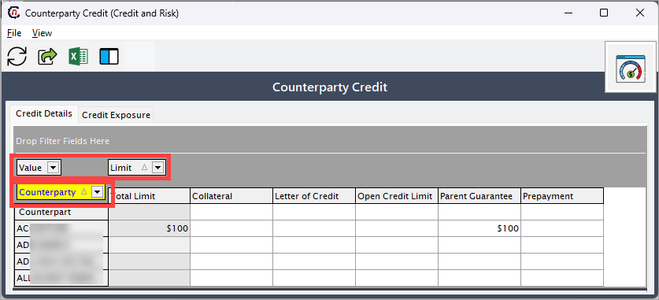
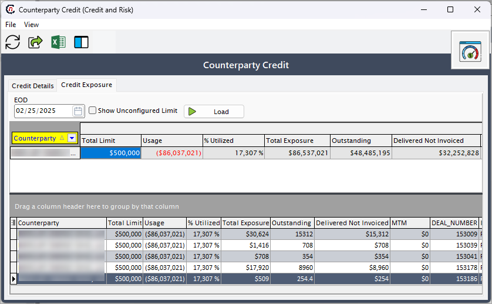

# Configure counterparty credits

The following section provides step-by-step instructions for configuring and managing counterparty credit in the application. Configuring counterparty credit involves setting up processes and systems to assess, monitor, and manage the credit risk associated with counterparties.

Here you can learn:

* How to navigate to the **Counterparty credit** screen.
* How to configure credit limits and manage related settings.
* Analyze credit exposure data based on deals, pricing, and index values and MTM (Mark-to-Market).

The guide simplifies the configuration process, clarifies credit metrics, and ensures effective credit risk monitoring.

## Prerequisites

* You must have the requisite *add* or *modify* permissions in the **Counterparty credit** screen.
* A [counterparty](../getting_started/counterparty/create_counterparty.md) must be configured prior to setting up counterparty credits.

## Configuration steps

### Step 1: Navigate to the Counterparty credit screen

1.	Log in to the **nGenue** application.
2.	Click the **Search** icon and enter *counterparty credit* in the search bar. 
 
3.	Double-click **Counterparty credit** to open the respective screen. Here, you can configure the credit limit for the selected counterparty and view the credit exposure details, which are retrieved from the deal management configuration settings.

4. The next screen i.e., **Counterparty credit** screen is divided into two tabs: **Credit details** and **Credit exposure.**
 

#### Credit details

The **Credit details** tabs further consists of 3 filters to narrow down the results. This provides the flexibility to view only relevant data, making the search process faster and more efficient.

* **Value:** This filter is used to sort or refine the credit limit amounts for all pre-configured credit limits.
* **Limit:** This filter is used to sort or refine the limit type for all pre-configured credit limits.
* **Counterparty:** This dropdown allows you to choose the counterparty for whom they wish to set the credit limit. Based on the selection, the counterparty details will get displayed such as counterparty name, total limit, limit name and the amount. This data is the already configured credit Limit for the counterparty.

For any credit limit added to a counterparty, it will get reflected in the bottom section of the **Counterparty credit** screen. You can also create a new credit limit or edit/delete the ones that are not required.

**Add a new credit limit**

1. To add a new credit limit, you must first select the desired counterparty from the **Counterparty** dropdown. 
2. Click on **Add new limit** icon, which will prompt the system to create a new row with the selected counterparty. You will now require to fill in the following details:
    1. **Limit name:** Select from the dropdown.
    2. **Amount:** Credit limit to be added.
    3. **Start and end date:** Set start and the end date.
    4. **Note:** Add additional notes if required.
    

5. After entering all the required details, click the **Save** button to save the credit limit configured for the counterparty.

#### Credit exposure

The **Credit exposure** tab provides a detailed snapshot of a company's credit risk for each counterparty based on configured deals. It allows users to view how much of the credit limit has been used, the outstanding amounts, and potential exposure based on real-time deal data.

!!! note "Note"
     The credit exposure data will only be displayed when you click on the the **Load** button in the **Counterparty credit > Credit exposure** tab if the counterparty has a configured deal.

To use this tab effectively:

1. Select the desired date from the **EOD** dropdown to view exposure data for that specific date.
2. If you want to include credit exposure from unconfigured limits, enable the **Show unconfigured limit** checkbox.
3. Click the **Load** button. The system fetches and displays data for all counterparties that have associated configured deals.

The data shown is dynamically calculated using the following sources:

1. [physical pricing](../deal_management/create_deal.md) information for the deal,
2. associated [index and curve](./configure_indices_and_curves.md) values, and
3. the [mark-to-market (MTM)](./configure_market_to_market.md) setup.

##### User scenario

A risk analyst wants to review the credit exposure of a counterparty named **"GasCorp Ltd"** as of **May 1st.**

1. The analyst navigates to the **Credit exposure** tab under counterparty credit.
2. From the **EOD** dropdown, the analyst selects **May 1st.**
3. They enable the **Show unconfigured limit** checkbox to include all available exposure data.
4. Upon clicking the **Load** button, the table populates with credit details for **"GasCorp Ltd."**
5. The analyst sees that **"GasCorp Ltd"** has a total limit of `$1,000,000,` with `$700,000` already used. This results in **70%** utilization.
6. The delivered not invoiced column shows `$50,000`, highlighting that invoicing is pending for some deliveries.
7. The analyst notes the **MTM value** and the specific deal and instrument involved, then flags this counterparty for follow-up to ensure timely invoicing and avoid breaching the credit limit.

##### Credit exposure- field description table

The main section of the screen contains a table displaying key credit-related metrics for the selected counterparty. The columns in the table include:
    
|Fields | Description | Data type | Mandatory (Y/N) | Fetched from (UI screen) | Displayed on (UI screen) |
|---|---|---|---|---|---|
|Counterparty | Displays the name of the counterparty. | String | Y | Counterparty screen | Customer invoice |
|Total limit | Shows the total credit limit assigned to the counterparty. | Currency | Y | Counterparty > Risk limits tab | Credit limit screen |
|Usage | Indicates the amount of the credit limit currently utilized. | Currency | Y | Deal management screen | Customer invoice |
|% utilized | Reflects the percentage of the total limit that has been used. | Percentage | Y | Deal management screen | Customer invoice |
|Total exposure | Represents the total credit exposure for the counterparty. | Currency | Y | Deal management screen | Customer invoice |
|Outstanding | Displays the outstanding amounts owed by the counterparty. | Decimal | Y | Deal management screen | Customer invoice |
|Delivered not invoiced | Represents the value of goods or services delivered but not yet invoiced. | Currency | Y | Deal management screen | N/A |
|MTM (mark-to-market) | Shows the mark-to-market valuation of open positions for the counterparty. | Currency | N | Market-To-Market screen | N/A |
|Deal number | Provides a reference number for specific deals associated with the counterparty. | Integer  | Y | Auto-generated | Customer invoice |
|Instrument name | Identifies the type of instrument (e.g., Physical NG) linked to the credit exposure. | String | Y | Deal management | Customer invoice |

---
