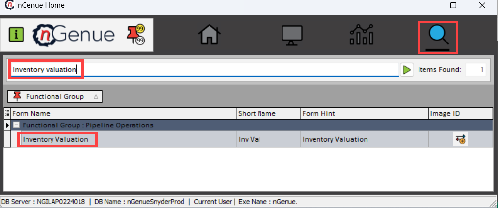
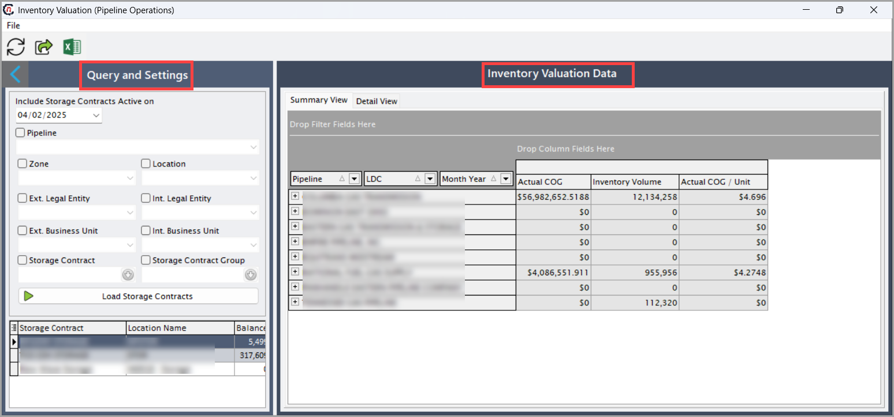
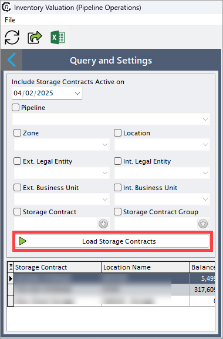
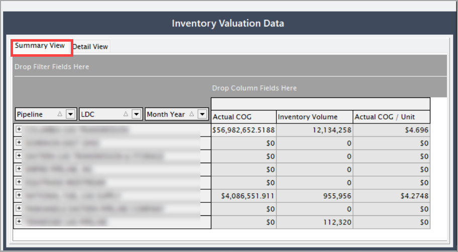
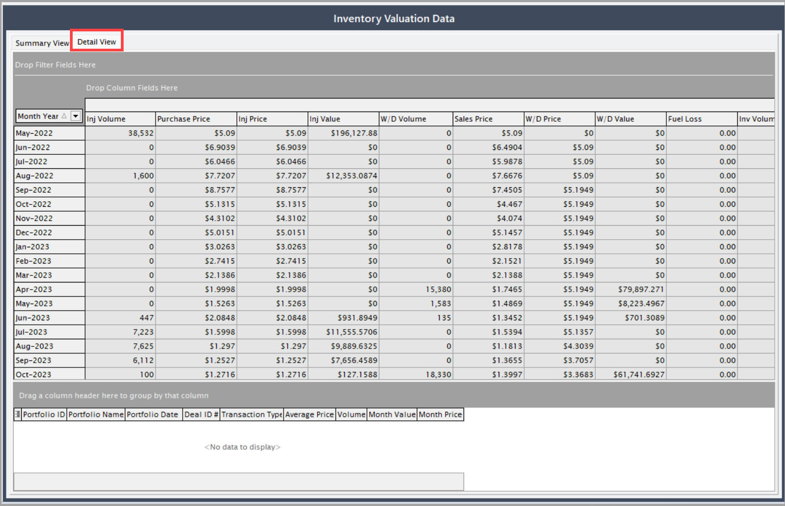

# Configure inventory valuation

This guide provides a step-by-step approach to configuring inventory valuation within the nGenue application. Inventory valuation helps track and assess the cost and volume of gas stored, injected, withdrawn, and sold over time, ensuring accurate financial and operational management.

## Prerequisites

Before configuring the inventory valuation, ensure the following:

* **Pipeline contracts** are properly set up in the system.
* **Storage volumes tab** is configured in the **Pipeline contract** screen.
* [PZL configuration](../getting_started/configure_pipeline.md) (Location and zone) is complete.

<!--
A hyperlink needs to be added to the Pipeline contracts and the Storage volumes tab.
!-->

### Process steps

#### Step 1: Navigate to the Internal inventory valuation screen

1. Log in to the **nGenue** application.
2. Click the **Search** icon and enter _Inventory valuation_ in the search bar.
3. Double-click **Inventory valuation** to open the respective screen.

4. The next screen is divided into two sections: **Query and settings** and **Inventory valuation data.**

**Query and settings**

This section allows users to apply filters and refine data to display only the relevant inventory valuation records. These filters help in narrowing down data for specific transactions, locations, or business entities.

Below are the fields available in the **Query and settings** screen:

| Fields |Description |
| ----------- | ----------- |
|Pipeline| Identifies the pipeline associated with transactions.|
|Zone| Filters data based on zone.|
|Location| Filters based on location.|
|External legal entity| Represents the external legal entity for the deal and storage contract.|
|Internal legal entity| Represents the internal legal entity for the deal and storage contract.|
|External business unit| The external business unit that handles the deal.|
|Internal business unit| The internal business unit that handles the deal.|
|Storage contract| Filters by associated storage contracts.|
|Storage contract group| Groups storage contracts together.|

After clicking **Load storage contracts**, the relevant data will be displayed.

**Inventory valuation data**

Once the filters in **Query and settings** are applied, the **Inventory valuation Data** section presents the relevant data. This section is divided into two key tabs: **Summary view** and **Detail view**

**Summary view**

This tab provides a high-level overview of inventory valuation, giving a snapshot of essential financial and volume-related data. This tab is useful for quick analysis and reporting.

The fields available in the **Summary view** tab are populated with details fetched directly from the Deal Management screen, where deals are initially configured. These fields capture critical attributes such as inventory volume unit, COG price, etc.

| Fields | Description |
| ----------- | ----------- |
|Actual COG (Cost of gas)| Includes the cost incurred to produce, transport, and deliver gas, including:   1. Production costs   2. Transportation costs   3. Processing costs
|Inventory volume| Total amount of gas held in storage, measured in cubic feet (cf) or million cubic feet (MMcf).|
|Actual COG/Unit| The cost of gas per unit of natural gas.|

!!! note "Note"
    Ensure the **Inventory valuation screen** is properly configured in the **Pipeline contract screen** under the **Storage volumes** tab for accurate data representation.

**Detail view** 

This tab offers an in-depth breakdown of inventory valuation by providing transaction-level data on gas injections, withdrawals, sales, and cost fluctuations over time.

Below are the fields available in the **Detail view** tab. These data are also retrieved from the **Deal management** screen.

| Fields | Description |
| ----------- | ----------- |
| Month/Year | A dropdown field for selecting a specific month and year to track gas-related transactions and activities. This helps in organizing and analyzing historical and future data efficiently. |
| Injection volume (Inj volume) | The total volume of natural gas injected into storage facilities during a specific period. This value is crucial for managing gas reserves and forecasting supply availability. |
| Purchase price | The price per unit at which natural gas is procured from suppliers, producers, or markets. This cost plays a significant role in financial planning and profitability analysis. |
| Injection price (Inj price) | The price incurred per unit of gas when injecting it into storage or pipelines. This price may include transportation and processing fees associated with gas injection. |
| Injection value (Inj value) | The total monetary value of the gas being injected into storage or pipelines. It provides insights into investment in storage. |
| Withdrawal volume (W/D volume) | The total volume of gas withdrawn from storage for distribution or sale. This value helps in monitoring consumption and maintaining the supply-demand balance. |
| Sales price | The price per unit at which natural gas is sold to customers, including utilities, industrial consumers, or other entities. It directly impacts revenue generation. |
| Withdrawal price (W/D price) | The price per unit of gas when withdrawn from storage for usage or distribution. It may vary based on market conditions and contractual agreements. |
| Withdrawal value (W/D value) | The total monetary value of the withdrawn gas. It provides insight into revenue generated from stored gas. |
| Fuel loss | The amount of gas lost due to leakage, transportation inefficiencies, or combustion during processing. Tracking fuel loss is essential for operational efficiency and cost management. |
| Inventory volume (Inv volume) | The total volume of gas available in storage after injections and withdrawals. This helps in inventory tracking, ensuring adequate reserves are maintained. |
| Previous actual COG | The previously recorded **Cost of Gas (COG)**, representing the historical cost incurred for acquiring and handling gas. It serves as a reference for cost trend analysis. |
| Actual COG | The latest calculated **COG**, encompassing expenses related to procurement, transportation, storage, and distribution. It reflects the real-time financial burden of gas management. |
| Actual COG/Unit | The unit cost of gas, determined by dividing the total **Actual COG** by the total gas volume. This metric is crucial for pricing strategies and profitability assessments. |

!!! note "Note"
    The above fields are populated once the **Pipeline contracts**, **PZL configuration**, and **Storage volumes** are correctly configured.

## Conclusion

Configuring inventory valuation in nGenue ensures accurate tracking of gas transactions and financial assessments. By following the above steps, users can effectively manage and analyze their inventory data to support business decisions.

---