# Configure pipeline scheduling

The following article provides step-by-step instructions to assist users in efficiently scheduling gas nominations, handling transportation agreements, and monitoring gas flow across pipelines. The aim is to support accurate planning, seamless scheduling, and streamlined operations within the pipeline management process.

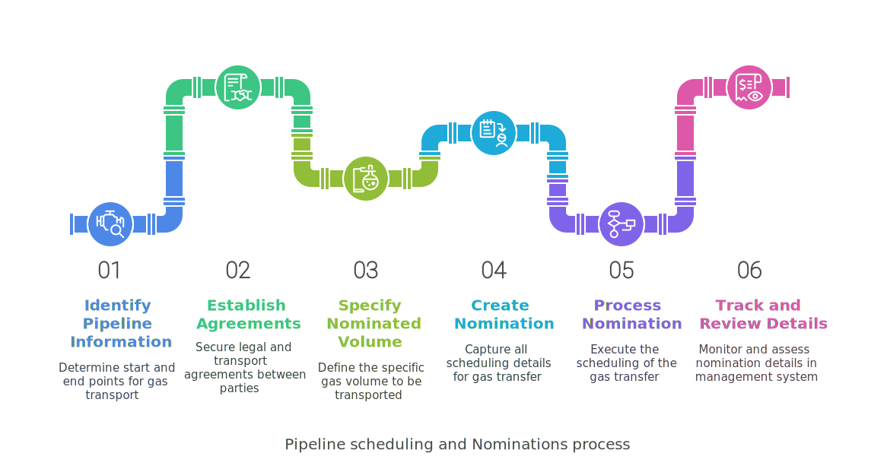

## Prerequisites

1. You should have the required permissions to _add_ or _modify_ the **Pipeline scheduling** module within the application.
2. Necessary transport contracts, pipelines, and relevant LDC data must be pre-configured.
3. All associated entities, such as receipt points, delivery points, and fuel rates, should be available for accurate scheduling.

## Process steps

### Step 1: Navigate to the Pipeline scheduling screen

1.	Log in to the **nGenue** application.
2.	Click on the **Search** icon and enter *pipeline scheduling* in the search bar.  
3.	Double-click **Pipeline scheduling** to open the respective screen where you can begin configuring pipeline scheduling.
    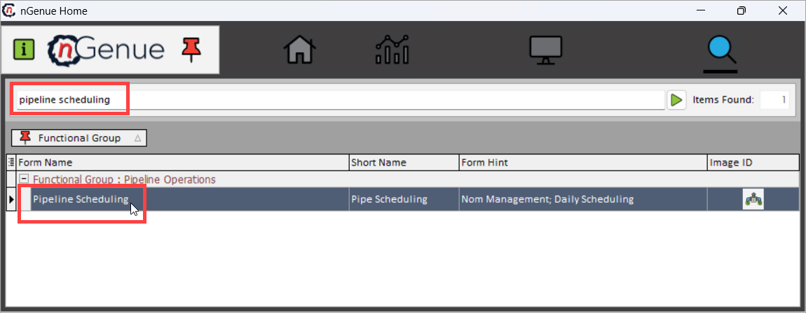
4. The next screen is divided into two sections: **Nomination settings** and **Nomination creation and management.**
    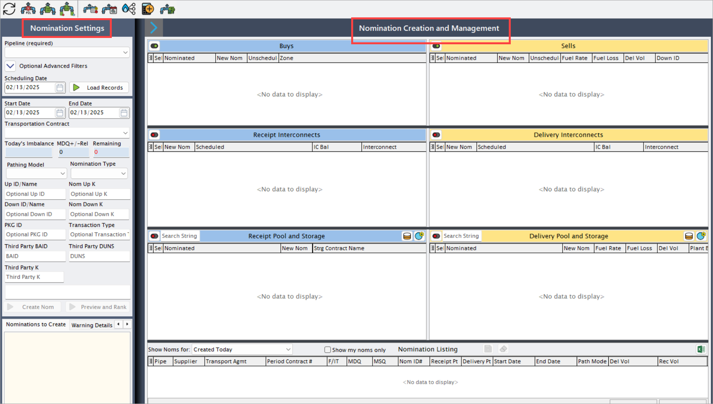

#### Nomination settings

The **Nomination settings** serves as the initial step in the pipeline scheduling process. Here, you can apply specific filters to refine data and narrow down the pipelines available for scheduling. This focused selection of records ensures efficiency in locating the precise pipeline and nomination details required for scheduling gas transfers.
    
Also, you can create a nomination by specifying essential details such as the start and end dates, transport agreements, and pipeline nominations. This section is critical for ensuring that all nominations align with contractual requirements and desired gas flow paths.

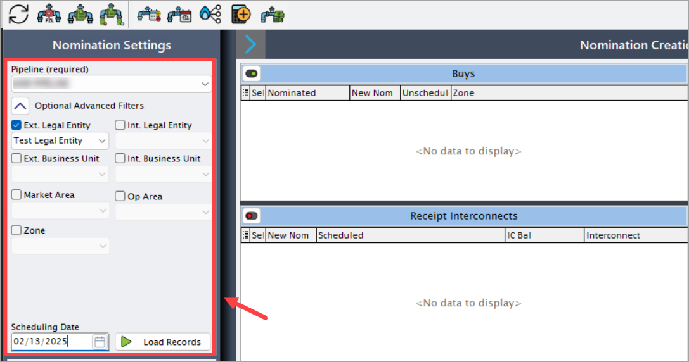

The table below describes the available fields and their functions:

| Fields      | Description                          |
| ----------- | ------------------------------------ |
| [Pipeline](../getting_started/configure_pipeline.md)  | This filter uses a dropdown list populated with all configured pipelines, which must be selected to schedule the gas transfer. If no pipelines have been created in the system, this dropdown will remain empty, underscoring the need for prior pipeline configuration. |
| External legal entity   | This dropdown filter lists all external legal entities available in the system, pulling data from the **External legal entity** screen. Only entities configured in that screen will appear here. Selecting an external legal entity helps identify the counterparty involved in the transfer. |
| [Internal legal entity](../getting_started/configure_book_structure.md#step-2-create-a-new-legal-entity) | This dropdown filter lists internal legal entities configured in the **Book structure** screen, enabling users to designate the internal entity responsible for the deal. |
| External business unit | This dropdown allows users to select from business units defined as external, drawing data from the **External business unit** screen. This filter provides further specificity regarding the counterparty’s business structure. |
| [Internal business unit](../getting_started/configure_book_structure.md#step-3-add-a-business-unit-to-the-legal-entity) | Similar to the **External business unit,** the internal business unit dropdown is populated with data from the **Book structure** screen. Selecting an internal business unit enables the user to specify the internal business unit involved in the scheduling transaction. |
| [Market area](../getting_started/configure_pipeline.md) | This dropdown lists market areas available in the system and draws data from the **Master data** tab on the **PZL** screen. Selecting a market area narrows down the records to the designated area. This data only appears if the market areas have been configured in the **Master data** tab. |
| [Operating area](../getting_started/configure_pipeline.md) | The **Operating area** dropdown, also sourced from the **Master data** tab in the **PZL** screen, allows users to refine their scheduling to a particular operational zone. This filter becomes essential when coordinating specific regional schedules and routes.|
| [Zone](../getting_started/configure_pipeline.md#step-3-create-a-new-pipeline-zone) | The **Zone** dropdown allows users to select specific zones for scheduling, pulling data from the **Zones and Locations** tab on the **PZL** screen. Only configured zones will appear in this dropdown, further refining the results by geographical division.|
| [Scheduling date](../deal_management/create_deal.md) | The **Scheduling date** filter is a date picker dropdown where users select the intended date for gas scheduling. The chosen date must align with the deal’s active period, falling within the start and end dates specified in the **Deal management** screen. If the selected date lies outside the active range of the deal, the data will not populate, as this is a required criterion for scheduling.|
| [Load records](../etrm/configure_pipeline_scheduling.md#create-a-nomination) | This action button displays the data matching in the **Nomination creation and management** section based on the chosen filter criteria, ensuring that only the relevant pipeline and nomination information appears. |

There are additional fields that is primarily used when you create a new nominations. These fields are explained under [create a nomination](#create-a-nomination) section.

#### Nomination creation and management

In the **Nomination creation and management** section, after selecting the filters and loading the records, deal records for the specified scheduling date and pipeline will populate based on the deal type. These deal records appear in either the **Buys** or **Sells** sections, depending on whether it is a buy or a sell deal.
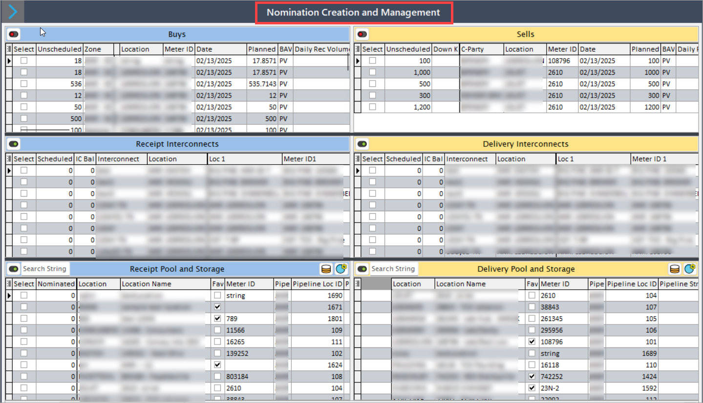

The initial volume specified while configuring a deal is displayed as the **Planned volume** in this scheduling screen. From here, the nomination process begins, requiring you to define where and how the gas should be scheduled, through which pipeline it will travel, and its end destination.

The nomination requires selecting start and end points for gas transfer. If any interconnects are available, they may be chosen as endpoints, depending on the selected pipeline. The next step involves entering nomination volumes for both the start and end points in the **New Nom** column, which initiates the scheduling process. 

Each of the six sections in this module— **Buys**, **Sells**, **Receipt Interconnects, Delivery Interconnects, Receipt Pool and Storage,** and **Delivery Pool and Storage** plays a role in defining, scheduling, and tracking the volume. Below is a breakdown of each section and column.

##### Buys

The **Buys** section is critical for managing gas purchase transactions within the pipeline system. It provides a detailed view of each buy deal, including scheduled volumes, nomination details, and key identifiers. 
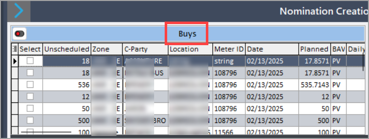

Here is a breakdown of the columns in this section, each serving a specific role in tracking and executing gas purchase nominations:

| Fields | Description |
|--- | --- |
| Select (checkbox) | A selection checkbox that allows users to choose specific records for further actions, such as adjustments or confirmations. |
| Scheduled | Displays the volume of gas that has already been scheduled for the particular deal, helping to monitor what has been arranged versus what remains. |
| Nom_vol | The nomination volume, representing the amount of gas designated to be transferred for this deal. It is the primary volume set for scheduling in the nomination process. |
| Unscheduled | Shows the volume of gas that has not yet been scheduled. This helps in identifying the remaining volume that requires scheduling actions. |
| Zone_name | Specifies the zone associated with the deal, which aids in categorizing deals based on geographical or operational zones within the pipeline network. |
| Market_area | The market area related to the deal, helping users determine where the gas is being purchased for distribution or consumption. |
| Operational_area | Denotes the operational area in which the deal is conducted, providing additional insight into the regional aspects of the transaction. |
| Up_id | The upstream identifier associated with the pipeline. This unique ID helps trace the gas source within the network. |
| Up_k | The unique key identifier for the upstream source, allowing for detailed tracking of upstream points in the transaction. |
| Pipe_abbrev | The abbreviation of the pipeline name where the gas is scheduled, facilitating quick identification of the pipeline. |
| Counterparty_abbrev | Abbreviation of the counterparty’s name, helping to quickly identify the external party involved in the purchase transaction. |
| Location_abbrev | Location abbreviation, often indicating the geographic point of the gas, such as "US" for the United States, to easily identify where the gas is located. |
| Meter_id | Unique identifier for the meter associated with this deal’s location, allowing for tracking of the measurement point. |
| Deal_date | The date on which the deal was agreed upon, providing a time reference for scheduling and historical analysis. |
| Bav_vol | The buy-allocated volume (BAV) for the deal, which indicates the allocated volume assigned specifically for this purchase. |
| Planned_vol | The initially planned volume for this deal, which serves as a baseline for the scheduling process. |
| Bav_type_code | The specific code identifying the type of buy allocation volume, categorizing the deal according to allocation methods. |
| Daily_rec_volume_noms | Displays the daily receipt volume nominations for the transaction, assisting in tracking day-to-day volume movements. |
| Daily_fuel_volume_noms | Daily nominations for fuel volumes, representing the amount of fuel allocated each day for operational requirements. |
| Rec_volume_noms | Total receipt volume nominations, providing an aggregated view of all receipt volumes scheduled under this deal. |
| Fuel_volume_noms | Total fuel volume nominations, showing the total amount of fuel required for the transport of the gas. |
| Del_volume_noms | Total delivery volume nominations, indicating the volume scheduled for delivery in the transaction. |
| Is_bav | A marker that indicates if the deal includes buy-allocated volume, aiding in sorting and managing records based on allocation type. |
| Note | Field for any additional notes regarding the deal, which may include special instructions, comments, or status information. |
| Dt_updated | The date when the record was last updated, providing an audit trail for modifications. |
| Updated_by | The user who last modified the record, supporting accountability and traceability. |
| Rec_or_del | Specifies whether the record is for a receipt or a delivery, helping to clarify the type of movement associated with the volume. |
| Location_name | Full name of the location associated with the transaction, making it easier to identify and reference. |
| Bav_type_name | The descriptive name of the buy allocation volume type, which explains the allocation methodology applied to the volume. |
| Pipe_name | The full name of the pipeline involved in the deal, providing clear identification of the transport route. |
| Trx_type | Type of transaction being conducted (e.g., buy, sell), helping to distinguish the nature of each record. |
| Counterparty_name | Full name of the counterparty organization, providing a reference to the other party involved in the transaction. |
| Supplier_id | Unique identifier for the supplier, linking the deal to the supplying organization. |
| Accounting_group_id | Identifier for the accounting group, which is useful for tracking financial aspects and reporting within specified groups. |
| Business_unit_id | Identifier for the business unit responsible for the deal, allowing tracking and reporting within the organization. |
| Portfolio_id | Identifier for the portfolio that includes this deal, providing insight into the grouping of deals for risk and financial management. |
| Strategy_id | Identifier for the strategy associated with the deal, helping align the transaction with broader business objectives. |
| Nomination_bav_type_id | ID that links the deal to a specific nomination buy allocation volume type, assisting in the organization of nomination records. |
| Supply_region_id | Identifier for the supply region, denoting the region of origin for the gas. |
| Pipeline_location_id | ID for the specific location on the pipeline where the gas is scheduled, ensuring precise location tracking. |
| Deal_point | Specific point within the deal, adding detail to the transaction’s physical or contractual location. |
| Supply_tier_id | Identifier for the supply tier, which may indicate priority or categorization of the supply source. |
| Supply_deal_daily_volume_id | ID for the daily volume associated with the supply deal, tracking day-by-day volumes. |
| Supply_deal_id | The overall identifier for the supply deal, linking all related records to the main transaction. |
| Description | Detailed description of the deal, providing context and any additional relevant information about the transaction. |
| External_ref_no | External reference number, which may link the deal to external systems or documentation. |
| Uom | Unit of measure for the transaction, which is essential for clarity in volume, weight, or energy metrics. |
| Ldc_name | Name of the Local Distribution Company (LDC) involved, which provides last-mile distribution or local network integration. |

##### Sells

The **Sells** section provides comprehensive details for each selling deal scheduled on a specified date and pipeline. This area encompasses key information, including volume, fuel rate, counterparty, and other transaction details needed for managing gas sales transactions.
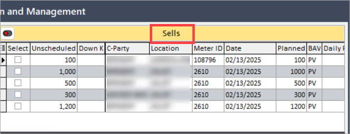

| Fields | Description |
|--- | --- |
| Select (Checkbox) | Allows users to select specific records for further actions, such as processing or making nominations. |
| Scheduled | Displays the volume of gas that has already been scheduled for the deal, reflecting committed quantities. |
| Nom_vol | Indicates the nomination volume, or the intended amount of gas to be sold in the transaction. |
| Unscheduled | Represents the unscheduled volume, or the remaining quantity of gas that has not yet been scheduled in the deal. |
| Fuel_rate | The rate applied to account for any fuel consumed or lost during the transfer process. |
| Fuel_loss | The calculated volume lost due to fuel consumption, ensuring accurate accounting of gas quantity delivered. |
| Deal_vol | Total volume designated for this specific sales transaction, showing the overall volume contracted. |
| Down_id | Identifies the downstream location or party involved in the transaction, providing reference for routing. |
| Down_k | A unique key identifier for the downstream pipeline, ensuring precise tracking of the route and destination. |
| Counterparty_abbreviation | The abbreviated name of the counterparty or buyer involved in the transaction. |
| Location_abbreviation | Abbreviated code for the transaction location, often used for quick reference in reports and documentation. |
| Meter_id | The unique identifier for the meter monitoring gas flow at the transaction point. |
| Deal_date | Date on which the sales deal was made, crucial for transaction timelines. |
| Planned_vol | Planned volume or quantity intended for sale as per the scheduling records. |
| Bav_type_code | Code that identifies the type of Buy Allocation Volume (BAV) relevant to this sales deal. |
| Daily_rec_volume_noms | Daily volume nominations for gas receipts, giving insight into daily intake levels. |
| Daily_fuel_volume_noms | Daily nominations for fuel volume, capturing the amount allocated for fuel requirements each day. |
| Daily_del_volume_noms | Daily delivery nominations, reflecting the daily volume intended for delivery to fulfill the contract. |
| Rec_volume_noms | Total volume nominated for receipt, indicating the gas quantity planned to be received. |
| Fuel_volume_noms | Overall fuel volume nominated, accounting for fuel consumption in the delivery process. |
| Del_volume_noms | Total delivery nominations, summarizing the amount of gas set for dispatch or delivery to the buyer. |
| Is_bav | A flag indicating if this entry represents a Buy Allocation Volume (BAV) in the transaction. |
| Note | Field to input additional comments or notes related to the transaction, facilitating record-keeping or clarifications. |
| Dt_updated | The last update date of the record, providing a timestamp for recent modifications. |
| Updated_by | Shows the user or system account responsible for the last update, enabling traceability. |
| Rec_or_del | Specifies whether the entry is for a receipt or an actual sales deal. |
| Location_name | Full name of the transaction location, adding context beyond the abbreviation. |
| Bav_type_name | Descriptive name of the BAV type, enhancing the understanding of the type of allocation. |
| Pipe_name | Full name of the pipeline involved in the deal, essential for logistical details. |
| Trx_type | Indicates the transaction type, such as sale, transfer, or other transaction modes. |
| Counterparty_name | Complete name of the counterparty, providing clear identification for stakeholders. |
| Supplier_id | Identifier for the supplier connected with the transaction, vital for linking to supply sources. |
| Accounting_group_id | Accounting group ID tied to the transaction, crucial for financial reporting. |
| Business_unit_id | Identifier for the business unit handling the transaction, helping in organization-level tracking. |
| Portfolio_id | Portfolio ID under which the deal is managed, aligning the deal with broader business strategies. |
| Strategy_id | ID associated with the strategy guiding the transaction, indicating its purpose or objectives. |
| Nomination_bav_type_id | ID for the type of BAV related to nominations, used for managing allocation specifics. |
| Supply_region_id | Identifier for the region where the gas is sourced, important for regional distribution logistics. |
| Pipeline_location_id | Location ID of the pipeline, essential for tracking where the transaction takes place. |
| Deal_point | Specific point within the transaction, such as a stage or location, providing finer detail for tracking. |
| Supply_tier_id | Identifier for the supply tier, indicating the level or category of supply within the transaction. |
| Supply_deal_daily_volume_id | Daily volume ID for the supply deal, recording the quantity allotted for each day. |
| Supply_deal_id | Overall unique identifier for the supply deal, consolidating related daily volumes and transactions. |
| Description | A more detailed description of the deal, providing additional context on terms or specifics. |
| External_ref_no | External reference number, linking the deal to any external tracking or record systems. |
| Uom | The unit of measurement for the transaction, defining the scale (e.g., MMBtu or Mcf). |
| Pipe_uom_id | Pipeline-specific UOM ID, ensuring units align with pipeline standards. |
| Ldc_pool_name | Name of the Local Distribution Company (LDC) pool associated with the sale, important for retail gas distribution. |
| Ldc_pool_account | The account associated with the LDC pool, identifying its financial or transaction account. |
| Pool_nomination | Volume nominated for the pool, indicating allocation to a shared distribution point. |
| Retail_pool_requirement | Specifies the volume requirement for the retail pool, aligning with customer demand. |
| Pool_alloc_volume | The volume allocated to the pool, setting aside quantities for specific distribution needs. |
| Pool_pnt_imbalance | Records any imbalance at the pool point, showing discrepancies that need reconciliation. |
| Zone_name | Name of the zone where the transaction occurs, detailing geographic or operational areas. |
| Market_area | Market area for the transaction, connecting the deal to regional or sector-specific markets. |
| Operational_area | Operational area associated with the deal, indicating where logistical actions are managed. |
| Ldc_name | Full name of the Local Distribution Company, establishing a clear reference to the distribution partner. |

##### Receipt interconnects

The **Receipt interconnects** section focuses on managing the entry points where gas is received, known as interconnects. These interconnects serve as critical gateways, facilitating the transfer of gas into designated locations and ensuring an efficient flow into the pipeline system. This section encompasses fields that capture both the physical and contractual aspects essential for managing receipt interconnects, from the specifics of volume scheduling to the identifiers for locations and meters involved.
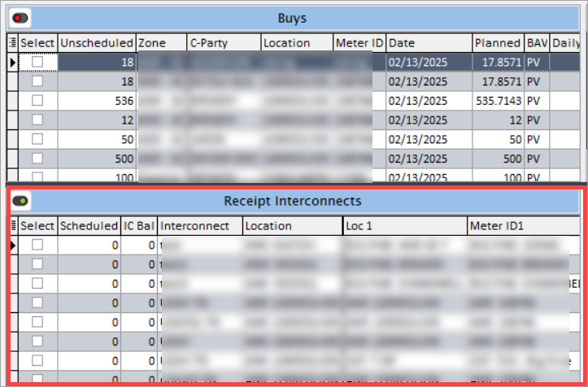

The information below outlines the key fields and their purposes, ensuring comprehensive tracking and management of receipt interconnect details.

| Field | Description |
|-----------------------------|--------------------------------------------------------------------------------------------------------------------------------|
| Select (Checkbox) | A checkbox to allow users to select specific interconnect records for actions such as nominations or scheduling adjustments. |
| Nom_vol | This field represents the nominated volume for transfer at the interconnect, showing the intended amount of gas designated for movement through this entry point. |
| Scheduled | The total volume already confirmed and scheduled for transfer at this interconnect, indicating quantities that are actively assigned for flow. |
| IC bal (Interconnect balance) | Displays the current balance available at the interconnect, representing gas volume that can still be allocated or adjusted. |
| Interconnect | A unique identifier or name assigned to each interconnect, providing quick reference to the specific entry point involved in the transaction. |
| Location | The primary physical location associated with the interconnect, describing where the transfer point is geographically or operationally situated. |
| Up_down_bal_source | Identifies the source of balance, whether upstream or downstream, that relates to the interconnect’s gas flow and allocation. |
| Loc 1 (Primary location) | Designates the first (primary) location associated with this interconnect, often the point where gas initially enters or is measured. |
| Meter 1 (Primary meter id) | The unique identifier of the meter located at the primary location, tracking gas volume readings at this initial measurement point. |
| Loc 2 (Secondary location) | A secondary location associated with the interconnect, if applicable, to represent a backup or alternate transfer point within the network. |
| Meter 2 (Secondary meter id) | ID of the meter located at the secondary location, serving as an additional measurement point if multiple locations are used for the interconnect. |
| Pipeline 1 (Primary pipeline identifier) | The identifier for the first pipeline connected to this interconnect, crucial for defining which pipeline is actively linked to the interconnect point. |
| Pipe 1 (Primary pipeline abbreviation) | An abbreviated name or code for the primary pipeline, used for quick reference and within reports or operational tracking. |
| Location 1 (Pipeline 1 location name) | The name of the location associated with the primary pipeline, providing a geographic or operational context for where gas is received. |
| Pipeline 2 (Secondary pipeline identifier) | The identifier for an alternative or secondary pipeline that can serve as a fallback or additional transfer channel for the interconnect. |
| Pipe 2 (Secondary pipeline abbreviation) | An abbreviated code for the secondary pipeline, used to streamline reporting and tracking when multiple pipelines are involved. |
| Location 2 (Pipeline 2 location name) | Name of the location linked to the secondary pipeline, designating a secondary receiving point associated with this interconnect. |
| Active_meterid | The identifier for the currently active meter being used at the interconnect, indicating the primary meter tracking real-time gas transfer. |
| Active_pipeline_id | Identifier of the pipeline actively being used for gas transfer through the interconnect, representing the primary operational pipeline. |
| Active_pipeline_location_id | Location ID associated with the active pipeline, marking the precise location for current gas receipt or transfer. |
| Pipeline_location_id_1 | Location ID tied to the first pipeline, designating where gas initially flows through the interconnect. |
| Pipeline_location_id_2 | Location ID associated with the secondary pipeline, capturing any additional or backup location utilized for gas flow. |
| Pipeline_id_1 | Identifier for the primary pipeline, establishing the connection between this interconnect and the main pipeline for gas transfer. |
| Pipeline_id_2 | Identifier for the secondary pipeline linked to the interconnect, providing an alternative flow route as needed. |
| UOM | Specifies the unit of measurement applied for the gas volume at this interconnect, such as MMBtu or Mcf, to standardize tracking and reporting. |
| UOM conv | A factor used to convert the current unit of measurement to other units as required by reporting or operational standards. |
| Zone_name | Identifies the operational zone associated with the interconnect, helping categorize the geographical area for the gas transfer. |
| Market_area | Describes the market area where this interconnect is located, aligning the interconnect with specific market zones for strategic tracking. |
| Operational_area | Details the operational area for this interconnect, often reflecting jurisdictional or functional zones within the pipeline network. |
| Projected remaining | An estimation of the remaining volume that can be transferred through the interconnect, aiding in capacity planning. |
| Projected volume | The total projected gas volume for the interconnect, offering a forecast to support scheduling and capacity allocation decisions. |

##### Delivery interconnects

The **Delivery interconnects** section is dedicated to managing the points where gas is delivered through specific interconnects within the network. It includes comprehensive information on nominated volumes, scheduled quantities, location details, and pipeline connections relevant to each delivery point. This section enables tracking and scheduling gas deliveries through the interconnects, ensuring an accurate flow across the network and assisting in resource allocation.
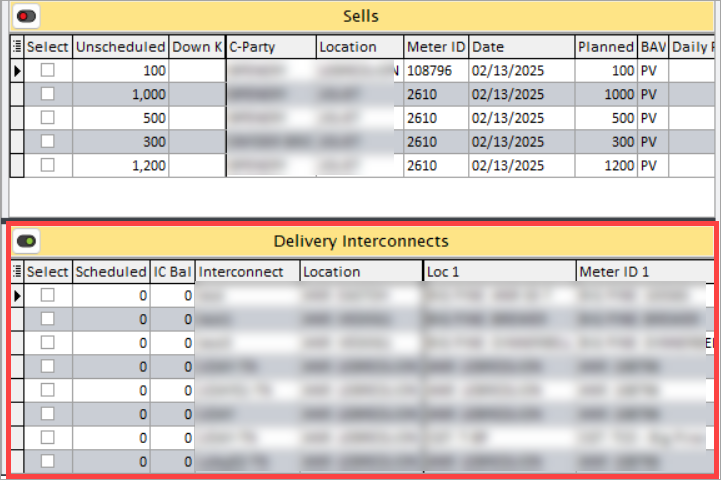

Below are the detailed descriptions of each field within this section.

| Field | Description |
|--------|-------------|
| Select (Checkbox) | A selectable checkbox enabling users to choose specific delivery interconnect records for further actions, such as nomination adjustments or scheduling. |
| Nom_value (Nominated volume) | This field captures the nominated volume of gas designated for delivery through the interconnect, specifying the quantity expected for transfer at this point. |
| Scheduled | Displays the volume of gas already scheduled for delivery at the interconnect, indicating confirmed quantities planned for transfer. |
| IC_bal (Interconnect balance) | Reflects the available gas balance at the delivery interconnect, showing the current volume that can still be allocated for delivery. |
| Interconnect | The unique identifier or name of the delivery interconnect, providing quick reference to the specific interconnect being managed. |
| Location | Specifies the physical location of the delivery interconnect, helping operators understand the geographic placement and logistical details of the delivery point. |
| Up_down_bal_source (Balance Source) | Identifies whether the balance source is upstream or downstream, offering context for the balance information at the delivery interconnect. |
| Loc_1 (Primary location) | The first or primary location associated with the delivery interconnect, serving as the main site where gas is delivered and measured. |
| Meter_1 (Primary meter id) | The ID of the meter situated at the primary location, responsible for tracking the actual volume delivered at this site. |
| Loc_2 (Secondary location) | If applicable, a secondary location associated with the delivery interconnect, which may serve as an alternative delivery site within the network. |
| Meter_2 (Secondary meter id) | The identifier of the meter positioned at the secondary location, allowing for gas measurement at an additional point if multiple locations are in use. |
| Pipeline_1 (Primary pipeline identifier) | The unique identifier of the primary pipeline associated with this delivery interconnect, representing the main channel for gas transfer. |
| Pipe_1 (Primary pipeline abbreviation) | An abbreviated name for the primary pipeline linked to the delivery interconnect, used for efficient reference and reporting. |
| Location_1 (Pipeline 1 location name) | The name of the primary location associated with Pipeline 1, helping to geographically locate where gas is delivered from this pipeline. |
| Pipeline_2 (Secondary pipeline identifier) | The identifier for an alternative or secondary pipeline connected to this delivery interconnect, providing additional routing options. |
| Pipe_2 (Secondary pipeline abbreviation) | A short or abbreviated form of the secondary pipeline’s name, facilitating quick identification within tracking and reporting systems. |
| Location_2 (Pipeline 2 location name) | The name of the secondary location associated with Pipeline 2, offering insight into additional or backup delivery sites. |
| Active_meter_id (Active meter Id) | The identifier of the meter currently active at the delivery interconnect, which is responsible for real-time volume tracking. |
| Active_pipeline_id | The ID of the pipeline presently in use at the delivery interconnect, marking the active channel for gas flow. |
| Active_pipeline_location_id | Location ID for the active pipeline, pinpointing the exact location where gas is currently being delivered. |
| Pipeline_interconnect_id | A unique identifier specific to the pipeline interconnect, denoting the point of connection between the pipeline and the delivery location. |
| Pipeline_location_id_1 (Primary location id) | The ID for the first (primary) pipeline location, specifying where the pipeline connects with the delivery interconnect. |
| Pipeline_location_id_2 (Secondary location id) | If relevant, the ID for a secondary pipeline location, allowing for tracking at an additional delivery point. |
| Pipeline_id_1 | Identifier of the primary pipeline used in gas delivery, creating a direct link between the pipeline and the delivery interconnect. |
| Pipeline_id_2 (Secondary pipeline id) | The identifier for a secondary pipeline associated with the interconnect, enabling an alternate or backup delivery route. |
| UOM (Unit of measurement) | Indicates the unit of measurement (e.g., MMBtu or Mcf) used for recording gas volume at the delivery interconnect, ensuring standardized data. |
| UOM_conv (Unit conversion factor) | A factor applied to convert the specified unit of measurement into other units as needed, supporting versatile reporting requirements. |
| Zone_name | Defines the operational zone for the delivery interconnect, helping categorize its location within broader geographic or operational areas. |
| Market_area | Describes the market area associated with this delivery interconnect, aligning the location with specific market zones for strategic planning. |
| Operational_area | Specifies the operational area encompassing the delivery interconnect, often reflecting jurisdictional or functional zones within the network. |
| Projected_remaining (Projected remaining volume) | An estimate of the remaining gas volume available for delivery at the interconnect, aiding in future capacity planning. |
| Projected_volume (Projected total volume) | Represents the total projected gas volume for delivery through this interconnect, supporting scheduling and allocation decisions. |

##### Receipt pool and storage

The **Receipt pool and storage** section is dedicated to managing the pools and storage facilities where gas is received, tracked, and allocated. It includes details such as the scheduled volumes, contracts, locations, balances, and associated pipelines, ensuring efficient tracking and management of gas in storage or pooling arrangements.
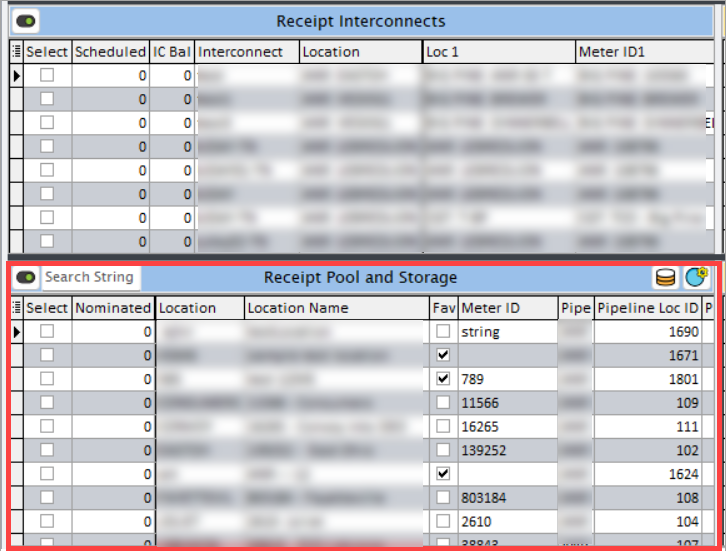

The table below list down the fields available on this section and its detailed description:

| Field | Description |
|--------|-------------|
| Select (Checkbox) | A selectable checkbox that allows users to choose specific records for further actions, such as updating, modifying, or processing receipts in the pool or storage system. |
| Scheduled | The volume of gas that has been scheduled to be received into the pool or storage facility. This field provides clarity on the quantity of gas that has been planned for reception at the interconnect point. |
| Nom_vol (Nomination volume) | The nominated volume of gas, representing the quantity that has been officially requested or nominated for receipt. This field is critical for ensuring that the correct volume of gas is allocated for storage or pooling. |
| Contract_name | The name of the contract associated with the receipt of gas into the pool or storage area. This contract may outline the terms of storage, withdrawal, and other relevant conditions tied to the transaction. |
| Strg_rel_contract | The unique identifier or number for the storage or release contract linked to the pool or storage. This contract governs the terms and conditions of gas storage and withdrawal. |
| Loc_abbreviation (Location abbreviation) | A shortened form of the location name, used for easy reference and to save space in reports or interfaces. |
| Loc_name (Location name) | The full name of the location where the gas is received, stored, or pooled. This field is important for understanding where the gas is being processed or kept. |
| Is_commonly_used | A field indicating whether the specific storage or pool location is frequently used. This helps prioritize commonly accessed storage locations, ensuring efficient gas flow management. |
| Meterid (Meter id) | The unique identifier of the meter associated with the storage or pool. The meter records the actual volume of gas being received, stored, or withdrawn at that location. |
| Pipe_abbreviation (Pipeline abbreviation) | A short code or abbreviation for the pipeline associated with the storage or pool location. This provides quick identification of the pipeline linked to the gas receipt or storage point. |
| Pipe_location_id | The unique identifier for the location of the pipeline within the network. It helps track where the pipeline intersects with the storage or pool facility. |
| Pipeline_storage_contract_id | The identifier for the pipeline storage contract, which specifies the terms for storing gas in the pipeline system. It is crucial for ensuring that gas is stored according to the agreed conditions. |
| Storage_abbreviation (Storage abbreviation) | A shorthand or abbreviation for the storage location name, used to easily refer to the facility where gas is stored. |
| Storage_name | The full name of the storage facility or location. This is used for reference in reports, agreements, and tracking records. |
| Location_type_name (Location type) | Defines the type of location, such as a storage facility, pool, or another specific categorization. It helps differentiate various types of locations in the system. |
| Pool_balance | Represents the current balance of gas within the pool. It reflects the total volume of gas that is available or accounted for within the pooling system. |
| Storage_balance | The volume of gas currently stored in the facility. This balance indicates how much gas is held in storage, helping manage inventory levels and ensuring that gas is available when needed. |
| Is_pool | A field that specifies whether the current facility or location is a pool. This helps distinguish between storage locations and pooling areas, which are used to manage gas differently. |
| UOM | The unit of measurement used for recording the volumes of gas in the pool or storage facility. This could include units such as cubic feet, gallons, or megatons, depending on the system configuration. |
| Zone_name | The name of the zone in which the storage or pool facility is located. Zones are used to define geographical or operational areas, ensuring gas is managed within specific regions. |
| Market_name | The market area associated with the storage or pool. This helps connect gas storage and pooling operations with specific energy markets, ensuring that gas deliveries and receipts align with market requirements. |
| Operational_area | The operational area to which the storage or pool location belongs. This field typically refers to the logistical or operational zones within a larger network, aiding in resource management. |
| Planned_storage | The volume of gas that is planned to be stored within the facility. This planned volume can be part of a contract or operational plan to manage gas reserves. |
| Planned_remaining | The remaining volume of gas that is planned to be stored or received. It helps in projecting future storage needs and provides insight into how much capacity remains for further gas receipts or withdrawals. |

##### Delivery pool and storage

The **Delivery pool and storage** section is designed to manage the storage and delivery pools of gas, providing critical information on scheduled volumes, contractual agreements, and pipeline locations. This section tracks essential data such as contract details, delivery planning, and volume management, ensuring the efficient operation of gas delivery and storage processes.
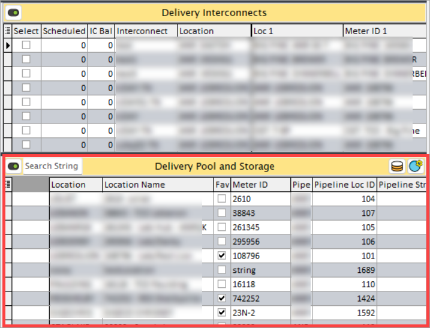

Below is an elaboration of the key fields in this section.

| Field | Description |
|--------|-------------|
| Select (Checkbox) | This checkbox allows users to select specific records for further actions, such as nomination, approval, or other processes. It provides an easy way to select multiple entries for batch operations. |
| Scheduled | This field represents the volume of gas that has already been scheduled for delivery into the storage pool. It indicates the amount of gas that is planned to be delivered at a specific time, helping to manage scheduling and ensure the appropriate amount of gas is available for delivery. |
| Nom_vol (Nomination Volume) | This is the volume of gas nominated for storage or delivery, which reflects the amount requested by the parties involved in the contract. The nomination volume is a critical factor in ensuring that the storage or delivery volumes are in alignment with contractual agreements and operational requirements. |
| Fuel_rate | The fuel rate is a defined factor used to adjust for losses during transportation. It is applied to the gas volumes to account for the energy used or lost during delivery, helping ensure that the agreed-upon volume is accurately measured after adjustments for losses. |
| Fuel_loss | Fuel loss is the amount of gas lost during the delivery or storage process due to factors such as transportation inefficiencies or pipeline losses. This field helps in tracking and accounting for those losses, ensuring that adjustments can be made to reflect the actual volume delivered. |
| Del_vol (Delivery Volume) | This represents the total volume of gas that is designated for delivery as part of the storage or pool contract. It is important for monitoring the gas available for delivery and aligning with contractual delivery obligations. |
| Burn | This refers to the volume of gas that is designated for combustion or end-use within the scope of the contract. It reflects the gas that is consumed for energy production or other industrial purposes as part of the contractual agreement. |
| Contract_name | This field captures the name of the specific contract associated with the delivery or storage arrangement. The contract name serves as a reference for identifying the terms and conditions that govern the gas delivery and storage process. |
| Strg_rel_contract | The unique identifier or contract number for the storage or release agreement. This reference number is crucial for tracking the contract details, ensuring that the gas delivery and storage processes are aligned with the terms outlined in the contract. |
| Loc_abbreviation (Location Abbreviation) | A shortened version of the location name, typically used to save space in reports and system interfaces. This field is useful for quickly referencing the location where the gas is being stored or delivered. |
| Loc_name (Location Name) | The full name of the delivery or storage location, providing more detail about the specific site involved in the contract. This name helps identify where the gas is being stored or delivered, supporting logistics and operational coordination. |
| Is_commonly_used | This indicator shows whether the delivery or storage location or contract is frequently used. A "Yes" value indicates that the location or contract is commonly accessed, which may highlight important or critical facilities in the network. |
| Meterid (Meter ID) | This is the unique identifier for the meter associated with the delivery or storage pool. The meter records the actual volume of gas being delivered or stored, providing real-time tracking and monitoring of gas flow. |
| Pipe_abbreviation (Pipeline Abbreviation) | A shortened version of the pipeline name or identifier. This field helps quickly identify the pipeline associated with the delivery or storage, reducing the need for full pipeline names in operational reports. |
| Pipeline_location_id | The unique identifier for the specific location within the pipeline network where the gas is being delivered or stored. It helps track the exact point in the pipeline system associated with the delivery or storage operation. |
| Pipeline_storage_contract_id | The ID of the contract tied to the pipeline storage agreement. This contract governs the terms for storing gas within the pipeline, and the ID provides a reference to ensure that all actions align with the terms of the pipeline storage contract. |
| Location_type_name (Location Type) | The descriptive name that defines the type of location, such as "Delivery Point," "Storage Facility," or other categorizations. This helps differentiate between various types of locations in the system and ensures clarity in reporting and tracking. |
| Storage_name | The full name of the storage facility associated with the contract. This field provides clarity on where the gas is stored, allowing for better management and identification of storage resources. |
| Storage_abbreviation (Storage Abbreviation) | A shortened version of the storage facility’s name. This abbreviation is useful for space-constrained environments like reports, dashboards, and interfaces. |
| Is_pull | An indicator that specifies whether the gas volume is being pulled from the storage pool (as opposed to being pushed or injected). This field helps track whether the gas is being withdrawn or added to the storage, a critical part of managing gas inventories. |
| UOM (Unit of Measure) | The unit of measurement used for recording volumes in the delivery or storage context. Common units may include cubic feet, gallons, or megatons, depending on the operational requirements. |
| Zone_name | The name of the geographical zone associated with the storage or delivery location. Zones help organize and manage gas delivery and storage operations within specific geographic areas, improving efficiency in logistics and volume management. |
| Market_area | The market area linked to the delivery or storage pool, which identifies the broader economic or energy market in which the gas is being stored or delivered. This is important for understanding how market dynamics may affect gas flows and pricing. |
| Operational_area | The operational area responsible for overseeing the delivery or storage pool. This could refer to specific regions or divisions within a gas utility or network, ensuring that gas delivery and storage activities are efficiently managed. |
| Planned_storage | The volume of gas that is planned to be stored in the pool or storage facility according to forecasts or contractual obligations. This planned storage helps manage inventory and align with expected usage or delivery schedules. |
| Planned_remaining | The remaining volume of gas that is planned for storage or delivery after accounting for any volumes already scheduled. This field helps provide a clear picture of how much capacity remains for future deliveries or storage planning. |

### Create a nomination

You can create a nomination by specifying essential details such as the start and end dates, transport agreements, and pipeline nominations. This section is critical for ensuring that all nominations align with contractual requirements and desired gas flow paths. Once the necessary details are configured, click on the **Create Nom** button to generate the nomination.
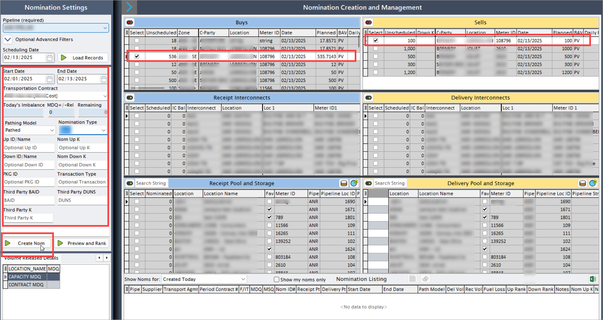

Below are the fields and configurations available in this section for precise nomination management:

| Field | Description |
|--------|-------------|
| Start_date | The date when the nomination becomes effective, marking the beginning of gas delivery or storage under the nominated agreement. Setting this date ensures that the nomination aligns with the desired operational timeline. |
| End_date | The date on which the nomination period concludes, indicating the last day for the scheduled gas flow. This is essential for managing contract timelines and ensuring compliance with scheduled agreements. |
| Transportation_contract | The transport agreement or contract that governs the nomination. Selecting the correct contract is crucial for ensuring that the gas transportation adheres to contractual terms, including volume limits and delivery requirements. |
| Todays_imbalance | The current imbalance for the day, reflecting any discrepancies between nominated and actual volumes. Managing this imbalance helps in balancing supply and demand effectively, ensuring no over- or under-delivery. |
| MDQ_rel (Maximum daily quantity adjustment) | Adjustments to the Maximum Daily Quantity (MDQ) for release or nomination. This value helps accommodate volume flexibility while adhering to the maximum limits set in the contract. |
| Remaining | The remaining volume available for nomination within the current contract or pipeline. This figure assists users in avoiding over-nomination and staying within the permissible limits. |
| Pathing_model | The pathing model used for gas transport. It may represent various routing or pathing strategies to ensure efficient gas delivery along the pipeline network. This setting impacts route selection and gas flow optimization. |
| Nomination_type | The type of nomination, such as firm, interruptible, or storage, indicating the level of commitment and flexibility of the nomination. Different types affect priority and guarantees in gas delivery. |
| Up_id_name | The identifier or name of the upstream point where gas enters the pipeline system. This information helps track the entry point of the gas and aligns with the start location for the nominated path. |
| Nom_up_k | The nominated volume for the upstream location, representing the quantity of gas intended to flow into the pipeline at the upstream point. This is key for balancing nominations between upstream and downstream points. |
| Down_id_name | The identifier or name of the downstream point where gas exits the pipeline system. This exit location must align with the end point of the nomination, ensuring accurate delivery tracking. |
| Nom_down_k | The nominated volume for the downstream location, representing the amount of gas scheduled for delivery or storage at the downstream point. This value should align with delivery requirements at the endpoint. |
| PKG_id | The package ID associated with the nomination, used for tracking and managing specific nomination groups. This ID provides an additional layer of organization, especially for bulk nominations. |
| Transaction_type | The type of transaction for the nomination, such as delivery, storage, or transfer. Selecting the correct type ensures the nomination aligns with the purpose of the gas movement. |
| Third_party_baid | The Business Associate ID of a third party involved in the nomination, if applicable. This field tracks external partners associated with the nomination, improving collaboration and accountability. |
| Third_party_duns | The DUNS (Data Universal Numbering System) number of a third party, providing a unique identifier for that organization. This is useful for tracking and verifying third-party involvement in the nomination process. |
| Third_party_k | Any additional reference ID for a third-party organization associated with the nomination. This can be useful for contractual tracking and ensuring all parties involved are accurately recorded. |

Once all fields are configured accurately, click **Create Nom** to finalize the nomination. This action locks in the specified parameters and officially records the nomination, making it accessible for further operational processes and tracking.

### View the nominations details

A comprehensive overview of all nominations that have been created can be seen in the **Nomination listing** sections. Here, you can review the details of each nomination, track quantities, and manage important information related to scheduled gas flows. An excel export feature is available, allowing you to save the data to a file that can be shared with pipelines to facilitate scheduling.
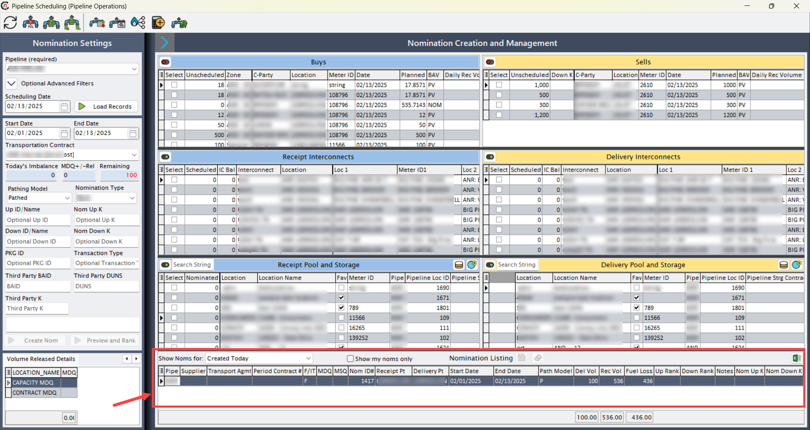

The following fields are available for viewing and exporting, each offering key information for managing nominations.

| Field | Description |
|--------|-------------|
| Pipe | The pipeline name or identifier through which the nominated gas will flow. |
| Supplier | The supplier involved in the nomination, providing or receiving gas as per the contract. |
| Transport_agmt | The transportation agreement linked to the nomination, specifying terms and conditions for gas movement. |
| Period_contract | A unique identifier for the contract period, helping track nominations within specific contractual timeframes. |
| F_IT | Specifies whether the nomination is Firm or Interruptible, indicating the level of service commitment. |
| MDQ (Maximum Daily Quantity) | The highest volume allowed for transport per day under the agreement, guiding volume limits. |
| MSQ (Maximum Storage Quantity) | The maximum storage capacity within the nominated contract, ensuring storage limits are maintained. |
| Nom_id | Unique identifier for the nomination, enabling easy tracking and reference. |
| Receipt_pt | The receipt point where gas enters the pipeline network. |
| Delivery_pt | The delivery point where gas exits the pipeline network. |
| Start_date | The starting date of the nomination period, marking when gas flow begins. |
| End_date | The ending date of the nomination, specifying the final day of scheduled gas flow. |
| Path_model | The routing model selected for the nomination, affecting the gas flow path within the pipeline. |
| Del_vol | Total volume designated for delivery, recorded in the contract. |
| Rec_vol | Volume recorded at the receipt point, helping balance intake and outflow. |
| Fuel_loss | Amount of gas lost due to fuel consumption during transport. |
| Up_rank | Ranking for upstream nominations, used for prioritizing sources. |
| Down_rank | Ranking for downstream nominations, helpful in prioritizing deliveries. |
| Notes | Field for additional remarks or notes on the nomination, allowing custom documentation. |
| Nom_up_k | Nominated volume for upstream flows, specifying the volume at the receipt location. |
| Nom_down_k | Nominated volume for downstream flows, indicating the volume at the delivery point. |
| Sum_receipt | Sum of received volumes across nominations, useful for auditing total intake. |
| Sum_fuel | Total fuel loss across all nominations, allowing tracking of fuel usage. |
| Sum_delivered | Aggregate of delivered volumes, helping monitor overall outflows. |
| Nom_type_code | Code representing the nomination type, used for quick reference. |
| Nom_type | Description of the nomination type (e.g., firm or interruptible), outlining the service level. |
| Planned | Planned volume for the nomination period, aiding in future scheduling. |
| Date_created | Date when the nomination record was initially created. |
| Last_update | Date of the most recent modification to the nomination record. |
| Updated_by | User or system that last modified the nomination record. |
| Multi_seg | Indicator if the nomination spans multiple segments or regions. |
| Pipeline_name | Full name of the pipeline involved in the nomination. |
| Nomination_type_name | Detailed name for the type of nomination (e.g., storage, transportation). |
| MDQ_calc_point | Calculated point for MDQ, helping in volume tracking. |
| Transport_agmt_name | Full name of the transport agreement, for detailed referencing. |
| Supplier_name | Complete name of the supplier for clarity. |
| Receipt_pt_name | Full name of the receipt point for better identification. |
| Receipt_meter | The meter ID at the receipt point, for accurate tracking. |
| Delivery_pt_name | Full name of the delivery point for clear identification. |
| Delivery_meter | Meter ID at the delivery point, aiding in precise volume measurement. |
| Pathing_model_name | Descriptive name for the selected pathing model. |
| Created_by | User who created the nomination record. |
| Nomination_type_id | Identifier for the nomination type, enabling detailed tracking. |
| Nomination_pathing_model_id | ID for the pathing model, linking to specific routing methods. |
| Pipeline_transport_agmt_id | Unique ID for the transport agreement tied to the pipeline. |
| Supplier_id | Identifier for the supplier, helping manage relationships. |
| Nom_status | Status of the nomination, showing if it’s active, pending, or completed. |
| Nomination_multi_segment_id | ID indicating if the nomination involves multiple segments. |
| Delivery_point_id | Unique identifier for the delivery point. |
| Receipt_point_id | Unique identifier for the receipt point. |
| Contract_rank | Rank of the contract for priority sorting. |
| Is_physical_receipt | Indicates if the receipt point is a physical location. |
| Is_physical_delivery | Indicates if the delivery point is a physical location. |
| Ranked_down_k | Ranked volume for the downstream flow, aiding in prioritization. |
| Upstream_deal_id | Identifier for upstream deals associated with the nomination. |
| Ranked_up_k | Ranked volume for the upstream flow. |
| Downstream_deal_id | Identifier for downstream deals. |
| Up_pipeline_storage_contract_id | ID for the upstream pipeline storage contract. |
| Down_pipeline_storage_contract_id | ID for the downstream pipeline storage contract. |
| Rec_pipeline_interconnect_id | ID for interconnections at the receipt point. |
| Package_id | ID for the nomination package. |
| Del_pipeline_interconnect_id | ID for interconnections at the delivery point. |
| Transaction_type | Type of transaction (e.g., delivery, storage), indicating the nomination’s purpose. |
| Up_id | Upstream ID for precise tracking. |
| Up_k | Nominated volume at the upstream location. |
| Down_id | Downstream ID for tracking. |
| Down_k | Nominated volume at the downstream location. |
| Pkg_id | Package ID for grouping and tracking nominations. |
| BA_G_id | Business Associate Group ID for managing group affiliations. |
| DUNS_num | DUNS number for third-party identification, improving record accuracy. |
| Third_party_k | Third-party reference for additional tracking or contracts. |

The nomination details can be reviewed within the [Deal management](../deal_management/overview.md) module under the **Nominations** tab. This tab allows users to verify the specific nominations associated with each deal, including the scheduled dates, delivery points, and pipeline allocations.

Additionally, users can gain insights into scheduled versus pending nominations by navigating to the **Deal volumes** tab and selecting the **View by BAV (Balance at volume)** section. Here, a detailed breakdown is provided, showing which volumes are scheduled for particular dates and identifying any unscheduled (or pending) dates. This section is instrumental for tracking nomination statuses, ensuring timely adjustments, and aligning scheduled volumes with operational needs.

---