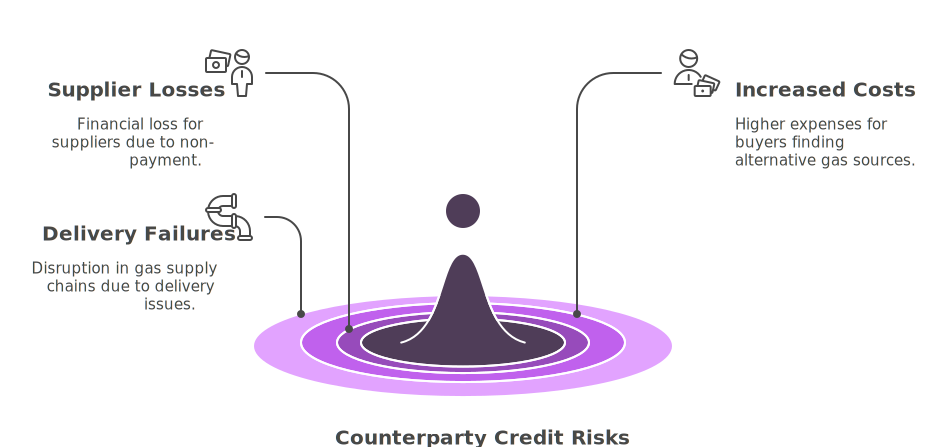
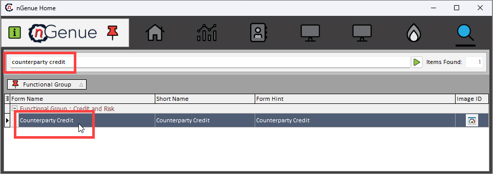
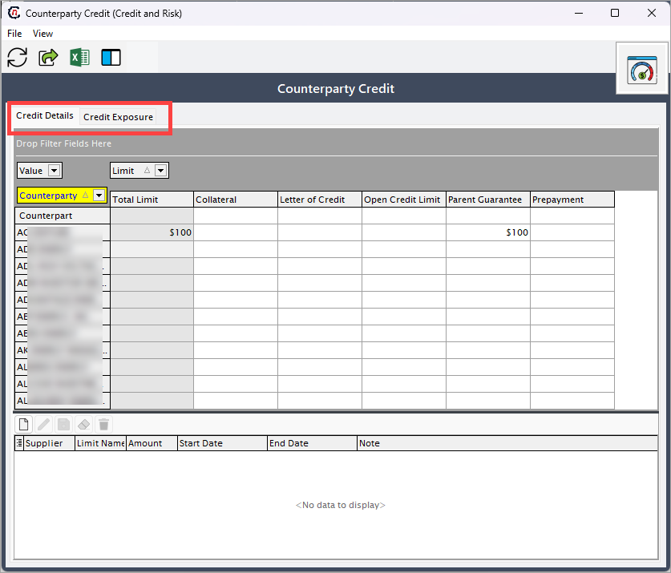
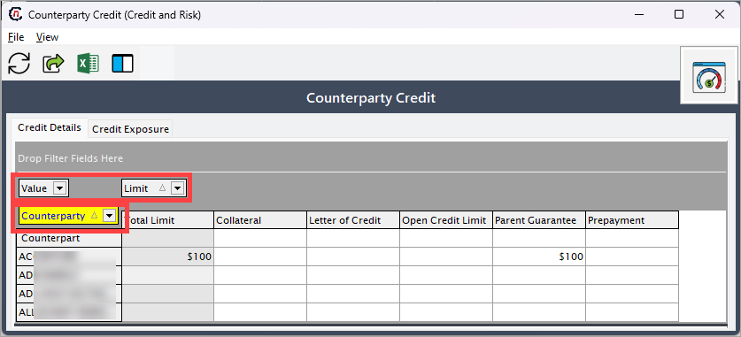
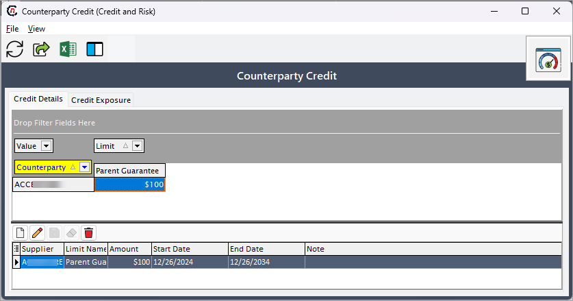
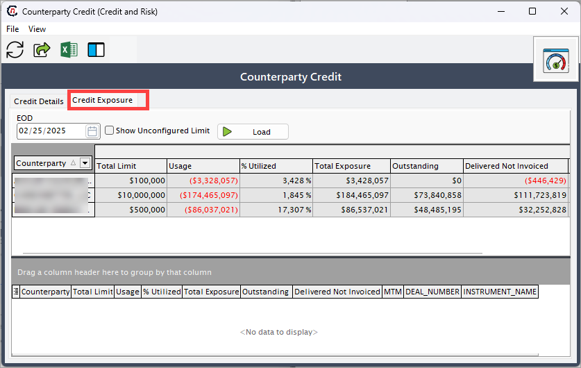
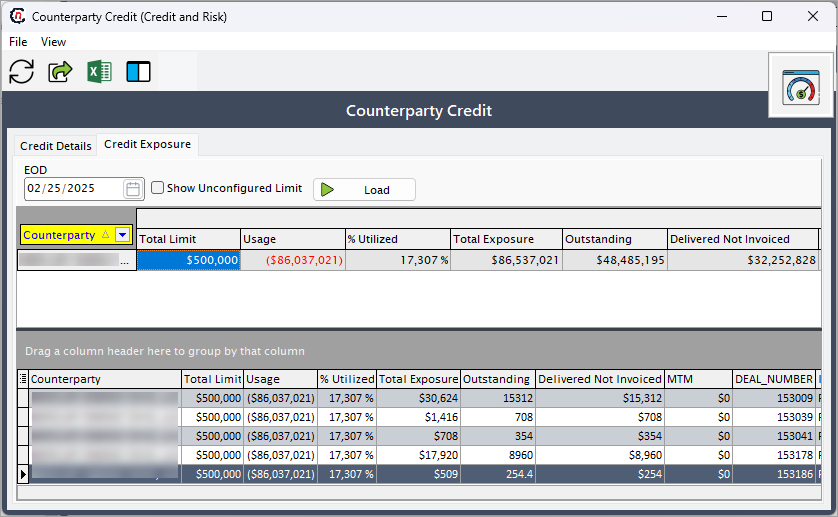

# Understanding counterparty credits in natural gas industry

When companies buy, sell, or transport natural gas, they make agreements with other companies, called counterparties. Counterparty credit risk is the chance that one of these companies fails to pay or doesn’t deliver gas as promised.

**For example:**

* A gas supplier sells natural gas to a local distribution company (LDC). If the LDC doesn’t pay on time or at all, the supplier loses money.
* A gas buyer signs a contract to purchase gas from a producer. If the producer fails to deliver, the buyer may have to find gas elsewhere at a higher price.

## How do companies manage this risk?
To reduce the risk of financial loss, companies take several precautions:

1. Check creditworthiness
    * Before making deals, companies check if the counterparty has a good credit history and a strong financial background.
    * They look at credit ratings (S&P, Moody’s, Fitch), financial statements, and past payment behavior.

2. Use financial protections
    * Prepayments – Some companies ask for payment before delivering gas.
    * Letters of Credit (LCs) – A bank guarantees the payment if the counterparty fails to pay.
    * Parent Guarantees – A larger, financially stable company guarantees the payment.
    * Collateral & Security Deposits – Some contracts require a company to provide cash or assets as a backup.

3. Set credit limits
    * Companies set a limit on how much business they do with a single counterparty to reduce risk.

4. Monitor and review
    * Companies regularly check if their counterparties are still financially stable.
    * If a counterparty starts struggling, companies may adjust contracts or ask for additional financial protections.

## Who faces counterparty credit risk?

* **Producers and marketers:** They risk losing money if buyers don’t pay.
* **Pipelines and storage operators:** They risk financial loss if customers don’t pay for transportation or storage services.
* **LDCs:** They face risk when customers don’t pay their gas bills.

## Why is this important?
Managing counterparty credit risk helps companies avoid big financial losses, keep gas flowing smoothly, and prevent business disruptions.

<!-- ## Configure counterparty credits

The following section provides step-by-step instructions for configuring and managing counterparty credit in the application. Configuring counterparty credit involves setting up processes and systems to assess, monitor, and manage the credit risk associated with counterparties.

Here you can learn:

* How to navigate to the **Counterparty credit** screen.
* How to configure credit limits and manage related settings.
* Analyze credit exposure data based on deals, pricing, and index values and MTM (Mark-to-Market).

The guide simplifies the configuration process, clarifies credit metrics, and ensures effective credit risk monitoring.

### Prerequisites

* You must have the requisite *add* or *modify* permissions in the **Counterparty credit** screen.
* A counterparty must be configured prior to setting up counterparty credits.

### Configuration steps

#### Step 1: Navigate to the Counterparty credit screen

1.	Log in to the **nGenue** application.
2.	Click the **Search** icon and enter *counterparty credit* in the search bar. 
 
3.	Double-click **Counterparty credit** to open the respective screen. Here, you can configure the credit limit for the selected counterparty and view the credit exposure details, which are retrieved from the deal management configuration settings.

4. The next screen i.e., **Counterparty credit** screen is divided into two tabs: **Credit details** and **Credit exposure.**
 

##### Credit details

The **Credit details** tabs further consists of 3 filters to narrow down the results. This provides the flexibility to view only relevant data, making the search process faster and more efficient.

* **Value:** This filter is used to sort or refine the credit limit amounts for all pre-configured credit limits.
* **Limit:** This filter is used to sort or refine the limit type for all pre-configured credit limits.
* **Counterparty:** This dropdown allows you to choose the counterparty for whom they wish to set the credit limit. Based on the selection, the counterparty details will get displayed such as counterparty name, total limit, limit name and the amount. This data is the already configured credit Limit for the counterparty.

For any credit limit added to a counterparty, it will get reflected in the bottom section of the **Counterparty credit** screen. You can also create a new credit limit or edit/delete the ones that are not required.

**Add a new credit limit**

1. To add a new credit limit, you must first select the desired counterparty from the **Counterparty** dropdown. 
2. Click on **Add new limit** icon, which will prompt the system to create a new row with the selected counterparty. You will now require to fill in the following details:
    1. **Limit name:** Select from the dropdown.
    2. **Amount:** Credit limit to be added.
    3. **Start and end date:** Set start and the end date.
    4. **Note:** Add additional notes if required.
    

5. After entering all the required details, click the **Save** button to save the credit limit configured for the counterparty.

##### Credit exposure

The **Credit exposure** tab provides a comprehensive view of a company's total credit risk associated with its counterparties. This tab aggregates and displays detailed information about the current and potential exposure to credit risk for each counterparty or transaction.

!!! note "Note"
    1. The credit exposure data will only be displayed when you click on the the **Load** button in the **Counterparty credit > Credit exposure** tab if the counterparty has a configured deal. 
    2. The calculations on this screen are based on the physical pricing configured for the deal, as well as the index and curved values and MTM set up.

1. Select a specific date from the **EOD** dropdown for which you want to view credit exposure details.
2. **Show unconfigured limit checkbox:** This checkbox enables users to include or exclude credit exposure data related to unconfigured limits. When selected, credit exposure details for limits that are not configured will also be displayed.
3. Click on the **Load** button to populate the table with the relevant credit exposure details.

4. The main section of the screen contains a table displaying key credit-related metrics for the selected counterparty. The columns in the table include:
    
    |Fields | Description | Data type | Mandatory (Y/N) | Fetched from (UI screen) | Displayed on (UI screen) |
    |---|---|---|---|---|---|
    |Counterparty | Displays the name of the counterparty. | String | Y | Counterparty screen | Customer invoice |
    |Total limit | Shows the total credit limit assigned to the counterparty. | Currency | Y | Counterparty > Risk limits tab | Credit limit screen |
    |Usage | Indicates the amount of the credit limit currently utilized. | Currency | Y | Deal management screen | Customer invoice |
    |% utilized | Reflects the percentage of the total limit that has been used. | Percentage | Y | Deal management screen | Customer invoice |
    |Total exposure | Represents the total credit exposure for the counterparty. | Currency | Y | Deal management screen | Customer invoice |
    |Outstanding | Displays the outstanding amounts owed by the counterparty. | Decimal | Y | Deal management screen | Customer invoice |
    |Delivered not invoiced | Represents the value of goods or services delivered but not yet invoiced. | Currency | Y | Deal management screen | N/A |
    |MTM (Mark-to-Market) | Shows the mark-to-market valuation of open positions for the counterparty. | Currency | N | Market-To-Market screen | N/A |
    |Deal number | Provides a reference number for specific deals associated with the counterparty. | Auto-generated  | Y | Deal management | Customer invoice |
    |Instrument name | Identifies the type of instrument (e.g., Physical NG) linked to the credit exposure. | String | Y | Deal management | Customer invoice |

    !!! note "Note"
        The **Credit exposure** tab displays pre-configured data that is calculated based on the indexes, physical pricing, and deals associated with the selected counterparty. -->