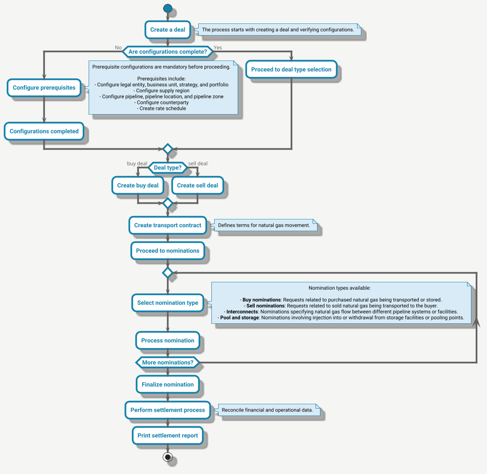

---
hide:
 - toc
---

# ETRM workflow

Let's understand the workflow of ETRM in nGenue through below flow diagram:

## Workflow explanation

Here is the detailed workflow sequence for the ETRM process, reflecting the flow described in the above diagram.

1. **Create a deal**

    1. The process begins when the trader initiates [creating a deal](../deal_management/create_deal.md).
    2. The system verifies whether all prerequisite configurations are completed.

2. **Check configurations** 
If configurations are incomplete, the trader must complete them:
    
     

    Once configurations are complete, the system allows proceeding to deal type selection.

3. **Select deal type**

    1. Based on the trader's choice, the system creates either:
        1. [Buy deal:](../deal_management/overview.md) Represents the purchase of natural gas.
        1. [Sell deal:](../deal_management/overview.md) Represents the sale of natural gas.

4. **Create transport contract**

    1. After selecting the deal type, the trader creates a [transport contract.](../getting_started/transport_contract.md)
    2. The contract outlines the terms and conditions for transporting natural gas.

5. **Proceed to nominations** 
The system moves to the [nominations](../etrm/pipeline_scheduling.md) phase to schedule the movement of natural gas.

6. **Select nomination type**

    1. Traders select from various nomination types:
        1. **Buy nominations**: Requests for purchased natural gas being transported or stored.
        2. **Sell nominations**: Requests for sold natural gas being transported to buyers.
        3. **Interconnects**: Specify gas flow between different pipeline systems or facilities.
        4. **Pool and storage nominations**: Include injection into or withdrawal from storage facilities or pooling points.

7. **Create and finalize nomination**
    1. The system processes the selected nominations, allowing for adjustments if necessary.
    2. Once all required nominations are complete, the system finalizes them.

8. **Perform scheduling process** 
The system reconciles financial and operational data as part of the pipeline scheduling process. [Learn more.](../etrm/pipeline_scheduling.md)

9. **Print settlement report** 
The workflow concludes with the trader printing a settlement report for record-keeping and compliance.

---

## Related topics that you might be interested

-   :material-format-paint:{ .lg .middle } __Understanding ETRM__

    ---

    Understand the basics of ETRM and what are its key components.

    [:octicons-arrow-right-24: Know more](./index.md)

-   :material-format-paint:{ .lg .middle } __How nGenue addresses ETRM aspect__

    ---

    Learn how nGenue addresses ETRM aspect.

    [:octicons-arrow-right-24: Know more](./addressing_etrm_aspects.md)    

