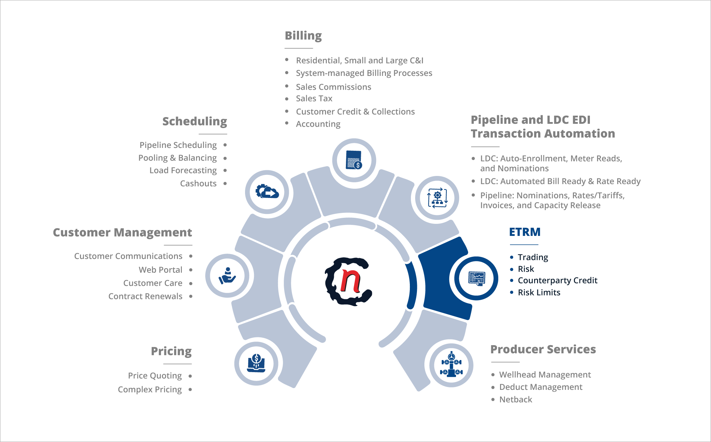
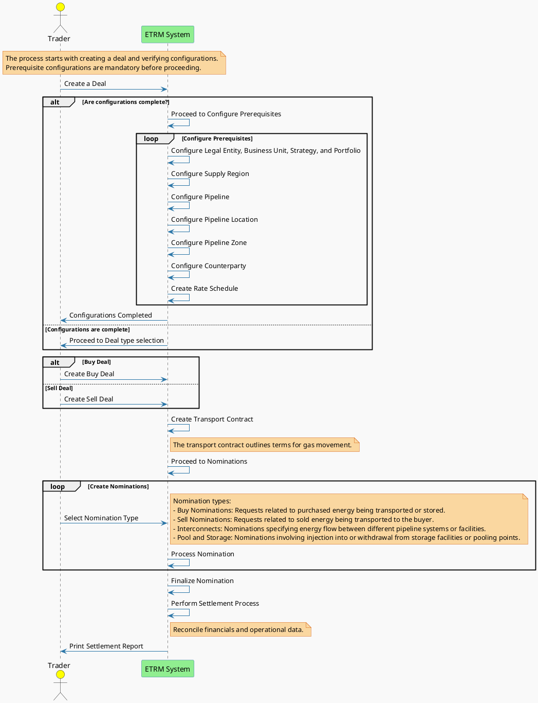
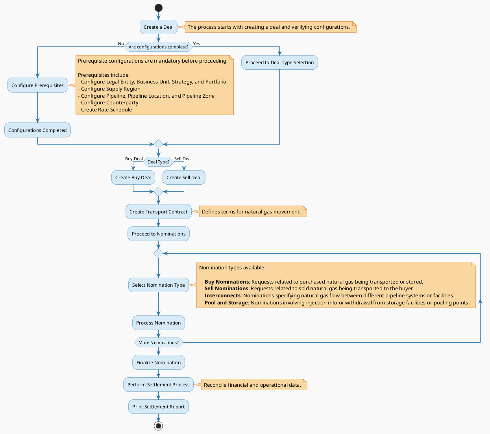

---
hide:
 - toc
---

# ETRM overview

**ETRM** stands for *Energy, Trade, and Risk Management.*

ETRM in nGenue focuses on managing the full lifecycle of wholesale natural gas transactions. It integrates trading, transportation, risk management, and reporting capabilities into a unified platform, tailored to the unique requirements of wholesale operations.

**Key wholesale processes supported by nGenue's ETRM include**:

* **Trading**: Facilitates the buying and selling of natural gas in wholesale markets.
* **Contract Management**: Manages long-term and short-term contracts with suppliers, buyers, and transporters.
* **Transportation Logistics**: Optimizes pipeline scheduling, nominations, and storage.
* **Risk Assessment**: Monitors price volatility, credit exposure, and operational risks.
* **Regulatory Compliance**: Ensures adherence to industry standards and legal requirements.

## ETRM Workflow

Let's understand the workflow of ETRM in nGenue through below plantuml diagram:

<!-- This is commented out. 
### Workflow 1

-->

### Workflow explanation

Here is the detailed workflow sequence for the ETRM process, reflecting the flow described in the the above PlantUML diagram.

1. **Create a deal**

    1. The process begins when the trader initiates [**creating a deal**](../deal_management/physical_deal.md).
    2. The system verifies whether all prerequisite configurations are completed.

2. **Check configurations** 
If configurations are incomplete, the trader must complete them:
    
     

    Once configurations are complete, the system allows proceeding to deal type selection.

3. **Select deal type**

    1. Based on the trader's choice, the system creates either:
        1. **Buy Deal**: Represents the purchase of natural gas.
        1. **Sell Deal**: Represents the sale of natural gas.

4. **Create transport contract**

    1. After selecting the deal type, the trader creates a [**Transport contract**.](../user_management/transport_contract.md)
    2. The contract outlines the terms and conditions for transporting natural gas.

5. **Proceed to nominations** 
The system moves to the [**Nominations**](../etrm/nominations.md) phase to schedule the movement of natural gas.

6. **Select nomination type**

    1. Traders select from various nomination types:
        1. **Buy Nominations**: Requests for purchased natural gas being transported or stored.
        2. **Sell Nominations**: Requests for sold natural gas being transported to buyers.
        3. **Interconnects**: Specify gas flow between different pipeline systems or facilities.
        4. **Pool and storage nominations**: Include injection into or withdrawal from storage facilities or pooling points.

7. **Create and finalize nomination**
    1. The system processes the selected nominations, allowing for adjustments if necessary.
    2. Once all required nominations are complete, the system finalizes them.

8. **Perform [settlement process](../etrm/settlements.md)** 
The system reconciles financial and operational data as part of the settlement process.

9. **Print [settlement report](../etrm/settlements.md)** 
The workflow concludes with the trader printing a settlement report for record-keeping and compliance.

## How nGenue addresses ETRM aspects

Below is a detailed explanation of how nGenue addresses key aspects of ETRM:

### 1. Deal and contract management

- **What it manages**: Centralizes the management of trading deals and contracts across the value chain.

* **Capabilities**:

    * Facilitates deal creation, execution, and settlement for both physical and financial trades.  
    * Tracks contract terms, pricing structures, and expiration dates.  
    * Supports hedging strategies to mitigate market risks.

- **Benefits**: Streamlines trading operations and ensures contractual compliance.

### 2. Pipeline path operations

- **What it manages**: Tracks and optimizes the movement of natural gas through pipeline networks. 

- **Capabilities**:

    - Configures pipeline paths to ensure the seamless flow of gas from suppliers to end users.  
    - Supports nomination, scheduling, and balancing to maximize throughput efficiency.  
    - Provides detailed analytics to monitor and address pipeline constraints in real time. 

- **Benefits**: Minimizes transportation costs and ensures reliable gas delivery.

### 3. LDC configurations

- **What it manages**: Customizes configurations for Local Distribution Companies (LDCs). 

- **Capabilities**:  
    - Manages contracts between LDCs and suppliers or marketers.  
    - Tracks volumes, delivery schedules, and rate structures specific to LDC agreements.  
    - Automates compliance with LDC-specific operational rules and regulations.

- **Benefits**: Enhances efficiency in serving LDCs and reduces manual intervention.

### 4. Storage and distribution

- **What it manages**: Handles the storage and distribution of natural gas to balance supply and demand. 

- **Capabilities**:  
    - Supports inventory management for gas stored in underground or off-site facilities.  
    - Optimizes withdrawal and injection cycles based on market conditions.  
    - Provides tools to allocate storage costs to relevant contracts or deals.  
- **Benefits**: Ensures energy availability during peak demand and maximizes storage profitability.

### 5. Risk management

- **What it manages**: Identifies, assesses, and mitigates risks associated with trading and operations.  
- **Capabilities**:  
    - Monitors market volatility and provides price forecasting tools.  
    - Enables scenario analysis to evaluate the impact of market changes on profitability.  
    - Tracks credit and operational risks associated with counterparties and logistics.  
- **Benefits**: Protects against financial losses and promotes informed decision-making.

nGenue’s ETRM platform empowers businesses to achieve operational excellence while staying competitive in an ever-changing energy market.
