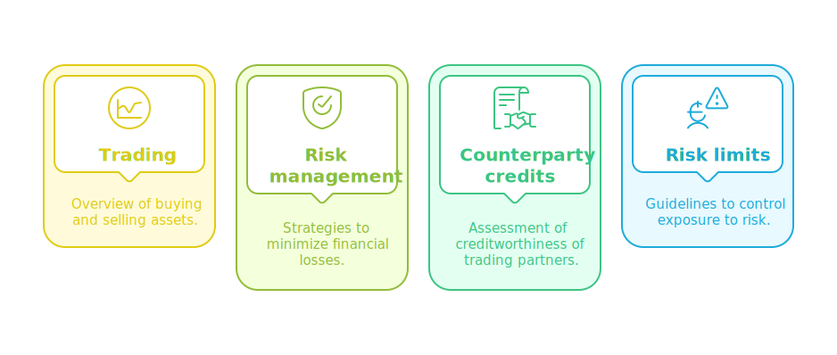
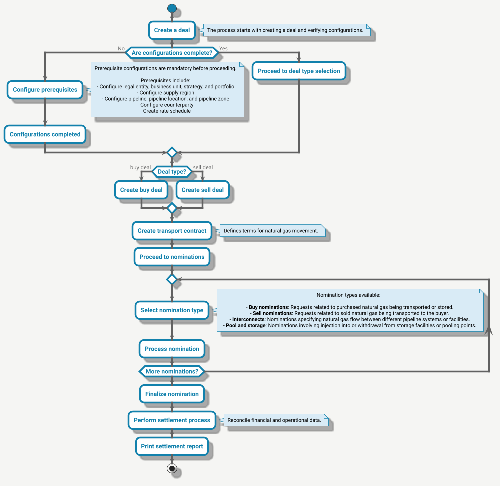

---
hide:
 - toc
---

# Understanding ETRM

nGenue’s **Energy Trading, and Risk Management (ETRM)** process is specifically designed to meet the needs of natural gas market participants, including utilities, marketers, and pipeline operators. It provides a unified platform to manage energy trading, financial risk, counterparty credit assessment, and compliance with risk limits. By integrating these functionalities, nGenue enables organizations to streamline trading operations, mitigate financial risks, and ensure regulatory compliance while maintaining efficiency and accuracy.

## Key components of ETRM

<!--  -->

### 1. Trading

The trading is all about efficiently manage energy trades by offering:

* **Trade capture and management:** Enables users to record and track transactions across multiple markets.
* **Market price integration:** Real-time price feeds ensure accurate valuation of traded contracts.
* **Position management:** Provides visibility into current positions, enabling better decision-making.
* **Contract and transaction execution:** Facilitates trade execution for long-term and short-term contracts.

This feature is designed to provide real-time visibility, automation, and control over trading activities, reducing manual errors and improving efficiency.

### 2. Risk management

nGenue’s risk management capabilities help businesses assess and mitigate financial exposure due to market fluctuations. Key features include:

* **Market risk analysis:** Provides insights into exposure due to price movements in the natural gas market.
* **Value at risk (VaR) calculation:** Measures potential portfolio losses under different market conditions.
* **Hedging strategies:** Supports derivative instruments such as swaps and options to offset risks.
* **Scenario analysis and forecasting:** Simulates different price scenarios and their impact on trading portfolios.

With nGenue’s risk management features, organizations can make data-driven decisions to protect profitability and ensure financial stability.

### 3. Counterparty credit management

Since trading involves multiple counterparties, **nGenue** includes a comprehensive counterparty credit management system to minimize the risk of defaults. It provides:

* **Credit Scoring & Limits:** Assigns credit scores to counterparties and establishes appropriate limits.
* **Exposure Monitoring:** Tracks real-time credit exposure across all transactions.
* **Collateral & Payment Tracking:** Manages security deposits, payments, and guarantees to secure transactions.
* **Risk Alerts & Notifications:** Triggers alerts when counterparties approach or exceed their credit limits.

By proactively managing counterparty risk, **nGenue** ensures secure and reliable energy transactions.

### 4. Risk limits

To maintain financial discipline and regulatory adherence, nGenue enforces risk limits through:

* **Predefined exposure limits:** Sets position and credit limits to prevent excessive risk-taking.
* **Automated risk alerts:** Notifies users when exposure approaches predefined thresholds.
* **Regulatory compliance reporting:** Ensures adherence to industry regulations such as NAESB and FERC guidelines.
* **Audit and Governance controls:** Tracks all transactions and risk management activities for transparency and accountability.

By enforcing risk limits, nGenue helps organizations maintain financial stability while meeting compliance requirements.

---

<!--
## ETRM workflow

Let's understand the workflow of ETRM in nGenue through below flow diagram:

### Workflow explanation

Here is the detailed workflow sequence for the ETRM process, reflecting the flow described in the above diagram.

1. **Create a deal**

    1. The process begins when the trader initiates [**creating a deal**](../deal_management/physical_deal.md).
    2. The system verifies whether all prerequisite configurations are completed.

2. **Check configurations** 
If configurations are incomplete, the trader must complete them:
    
     

    Once configurations are complete, the system allows proceeding to deal type selection.

3. **Select deal type**

    1. Based on the trader's choice, the system creates either:
        1. [**Buy deal:**](../deal_management/overview.md) Represents the purchase of natural gas.
        1. [**Sell deal:**](../deal_management/overview.md) Represents the sale of natural gas.

4. **Create transport contract**

    1. After selecting the deal type, the trader creates a [**transport contract**.](../getting_started/transport_contract.md)
    2. The contract outlines the terms and conditions for transporting natural gas.

5. **Proceed to nominations** 
The system moves to the [**nominations**](../etrm/nominations.md) phase to schedule the movement of natural gas.

6. **Select nomination type**

    1. Traders select from various nomination types:
        1. **Buy nominations**: Requests for purchased natural gas being transported or stored.
        2. **Sell nominations**: Requests for sold natural gas being transported to buyers.
        3. **Interconnects**: Specify gas flow between different pipeline systems or facilities.
        4. **Pool and storage nominations**: Include injection into or withdrawal from storage facilities or pooling points.

7. **Create and finalize nomination**
    1. The system processes the selected nominations, allowing for adjustments if necessary.
    2. Once all required nominations are complete, the system finalizes them.

8. **Perform [settlement process](../etrm/settlements.md)** 
The system reconciles financial and operational data as part of the settlement process.

9. **Print [settlement report](../etrm/settlements.md)** 
The workflow concludes with the trader printing a settlement report for record-keeping and compliance.

-->

## Related topics that you might be interested

-   :material-format-paint:{ .lg .middle } __ETRM workflow__

    ---

    Understand the workflow of ETRM in nGenue.

    [:octicons-arrow-right-24: Know more](./etrm_workflow.md)

-   :material-format-paint:{ .lg .middle } __How nGenue addresses ETRM aspect__

    ---

    Learn how nGenue addresses ETRM aspect.

    [:octicons-arrow-right-24: Know more](./addressing_etrm_aspects.md)    

-   :material-upload-network:{ .lg .middle } __Configuring a deal__

    ---

    Learn how to configure a deal in nGenue.

    [:octicons-arrow-right-24: Know more](../deal_management/overview.md)

-   :material-directions-fork:{ .lg .middle } __Internal book structure__

    ---

    Learn more about legal entity, business unit, portfolio, and strategy which makes a book structure.

    [:octicons-arrow-right-24: Know more](../getting_started/inbook_structure.md)

