# Understanding indices and curves

In the nGenue application, the concepts of **indices** and **curves** are integral to effective pricing management and financial data reporting. An index or curve encapsulates the hierarchical relationships between pricing structures, including the New York Mercantile Exchange (NYMEX) and Basis pricing. Understanding how to configure Indices and Curves is essential for setting up deals, generating invoices, and managing comprehensive settlements.

Configuring **indices** and **curves** is critical for:

* Setting up deals  
* Generating invoices  
* Managing comprehensive settlements  

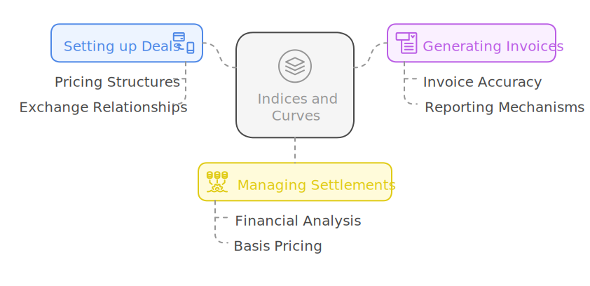

This module is foundational to pricing strategies and supports robust reporting mechanisms, enabling detailed financial analysis.

---

<!-- ## Configure indices and curves

The following sections serves as a comprehensive guide, providing detailed, step-by-step instructions for configuring indices and curves within the nGenue application. It is designed to assist you in successfully setting up these critical components to ensure accurate pricing and financial reporting.

### Prerequisites

* You must have the requisite *add* or *modify* permissions in the **Index curve definition** screen. The details about this screen is discussed later.
* A local distribution company (LDC) and a pipeline must be properly configured prior to setting up any index.

### Process steps

#### Step 1: Navigate to the Index curve definition screen

1.	Log in to the **nGenue** application.
2.	Click the **Search** icon and enter *index* in the search bar.  
3.	Double-click **Index curve definition** to open the respective screen.
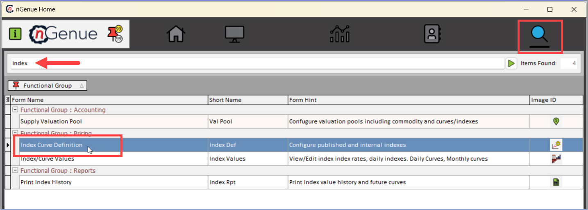
4. The next screen is divided into two sections: **Index query** and **Index configuration.**
    1. The **Index query** section will allow you to narrow down records displayed in the main data grid. This provides the flexibility to view only relevant data, making the search process faster and more efficient.
        * **Filter by LDC:** Filter records based on Local Distribution Companies (LDCs).
        * **Filter By pipeline:** Filter records according to pipelines.
        * **Index group:** This filter narrows down records based on predefined index groups.
        * **Index type:** Filter records by specific types of indexes from the dropdown.
        * **Character search:** This filter is a free-text search option that allows you to locate records based on a partial or full index name.
         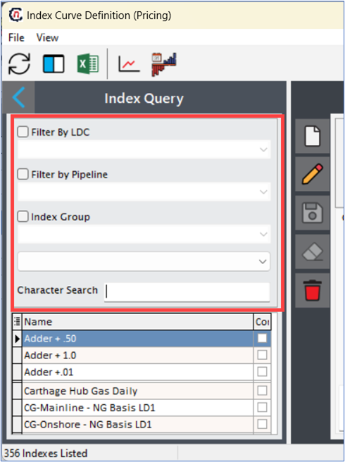
    2. The **Index configuration** section will have various options that facilitate the creation, modification, and management of index records. The table below describes the available icons and their functions:
    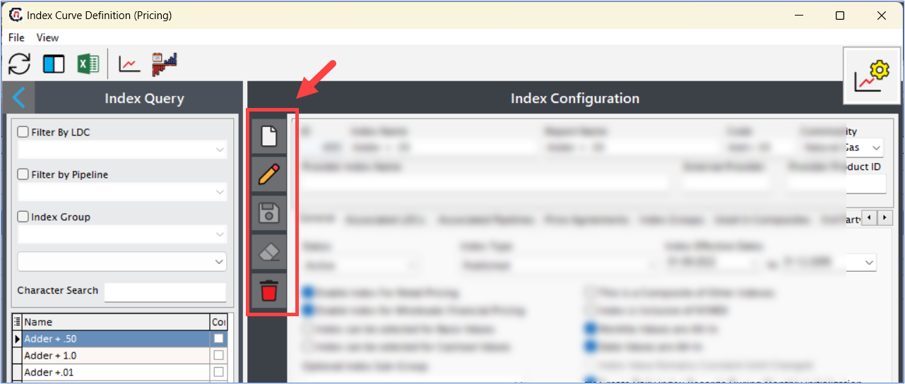
        
        | Icons      | Description                          |
        | ----------- | ------------------------------------ |
        |         | Add a new record. By selecting this option, you can enter the necessary details for a new index, such as its name, category, and relevant pricing information. This action is typically the starting point for adding any new index data into the system. |
        |     | Edit the record detail. This is used to modify an existing record. This feature allows you to update an index entry if any details have changed or need correction. For example, if the index’s value or associated pricing parameters need adjustment, you can select the record, make the necessary changes, and save the updated information.  |
        |         |  Save the record. |
        |   | Cancel the updates being made to the record. This allow you to reset any data entered in the current session without saving. This feature is useful if you need to discard changes or start over with new data entry. Using this option, you can ensure that any unwanted inputs are removed before the data is saved, helping maintain data accuracy.  |
        |   | Delete a record. This cannot be undone. |

#### Step 2: Add a new record

1. Click on **Add a new record** icon in the **Index configuration** to add a new record.
2. Enter a name for the index and a unique identifier in the **Index name** and **Code** fields, respectively. This code serves as a quick reference for identifying the index, especially in areas where space is limited or when searching through large datasets. By using a concise code, users can rapidly locate specific indexes without needing the full index name, making this field practical for streamlined navigation and filtering.
    
    !!! example "Example"

        If the index name is **"ABC index,"** the code could be **"ABCINDEX."**

3. The below table list down different fields along with its detailed description available to create a new record:

    | Fields      | Description                          |
    | ----------- | ------------------------------------ |
    |ID | The ID field is an auto-generated, unique identifier for each index record. It is primarily used in the backend to reference the index in other screens and modules, ensuring consistency across various parts of the system.|
    |Report name | This field is a text field used for entering the name of the index as it should appear in reports. This field is particularly useful if the reporting name needs to differ slightly for clarity or if specific formatting is required in external reports. |
    |Commodity | The Commodity field is a dropdown menu where users select the commodity type associated with the index. This dropdown is populated with predefined commodity types, which are configured in a separate screen known as **"Commodities.”**  Choosing the right commodity type is critical for accurate categorization, ensuring that the index is properly aligned with the relevant market or product type for pricing and analysis.|
    |Provider Index name | This is a text field where users can enter the name of the index as defined by the external provider or publisher. This is typically the official name provided by third-party entities, such as ICE or Platts, and may differ from the internal index name used within the system.  Recording the provider index name allows users to cross-reference the internal index with its external counterpart, ensuring that any external data imports or comparisons are accurate. |
    |External provider | This is a text field where users enter the name of the organization or entity that publishes the index data, such as a financial exchange or market data provider. This field allows you to specify the source of the index, ensuring traceability and accuracy, especially in cases where indexes from multiple providers are used.  Examples of common external providers might include ICE (Intercontinental Exchange) or Platts. Identifying the provider helps in validating data and attributing it to the correct source.|
    |Provider product ID| This field is where you input the unique product ID or code assigned by the external provider to the index. This acts as a direct link to the external index, making it easier to integrate or verify the index data against the provider's records.  Using the official product ID ensures that the correct data is used and minimizes the risk of mismatches or errors, particularly when importing or updating index data from the provider.|
    
    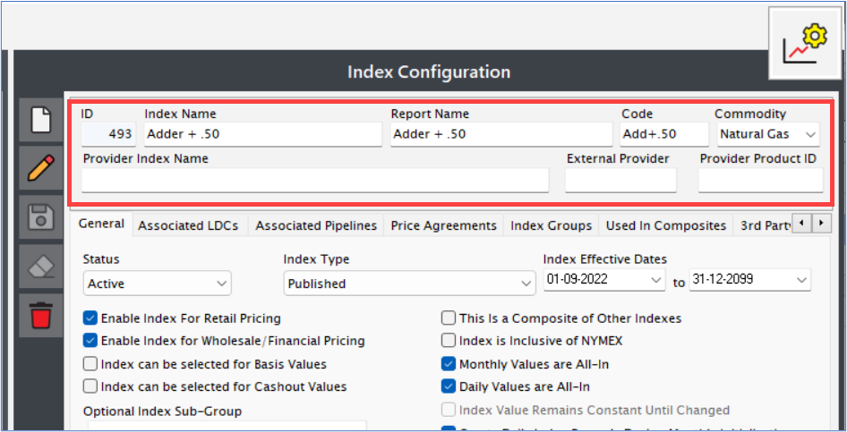

4. By correctly filling out these fields, you will ensure that all necessary information is captured for accurate pricing and invoicing. This structured setup enables the system to reference the index data seamlessly across various screens and modules, supporting efficient data management and reporting throughout the application. 

##### Configuring tabs

The **Index configuration** screen also consists of multiple tabs which provide a comprehensive framework for defining an index within the system. Each tab contains specific settings and fields that help classify and configure the index according to its usage, type, and integration with other parts of the system. This structure ensures that each index is appropriately organized and applied in the relevant contexts, such as pricing agreements, third-party integrations, and pipeline associations.

###### General tab

The **General** tab is the primary configuration area where most of the index’s defining characteristics are set. This tab contains several fields, each serving a specific purpose to ensure accurate setup and integration of the index in the system.
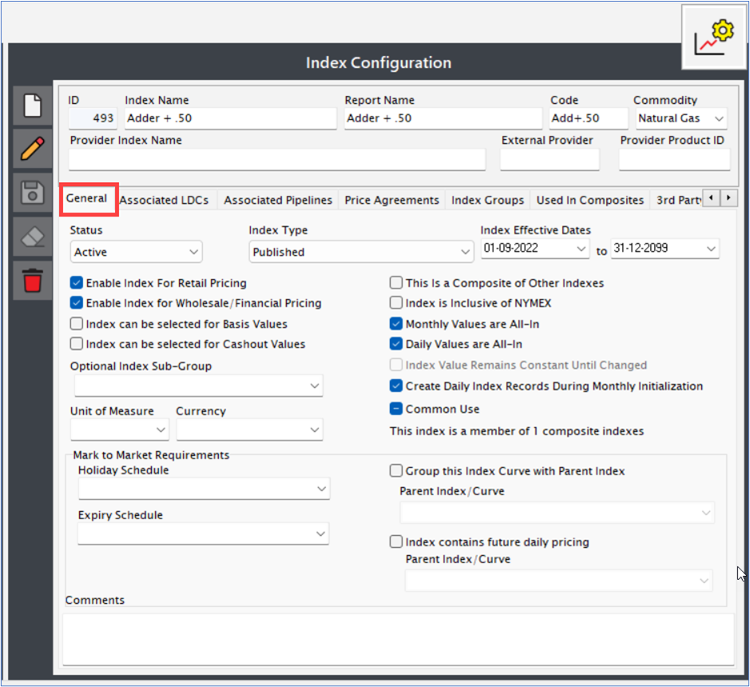

Below are the fields and their descriptions:

| Fields      | Description                          |
| ----------- | ------------------------------------ |
|Status | A dropdown with two options: Active and Inactive.  Setting the index to Active enables it to appear in other screens and modules, making it available for use across the system. The Inactive status hides the index from other screens, effectively disabling it without deleting the record.|
|Index type | A dropdown with three options: Published, Internal, and LDC.   1. Published: Indicates that the index is published by a provider (e.g., ICE, Platts).  2. Internal: Refers to indexes created within the system based on other indexes or benchmark values, such as NYMEX and Basis.  3. LDC: Designates indexes published by a Local Distribution Company (LDC).|
|Index effective dates | Date selectors for start and end dates, defining the period during which the index is valid. This range determines when the index data will be available for use, ensuring that only current and relevant indexes are applied.|
|Enable index for retail pricing | A checkbox that, when checked, enables the index for retail pricing. If left unchecked, the index will not be applied in retail pricing scenarios.|
|Enable index for wholesale/financial pricing | A checkbox that allows the index to be used in wholesale or financial pricing. Leaving this unchecked excludes the index from wholesale pricing applications.|
|Index can be selected for basis values | A checkbox indicating whether the index can be selected as a basis. When checked, the index is available as a basis option for pricing or other applications that require a basis selection.|
|Index can be selected for cashout values | A checkbox relevant to retail configurations, enabling the index for cashout selections when checked. This setting ensures the index is available for any cashout-related calculations.|
|Optional Index Sub-Group | A dropdown used to categorize the index into subgroups, which helps organize indexes by specific classifications.  Index groups are discussed further in the **"Index group"** section below.|
|Holiday schedule | A dropdown populated based on holiday schedules configured in the "Holiday Set" screen. Selecting a holiday set allows the index to account for holidays, ensuring that holidays are factored into index calculations.|
|Expiry schedule | A dropdown where users can define the expiration schedule for the index. This schedule determines when the index expires and is no longer valid for use.|
|Index contains future daily pricing | A checkbox that, when checked, indicates that the index contains daily pricing for future dates. Checking this option enables the use of both historical and future prices within the index.|
|Group this index curve with parent index | A checkbox that, when checked, allows the index to be grouped with a parent index. Once enabled, a dropdown appears to select the relevant parent index. This setting helps in scenarios where the index needs to be grouped with another to form a hierarchical relationship.|
|Parent index/curve | A dropdown list populated with other indexes created within the system. This dropdown only becomes active if the **"Group this index curve with parent index"** checkbox is checked, allowing users to specify the parent index.|
|This is a Composite of Other Indexes | When checked, marks the index as a composite index. Composite indexes are combinations of other indexes and are discussed further in the "Composite Index" section below.|
|Index is inclusive of NYMEX | A checkbox that, when checked, indicates that the index includes NYMEX pricing. This is useful for indexes that incorporate NYMEX values, ensuring that this inclusion is clear in the index definition.|
|Monthly values are all-in| A checkbox that, when checked, specifies that the index is monthly and represents an all-in value. Monthly indexes provide one value per month, which is used across daily pricing applications. |
|Daily values are all-in| A checkbox indicating that the index is a daily index with 30 or 31 values per month. Each day of the month has its own value, making it suitable for applications needing daily pricing details.|
|Index values remain constant until changed | A checkbox that, when selected, keeps the index value constant until a new value is manually set. This setting is helpful in scenarios where index values are not updated frequently.|
|Create daily index records during monthly initialization | A checkbox enabling the creation of daily index records as part of the monthly initialization process. When checked, this setting ensures daily records are automatically generated, streamlining data management.|
|Comments | A free-text field where users can enter any additional information or notes about the index. This field is flexible and can include observations, instructions, or other relevant details.|

Each of these fields within the **General** tab is integral to establishing a detailed and functional index configuration, allowing for fine-tuned adjustments in how the index behaves and interacts with other system elements.

###### Associated LDCs

In the **Associated LDCs** tab, you can assign specific **Local Distribution Companies (LDCs)** to the index. This assignment ensures that only the selected LDCs will have this Index populated in their respective transactions. If an LDC is not selected, it will not utilize the Index in any operations involving it.
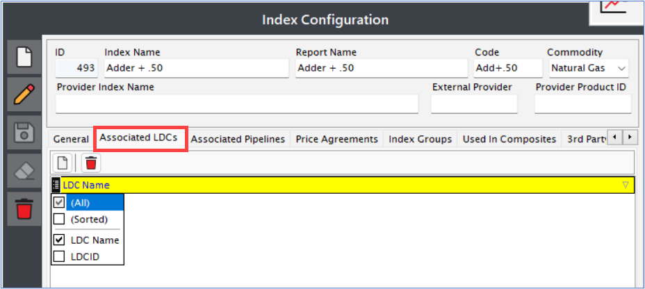

* **Table structure:** The tab contains a comprehensive table listing all LDCs currently assigned to the Index.
* **Create button:** This button opens a pop-up window where users can assign or unassign LDCs using the *left/right/top/bottom* arrow keys.
* **Delete button:** This function allows users to remove the currently selected LDC record from the index.

###### Associated pipelines

The **Associated pipelines** tab functions similarly to the LDCs tab, providing you with the ability to link specific pipelines to the Index. Only the selected pipelines will have access to this Index for any relevant transactions, while unselected pipelines will not utilize it.
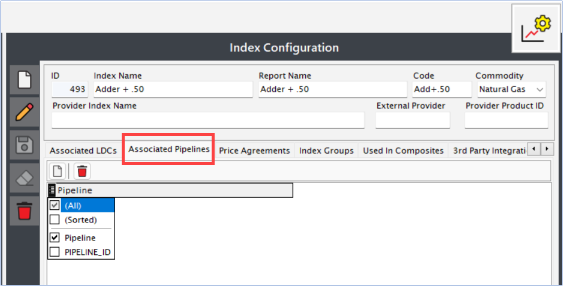

* **Table structure:** The tab features a table listing all pipelines assigned to the Index. 
* **Create button:** This button launches a pop-up window where you can assign or unassign pipelines using the *left/right/top/bottom* arrow keys. 
* **Delete button:** You can click this button to delete the currently selected pipeline from the index.

###### Price agreements

The **Price agreements** tab serves a vital role within the retail side of the system. It consolidates all price agreements that have been configured in conjunction with the Index. This centralization allows for easy management and oversight of pricing strategies associated with the Index, ensuring that all relevant agreements are accounted for and accessible.
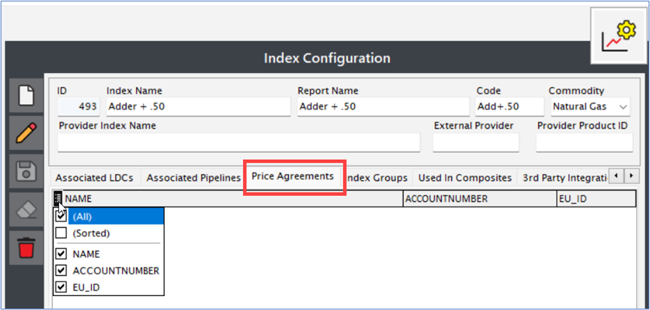

###### Index Groups

In the **Index groups** tab, you can assign the index to a specific group of related indexes, which enhances organizational clarity and simplifies management. You can create a new Index group using the New button, allowing for greater flexibility in categorizing and associating indexes. You also have the option to either edit, update, modify or save the record.
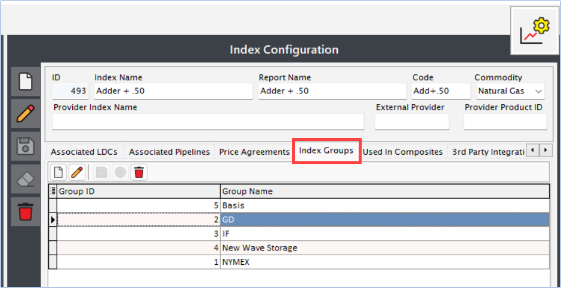

###### Composite members

In this section, you will be able to manage composite indexes, which allow for the calculation of one or more indexes through a defined set of formulas and calculation methods. This tab is critical for aggregating data from various indexes to derive meaningful insights or values.
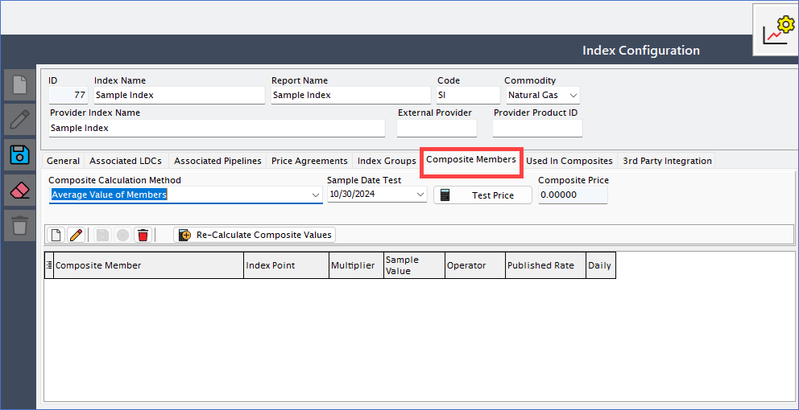

Below are the fields available on this tab and their detailed explanation:

| Fields      | Description                          |
| ----------- | ------------------------------------ |
|Composite Calculation Method | This field is presented as a dropdown menu from which users can select the method for calculating the composite index. The chosen calculation method dictates how the index values will be processed and combined. Users must select an appropriate method that aligns with their desired calculation approach.|
|Sample Date Test | This is a date selection dropdown where users can pick a specific date. The selected date serves as a reference point to evaluate the composite index value on that day. After selecting both the composite calculation method and the sample date, users can click the Test Price button to proceed.|
|Composite Price | After the Test Price button is clicked, the calculated price for the composite index will populate this field. This price is derived based on the selected method and date. It is crucial for users to verify that the computed price aligns with their expectations and the logic of the calculation method selected. |
|Add/Edit/Delete/Cancel/Save | You can manage the underlying data that contribute to the composite index's final value. You’ll be able to either create a new record, modify, clear, delete or save the changes to the record. |
|Re-Calculate Composite Values | Using the Re-Calculate Composite Values button, you can trigger a recalculation of the composite values whenever the calculation method is modified, ensuring that any changes are reflected in the derived values.|

There is another section that is comprised of seven columns, each configured to support the formulation of composite index calculations:

| Columns      | Description                          |
| ----------- | ------------------------------------ |
|Composite Member | This column lists the origin indexes that serve as the foundation for the composite index. Users must select which indexes to incorporate into their composite calculations.|
|Index Point | Here, you can specify where the values of the selected indexes will be drawn from for calculation purposes. This defines the source data for the composite index.|
|Multiplier |This field requires users to input a numeric value. The multiplier is utilized in conjunction with an operator to perform calculations on the index values.|
|Sample Value| You can input a sample value here, which helps estimate and visualize the potential outcomes of the calculations.|
|Operator | This dropdown allows users to select the type of operation that will be applied to the index values. Different operators can yield significantly different results, depending on the chosen calculation method.|
|Published Rate | This column displays the actual value of the origin index for the selected entry, allowing users to cross-check calculated values against the published rates to ensure accuracy.|
|Daily | This is a checkbox indicating whether the index is considered a daily index. When checked, it signifies that the associated calculations will pertain to daily data.|

This comprehensive structure within the Composite Members tab not only facilitates the configuration and management of composite indexes but also ensures that users can effectively validate and adjust calculations based on their specific needs and parameters.

###### Used in composites

The **Used in composites** tab provides insight into whether the selected index is utilized in any composite index calculations. This feature is beneficial for tracking the origin index's role in composite calculations, enhancing the user's understanding of the index's overall impact within the system.
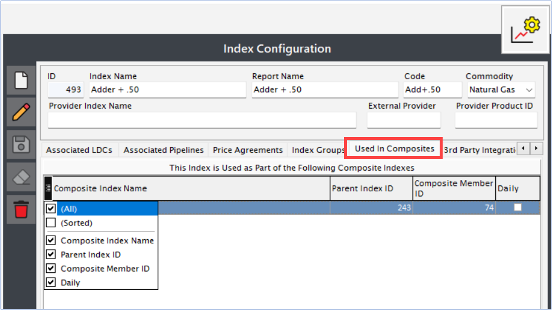

###### 3rd party integration

The **3rd party integration** tab facilitates connections with external systems through API integration. This feature allows the nGenue system to interface with external Energy Trading and Risk Management (ETRM) systems, enabling the transfer of index values and other relevant data. Once the appropriate values and endpoints are selected and configured, the Index values will be sourced from the external ETRM, ensuring that the nGenue system remains synchronized with external data streams. This integration is crucial for users who require real-time data exchange and comprehensive operational flexibility.
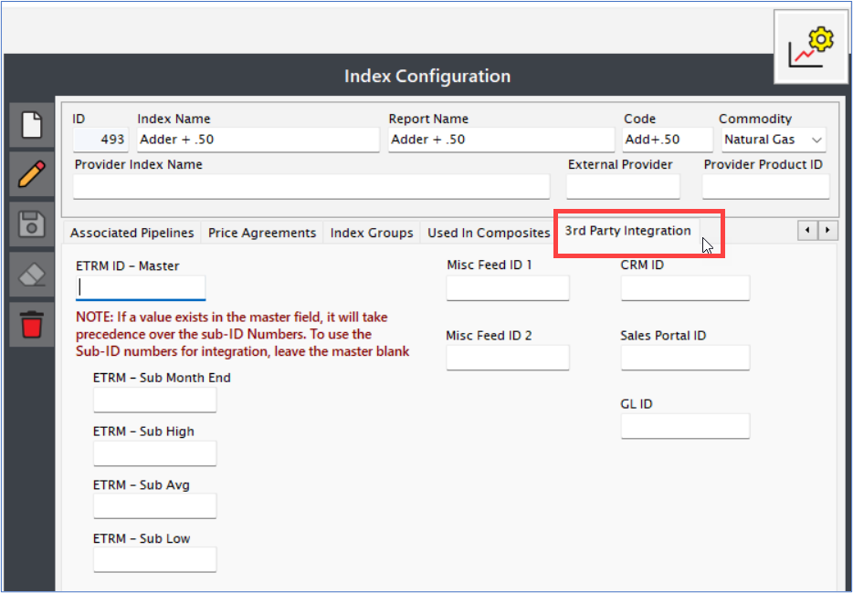

## Final thoughts

The **Index curve definition** is an essential part of configuring pricing data within the system, impacting both retail and wholesale processes. By effectively setting up the filters, main data, and tab configurations, users can ensure that the Index definitions are comprehensive and accurate for pricing applications. The screen's flexibility, with features for creating, editing, saving, and organizing Index data, allows for efficient and precise management of Index records. Mastering the use of this screen supports consistent pricing strategies and smooth invoice generation across various business operations. -->