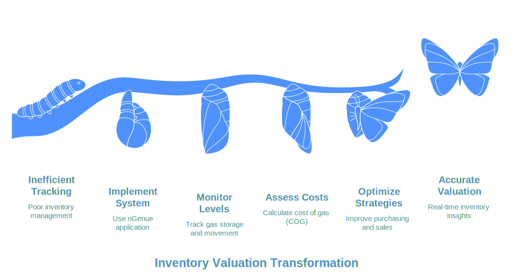

# Understanding inventory valuation

Inventory valuation in the nGenue application helps businesses track and assess the cost and volume of natural gas stored, injected, withdrawn, and sold over time. This ensures accurate financial and operational management by providing real-time visibility into inventory levels and costs.

<!--  -->

## Importance of inventory valuation

Accurate inventory valuation is critical in the natural gas industry as it helps organizations:

* Track inventory movement efficiently.
* Determine the cost of gas (COG) for financial planning.
* Optimize purchasing, storage, and sales strategies.
* Ensure compliance with financial and regulatory requirements.

## Key components

Inventory valuation consists of two main sections:

1. **Query and settings:** This section allows users to apply filters to refine data for specific transactions, locations, or business entities.

2. **Inventory valuation data:** This section presents the processed inventory data, split into **Summary view** and **Detail view**.
    * **Summary view:** Provides a high-level overview of inventory valuation, focusing on financial and volume-related data. Key fields include:
    * **Detail view:** Offers an in-depth breakdown of inventory valuation with transaction-level data.

## Conclusion
Inventory valuation in nGenue is a crucial process that enables organizations to manage gas inventory effectively, control costs, and optimize business operations. By leveraging accurate data and well-defined processes, businesses can make informed decisions to enhance profitability and efficiency.
