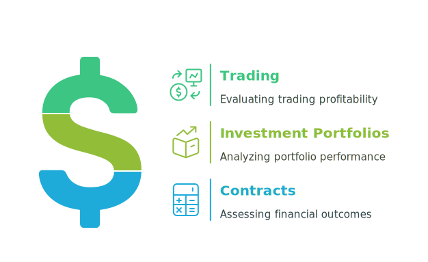
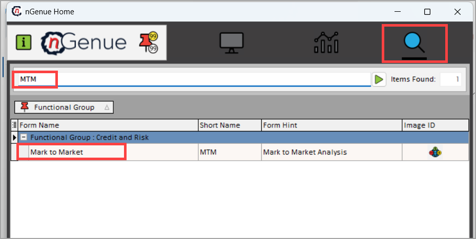
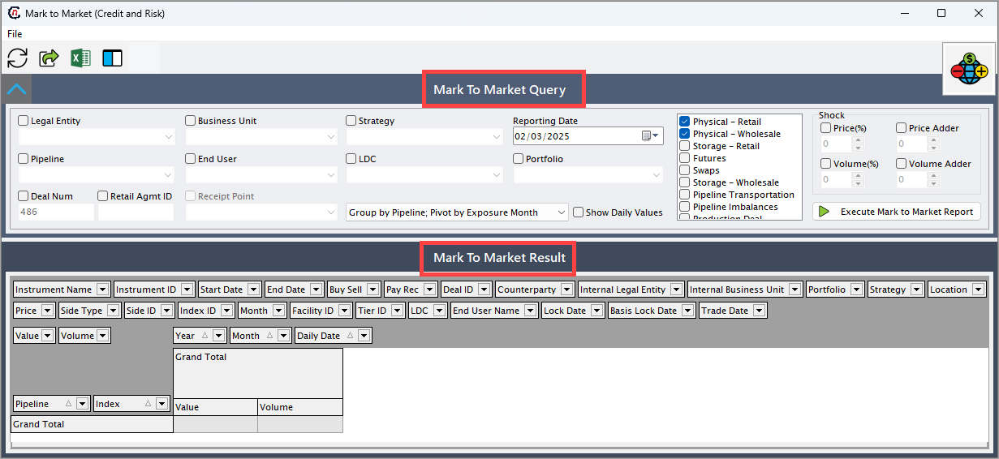
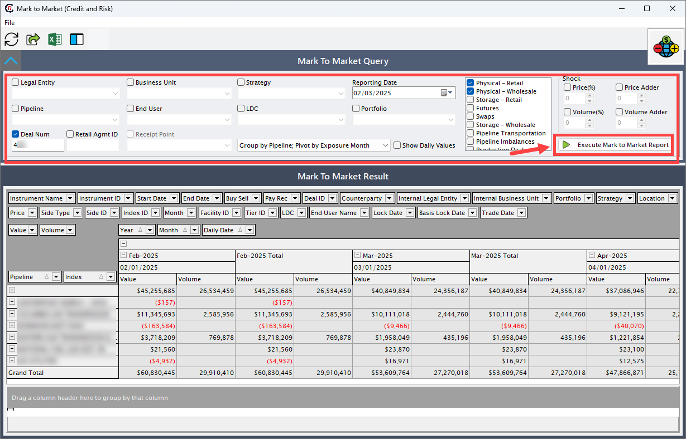
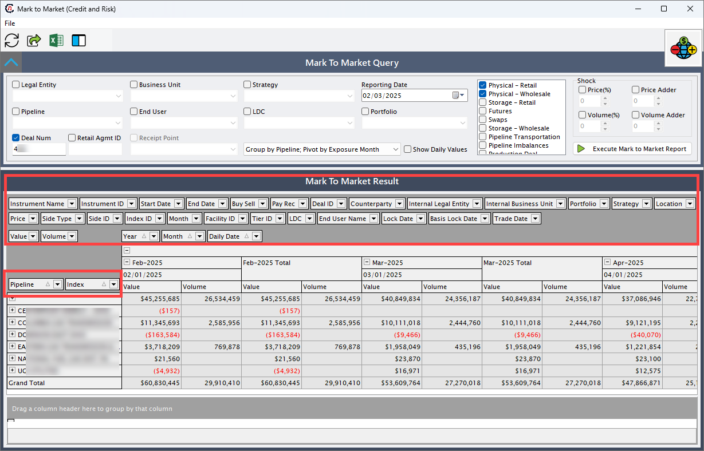
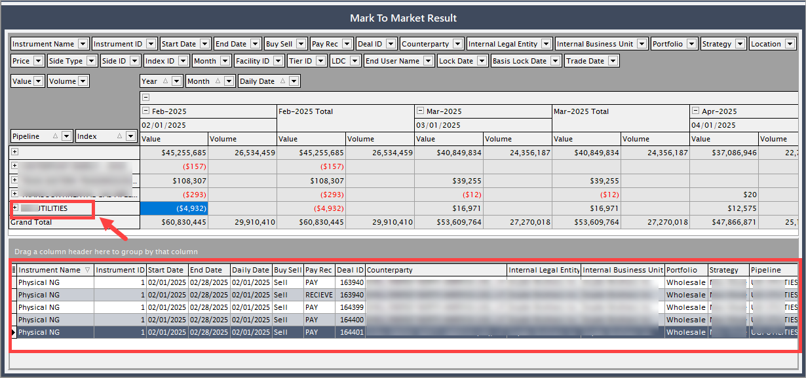
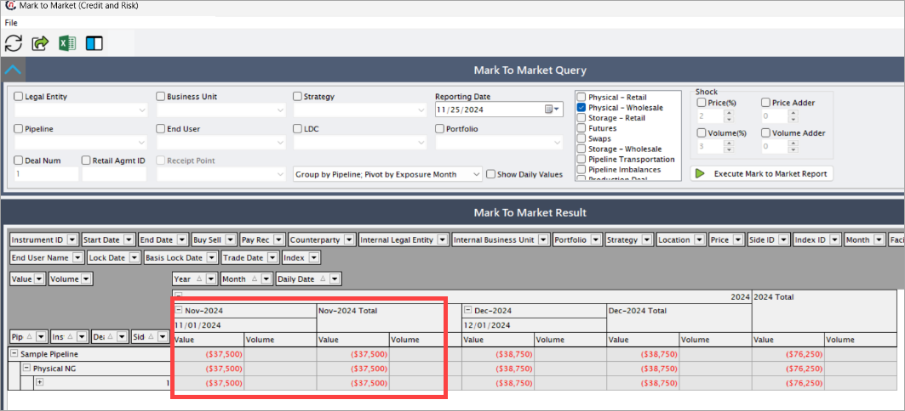
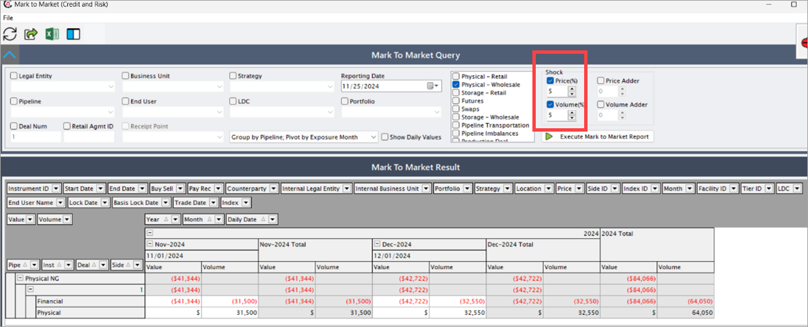

# Understanding MTM

**MTM (Mark-to-Market)** is a financial accounting method used to revalue assets and liabilities at their current market value. Unlike historical cost accounting, MTM provides a real-time snapshot of an organization’s financial position, enabling accurate and informed decision-making.

MTM is commonly applied in:

1. **Trading:** To evaluate the profitability of trading activities.
2. **Investment portfolios:** To analyze portfolio performance amidst market fluctuations.
3. **Contracts:** To assess financial outcomes impacted by changing market prices.

<!-- ## Procedure to configure MTM

The process involves setting up filters, defining instruments, and executing the MTM report to ensure accurate financial analysis and reporting.

### Prerequisites

Before configuring MTM, ensure the following prerequisites are in place:

1. **Access permissions:** Verify you have the necessary permissions to access and configure the MTM module.
2. **Legal entity:** Ensure the relevant legal entities are set up in the system.
3. **Business unit:** Confirm that business units aligned with financial operations are configured.
4. **Data availability:** Validate the presence of up-to-date data for deals, pricing, and indexes.
5. **Mandatory instruments:** Ensure at least one of the following instruments is configured:
    * Physical retail
    * Futures
    * Swaps
    * Storage wholesale
    * Pipeline transportation -->

<!-- ### Process steps

#### Step 1: Navigate to Internal MTM screen

1. Log in to the **nGenue** application.
2. Click the **Search** icon and type *MTM* in the search bar.
3. Double-click **MTM** in the search results to open the **Mark to market** screen.

4. The next screen has two main sections: **Mark to market query**, and **Mark to market result**.

##### Mark to market query

The **Mark to market query** section enables detailed analysis by providing comprehensive filters and essential parameters for accurate data representation. You can customize their view based on criteria like legal entity, business unit, pipeline, or via deal number. 

Key instruments, including physical retail, futures, or swap deal must be selected to populate data. Shock filters allow scenario testing by adjusting price or volume variables. The table below describes the available fields and their functions:

| Fields      | Description                          |
| ----------- | ------------------------------------ |
|Legal entity | Select the entity responsible for the deals.|
|Business unit | Specify the relevant division for analysis. |
|Strategy | Select the financial approach or investment plan.|
|Reporting date | Define the date for which the MTM report will be generated.|
|Pipeline | If applicable, select the transportation mode (e.g., physical, transportation).|
|End user and LDC| Include retail and Local distribution company data.|
|Portfolio and deal number | Focus on specific portfolios or transactions.|
|Retail agreement ID | Filter for specific retail agreements. |
|Receipt point | Specify the transaction receipt location. |
|Group By | Organize data by specific criteria such as portfolio or strategy. |
|Show daily values | Displays transaction data daily. |
|Mandatory instruments | To display data, at least one of the following instruments must be selected. These are essential for running the module. The following options are available:   1. **Physical retail:** Retail demand requirements. 2. **Physical wholesale:** Captures natural gas deals.  3. **Storage retail/wholesale:** Represents storage transactions.  4. **Futures/saps:** Financial hedging instruments.   5. **Pipeline transportation/imbalances:** Tracks costs and allocations.  6. **Production deals:** Tracks production-related agreements. |
|Shock | Simulate market scenarios by applying adjustments. The following filters are available:  1. **Price (%):** Simulates price changes. 2. **Price adder:** Adds a fixed value to the price.  3. **Volume (%):** Adjusts volume percentage. 4. **Volume adder:** Adds a fixed quantity to the volume. |

Once all filters and instruments are selected, click on the **Execute mark to market report** button to generate the data. This report aggregates, calculates, and displays relevant information for thorough analysis in the **Mark to market result** section.

##### Mark to market result

The **Mark to market result** section displays an overview of the selected data based on the filters applied in the **Mark to market query** section and provides deeper insights into the data such as:

1. A high-level summary of the configured deals, pipelines, storages, or transportations.
2. Display data for a specific end user or receipt point.  
3. Group by additional criteria like business unit or strategy.  
4. View daily values or compare financial impacts using the **Show daily values** toggle.

The table below describes the available fields and their functions:  

| Fields      | Description                          |
| ----------- | ------------------------------------ |
|Instrument ID | The ID associated with the deal's instrument.|
|End date | Specifies the end date for the data range. |
|Buy/sell | Filters based on transaction type.|
|Pay/rec | Indicates pay or receive status. |
|Internal legal entity | Filters by the legal entity tied to the deal|
|Strategy| Defines the strategic grouping.|
|Location | Filters data based on location criteria. |
|Price | Allows filtering by specific price values or ranges. |
|Side ID | Identifies the buy/sell side. |
|Index ID | Filters data based on the associated index. |
|Month | Limits data to a specific month. |
|Facility ID | Filters by the facility ID linked to the deal |
|Tier ID | Targets specific pricing tiers. |
|LDC | Filters by the Local Distribution Company. |
|End user name | Narrows results to specific end users. |
|Lock date | Filters by dates when pricing or volume was locked. |
|Basis lock date | Filters by the date basis was locked. |
|Trade date | Filters based on the trade execution date. |
|Index | Specifies the index used in the deal. |
|Start date | Specifies the start date for the data range. |
|Instrument name | Filters data by the instrument's name. |
|Counterparty | Limits results to specific counterparties. |
|Internal business unit | Filters by the business unit handling the deal. |
|Portfolio | Groups data based on the selected portfolio. |
|Pipeline | Displays pipeline-specific data |
|Deal ID | Shows data filtered by the specific deal ID. |
|Side type | Highlights whether the data is related to the buy or sell side. |
|Row area | Organizes data based on temporal and hierarchical criteria: 1. **Year:** Groups data by year. 2. **Month:** Groups data by month.  3. **Daily date:** Provides a daily breakdown of data. |

These configurable areas in the **Mark to market result** section enable detailed data analysis and offer flexibility for visualizing results based on various parameters and hierarchical structures.

Finally, the **Value** and the **Volume** tabs represent the financial value and the volume metrics for the selected filters.

A detailed breakdown of specific entries or records selected from the **Mark to market result** section is seen at the bottom of the page. It provides in-depth insights, supports drill-down functionality for transaction-level analysis. 

Additionally, it allows seamless navigation by redirecting you to the associated deal, pipeline, storage, or transportation entry. Clicking on a record in the **Mark to market result** section redirects you to the corresponding deal or associated instrument, ensuring seamless access to its detailed information.

## Understanding MTM using scenarios

### Scenario 1

To illustrate the workings of the MTM within the nGenue application, consider a sample scenario involving the following parameter:

1. **Deal type:** A physical NG deal.
2. **Deal period:** 11 January, 2024 to 12 December, 2024
3. **Volume:** 1,000 CC Dth
4. **Volume period:** Daily
5. **Pricing period:** Daily.

The deal includes two distinct **physical pricing** tiers, one applicable to the month of **November** and the other to **December.** These tiers allow for specific configurations that align with different time frames during the deal’s term.  

For the **November** tier, the daily volume of **1,000 CC Dth** accumulates over **30 days,** resulting in a total volume of **30,000 CC Dth** for the month.

The **Index value** for **November** is configured at **$1.25.** To calculate the financial value for November, the total volume is multiplied by the Index value:  
**30000 CC Dth * $1.25 = $37,500**`

This amount, **$37,500,** represents the financial side for the month of **November,** based on the deal's configured parameters and pricing structure. 

Such detailed configurations, including daily pricing and tiered structures, enable precise data calculations and financial assessments within the MTM module. This ensures accurate reporting and a comprehensive view of deal performance.

The financial value calculated for the **November** tier of the deal **(Deal Number = 1)** is seamlessly reflected in the Mark-to-Market (MTM) module.

For instance, the calculated financial total of **$37,500** (derived from the daily volume of 30000 CC Dth multiplied by the Index value of $1.25 index value) will be visible in the MTM under the relevant deal parameters. This ensures that all financial metrics associated with the deal are accurately represented, allowing for thorough analysis and reporting.

### Scenario 2

Consider a different scenario where both **price (%)** and **volume (%)** are increased by **5%.** The adjustments and resultant calculations are as follows:

#### Price Adjustment

1. The original price is **$1.25.**  
2. A 5% increase in price is calculated as **5% of $1.25 = $0.0625.** 
3. The adjusted price becomes **$1.25 + $0.0625 = $1.3125.** 

#### Volume Adjustment

1. The original volume is **30,000 CC Dth.**  
2. A 5% increase in volume is calculated as **5% of 30,000 CC Dth = 1,500 CC Dth.**
3. The adjusted volume becomes **30,000 CC Dth + 1,500 CC Dth = 31,500 CC Dth.**

#### Final Value

The adjusted price `($1.3125)` is multiplied by the adjusted volume `(31,500 CC Dth)` to calculate the total value: 
 
**$1.3125 × 31,500 CC Dth = $41,344.**

This scenario illustrates how shock filters dynamically impact pricing and volume, providing valuable insights into potential financial outcomes.

--- -->
