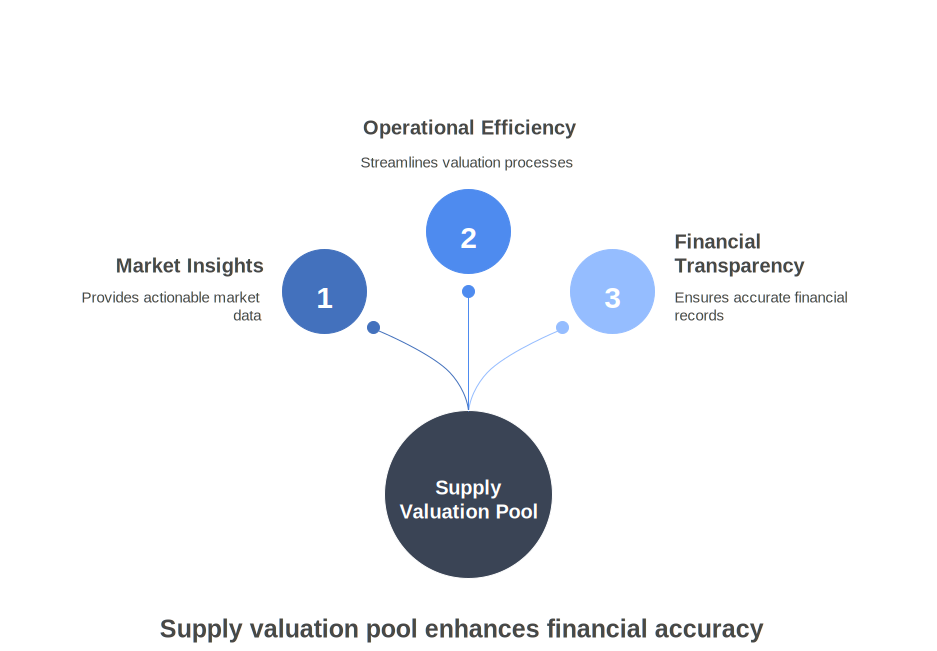
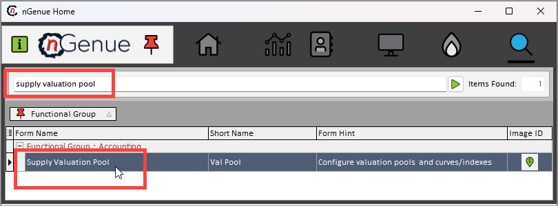
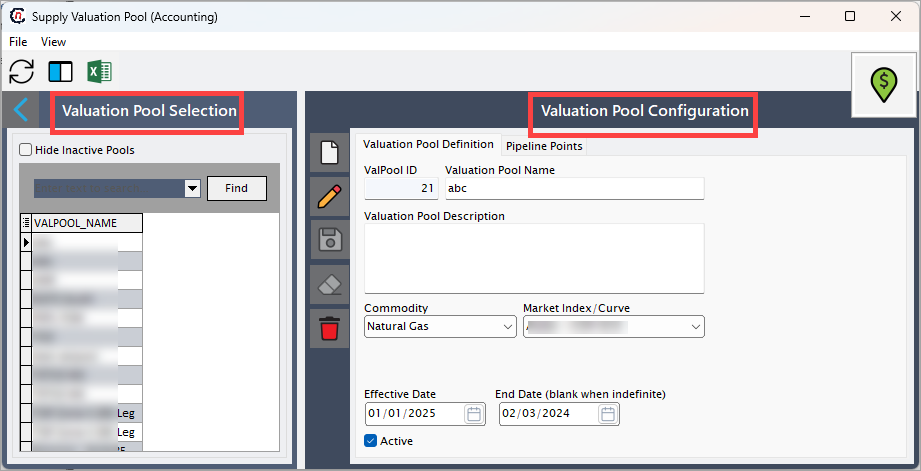
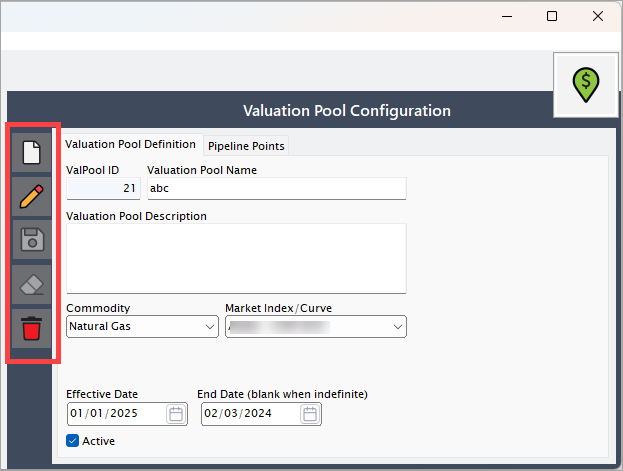
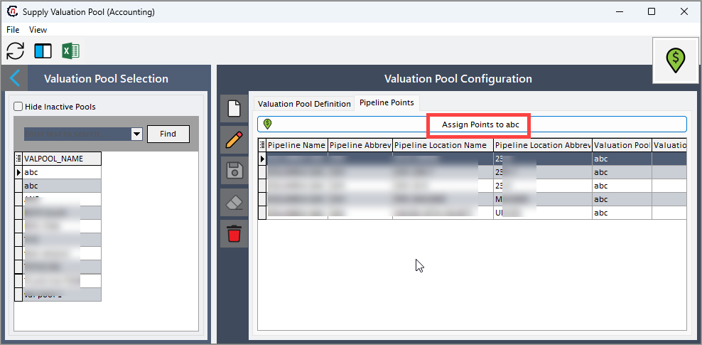
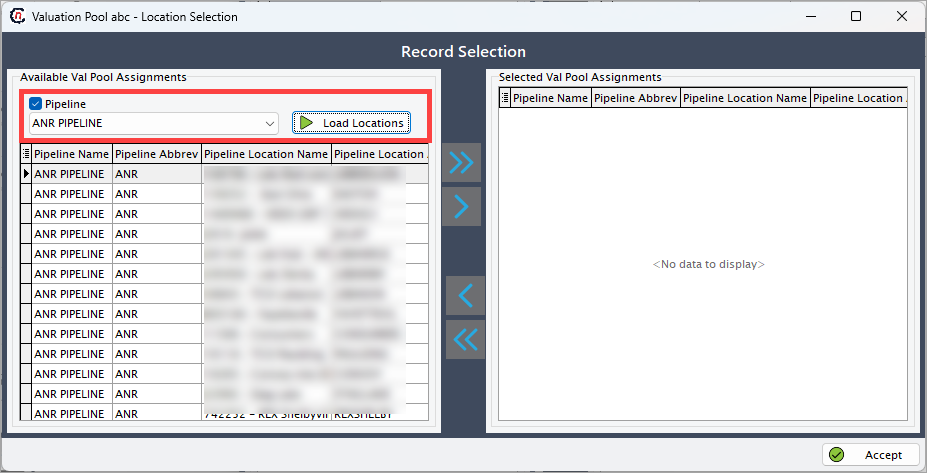
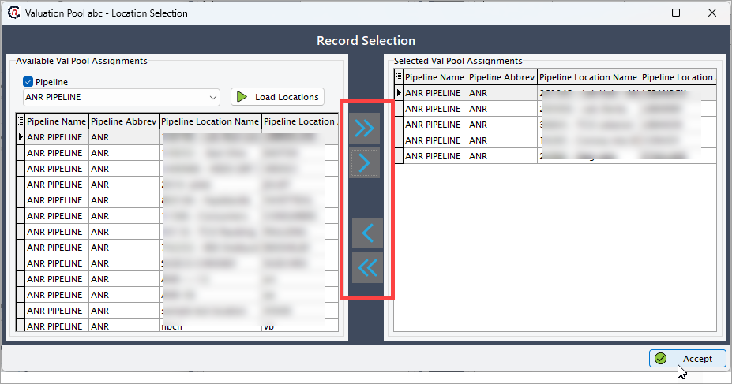

# Understanding supply valuation pool

The **supply valuation pool** simplifies the process of MTM (Mark-to-Market) valuation by providing a centralized framework for configuring and managing market indices or curves. MTM ensures that asset and liability values are updated to reflect current market conditions, maintaining the accuracy of financial records.

This module streamlines the management of valuation data, allowing users to efficiently define, organize, and adjust valuation pools. By using this system, businesses can gain actionable insights into market values, enhance operational efficiency, and ensure financial transparency.

---

<!-- ## Procedure to configure supply valuation pool

Configuring a supply valuation pool involves accessing the configuration screen, creating categories for better organization, and managing key details such as valuation definitions and pipeline points.

### Prerequisites

* You must have the permissions to _add_ or _update_ the **Supply valuation pool** screen.

### Process steps

#### Step 1: Navigate to Internal supply valuation pool screen

1. Log in to the **nGenue** application.
2. Click on the **Search** icon and type _Supply valuation pool_ in the search bar.
3. Double-click **Supply valuation pool** in the search results to open the **Supply valuation pool** screen.

4. The next screen has two main sections: **Valuation pool selection** and **Valuation pool configuration**.

    1. **Valuation pool selection:** Displays a list of existing valuation pools.
    2. **Valuation pool configuration:** Shows the details of the selected pool, allowing you to add, update, or edit configurations. The table below describes the available icons and their functions:
    

        | Icons      | Description                          |
        | ----------- | ------------------------------------ |
        |         | Add a new record |
        |     | Edit the record detail. |
        |         |  Save the record. |
        |   | Cancel the updates being made to the record. |
        |   | Delete a record. |

#### Step 2: Configure a valuation pool

1. Open the **Valuation pool configuration** screen and click on the **Add** button.
2. Enter the following details under the **Valuation pool definition** tab:

    |Fields | Description | Data type | Mandatory (Y/N) | Fetched from (UI screen) | Displayed on (UI screen) |
    |---|---|---|---|---|---|
    | Val pool Id | An auto-generated identifier assigned when the valuation pool configuration is saved. | Auto-generated | Y | Auto-generated | N/A |
    | Valuation pool name | A user-defined name to describe the valuation pool. | String | Y | User input | Pipeline location |
    | Description | Optional field for providing additional context or details about the valuation pool. | String | N | User input | N/A |
    | Commodity | The specific commodity associated with the valuation pool, selected from a predefined dropdown list. | Dropdown | Y | Commodities screen | N/A |
    | Market index/curve | A dropdown list allowing selection of the applicable market index or curve for valuation. | Dropdown | Y | Index curve definition screen | MTM screen |
    | Effective date | The date when the valuation pool becomes active. | Date | Y | User input | N/A |
    | End date | The expiration date for the valuation pool; can be left blank if the pool is to remain active indefinitely. | Date | N | User input | N/A |

#### Step 3: Configure pipeline points

1. Go to the **Pipeline points** tab and click on the **Assign points to** button.
  
2. Enable the **Pipeline** checkbox and select the pipeline from the dropdown.
3. Click **Load location** to display the available locations.
  
4. Add locations by:
    * Click on the **forward arrow** (**>>**) key to include all locations.
    * Click on the **forward arrow** (**>**) key to include selected locations.
5. Remove locations using the **backward arrows** (**<< or <**) if necessary.
6. Click **Accept** to save your changes.
  
7. The system will display the assigned valuation pool under the **Valuation pool** section on the **Location** screen. -->