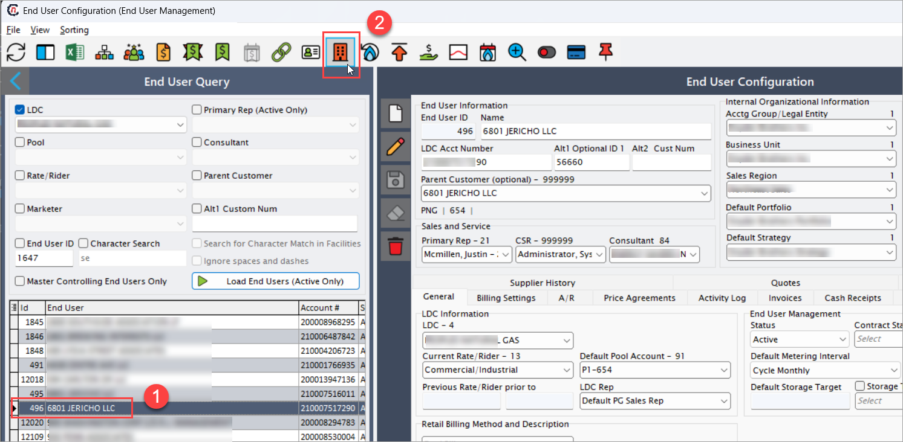
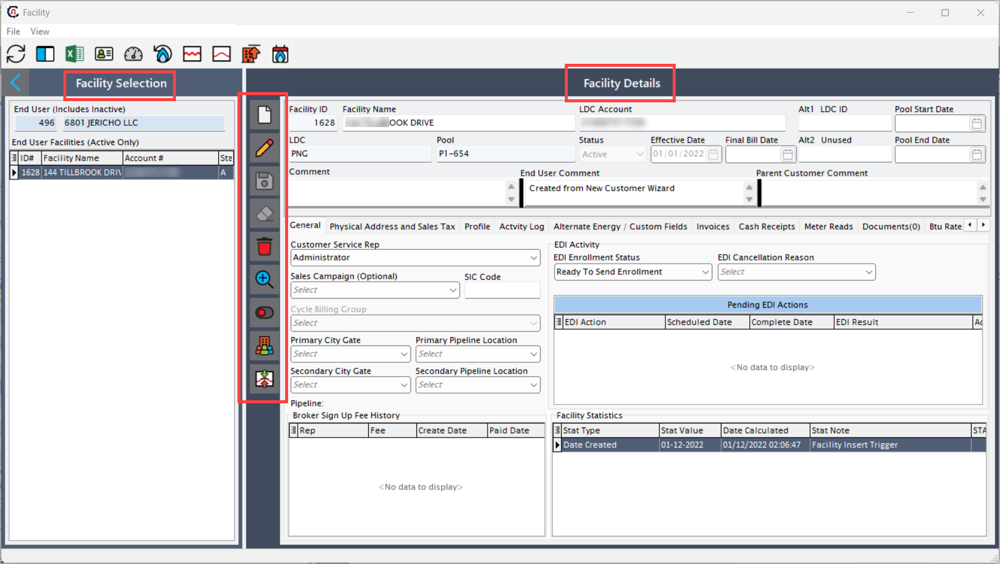
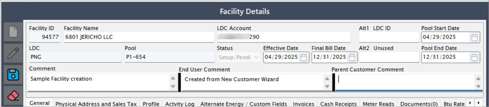
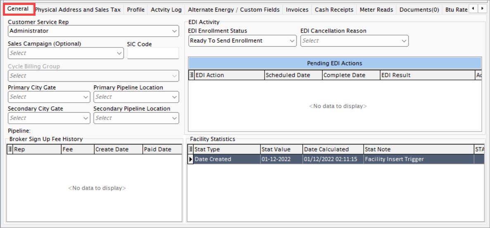
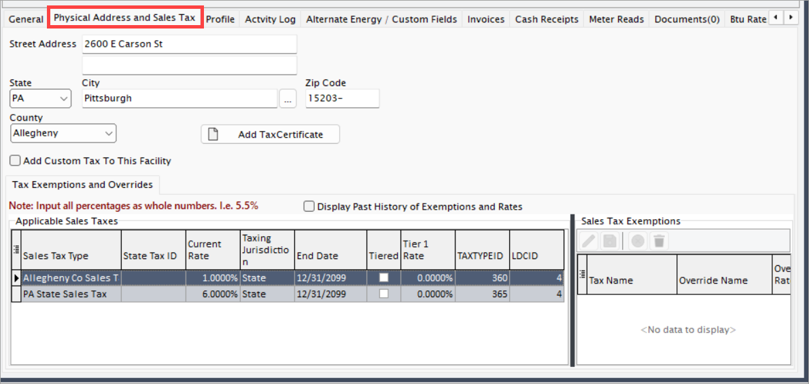
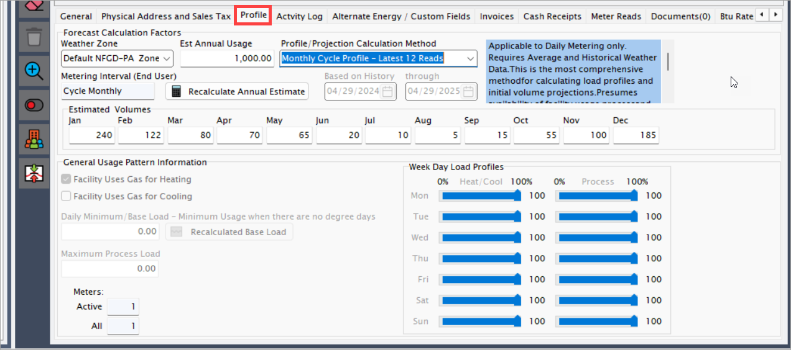
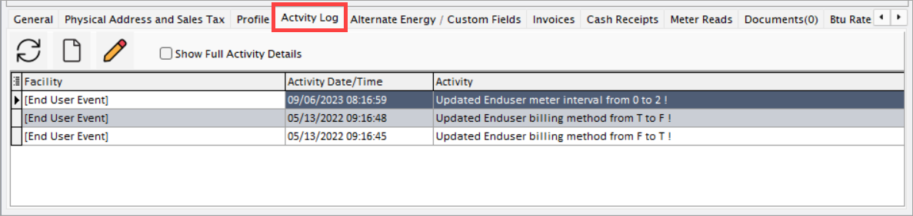
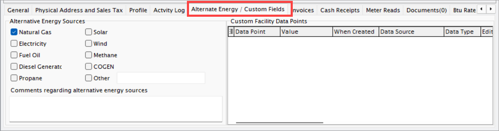
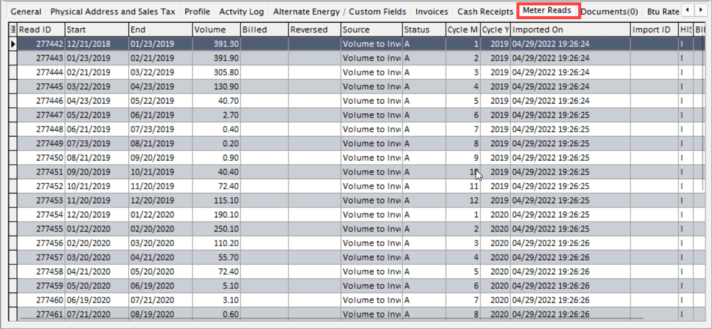

# Add facility to an end user

This document provides a step-by-step procedure to configure a facility in the nGenue application. A facility must be configured accurately to ensure proper gas flow tracking, metering, billing, and compliance.

## Prerequisites

Before configuring a facility, ensure the following prerequisites are met:

- You have the appropriate user access permissions to create or edit facility configurations.
- All related entities (such as LDCs, pool, and end users) have been configured in the nGenue application.

## Navigate to the Facility screen

1. In the **End user configuration** screen, select a user you would like to add a facility to.
2. Click on the **Facilities** icon available in the top header of the page. This will take you to the **Facility** screen.
   
3. The **Facility** screen is divided into two main sections: **Facility selection** and **Facility details.**
   
   
    #### Facility selection 

    1. This section displays a list of facilities configured for an end users. 
    2. You can quickly browse through the list and select a facility to view or modify its configuration.

    #### Facility details

    When you select a facility from the **Facility selection** section, its detailed configuration is displayed in this section. On this panel, you can view, update, or fine-tune the settings of the selected facility. The table below describes the available icons and their functions:

      | Icons      | Description                          |
      | ----------- | ------------------------------------ |
      |         | Add a new facility record |
      |     | Edit the facility record detail. |
      |         |  Save the facility record. |
      |   | Cancel the updates being made to the facility record. |
      |   | Delete a facility record. |
      |   | [Validate facility is ready to activate](validate_facility.md) |
      |   | [Change facility status](transfer_facility.md) |
      |   | [Transfer facility to another end user](transfer_facility.md) |
      |   | Adjust load profile incrementally |

### Add a new facility record

1. Click on **Add a facilty record** icon from the **Facility** screen.
2. Enter a facility name. This will be the name of the customer facility (e.g., a hospital, a commercial site). Identifies the facility for billing, reporting, and operational activities.

2. Fill in the below details:
    1. **LDC account:** LDC assigned account number for the facility. This is *auto-generated*, however if there is any change in the LDC account number, you can modify it. It links the facility to its utility account for billing and service management.
    2. **Alt1 LDC ID:** Alternate LDC identifier, if applicable. This provides an additional reference ID for facilities that have multiple identifiers.
    3. **Pool:** Designated pool that the facility belongs to. Organizes facilities into groups for scheduling, nomination, and balancing purposes.
    4. **Pool start date:** The effective start date for the facility's participation in the assigned pool. Defines when the facility becomes active under the assigned pool.
    5. **Pool end date:** The effective end date for pool participation, if applicable. This marks when the facility stops participating in a particular pool.
    6. **LDC:** The LDC (Local Distribution Company) that provides gas service to the facility. This is essential for determining delivery requirements and service options.
    7. **PNG:** Utility-specific field; possibly relates to the pipeline nomination group or other internal reference. It is used for advanced operational tracking.
    8. **Comment:** Free text area for general notes related to the facility. It helps internal users store additional information about the facility.
    9. **End user comment:** Free text comment area specific to end-user notes or special instructions. It enables documentation of customer-specific requirements or notes.
    

3. Configure other details that are available in different tabs under the Facility details panel.

#### General tab

The **General** tab provides a broad overview of key operational, billing, service, and system tracking information about the facility. It captures critical facility-specific data, links to customer service teams, billing cycles, pipeline delivery points, and EDI statuses. The information entered here forms the foundation for how the facility interacts with internal systems and external partners.

| Field | Description | Importance |
|------|-------------|------------|
| Parent customer comment | Free text field to capture comments inherited or associated with the parent customer. | Ensures important customer-wide notes are available at the facility level. |
| Customer service rep - Service | Dropdown to select the service category or customer service representative (CSR) assigned to the facility. | Manages internal CSR assignments for customer support and follow-up. |
| Sales campaign (optional) | Dropdown to associate the facility with a specific sales campaign, if applicable. | Tracks marketing and campaign effectiveness at the facility level. |
| SIC code | Standard industrial classification code representing the type of business at the facility. | Helps classify customers by industry for reporting and analysis. |
| Cycle billing group | Dropdown (currently disabled in screenshot) to associate the facility with a billing cycle group. | Defines how and when billing occurs if enabled. |
| Primary city gate | Primary delivery point (city gate) from the pipeline to the utility for this facility. | Critical for nomination, delivery, and balancing operations. |
| Primary pipeline location | Primary pipeline meter location for this facility. | Used for tracking delivery and usage. |
| Secondary city gate | Secondary or backup delivery point, if applicable. | Provides a fallback or secondary supply point. |
| Secondary pipeline location | Secondary pipeline meter location for the facility. | Allows for flexible operational and nomination setups. |
| EDI activity – EDI enrollment status | Dropdown to indicate the facility’s enrollment status in EDI (Electronic Data Interchange) processes. | Critical for automated data exchanges between nGenue, LDCs, and other third parties. |
| EDI activity – EDI cancellation reason | Dropdown to select a reason when EDI enrollment is canceled. | Ensures proper tracking and documentation of EDI changes. |
| Pipeline - Broker sign-up fee history | Table showing the history of broker sign-up fees with columns: Rep, Fee, Create Date, Paid Date. | Tracks historical fee data for brokers associated with the facility. |
| Pending EDI actions | Table showing scheduled EDI actions including EDI action, scheduled date, complete date, and result. | Tracks pending or upcoming automated EDI transactions. |
| Facility statistics – Stat type | Type of statistic recorded (e.g., Date created). | Useful for audit and operational tracking. |
| Facility statistics – Stat value | Actual value of the statistic (e.g., the specific date or amount). | Provides measurable data for tracking facility lifecycle events. |
| Facility statistics – Date calculated | Date and time the statistic was recorded or calculated. | Ensures accurate tracking of when data points were captured. |
| Facility statistics – Stat note | Additional notes about the statistic. | Provides context or clarification for the recorded statistic. |

#### Physical address and sales tax tab

The **Physical address and sales tax** tab captures detailed location information for the facility and manages the facility's sales tax obligations. It enables accurate billing, jurisdiction assignment, and regulatory compliance by maintaining updated address details, tax certificates, and applicable tax rates and exemptions.

| Field | Description | Importance |
|------|-------------|------------|
| Street address | The street address where the facility is physically located. | Required for service, billing, and tax jurisdiction determination. |
| State | Dropdown to select the U.S. state where the facility is located. | Essential for applying the correct tax rates and regulatory rules. |
| City | City name where the facility is located. | Used for tax jurisdiction and address validation. |
| Zip code | Postal ZIP code for the facility's physical location. | Critical for proper tax calculation, service eligibility, and delivery logistics. |
| County | Dropdown to select the county where the facility is located. | Further refines tax jurisdiction and regional reporting requirements. |
| Add tax certificate | Button to upload or attach a tax exemption certificate. | Supports handling of tax-exempt customers and accurate billing. |
| Add custom tax to this facility | Checkbox to enable adding a custom tax configuration specific to this facility. | Provides flexibility to handle facility-specific tax scenarios not covered by standard tax rules. |
| Tax exemptions and overrides - Display past history of exemptions and rates | Checkbox to show the historical changes in tax exemptions and rates applied to the facility. | Useful for auditing and historical tracking of tax changes. |
| Tax exemptions and overrides - Applicable sales taxes (table) | Table listing the sales taxes that apply to the facility, including: <ul><li>Sales Tax Type</li><li>State Tax ID</li><li>Current Rate</li><li>Taxing Jurisdiction</li><li>Start Date</li><li>End Date</li></ul> | Displays and manages all sales taxes currently applicable to the facility for billing and reporting purposes. |
| Tax exemptions and overrides - Facility sales tax exemptions (table) | Table listing facility-specific sales tax exemptions, including: <ul><li>Tax Name</li><li>Override Name</li><li>Override Rate</li><li>Marketer Exemption</li><li>LDC Exemption</li><li>Start Date</li><li>End Date</li></ul> | Allows defining exemption rules where facility sales are exempt from standard taxes. |

#### Profile tab

The **Profile** tab is used to define and manage a facility's gas usage profile and related forecasting parameters. It stores key attributes such as estimated annual usage, load distribution patterns, and daily base loads. This tab ensures accurate usage prediction, billing calculations, and nomination planning, especially critical for balancing supply and demand.

| Field | Description | Importance |
|------|-------------|------------|
| Weather zone | Dropdown to select the geographic weather zone where the facility is located. | Used for forecasting gas usage based on regional temperature patterns and seasonal variations. |
| Est annual usage | Displays the estimated annual gas consumption for the facility (editable under certain conditions). | Key for forecasting, contracting, and load planning purposes. |
| Profile/projection calculation method | Dropdown to select the method used to project future gas usage: <ul><li><b>Monthly Cycle Profile – Latest 12 Reads</b>: Uses the last 12 months of actual cycle reads for projection.</li><li>Other methods if available based on system configuration.</li></ul> | Determines how usage estimates are generated for billing, nominations, and reporting. |
| Metering interval (end user) | Dropdown to set how often meter readings are taken (e.g., monthly). | Critical for accurate billing cycles and usage tracking. |
| Recalculate annual estimate | Button to trigger recalculation of the annual usage estimate based on updated factors. | Ensures usage estimates stay accurate if weather zones, metering intervals, or other conditions change. |
| Based on history through [Date] | Date range end for historical usage data considered for profile calculations. | Defines the historical window used in annual projections. |
| Estimated volumes (Jan-Dec) | Editable fields showing monthly breakdown of estimated volumes based on profile calculations. | Supports more granular forecasting and planning by month. |
| Facility uses gas for heating | Checkbox indicating if the facility uses natural gas for heating purposes. | Impacts load profiles and demand forecasting during colder months. |
| Facility uses gas for cooling | Checkbox indicating if the facility uses natural gas for cooling purposes. | Affects load profiles primarily in warmer seasons. |
| Daily minimum/base load | Field to enter or recalculate the facility's minimum daily gas usage, independent of heating/cooling demand. | Provides a baseline for load forecasting and ensures minimum contracted volumes are met. |
| Maximum process load | Field for maximum gas volume used for industrial processes. | Helps set high-demand thresholds for industrial facilities. |
| Meters – Active | Displays the number of active meters at the facility. | Important for tracking metering devices in use and ensuring billing accuracy. |
| Meters – All | Displays the total number of meters (active and inactive) assigned to the facility. | Useful for facility asset management and service planning. |
| Weekday load profiles | Sliders (0%-100%) and fields to define how the facility’s gas usage varies by day of the week and by type: <ul><li><b>Heat/Cool load</b></li><li><b>Process load</b></li></ul> | Fine-tunes the load profile for better forecasting and nomination accuracy. |

#### Activity log tab

The **Activity log** tab provides a comprehensive history of changes, updates, and actions taken against the facility record. This audit trail ensures transparency, accountability, and traceability by recording who made changes, when changes were made, and what the changes were. It is critical for auditing, troubleshooting issues, and maintaining historical accuracy for regulatory and operational purposes.

#### Alternate energy/ Custom fields tab

The **Alternate energy / custom fields** tab allows users to track additional facility energy characteristics beyond standard attributes. This tab captures information about alternative energy sources used by the facility and provides flexibility through custom data points. It helps ensure all important energy-related and facility-specific details are recorded to support billing, reporting, and operational planning.

| Field | Description | Importance |
|------|-------------|------------|
| Alternative energy sources | Multiple checkboxes to identify the types of energy sources the facility uses: <ul><li>Natural Gas</li><li>Electricity</li><li>Fuel Oil</li><li>Diesel Generator</li><li>Propane</li><li>Solar</li><li>Wind</li><li>Methane</li><li>COGEN (Combined Heat and Power)</li><li>Other (with text field to specify)</li></ul> | Important for understanding the facility’s energy mix, impacting load forecasts, billing, and reporting. |
| Comments regarding alternative energy sources | Text area to capture any additional notes about the facility's energy setup, such as special equipment, expected future changes, or backup systems. | Provides context for account managers, billing analysts, and operations teams. |
| Custom facility data points – Data point | Name of the custom field created for tracking additional facility-specific information. | Allows flexible extension of the facility record without hardcoding fields. |
| Custom facility data points – Value | Value assigned to the custom data point. | Holds the specific input or measurement related to the custom field. |
| Custom facility data points – When created | Timestamp indicating when the custom data point was added. | Useful for tracking changes over time. |
| Custom facility data points – Data source | Origin or reference for the custom data point information (e.g., user input, external system). | Assists in validating and auditing the data. |
| Custom facility data points – Data type | Specifies the type of data stored (e.g., text, numeric, date). | Ensures proper data validation and processing. |
| Custom facility data points – Edit | Allows users to modify the existing custom facility data point if needed. | Supports keeping facility records accurate and updated. |

#### Invoices tab

The **Invoices** tab displays the billing history and invoice records associated with the facility. It provides detailed information on billed amounts, invoice dates, payment due dates, and statuses. This tab is essential for financial reconciliation, customer inquiries, dispute resolution, and tracking outstanding balances over time.

#### Cash receipts tab

The **Cash receipts** tab records all payments received from the customer against invoices. It provides a breakdown of receipt dates, payment amounts, methods of payment, and the invoices to which they were applied. This tab is vital for ensuring accurate financial accounting, managing customer account balances, and improving cash flow visibility.

#### Meter reads tab

The **Meter reads** tab allows users to view, add, and manage historical and current meter reading data for the facility. Accurate meter reads are critical for billing gas consumption correctly and for load forecasting. This tab ensures timely capture of usage information and supports validation of customer invoices.

#### Documents tab

The **Documents** tab stores electronic documents related to the facility, such as contracts, signed agreements, tax certificates, correspondence, and reports. Centralizing facility-specific documentation ensures quick access to critical files for audits, customer service, billing validation, and regulatory compliance.

#### BTU rates

The **BTU rates** tab allows users to manage and view the BTU (British Thermal Unit) rates applicable to a facility's pool. Each entry here corresponds to a specific BTU rate effective for a given date range.

| Field | Description | Importance |
|------|-------------|------------|
| Specific pool | Identifies the specific pool associated with the BTU rate. | Important for categorizing and applying correct BTU rates at a facility or customer level. |
| BTU start date | Date when the BTU rate becomes effective. | Essential for ensuring accurate billing based on the correct time period. |
| BTU end date | Date when the BTU rate expires or is no longer valid. | Helps manage rate updates and prevent billing errors. |
| BTU rate | The actual BTU value used for billing calculations, typically expressed as a ratio or conversion factor. | Critical for energy billing, consumption reporting, and cost estimation. |
| Date updated | Timestamp of the last update made to the BTU rate entry. | Provides an audit trail for changes and ensures data currency. |
| LDCID | Unique identifier for the local distribution company (LDC) associated with the BTU rate. | Important for mapping the facility to the correct LDC in system operations. |
| LDC_POOLIT | Internal reference ID linking to the LDC's pool information. | Supports backend system processing and validation. |
| LDC_BTU_R | Reference code or identifier for the BTU rate record related to the LDC. | Helps distinguish between multiple BTU rates tied to different pools or setups. |
| FACILITY_ID | Unique identifier for the facility the BTU rate applies to. | Ensures the correct BTU rate is applied to the right facility for billing and reporting. |

#### Fuel % rates

The **Fuel % rates** tab is used to record and maintain fuel percentage rates applicable to a facility. Fuel rates are typically used to allocate a share of the transportation fuel consumed during the delivery of natural gas. Tracking fuel rates separately ensures precision in billing and provides transparency when allocating fuel-related costs.

## Conclusion

Configuring a facility accurately is essential to the smooth operation of the gas distribution system. It ensures traceability, compliance, and efficiency across all operational and commercial processes. Always keep documentation and configurations in sync to reflect real-world changes.

---
