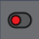
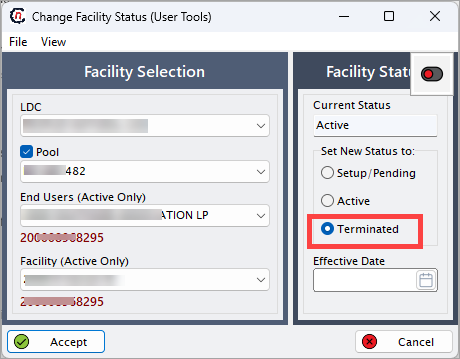

# Cancel a facility

Canceling a facility means changing its status from active to a non-operational state, such as setup/pending or terminated. This is typically required when a facility no longer receives natural gas service, has been decommissioned, or was added by mistake.

## Why cancel a facility?

A facility may need to be canceled in the following scenarios:

* The business operating at the facility has shut down permanently.
* The end user has relocated, and the facility is no longer in use.
* The facility was created during setup but never went live.
* Service has been transferred to another end user or consolidated with another location.
* There was a data entry error, and the facility was added incorrectly.

Canceling ensures accurate records, avoids billing errors, and prevents system confusion during operations or audits.

## Use cases

1. **Scenario 1: Business closure** 
     An office building associated with a facility has been permanently closed. The end user no longer needs gas services, and the facility must be marked as terminated.

2. **Scenario 2: Transfer of service** 
     A facility has been transferred to a different end user. The original association needs to be canceled to reflect the updated ownership.

3. **Scenario 3: Setup error** 
     A facility was accidentally added twice or assigned to the wrong LDC during onboarding. It should be set to setup/pending or removed altogether.

## How to cancel a facility

This guide explains how to cancel a facility in the nGenue application.

### Prerequisites

Before canceling a facility:

* Verify that the facility is in active status.
* Ensure no open transactions, pending charges, or linked services exist.
* Confirm that canceling the facility is the correct step (consult your supervisor if needed).
* Make sure you have the correct permissions in the system to perform this action.

### Steps to cancel a facility

1. In the **End user configuration** screen, select an end user for which you have added a facility.
2. Click on the **Facilities** icon available in the top header of the page. This will take you to the **Facility** screen.
3. For more than one facility configured for an end user, make sure you select the right facility from the **Facility selection** screen.
4. Click on the  icon to cancel the facility.
5. View the current status of the facility in the **Facility status** panel.
6. Set the new status to **Terminated.**
8. Enter the effective date when the facility should get terminated or move in active stage.
9. Click **Accept.**

    

## What happens after cancelation?

1. The facility is removed from active listings.
1. It is no longer eligible for transactions or billing.
1. Historical data remains accessible for audits and reporting.
1. A canceled facility cannot be reactivated directly; it would need to be reconfigured if required in the future.

---
