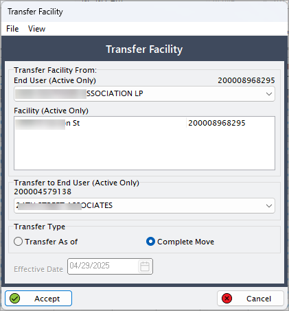

# Transfer a facility to end user

In the natural gas industry, a **facility** refers to a specific location or site—like a factory, commercial building, or residential complex—where natural gas is delivered and consumed. Each facility is typically linked to an **end user**, which is the customer or entity responsible for using the gas, receiving bills, and managing related transactions.

Transferring a facility to another end user becomes necessary when the person or organization using that location **changes**. This ensures that the right party is legally and financially responsible for all future gas-related activities at the facility.

## Common scenarios that require a facility transfer

1. **Change of ownership** 
     If a business or property is sold, the original owner (End User A) no longer manages the site. The new owner (End User B) needs to take over the gas service. Transferring the facility updates the records to reflect this change.
     
    !!!note "Example"
        A warehouse is sold to another company. The facility linked to the old owner must now be associated with the new owner.

2. **Tenant move-out / Move-in** 
     In commercia or multi-unit residential properties, tenants may change frequently. When a tenant moves out, and a new one moves in, the facility needs to be reassigned to the new tenant's account to ensure correct billing.

    !!!note "Example"
        A restaurant in a shopping plaza moves out, and another opens in the same spot. The facility is reassigned to the new restaurant's end user account.

3. **Business reorganization or internal transfer** 
     Sometimes, large companies restructure and shift operational control of facilities from one department or entity to another. Even if the parent company remains the same, the system needs to reflect the change in responsible party.

    !!!note "Example"
        A company splits its logistics and manufacturing divisions. A facility is transferred from one internal end user account to another.

4. **Customer switching gas suppliers** 
If an end user changes their supplier or contract model, the facility may need to be reassigned under a new account or business agreement.

    !!!note "Example"
        A customer moves from a fixed-rate to a market-based contract with a different supplier, and the facility must reflect the new relationship.

## Why it matters

* **Accurate billing**: Ensures that the right entity is billed for gas usage at the correct location.
* **Legal accountability**: Shifts legal and contractual obligations from the old end user to the new one.
* **Operational clarity**: Keeps records clean and prevents confusion during audits, reporting, or dispute resolution.
* **Regulatory compliance**: Helps utilities and local distribution companies meet compliance requirements for customer data accuracy.

## What happens if you don’t transfer the facility?

If a facility is not transferred when needed:

* The old customer may continue receiving and being liable for bills.
* The new customer might not get service or billing notices.
* System reports and contracts will be inaccurate.
* Legal and financial disputes may arise.

In short, **transferring a facility to the correct end user is essential** for maintaining a clean, fair, and functional natural gas delivery and billing system.

## Steps to transfer a facility to another end user

This guide explains how to transfer a facility from one end user to another in the nGenue application.

### Prerequisites

Before transferring a facility, ensure the following conditions are met:

* The **current end user** associated with the facility is active.
* The **new end user** is already set up in the system.
* The facility is not in an **active transaction cycle** (e.g., nomination, billing).
* All **outstanding bills or obligations** for the existing end user are cleared or accounted for.
* Administrative approvals (if applicable) are in place.

### Steps to transfer a facility

1. In the **End user configuration** screen, select an end user for which you have added a facility.
2. Click on the **Facilities** icon available in the top header of the page. This will take you to the **Facility** screen.
3. For more than one facility configured for an end user, make sure you select the right facility from the **Facility selection** screen.
4. Click on the  icon to transfer the facility.
5. In the **Transfer facility** screen, do the following:
    
     5. Search for and select the *active* end user who currently owns the facility.
     6. Search for and select the *active* target end user who will receive the facility.
     7. Choose the **Transfer type.** Select either:
        1. **Transfer as of:** To specify a date-based transfer.
        2. **Complete move:** If all related services are moving with the facility.

8. Enter the effective date when the transfer should take effect.
9. Click **Accept.**

---