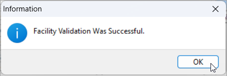

# Validate a facility

Validating that a facility is ready to be activated before actually activating it is critical in the natural gas industry to ensure safety, accuracy, and smooth operations.

## Why validate a facility before activation?

Imagine turning on a gas connection at your home. You wouldn't just flip the switch without checking if the pipe is installed properly, the meter is working, or the system is safe—right? The same principle applies at a much bigger scale in the natural gas industry.

1. **Ensure all required information is complete**  
     Before a facility can go live, we must make sure that:
     1. The address, meter number, and other basic details are correctly entered.
     1. The facility is linked to the right end user and contract.
     1. It's associated with the right LDC (Local Distribution Company) and pipeline path.

     If any of this is missing, the facility may be billed incorrectly or gas might not flow as expected.

2. **Prevent safety risks**  
     Natural gas is a powerful and potentially dangerous energy source. If a facility is activated before all safety checks are complete, it could result in:
     1. Leaks or explosions
     2. Service disruptions
     3. Serious damage or injury

     Validating the facility ensures that all physical infrastructure is in place and tested.

3. **Avoid costly mistakes**  
     If a facility is activated without validation:

     1. It might start receiving gas without a valid rate or contract
     2. It could be billed incorrectly or cause system imbalances
     3. Legal or regulatory violations might occur

     This can lead to financial losses for both the utility company and the customer.

4. **Check system readiness**  
     Validation helps verify:

     1. The facility can be scheduled in the system
     2. It has all required configurations (like rate codes, meters, service dates)
     3. It’s technically ready to participate in the supply and delivery chain

     Think of it like running a pre-flight check before takeoff.

## How to validate a facility

1. In the **End user configuration** screen, select an end user for which you have added a facility.
2. Click on the **Facilities** icon available in the top header of the page. This will take you to the **Facility** screen.
3. For more than one facility configured for an end user, make sure you select the right facility from the **Facility selection** screen.
4. Click on the  icon to validate the facility.
5. Upon successful validation, a popup appears stating the facility is successfully validated.
    

---    

