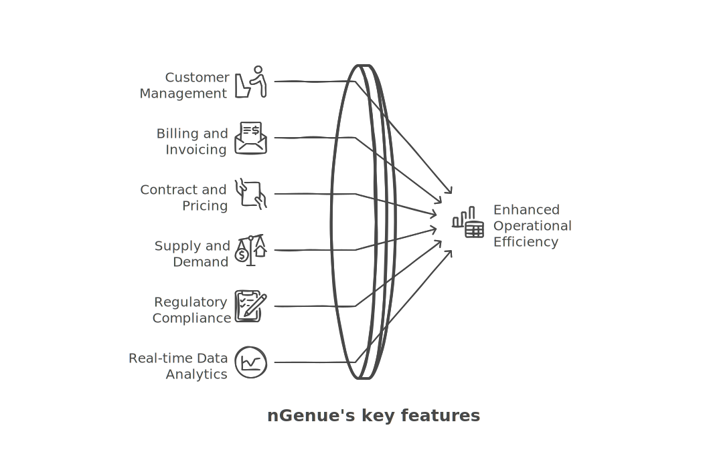

---
hide:
 - toc
---

# Key features and benefits of nGenue

Below are the key features of nGenue:

- **Customer management**  
   nGenue offers a centralized customer relationship management (CRM) module, enabling businesses to track customer data, manage accounts, and ensure personalized service. It also helps with contract management and customer communication.

2. **Billing and invoicing**  
   Automate billing processes and generate accurate invoices based on consumption, contracts, and tariffs. nGenue simplifies complex billing scenarios for both residential and commercial customers.

3. **Contract and pricing management**  
   nGenue’s contract management tools allow users to manage contract terms, renewals, and pricing models. The dynamic pricing engine supports multiple rate structures, ensuring that pricing is always accurate and competitive.

4. **Supply and demand forecasting**  
   Accurately predict demand using historical data and advanced forecasting algorithms, ensuring businesses can manage their supply chain efficiently and avoid costly imbalances.

5. **Regulatory compliance**  
   The platform helps organizations stay compliant with industry regulations by automating reporting and managing compliance requirements, reducing the risk of fines and penalties.

6. **Real-time data and analytics**  
   Leverage real-time data and built-in analytics to gain insights into business performance. nGenue’s dashboards provide actionable intelligence for decision-making and strategy development.

7. **Integration with utility systems**  
   Seamlessly integrate with utility data systems, enabling the secure exchange of information related to meter reads, customer data, and payment records.

## Benefits of using nGenue

- **Industry-specific functionality**: nGenue is tailored for the natural gas industry, offering features and workflows designed to meet the unique needs of gas marketers and utilities.
  
- **Increased efficiency**: By automating time-consuming processes such as billing, invoicing, and customer management, nGenue reduces manual work and improves operational efficiency.
  
- **Improved accuracy**: nGenue ensures accurate billing and pricing, eliminating human errors and ensuring customer satisfaction.
  
- **Scalability**: Whether you are a small marketer or a large utility, nGenue is designed to grow with your business, offering flexibility to meet evolving needs.

- **Data-driven decision making**: With powerful analytics and reporting tools, nGenue provides actionable insights that help businesses make informed decisions and drive growth.

- **Regulatory compliance**: Stay on top of industry regulations with nGenue’s compliance tools, minimizing the risk of penalties and improving audit readiness.

By leveraging nGenue, natural gas companies can streamline their operations, enhance customer service, and achieve long-term success in a competitive market.

---