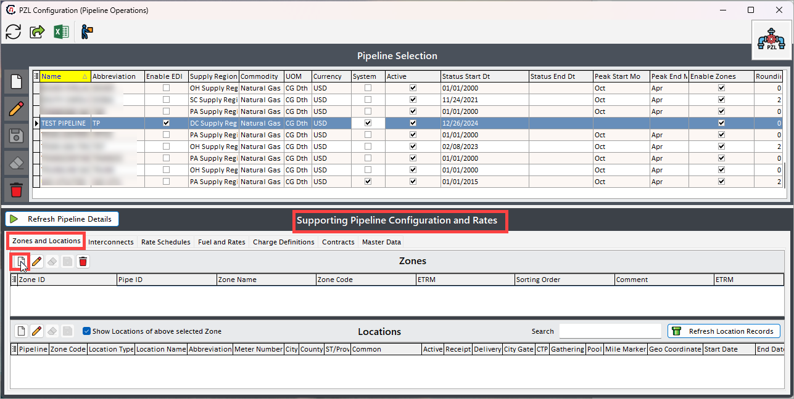
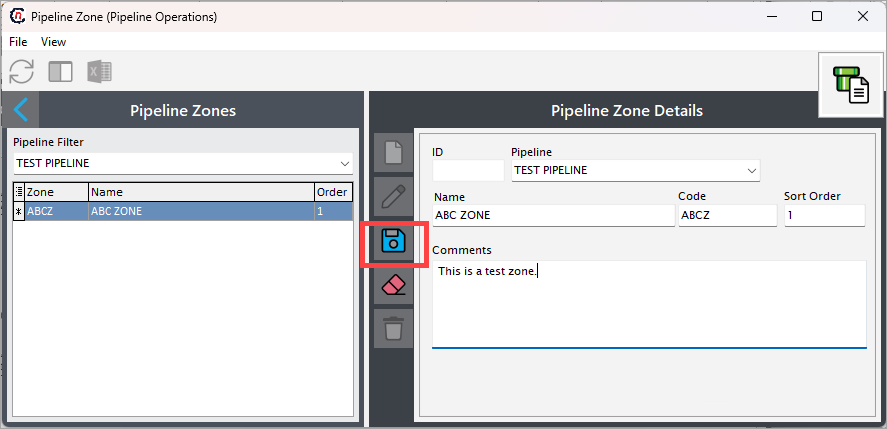

# Configure pipeline, zone, and location

Configuring a pipeline is a foundational step in managing the flow of natural gas across zones, locations, ensuring accurate scheduling, nominations, and billing processes. The pipeline configuration process involves defining the pipeline’s attributes, operational zones, and associated locations, such as points, interconnects, and citygates. Proper pipeline configuration is critical to ensuring the smooth operation of the natural gas supply chain within nGenue.

## Prerequisites

1. You must have the necessary permissions to add or modify **PZL configuration** screen settings.
2. A [supply region](./configure_supply_region.md) must already be configured in nGenue.

## Process steps

### Step 1: Navigate to PZL configuration screen

1.	Log in to the **nGenue** application.
2.	Click the **Search** icon and enter *PZL* in the search bar.  
3.	Double-click **PZL configuration** to open the respective screen.

4. The next screen is divided into two sections: **Pipeline selection** and **Supporting pipeline configuration and rates.**
    
    1. The **Pipeline selection** section lists existing pipelines configured where you can either edit, delete the existing pipeline records or create a new one. The table below describes the available icons and their functions:
    

        | Icons      | Description                          |
        | ----------- | ------------------------------------ |
        |         | Add a new pipeline record |
        |     | Edit the pipeline record detail. |
        |         |  Save the pipeline record. |
        |   | Cancel the updates being made to the pipeline record. |
        |   | Delete a pipeline record. |

    2. The **Supporting pipeline configuration and rates** section allows you to perform additional pipeline configurations such as create, edit, or delete pipeline zones, interconnects, rates and pipeline locations.

### Step 2: Create a new pipeline record

1. In the **PZL configuration** screen, click the **Add pipeline record** icon.
2. Fill in the details as mentioned in the table below:
    

    <!-- |Fields |Description | 
    |---|---|
    |Name | Enter the full name of the pipeline. This is a mandatory field. |
    |Abbreviation   | Enter an abbreviation for the pipeline name. For instance, if the pipeline is named **"ABC PIPELINE,"** you might use **"ABC"** as the code for easy reference.  |
    |Enable EDI | This checkbox enables EDI (Electronic Data Interchange) import when selected. |
    |[Supply region](./configure_supply_region.md) | Select a supply region from the dropdown menu. The options in this dropdown are populated based on pre-created supply regions.|
    |Commodity | Choose a commodity from the dropdown menu, such as **"Natural Gas."** |
    |UOM | Select the unit of measure (UOM) to standardize the measurement for pipeline-related transactions. |
    |Currency | Choose the currency for pipeline transactions to define the currency in which transactions will be conducted. |
    |System | This checkbox, when selected, indicates that the marketer is responsible for making nominations. |
    |Active | This checkbox indicates whether the pipeline is currently active. |
    |Status start dt. | Select the start date for the pipeline's active status from the date dropdown. |
    |Status end dt. | Choose the end date for the pipeline's active status from the date dropdown. |
    |Peak start month | Select the month when the peak season for the pipeline begins. |
    |Peak end month | Choose the month when the peak season for the pipeline concludes. |
    |Enable zone | This checkbox indicates whether the pipeline has designated zones. It is recommended to always select **"Yes" (Y)** and create a generic zone to maintain consistency across pipelines. |
    |Rounding decimal’s | Specify the number of decimal places to which the pipeline volumes should be rounded. | -->

    | Fields | Description | Data type | Mandatory (Y/N) | Fetched from (UI screen) | Displayed on (UI screen) |
    |--------|-------------|-----------|------------------|---------------------------|----------------------------|
    | Name | Enter the full name of the pipeline. | String | Y | User input | Pipeline configuration screen |
    | Abbreviation | Enter an abbreviation for the pipeline name. For instance, if the pipeline is named **"ABC PIPELINE,"** you might use **"ABC"** as the code for easy reference. | String | Y | User input | Pipeline configuration screen; displayed as **Code** field |
    | Enable EDI | Check this box to enable Electronic Data Interchange (EDI) import. This feature is currently in beta. | Checkbox | N | Pipeline configuration > EDI defaults tab; displayed as **Enable EDI partner** checkbox |
    | [Supply region](./configure_supply_region.md) ID | Select a supply region from the dropdown menu. | Dropdown | Y | Supply region screen | PZL configuration screen |
    | Commodity | Choose a commodity from the dropdown menu, such as **"Natural Gas."** | Dropdown | Y | Commodities screen | Pipeline configuration screen |
    | UOM | Select the unit of measure (UOM) to standardize the measurement for pipeline-related transactions. | Dropdown | Y | System-generated | PZL screen |
    | Currency | Choose the currency for pipeline transactions to define the currency in which transactions will be conducted. | Dropdown | Y | System-generated | Pipeline configuration > Details tab |
    | System | This checkbox, when selected, indicates that the marketer is responsible for making nominations. | Checkbox | N | Pipeline setup | Pipeline setup |
    | Active | This checkbox indicates whether the pipeline is currently active. | Checkbox | Y | Pipeline setup | Pipeline setup |
    | Status start dt. | Select the start date for the pipeline's active status from the date dropdown. | Date | Y | Pipeline setup | Pipeline setup |
    | Status end dt. | Choose the end date for the pipeline's active status from the date dropdown. | Date | N | Pipeline setup | Pipeline setup |
    | Peak start month | Select the month when the peak season for the pipeline begins. Usually the peak months starts from Novemnder. | Dropdown | N | Pipeline setup | Pipeline setup |
    | Peak end month | Choose the month when the peak season for the pipeline concludes. The peak months stays till March. | Dropdown | N | Pipeline setup | Pipeline setup |
    | Enable zone | This checkbox indicates whether the pipeline has designated zones. It is recommended to always select **"Yes" (Y)** and create a generic zone to maintain consistency across pipelines. | Checkbox | Y | Pipeline setup | Pipeline setup |
    | Rounding decimal’s | Specify the number of decimal places to which the pipeline volumes should be rounded. | Numeric | N | Pipeline setup | Pipeline setup |

3. Once the pipeline is configured and saved, the value will be displayed under the **Pipeline selection** section.

### Step 3: Create a new pipeline zone

1. In the **Supporting pipeline configuration and rates** section and under the **Zone and locations** tab, click the **Add zone record** button.

2. Enter a name for the pipeline zone being configured and a unique identifier in the **Name** and **Code** fields, respectively.
    
    !!! example "Example"

        If the pipeline zone name is **"ABC zone,"** the code could be **"ABCZ."**

3. Based on the previous selection, the **Pipeline** field will be auto-populated. If not, select the pipeline for which the zone is being configured.
4. The **Sort order** field is used to determine the display or processing order of zones in a pipeline. This field allows you to assign a numerical value to each zone, defining its priority or sequence relative to other zones. For example, if you have three pipeline zones, **Zone A** with sort order 1, **Zone B** with sort order 2, **Zone C** with sort order 3, then the zones will appear or be processed in the order: **Zone A → Zone B → Zone C.**
5. Add any additional details in the **Comments** box.
6. Click **Save.**
    
6. Once the zone is configured and saved, it will get displayed in the **Pipeline zones** and also under the **Supporting pipeline configuration and rates** section.

### Step 4: Assign pipeline locations to a zone

1. In the **Supporting pipeline configuration and rates > Locations** section, click the **Add location record** button.

2. On the next screen, give a short name of the pipeline location for easier identification in the **Nick name** field.
3. Fill in other details as per the table below:
    

    | Fields | Description | Data type | Mandatory (Y/N) | Fetched from (UI screen) | Displayed on (UI screen) |
    |--------|-------------|-----------|------------------|---------------------------|----------------------------|
    | Abbrev | Enter a short abbreviation that uniquely identifies the pipeline location. This helps in quickly referencing the location within the system and reports. | String | Y | Pipeline location setup | Pipeline location setup |
    | Meter # | Displays the meter number associated with the location, which is used for tracking natural gas flow measurements and ensuring accurate billing and auditing. | String | N | Pipeline location setup | Pipeline location setup |
    | EBB name | Enter the Electronic Bulletin Board (EBB) name, which is used in pipeline communication and nomination systems to represent this location for scheduling and confirmations. | String | N | Pipeline location setup | Pipeline location setup |
    | [Pipeline](./pipeline.md#understanding-pipeline) | Select the pipeline to which this location belongs. This links the location to a specific pipeline system in the application. | Dropdown | Y | Pipeline location setup | Pipeline location setup |
    | [Pipeline zone](./pipeline.md#understanding-pipeline-zone) | Choose the zone within the pipeline system where this location is situated. Pipeline zones are used to segment transportation areas for regulatory or operational purposes. | Dropdown | Y | Pipeline location setup | Pipeline location setup |
    | Up Down name | Specify the upstream or downstream identifier for the location, which indicates the direction of gas flow at this point on the pipeline. | String | N | Pipeline location setup | Pipeline location setup |
    | Pipeline location types | Select one of the following location types:  **Point** – a physical injection or withdrawal site.  **Pool** – location where the gas is stored before distribution.  **Citygate** – a delivery point to a Local Distribution Company.  **Interconnect** – a connection point between two pipeline systems.  **Storage** – a facility for temporarily holding natural gas.  **Gathering** – the origin point for collecting gas from wells.  **Virtual** – a non-physical point used for balancing and scheduling. | Dropdown | Y | Pipeline location setup | Pipeline location setup |
    | Pipeline Loc sub-group | Categorize the location under a subgroup for operational reporting or system segmentation. This enables more granular tracking of location roles or properties. | Dropdown | N | Pipeline location setup | Pipeline location setup |
    | LDC and LDC pool | These fields are applicable only if the pipeline location type is **Citygate**.  Select the **LDC** (Local Distribution Company) and **LDC pool** to define which distribution company and aggregation point are associated with the location. | Dropdown | N | Pipeline location setup | Pipeline location setup |
    | City | Enter or display the city in which the pipeline location is based. Useful for location-specific analytics and regulatory compliance. | String | N | Pipeline location setup | Pipeline location setup |
    | Country | Enter the name of the county (or region) in which the location resides. This may help categorize locations regionally for jurisdiction or tax reporting. | String | N | Pipeline location setup | Pipeline location setup |
    | State | Specify the U.S. state (or similar governing region) where the location exists. | Dropdown | N | Pipeline location setup | Pipeline location setup |
    | [Supply region](./configure_supply_region.md) | Select the supply region linked to this location. A supply region defines the broader geographical source or delivery area for natural gas. | Dropdown | Y | Pipeline location setup | Pipeline location setup |
    | Mile marker | Enter the mile marker value to indicate the exact point along the pipeline. It assists in spatial mapping and maintenance planning. | Numeric | N | Pipeline location setup | Pipeline location setup |
    | [Valuation pool](../etrm/configure_valuation_pools.md) | Select the valuation pool used to assign a pricing group for financial evaluation and settlement. | Dropdown | N | Pipeline location setup | Pipeline location setup |
    | By default, include in Transport agmt valuations | When checked, this location is automatically included in valuation calculations for transportation agreements. | Checkbox | N | Pipeline location setup | Pipeline location setup |
    | Active | Indicates whether the location is currently active in the system. | Checkbox| Y| User selection | General info |
    | Allow delivery | Indicates if the location is allowed for gas deliveries.| Checkbox| N| User selection| General info |
    | Allow receipt| Indicates if the location is allowed for gas receipts.| Checkbox| N| User selection| General info |
    | Commonly used| Marks the location as commonly used to prioritize or filter in user interfaces. | Checkbox| N| User selection| General info |
    | Enable forecasts | Indicates if forecasts should be enabled for this location. | Checkbox| N| User selection| General info |
    | Traded | Indicates whether trading activity occurs at this location. | Checkbox| N| User selection| General info |
    | Start date | Select the date when this pipeline location becomes active and available for use in operations or nominations. | Date | Y | Pipeline location setup | Pipeline location setup |
    | End date | Set the date when the pipeline location will become inactive or is no longer in use. | Date | N | Pipeline location setup | Pipeline location setup |
    | Market areas | Choose a market area associated with this location. The dropdown is populated from the **PZL screen > Master data > Market areas** section. Market areas are used for regional reporting and gas movement categorization. | Dropdown | N | Pipeline location setup | Pipeline location setup |
    | Operational areas | Choose the relevant operational area for this location. The dropdown values are populated from the **PZL screen > Master data > Operational areas**. Operational areas help group and manage physical or commercial zones. | Dropdown | N | Pipeline location setup | Pipeline location setup |
    | Last Updated | System-generated timestamp indicating the last time the location data was modified. Useful for audit and tracking purposes.| Date | Y| System-generated| General Info |
    | Updated by | Captures the username or ID of the person who last modified the location configuration. | String| Y| System-generated | General Info |
    | ETRM ID| External ID from the Energy Trading and Risk Management system that maps this location for integration. | String| N| User input| General Info |
    | CRM ID | Identifier used in Customer Relationship Management systems to associate pipeline locations with customer data. | String| N| User input| General Info |
    | GL ID| General ledger ID used for financial tracking and reconciliation. Helps in mapping charges or revenues to accounts.| String| N| User input| General Info |
    | Sales portal ID| ID that links this pipeline location to the sales portal for visibility in customer-facing platforms.| String| N| User input| General Info |

3. Click **Save.**

4. Once the location is configured and saved, it will get displayed in the **Pipeline location** and also under the **Supporting pipeline configuration and rates** section.

### Additional configurations

#### Interconnects

**Interconnects** are vital points in the natural gas pipeline infrastructure where multiple pipeline systems converge to transfer, exchange, or reroute gas. These connections enable seamless integration across regional or interstate networks, ensuring efficient gas transportation from producers to end-users.

!!! note "Note"
    To interconnect the pipeline, there should be two pipelines configured with zones and locations.

1. Go to the **Interconnects** tab in the **Supporting pipeline configuration and rates** section.
2. Click on the **Add pipeline interconnect record** button.

3. On the next screen, give a **name** of the interconnect.
4. Select the **pipeline** and the **pipeline locations** from the dropdown in **Location 1** and **Location 2** fields.

5. Additional checkboxes:
    1. **Interconnect allows receipts:** Select whether the interconnect location permits receiving natural gas into the pipeline system.
    2. **Interconnect allows delivery:** Select whether the interconnect location permits delivering natural gas out of the pipeline system.
    3. **Commonly used:** Indicate whether this pipeline location is frequently utilized for transactions or operations.

6. Click **Save.**
    

#### Rate schedules

The **Rate schedules** defines the rate schedules and applicable charge types for the selected pipeline. These would include both firm and interruptive services for transportation, storage, park and loan and other pipeline services. The detailed procedure to set up a rate schedule is discussed in the [define rate schedule](./rates_tariffs.md#step-2-setup-rates-schedules) section.

#### Fuel and rates

The **Fuel and rates** tab is the final step in building out the rate schedules. This tab captures the applicable charges (including in-kind fuel) that is updated each time a new rate is published by the pipeline. It allows users to input charges for various services or transactions, specify fuel rates to account for transportation losses, and applicable rates for precise settlement calculations. The detailed steps to configure fuel and rates are discussed in the [defining fuel and rates](./rates_tariffs.md#step-3-setup-fuels-and-rates) section.

#### Charge definitions

The **Charge definitions** tab lists and defines the various charges applicable to a selected pipeline. The data captured in this tab is the basis for defining how a rate schedule is applied to nominations and settlements. The details help determine when a charge is applied: seasonally, against usage, as a fixed fee, as part of storage or transport, etc.

The procedure to define a new charge definition is described in the [how to add a charge definition for a pipeline](./rates_tariffs.md#step-1-define-the-charge-definitions) section.

#### Contracts

In the **PZL configuration** screen, the **Contracts tab** is designed to maintain and manage all agreements that relate to how gas is transported, stored, or transacted through a pipeline. This is an essential area for any company dealing with the movement or sales of natural gas, as it defines the contractual framework under which gas flows are managed and commercial activities are executed.

This contracts tab is subdivided into three key sub-tabs: **Storage contracts**, **Transport agreements**, and **Counterparty contracts**. Together, they form the backbone of pipeline-related commercial operations.

These tabs serve different but interrelated purposes:

1. The **storage contracts** tab focuses on agreements with pipeline or third-party storage providers, enabling gas injection and withdrawal services across different time periods. This is useful in managing seasonal imbalances or take advantage of price fluctuations.
  
2. The **transport agreements** tab documents contracts that grant the right to move gas across a specific route within a pipeline network. These can be firm (guaranteed capacity) or interruptible (available if space permits), and they ensure that distributors or suppliers operates within contractual limits when nominating gas flows.
  
3. The **counterparty contracts** tab handles commercial agreements between your company and external trading partners, such as marketers, utilities, LDCs, or producers. These agreements govern the sale, purchase, or exchange of gas using a pipeline as a transit route, but they are independent of the pipeline operator.

Configuring each of these tabs accurately ensures that nGenue can properly validate transactions, enforce limits, apply charges, and streamline financial settlement processes.

#### Master data

In the pipeline configuration screen of nGenue, the **master data** tab plays a crucial role in defining foundational elements that support accurate modeling, operation, and reporting within the system. It provides the building blocks that other modules (like deal management, nomination, scheduling, and billing) rely on to operate correctly. 

This tab is divided into four sub-tabs: **market areas**, **operational areas**, **storage types**, and **pipeline constants**. These are not contracts or transactional data, but rather setup data that define the pipeline’s physical layout, functional categorization, and configuration logic.

These sub-tabs are essential for creating a digital twin of the pipeline’s infrastructure and market operation. Each component supports different aspects of pipeline configuration:

1. **Market areas** categorize geographic or commercial areas where gas is bought or sold.
2. **Operational areas** divide the pipeline into segments for internal scheduling and movement of gas.
3. **Storage types** define the categories or classifications of storage (e.g., firm, interruptible).
4. **Pipeline constants** configure key fixed values such as conversion factors, losses, or capacity limits.

Configuring this tab correctly ensures smoother transaction processing, correct charge calculations, and gas balancing.
