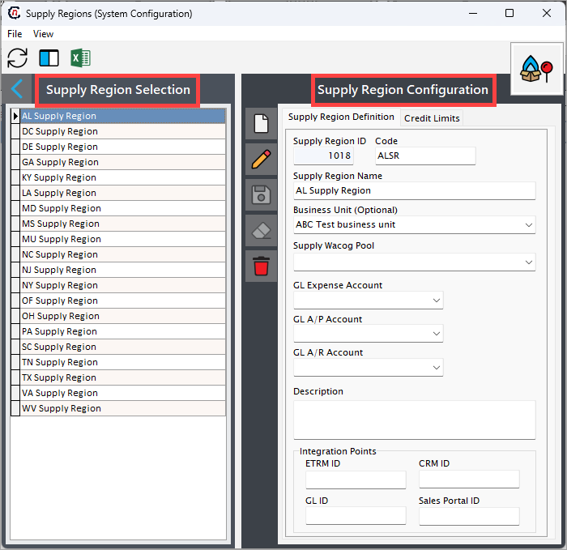
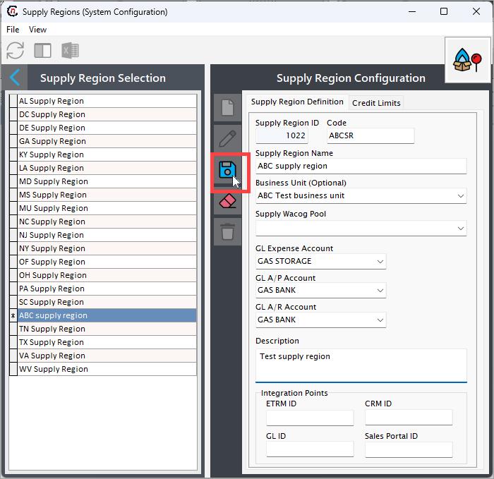

# Configure a supply region

Configuring a supply region in nGenue impacts multiple screens. Users see a dropdown menu displaying the configured supply regions, which allows them to select a specific region from the dropdown.

In some cases, like creating deal or configuring a new pipeline, a supply region is required. Therefore, at least one supply region should exist.

The configuration process for the supply region captures key information about the defined supply region when used for accounting, reporting, or **Weighted Average Cost of Gas (WACOG)** purposes.

## Prerequisites

To configure a supply region in ngenue, ensure the following:

1. **Required: user permission**  
     You must have the appropriate user role or permission that allows you to add or modify entries on the **Supply region** screen.
2. **Optional: link to a business unit**  
     If you want to link the supply region to a business unit, make sure the business unit is already created from the **Internal book structure** screen. You can proceed without linking a business unit immediately and choose to link one later when needed.
3. **Optional: link to a WACOG pool**  
     You can link a WACOG pool to the supply region for weighted average cost calculations. To do this, create a new WACOG pool from the **Supply WACOG pool configuration** screen.

<!-- **Prerequisites:**
Before setting up the **Supply region**, you must pre-configure the following screens:

- Internal Book Structure
- Supply WACOG Pool Configuration
- Chart of Accounts List

Make sure these are properly configured before proceeding with the Supply Region setup. -->

## Process steps

### Step 1: Navigate to the Supply region configuration screen

1.	Log in to the **nGenue** application.
2.	Click the **Search** icon and enter *supply region* in the search bar.  
3.	Double-click **Supply regions** to open the respective screen.

4. The next screen is divided into two sections: **Supply region selection** and **Supply region configurations.**
    
    1. The **Supply region selection** section lists existing supply region configurations.
    2. The **Supply region configurations** section allows you to create, edit, or delete supply region records. The table below describes the available icons and their functions:
    
        | Icons      | Description                          |
        | ----------- | ------------------------------------ |
        |         | Add a supply region record |
        |     | Edit the supply region record detail. |
        |         |  Save the supply region record. |
        |   | Cancel the updates being made to the supply region record. |
        |   | Delete a supply region record. |

### Step 2: Create a new supply region

1. In the **Supply region configurations** screen, click the **Add a supply region record** button.
2. Fill in the details as mentioned in the table below:

    | Fields | Description | Data type | Mandatory (Y/N) | Fetched from (UI screen) | Displayed on (UI screen)|
    | --- | --- |--- | --- |--- | --- |
    | Supply region Id | This field is auto-generated by the system and is created automatically when a new configuration is made | Auto-generated | Y | Auto-generated | N/A |
    | Code | A unique identifier that you can use for your supply region name.   For example: If the supply name name is **"ABC supply region,"** the code could be **"ABSR."** | Integer | Y | User input | Pipeline location |
    | Supply region name | Enter the name of the supply region that you wish to add during the configuration process. | Integer | Y | User input | Pipeline, Pipeline location, Deal creation and Deal management screen |
    | [Business unit](./configure_book_structure.md#step-3-add-a-business-unit-to-the-legal-entity) | Select the business unit that you want to link to your supply region. | Dropdown | N | Internal book structure screen | N/A |
    | Supply WACOG pool | Link a WACOG pool to the supply region for calculation.   If a supply region sources gas from multiple contracts, the WACOG pool calculates a blended rate, which becomes the reference for billing or further cost management. | Dropdown | N | Supply Wacog pool configuration screen | N/A |
    | GL Expense Account | Link the supply region’s operational expenses (e.g., transportation, storage) to the correct General Ledger (GL) account. | Dropdown | N | Chart of Accounts list screen | N/A |
    | GL A/P account and GL A/R account | Select the required account details for **GL A/P account** and **GL A/R account** respectively. These accounts are used either to track revenue generated or track payments owed to suppliers or vendors associated with the supply region. | Dropdown | N | Chart of accounts list screen | N/A |
    | Description | Provide any additional details if any. | String | N | User input | Pipeline, and deal creation screen |

    !!!note "Integration points"
        The fields in the **Integration points** section are automatically populated when third-party tools are integrated with nGenue. These fields can be skipped when entering data manually.

7. Once all mandatory fields are filled, click the **Save** button to configure the supply region.

## Conclusion

Supply regions are fundamental to the functioning of the natural gas industry, influencing production, pricing, and market dynamics. Understanding these regions helps stakeholders navigate the complexities of the natural gas market and make informed decisions regarding investments, infrastructure development, and energy policy. As the demand for natural gas continues to grow, the significance of supply regions will only increase, shaping the future of energy consumption worldwide.
