# Create a counterparty

This article outlines the step-by-step instructions for configuring a counterparty in nGenue via the **Counterparty management** module. This module is designed to create and manage counterparties within nGenue by enabling users to efficiently capture, organize, and maintain detailed information about each counterparty. Counterparties are used for various activities in nGenue, including credit, invoicing, deal entry, and more.

## Prerequisites

Before proceeding with the configuration of counterparties, you must ensure the following prerequisites are met:

* You must have the required permissions to add or modify the counterparty within the application. 
* To configure a risk limit, you must first set up the **Limit** on the **Limit type** configuration screen. This is discussed later in this article.
* Before uploading a document in the **Document** tab, you must configure the permanent storage path in the **Global settings.** This ensures that you can access and upload files from their local system successfully.
* Before configuring a document recipient on the **Counterparty contract** page, a contact must be added in the **Contacts** tab.

## Procedure

### Step 1: Navigate to the Counterparty (Supply management) screen

1.	Log in to the **nGenue** application.
2.	Click on the **Search** icon and enter *Counterparty* into the search text bar. 
    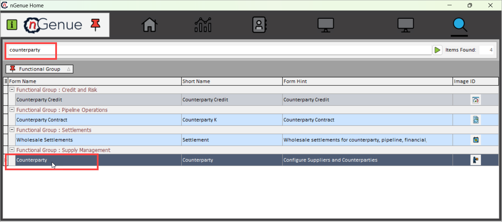
3.	Double click on **Counterparty** to open the **Counterparty (Supply management)** screen.
4.  The **Counterparty (Supply management)** screen is divided into two sections:
    1. **Counterparty selection:** This panel contains query functionality and a listing of defined counterparties.  Use the filters to display a list of defined counterparties.  Click on the result to load the counterparty and their relevant details into the **Counterparty configuration** panel.
    2. **Counterparty configuration:** Contains a static panel with identifying counterparty information at the top with a series of tabs to capture detailed information including credit, risk limits, contracts, accounting information, etc.
    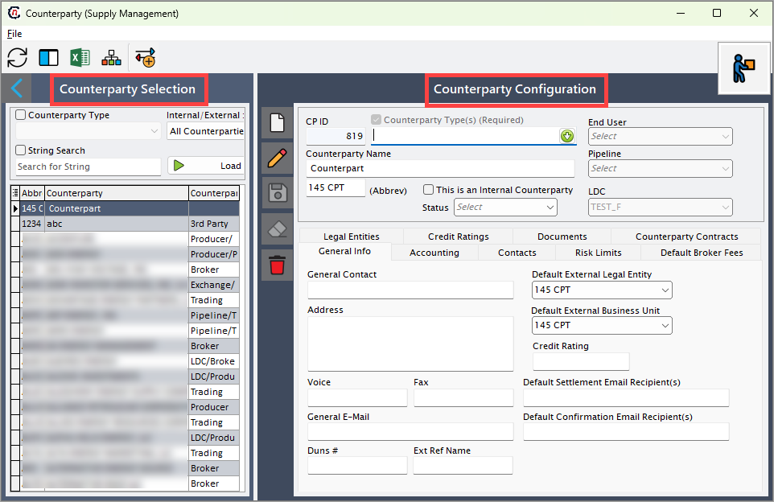
      
    The table below describes the available icons and their functions:
        
        | Icons      | Description                          |
        | ----------- | ------------------------------------ |
        |         | Add a new record |
        |     | Edit the record detail. |
        |         |  Save the record. |
        |   | Cancel the updates being made to the record. |
        |   | Delete a record. |

### Step 2: Create a new counterparty

1.	Click on the **Add a counterparty record** icon. 
2.	In the **Counterparty configuration** screen, you select the desired counterparty type from the dropdown menu. A counterparty can have multiple functions. Designations in this field may control where the counterparty is available for selection within nGenue.  Choices include:
    * Retail gas supply manager
    * Manager
    * Director energy marketing
    * Scheduler
    * LDC producer
    * Wholesale broker
    * 3rd party marketer
    * End-user
    * Exchange
    * Pipeline
    * Trading partner
        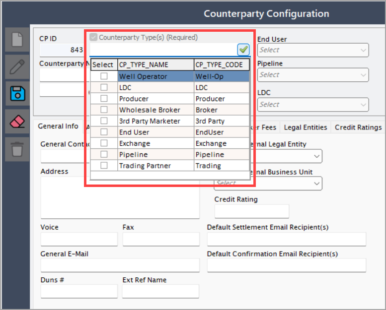

3. Enter the **Counterparty name** and add an abbreviation to it in the **(Abbrev)** field. This abbreviation is used to build a legal entity, and business unit.
4. Select the **This is an internal counterparty** checkbox if you want to designate if the counterparty is also an internal business.
5. **Status:** Includes:
    * Pending approval
    * Approved
    * Rejected
    * Inactive

6. **End user/Pipeline/LDC:** Based on the selected counterparty type, the corresponding dropdown is enabled. For example, if the user selects **End user** as the counterparty type, the **End user** dropdown will allow the user to select an end-user name.

7. To save the record, click **Save.**
    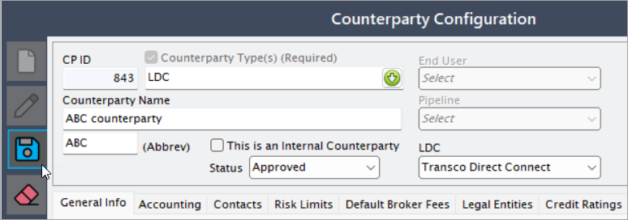

    !!! note "Note"
        The **CP ID** is an auto-generated internal ID that generates after you save the counterparty creation configuration.

8. Upon initial creation of a new counterparty, the system will automatically create a legal entity and business unit based on the provided abbreviation. The system will then ask if the counterparty contract screen should be opened to populate relevant information. If declined, you can open the **Counterparty contracts** screen at any time to update or add contracts.

### Step 3: Additional configuration tabs available on the Counterparty configuration screen

#### General info tab

This primary tab captures general information about the counterparty including legal entity, business unit and company defaults.
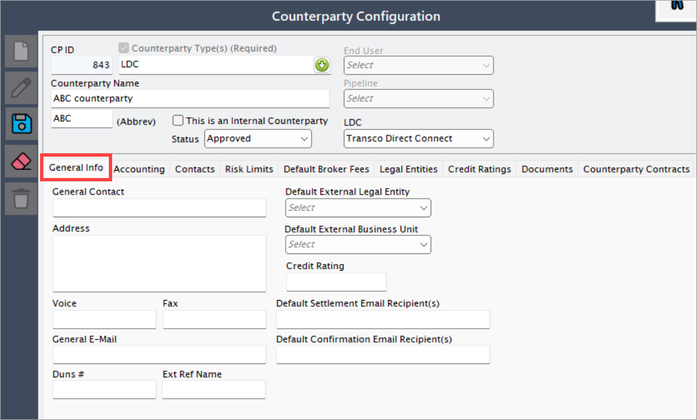

The below table lists down the various fields available on this tab with an explanation for each field:

| Fields | Description | Data type | Mandatory (Y/N) | Fetched from (UI screen) | Displayed on (UI screen) |
|--------|------------|-----------|-----------------|--------------------------|--------------------------|
| General contact | Add the name of the dedicated contact person who will be taking care of the counterparty. | String | Y | User input | TBA |
| Address | Add the full address of the counterparty, including street, city, state, and postal code. | String | N | User input | TBA |
| Voice | Add the contact number for the counterparty. | Phone number | N | User input | TBA |
| Fax | Add the fax number of the counterparty. | Phone number | N | User input | TBA |
| General e-mail | Add the email address of the counterparty. | Email | N | User input | TBA |
| Default external legal entity | When you configure a counterparty, a default external legal entity is created using the counterparty abbreviation. For example, if a counterparty with the abbreviation **"nGenueCP"** is configured, a default external legal entity named **"nGenueCP"** will be created. | Dropdown | Y | External legal entity screen | N/A |
| Default external business unit | When you configure a counterparty, a default external business unit is created using the counterparty abbreviation. For example, if a counterparty with the abbreviation **"nGenueBU"** is configured, a default external business unit named **"nGenueBU"** will be created. | Dropdown | Y | External legal entity screen | N/A |
| Default settlement email recipient(s) | Enter the default settlement email recipient(s) (if required). | Email | N | User input | TBA |
| Default confirmation email recipient(s) | Enter the default confirmation email recipient(s) (if required). | Email | N | User input | TBA |

Once the mandatory fields are entered and you click on the **Save** button, the counterparty details are saved and displayed on the left side of the current screen.

#### Accounting tab

The **Accounting** tab captures basic default accounting information for the counterparty. Most accounting information will default from the **Counterparty contract** screen.  However, this can be useful for a central repository if desired.
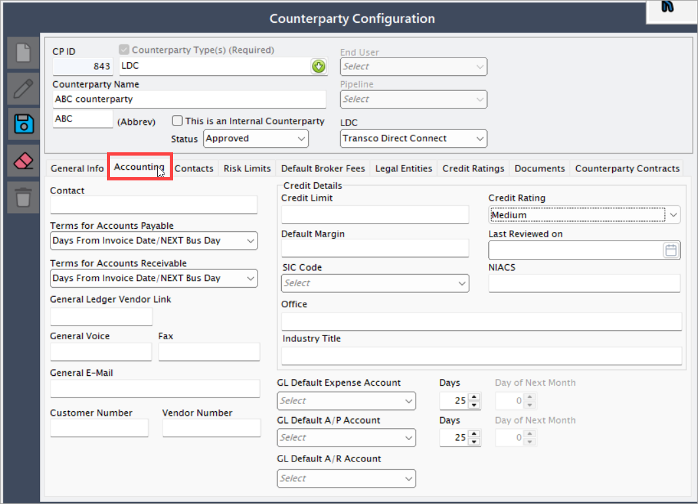

The below table lists down the various fields available on this tab with an explanation for each field:

| Fields | Description | Data type | Mandatory (Y/N) | Fetched from (UI screen) | Displayed on (UI screen) |
|--------|------------|-----------|-----------------|--------------------------|--------------------------|
| Contact | Enter the name of the contact person responsible for handling accounting-related queries. | String | N | User input | N/A |
| Credit limit | This optional field allows you to specify the maximum credit limit allocated to the counterparty. | Decimal | N | Indices/Curve values screen | N/A |
| Terms Of account payable/receivable and days | Defines the payment terms for payables and receivables, specifying when payments are due based on the selected combination. If terms are defined in the **Counterparty contract** screen, those settings will override this field. | Dropdown | N | TBA | N/A |
| General ledger vendor link | Links the counterparty to their general ledger (GL) accounting system by providing a vendor reference. | String | N | User input | N/A |
| General voice | Enter the primary contact number of the person responsible for accounting-related communications. | Phone number | N | User input | N/A |
| Fax | Enter the fax number of the person responsible for accounting-related communications. | Phone number | N | User input | N/A |
| General e-mail | Enter the email address of the person handling accounting-related communications for the counterparty. | Email | N | User input | N/A |
| GL default accounts (Expense, A/P, & A/R) | Specifies the default general ledger (GL) accounts, categorized based on the defined chart of accounts. This field is optional. | Dropdown | N | Chart of accounts | N/A |
| Customer number | An optional identifier used to map the counterparty to an external third-party system. | String | N | User input | N/A |
| Vendor number | An optional identifier used to map the counterparty to an external third-party system. | String | N | User input | N/A |

Save the configuration using the **Save** button.

#### Contacts tab

The **Contacts** tab is a listing of defined contacts for the counterparty.
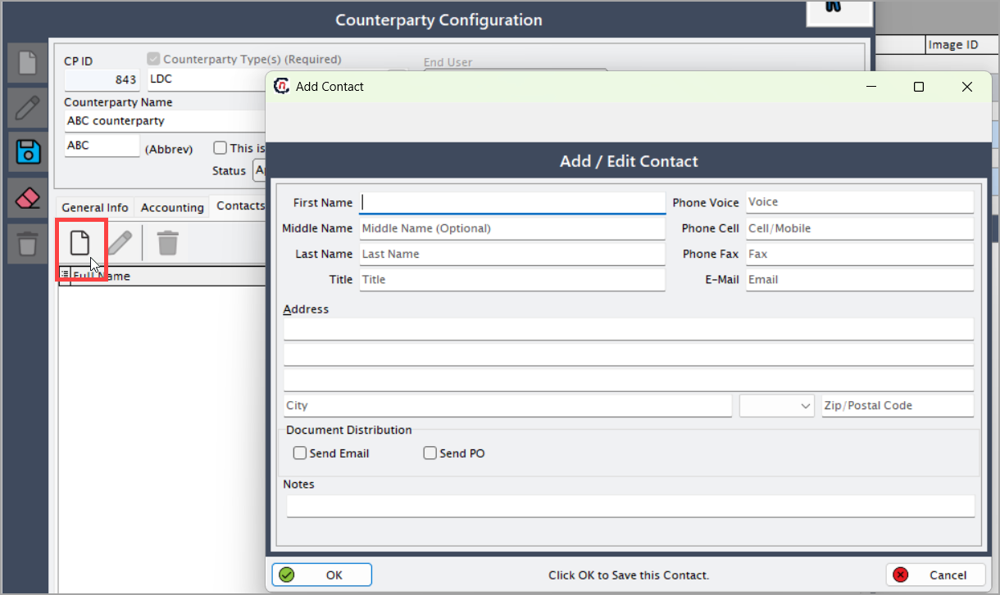

Click on the **Add new contact** button to add the contact details for the selected configured counterparty.

The below table lists down the various fields available on the **Add/edit contact** screen:

| Fields | Description | Data type | Mandatory (Y/N) | Fetched from (UI screen) | Displayed on (UI screen) |
|--------|------------|-----------|-----------------|--------------------------|--------------------------|
| Name (first name, middle name, last name, and title) | Enter the full name details of the contact person, including first name, middle name, last name, and title. | String | N (only first name is mandatory) | N/A | Deal Creation |
| Contact details | Enter the contact details of the counterparty, including phone number (landline), mobile number, fax number, and email address. | Phone number, Email | N (only email address is mandatory) | N/A | N/A |
| Address | Enter the complete address of the contact person for the counterparty, including street, city, state, and postal code. | String | Y | N/A | N/A |
| Document distribution | Select the preferred method of document distribution for the contact person (e.g., via PO or email) by clicking on the checkbox. | Checkbox | Y | N/A | TBA |
| Notes | Add any additional notes if required. | String | Y | N/A | N/A |

Click **Ok** to save the contact details configuration. After creating or updating the contact details, the system will ask if the **Contract role** should be updated. If you choose **Yes**, this will launch the **Contact role** screen. Remember that this screen can be accessed at any time from the button at the top of the screen.

The available roles that you can assign to a contact are listed below:

* Accounting – General
* Accounting – Settlement
* End user – OMO/OFO
* Wholesale – Trader
* Wholesale – Scheduler
* End user – Billing
* End user – Contracts
* Wholesale – Confirms
* Broker – Commissions
* End user – Account activity

#### Risk limits tab

The **Risk limits** tab captures the various limits set for the counterparty. This list of limits works with the list of limits defined in the Limit Type screen and associated with Counterparty. These limits will be used for trading and reporting.
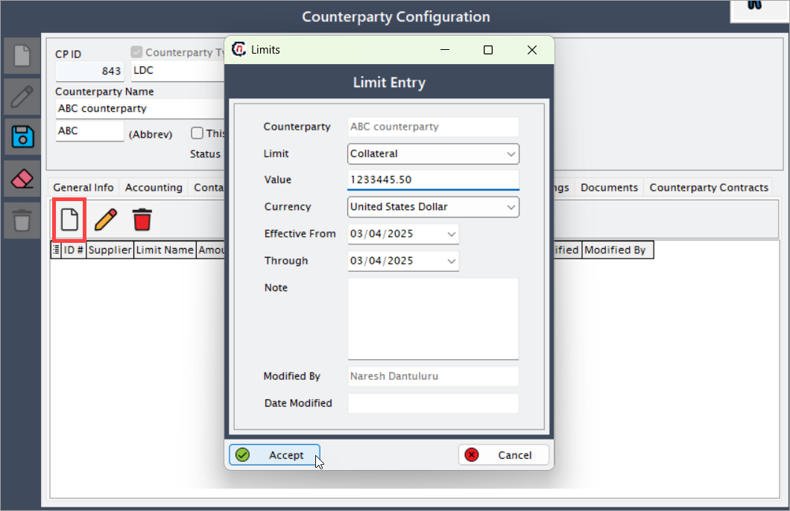

!!! note "Note"
    To configure a risk limit, you must first set up the **Limit** on the **Limit type** configuration screen.

1. To add, edit or remove a risk limit for the counterparty, right-click anywhere on the page to use one of the following options:
    1. Add risk
    2. Edit risk
    3. Delete risk
2. When you click on the **Add risk** button to configure a risk limit for the counterparty, you will redirected to the **Limit entry** screen where you will need to enter all the required details as listed in the below table:

    | Fields | Description | Data type | Mandatory (Y/N) | Fetched from (UI screen) | Displayed on (UI screen) |
    |--------|------------|-----------|-----------------|--------------------------|--------------------------|
    | Counterparty | Displays the counterparty for which the risk limit is to be configured. | String | Y | Auto-generated | N/A |
    | Limit | Select the limit type from the dropdown based on previously configured limit entity types. | Dropdown | Y | Limit type screen | N/A |
    | Value | Enter the risk value to be set for the selected counterparty. | Decimal | Y | N/A | Counterparty credit screen |
    | Currency | Select the currency for the risk limit from the dropdown. | Currency | Y | N/A | Counterparty credit screen |
    | UOM | Select the appropriate unit of measurement from the dropdown. | Dropdown | Y | Global settings > UOM tab | TBA |
    | Effective from and through | Enter the start and end dates during which the risk limit will remain effective. | Date | Y | N/A | N/A |
    | Note | Add any additional notes if required. | String | Y | N/A | N/A |
    | Modified by | Displays the name of the user who last modified the risk limit. | String | Y | Auto-generated | N/A |
    | Date modified | Displays the date when the risk limit was last modified. | Date | Y | Auto-generated | N/A |

3. Click **Accept** to save the configuration.

#### Default broker fees tab

The **Default broker fees** tab is used to manage and configure broker fees associated with counterparties. This tab allows users to set default fee structures for brokers by entering relevant details such as flat fees, rate per unit, and tiered structures.
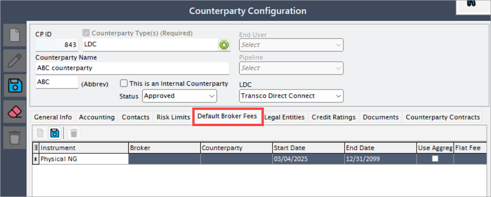

The below table lists down the various fields available on this tab with an explanation for each field:

**Steps to use the Default broker fees tab:**

1. Click on the **Default broker fees** tab.
2. Click on the **Add new partial** button to create a new broker fee entry.
3. Enter the required data into the displayed grid, such as:

    | Fields | Description | Data type | Mandatory (Y/N) | Fetched from (UI screen) | Displayed on (UI screen) |
    |--------|------------|-----------|-----------------|--------------------------|--------------------------|
    | Instrument | Represents the financial instrument associated with the transaction, such as futures, options, swaps, or other tradeable securities. This defines the nature of the transaction and its applicable terms. | String | Y | TBA | N/A |
    | Broker | Select a broker associated with counterparties from the dropdown. Brokers facilitate transactions between counterparties and may charge fees based on predefined agreements. | Dropdown | Y | Broker counter | TBA |
    | Counterparty | The counterparty involved in the transaction. This is the entity on the other side of the trade, which could be a customer, supplier, or financial institution. | String | Y | Counterparty | TBA |
    | Start and end date | Defines the validity period for the agreement. The start date marks when the contract or trade becomes active, and the end date determines when it expires or is no longer valid. | Date | Y | N/A | TBA |
    | Use aggreg | Indicates whether aggregation is applied for the transaction. If enabled, multiple transactions may be combined for reporting or fee calculation purposes. | Boolean | Y | TBA | TBA |
    | Flat fee | A fixed fee applied regardless of transaction volume. This fee remains constant irrespective of the number of units traded or the size of the deal. | Decimal | N | N/A | N/A |
    | Rate per unit | The fee calculated based on the number of units transacted. This dynamic fee varies depending on the transaction volume and the agreed-upon rate structure. | Decimal | N | N/A | N/A |
    | Adder type | Select a pricing adjustment type for broker fees from the dropdown. This allows users to apply specific pricing rules, such as percentage-based markups, flat additions, or other adjustments. | Dropdown | Y | Pricing adder type screen | TBA |
    | EFT acct | The electronic funds transfer (EFT) account used for transactions. This is the bank account or payment processing account designated for handling payments between parties. | String | Y | TBA | TBA |
    | Tiered | Indicates whether tiered pricing applies. Tiered pricing structures allow different rates or fees depending on transaction volume, ensuring that higher volumes may qualify for lower rates. | Boolean | N | N/A | TBA |
    | Tier 1 high | The upper limit for Tier 1 pricing. If a transaction falls within this range, it will be charged at the Tier 1 rate. This is typically the lowest pricing tier. | Decimal | N | N/A | TBA |
    | Tier 2 high | The upper limit for Tier 2 pricing. Transactions exceeding the Tier 1 limit but within this range will be charged at the Tier 2 rate, which may differ from Tier 1 pricing. | Decimal | N | N/A | TBA |

4. Click on the **Save** button to confirm and apply the changes.

#### Legal entities tab

The **Legal entities** tab provides further information on the attached legal entity and the business unit associated with the counterparty. This is generally for informational purposes or to allow for adjustments during the initial definition.
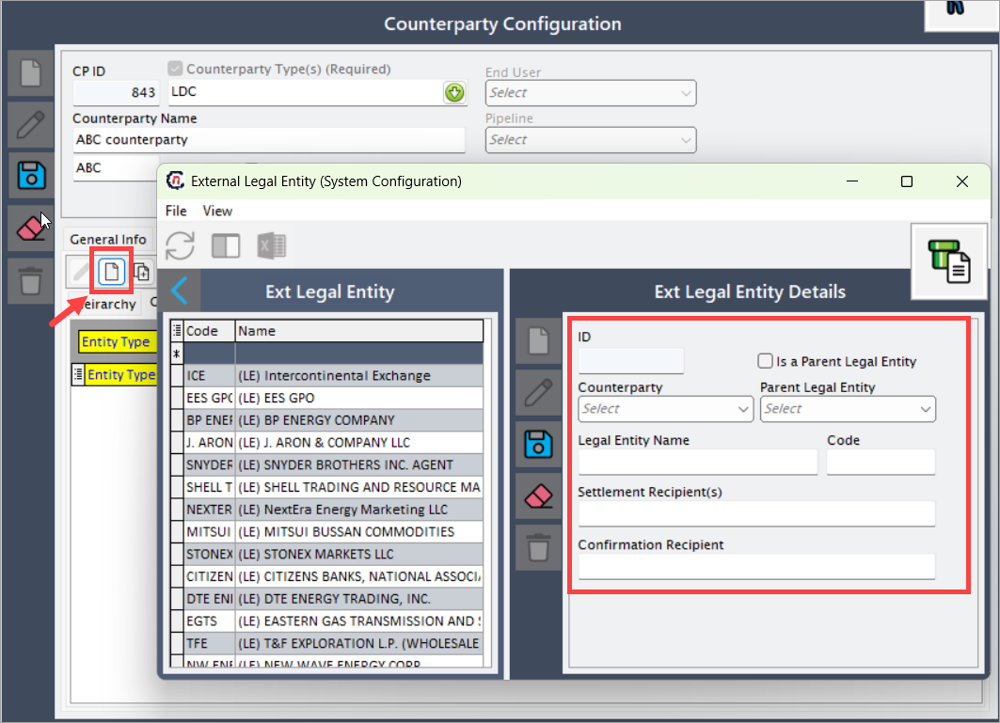

!!! note "Note"
    It is not recommended to update the settings on the **Legal entities** tab after initial setup.

1. Click on the **Add new legal entity** button redirects the user to the **External legal entity** configuration screen.
2. Enter all the required details as listed in the below table:

    | Fields | Description | Data type | Mandatory (Y/N) | Fetched from (UI screen) | Displayed on (UI screen) |
    |--------|------------|-----------|-----------------|--------------------------|--------------------------|
    | ID | A unique identifier that is auto-generated when a new legal entity is created. This ID is used for system tracking and reference purposes. | Integer | Y | Auto-populated | N/A |  
    | Counterparty | Select the counterparty from the dropdown for which you wish to set up a legal entity. A counterparty represents a business entity involved in financial or contractual transactions. | Dropdown | Y | Counterparty | N/A |
    | Is a parent legal entity | Selecting this checkbox designates the newly configured legal entity as a **parent entity**, meaning it will not be assigned under any other parent entity. When selected, the **Parent legal entity** dropdown will be disabled. | Checkbox | Y | N/A | If selected, it appears as a **Parent legal entity** in the **Parent legal entity** dropdown. |
    | Parent legal entity | Select the **parent legal entity** under which the new legal entity will be structured. This field helps in organizing hierarchical relationships between legal entities. If the **Is a parent legal entity** checkbox is selected, this dropdown will be disabled. | Dropdown | Y | Parent legal entity records from **Ext. legal entity** | N/A |
    | Legal entity name | Enter the full name of the legal entity being configured. This name should match official business records and be used consistently in documentation and reporting. | String | Y | N/A | Counterparty creation |
    | Code | Assign an abbreviation or short code for the legal entity. This helps in easy identification and quick reference. For example, if the legal entity name is **"nGenue Legal Entity,"** the code could be **"NLE."** | String | Y | N/A | Counterparty creation |
    | Settlement recipient | Enter the default recipient(s) for settlement-related reports and notifications. This ensures that key stakeholders receive financial reconciliation details on time. | String | N | N/A | N/A |
    | Confirmation recipient | Specify the individual(s) or entity(ies) who will receive contract confirmation reports by default. This helps in maintaining an accurate record of agreements and communications. | String | N | N/A | N/A |

3. Click **Save** to save the configured legal entity.

#### Credit ratings tab

The **Credit rating** tab tracks credit scores over time.
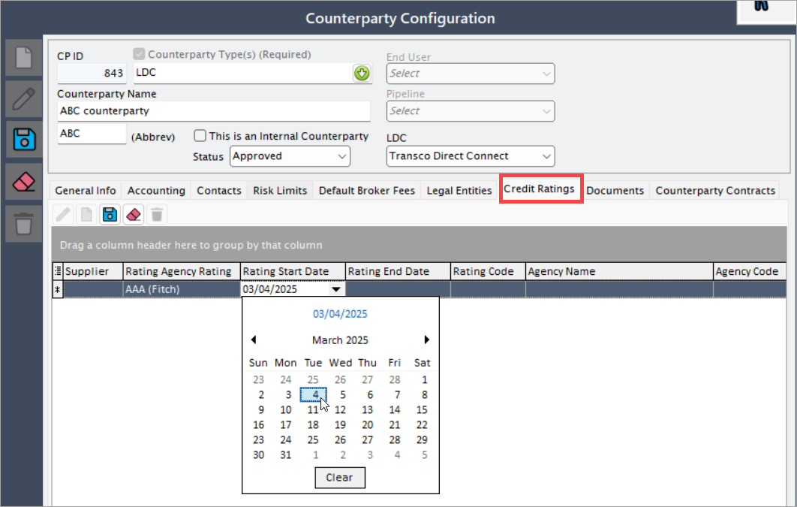

1. Click on the **Add new credit rating** button to insert a new line in the listing to add additional information.
2. Enter all the required details as listed in the below table:

    | Fields | Description | Data type | Mandatory (Y/N) | Fetched from (UI screen) | Displayed on (UI screen) |
    |--------|------------|-----------|-----------------|--------------------------|--------------------------|
    | Rating agency ratings | Select the name of the rating agency from the dropdown list. Rating agencies assess the financial strength and creditworthiness of counterparties. | Dropdown | Y | Fetched from a stored procedure | N/A |
    | Rating start date | Enter the date when the rating becomes effective. This determines the validity period of the assigned rating. | Date | Y | N/A | N/A |
    | Rating end date | Enter the date when the rating expires or is no longer applicable. This ensures ratings remain current and valid. | Date | Y | N/A | N/A |
    | Rating code | This field is auto-generated once a rating agency is selected from the **Rating agency ratings** dropdown. It provides a unique identifier for the assigned rating. | String | Y | Auto-generated | N/A |
    | Agency name | This field is auto-generated upon selecting a rating agency from the **Rating agency ratings** dropdown. It displays the full name of the agency issuing the rating. | String | Y | Auto-generated | N/A |
    | Agency code | This field is auto-generated upon selecting a rating agency from the **Rating agency ratings** dropdown. It provides a system-generated unique code that identifies the rating agency. | String | Y | Auto-generated | N/A |

3. Click **Save** to save the credit ratings and preview the changes on the same screen.

#### Documents tab

The **Documents** tab contains all the documents linked to the counterparty. On this tab, you can either add a new document or make adjustments to the links of the existing documents.
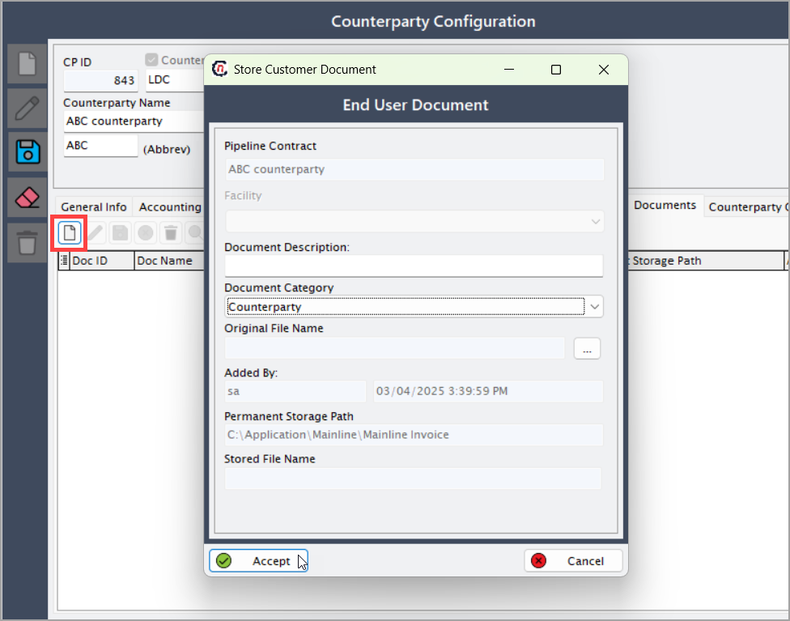

!!! note "Note"
    Before uploading a document, you must first configure the permanent storage path in the [Global settings](../../system_configuration/global_settings.md) screen. This ensures that users can access and upload files from their local system successfully.

1. Click on the **Add** button to open the **Store customer document** screen where you can link saved documents to the counterparty.

2. Enter all the required details as listed in the below table:

    | Field Name | Description | Data Type | Mandatory (Y/N) | Fetched from (UI screen) | Displayed on (UI screen) |
    |------------|------------|-----------|-----------------|--------------------------|--------------------------|
    | Pipeline contract | This field auto-populates based on the counterparty selected. It links the contract to the corresponding pipeline entity. | String | Y | Counterparty screen | N/A |
    | Document description | Enter any relevant details about the document. This field allows users to add additional context or remarks regarding the document. | String | N | User input | N/A |
    | Document category | Choose the type of document from the dropdown:  1. Broker document  2. Pipeline document  3. Consultant document  4. Employee document  5. Counterparty  6. Miscellaneous  7. Well operator agreement  8. LDC document. | Dropdown | Y | Hard-coded | N/A |
    | Original file name | Click the **...** button to browse and select a file from the local system. The selected file must be stored in the configured directory, which can be managed in the [Global Settings](../../system_configuration/global_settings.md) module. | File | Y | Path configured in the Global settings screen | N/A |
    | Added by / Added date / Permanent storage path / Stored file name | This field auto-populates with details of the user who uploaded the document, the date of upload, the system-generated storage path, and the stored file name. | String | Y | Auto-generated | N/A |

3. Click **Accept** to save the changes.

#### Counterparty contracts tab

The **Counterparty contracts** tab displays all the contracts associated with the counterparty. To add a new contract or modify existing ones, click the **Add** button or use the buttons located at the top of the listing grid. This action will open the **Counterparty contracts** screen, where detailed information can be captured.
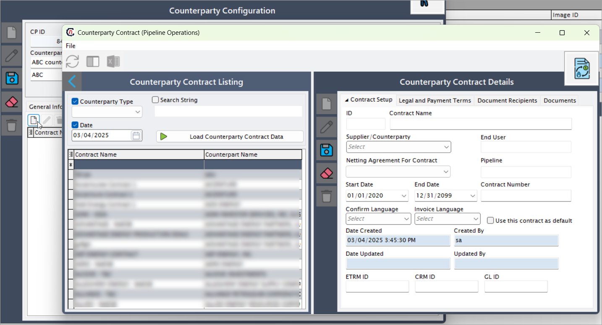 

For more information on Counterparty contracts, refer to the [Counterparty contracts page](#).  
