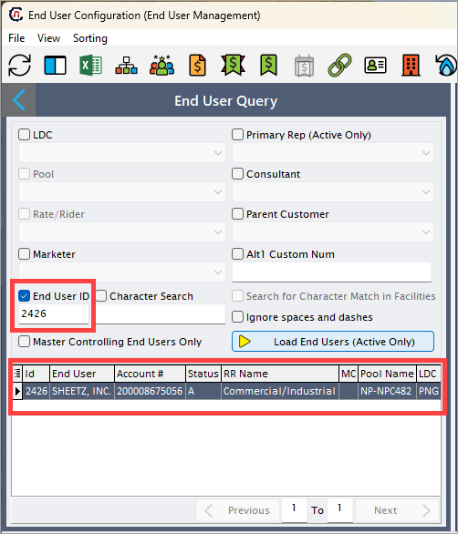
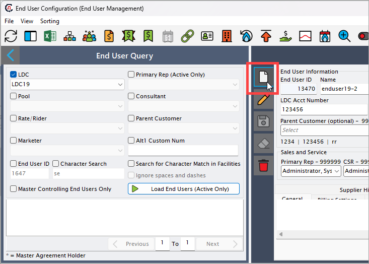
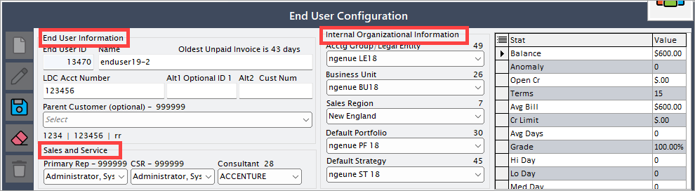
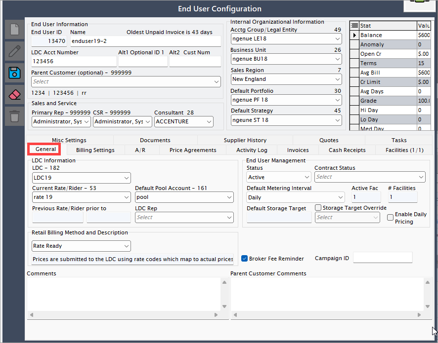

---
hide:
 - toc
---

# Creating an end user

In this section, we will walk through the step-by-step process of creating an end user within the nGenue application. After you are done creating an end user, you will need to add their [address](create_end_user.md#creating-an-end-user-address), set up a [sales contract](create_end_user.md#creating-a-sales-contract) and [price agreement](create_end_user.md#adding-price-agreement), and add facilities to activate the account. Each of these steps is detailed in separate topics on this page.

1.	Login to the **nGenue** application.
2.	Click on the **search** icon and enter *End User* into the search bar. 

3.	Double click on **End User**. 

4.	The **End User (End User Management)** screen appears. Click on the **Load End Users** button.   

5.	Click on the **Add an End User Record** button. 
 

6.	Fill in the below details:

    - **End User Information**: Enter the details such as end user name, LDC account number, primary rep and consultant.

    - **Default Value**: Enter the details such as end user name, LDC account number, primary rep and consultant.

    - **General**: Fill in the details such as LDC name, current rate rider, default pool account, and LDC rep.
    

    - **Billing Settings**: Select the required **Billing format** from the dropdown. 
    

7. Click **Save** to save the record. You have successfully created an end user in the nGenue application.

## Creating an end user address

This section provides the steps to create an address for an end user within the application.

1.	Click on the **End User Level Address** icon from the **End User** screen. 

2.	Click on the **Add an End User Address Record** button.  

3.	Enter the required details in the **Address Configuration** screen, including *Contact*, *Title*, *Address*, and other relevant information.

4. Click **Save**. 
 
## Creating a sales contract 

This section explains the process for creating a Sales Contract within the application.

1.	From the **End User** screen, click on the **Sales** contracts menu. 
2.	Click on the **Add a Sales Contract Record** button.  
3.	Enter the required details in the **Contract Details** screen, including *Contact type*, *Effective Date*, *Contract*, and other relevant information.  

## Adding price agreement

This section explains the process for adding a Price Agreement within the application.

1.	From the **End User** screen, click on the **Price Agreements** menu.  
2.	Click on the **Add a Price Agreement Record** button.  
3.	Enter the required details in the **Price Agreement Configuration** screen, including *Effective Date, Currency, Supply Region*, and other relevant information.   

 
## New pricing tier configuration

This section explains the process for adding a new pricing tier configuration within the application.

1.	Click on the **Add New Tier** button under the **Pricing Tiers** tab.  

2.	Fill in or select the options as per your need. 
3.	Enable *buyback* if required.
4.	Additionally, fill in the details in the **Commodity Sales and Validation screen**, including *Pricing Methodology, Date, Derive volume from, Commodity Status* and its related fields.  
 

## Creating a facility

This section provides a step-by-step guide for creating a Facility within the application.

1.	Click on the **Facility** icon in the End User screen.  
2.	Click on the **Add a Facility Record** button.  
3.	Enter the required details in the **Facility Details** screen, including *Facility Name, Effective Date, Currency, and Supply Region.*
4.	In the **Physical Address and Sales tax** section, enter the details such as *Street Address, State, City, and Country.*  
5.	In the **Profile** tab, fill in the details as *Weather Zone, and Estimated Volumes.*  

## Creating a facility address

This section provides a step-by-step guide for creating a facility within the application.

1.	From the **Facility** screen, click on the **Open Facility Addresses** menu.  
2.	Click on the **Add a Facility Address Record** button.  
3.	Enter the required details in the **Address Details** screen, including *Contact, Title, Address,* and other relevant information.  

 
## Creating a meter 

This section provides a step-by-step guide for creating a Facility within the application.
1.	Click on the **Open Meter Data** menu from the **Facility** screen. 
2.	Click on the **Add a Facility Meter Record** button.  
3.	Enter the required details in the **Meter Details*** screen, including Name, Meter Number, Status,* and other relevant information.  

## Activating a facility

Activate a facility by clicking on the **Change Facility Status** button.  

## Activating an end user
To activate an end user, click on the **Activate End User** button in the **End User** screen.

---
 

