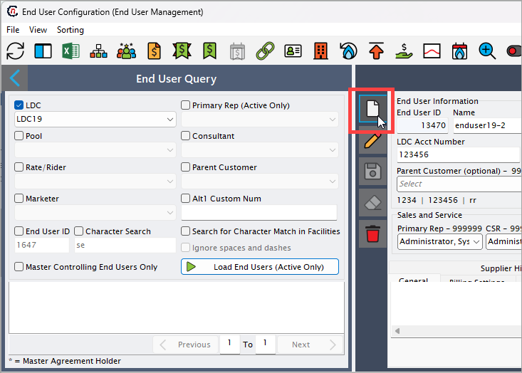

<!-- # End user configuration

<!-- In this section, we will walk through the step-by-step process of creating an end user within the nGenue application. After you are done creating an end user, you will need to add their [address](create_end_user.md#create-an-end-user-address), set up a [sales contract](create_end_user.md#create-a-sales-contract) and [price agreement](./create_end_user.md#add-price-agreement), and add facilities to activate the account. Each of these steps is detailed in separate topics on this page.
  

> In this article, you'll be able to understand: 
    1. [How to create an end user](create_end_user.md#create-an-end-user) 
    2. [How to add address of an end user](create_end_user.md#create-an-end-user-address) 
    3. [How to add sales contract for an end user](create_end_user.md#create-an-end-user-sales-contract) 
    4. [How to add an end user pricing agreement](create_end_user.md#add-price-agreement-for-an-end-user)  -->
>

## Prerequisites

Before proceeding with the configuration of an end user, you must ensure the following prerequisites are met:

* You must have the required permissions to *add* or *modify* the **End user** screen within the application.

## Create an end user

To create an end user in nGenue, follow the below steps:

1.	In the **End user configuration** screen, click on the **Add an end user record** button. 
    
2. The table below provides detailed explanations for each field in the available in the **End user configuration** screen:

    *End user information*

    | Field name | Description |
    |------------|------------|
    | End user ID | A system-generated unique identifier assigned to the end user to track their account and transactions. |
    | Name | The full legal name of the end user or business entity associated with the account. |
    | Payment information | Displays payment-related details for the end user, including payment methods, terms, and history. |
    | LDC acct number | A unique identifier assigned by the Local Distribution Company (LDC) to track gas distribution for the end user. |
    | Alt1 / Alt2 Cust Num | Alternate customer numbers that can be used for cross-referencing within the system. These may be legacy account numbers or IDs used for integration with external systems. |
    | Parent customer (optional) | Allows linking the end user to a parent customer, which can be useful for billing, reporting, and account management purposes. |

    *Sales and service*

    | Field name | Description |
    |------------|------------|
    | Primary rep | The primary sales or service representative responsible for managing the end user's account, handling contracts, and providing support. |
    | CSR | The customer service representative assigned to address customer inquiries, manage complaints, and ensure service quality. |
    | Consultant | A consultant assigned to the end user for advisory purposes, such as helping with gas procurement strategies, compliance, or contract negotiations. |

    *Internal organizational information*

    | Field name | Description |
    |------------|------------|
    | Acctg group / legal entity | The accounting group or legal entity under which the end user’s account is categorized for financial and regulatory tracking. |
    | Business unit | The internal business division or unit responsible for managing the end user’s account, often used for reporting and resource allocation. |
    | Sales region | The geographical region assigned to the end user based on their location or where the sales team manages their contract. |
    | Default portfolio | The default product or service portfolio assigned to the end user, which may include gas supply agreements, pricing plans, or service packages. |
    | Default strategy | The default sales, pricing, or contract strategy that applies to the end user’s account, determining pricing tiers, contract terms, and risk management approaches. |

    

3. The **End user configuration** screen is also divided into multiple tabs, each designed to capture specific details required for end user configuration. 

    Below is a detailed explanation of each tab:

    ### 1. General tab

    *LDC information*

    | Field name | Description |
    |------------|------------|
    | LDC | The local distribution company responsible for delivering gas to the end user. |
    | Current rate/rider | The current rate plan or rider assigned to the end user. |
    | Default pool account | The default pool account linked to the end user’s gas supply. |
    | Previous rate/rider prior to | Displays the previous rate plan or rider that was assigned before the current one. |
    | LDC rep | The representative from the LDC assigned to manage the end user's account. |

    *Retail billing method and description*

    | Field name | Description |
    |------------|------------|
    | Billing method name | Specifies the billing method used for the end user, determining how invoices are generated and sent. The available options are:   **Rate Ready** – The supplier sets a predefined rate, and the LDC calculates the bill based on usage. This method ensures consistency but requires accurate rate setup in advance.   **Bill Ready** – The supplier provides the entire bill calculation, and the LDC only delivers the invoice to the customer. This offers more control over billing but requires additional data management by the supplier.   **Dual Bill** – The supplier and the LDC generate separate invoices for their respective charges. This is used when both entities need to bill the customer directly.   **Single Bill** – A consolidated bill where the supplier and LDC charges are combined into a single invoice, simplifying the payment process for the end user. |
    | Broker fee reminder | Indicates whether a broker fee reminder is set for this account. |
    | Campaign ID | Identifies if the end user is part of a specific marketing or pricing campaign. |
    | Parent customer comments | Additional notes related to the parent customer, if applicable. |

    *End user management*

    | Field name | Description |
    |------------|------------|
    | Status | Displays the current management status of the end user, which affects their ability to receive gas supply and billing. The options include:   **Prospect** – The end user is in the initial setup phase and has not yet been activated for service.   **Setup/Pending** – The account setup is in progress, but certain steps (such as contract approval or LDC confirmation) are still required.   **Active** – The end user is fully enrolled, and service is currently being provided. They will be billed according to their selected billing method.   **Credit Hold** – The account is temporarily suspended due to credit issues, preventing further gas supply or transactions. This status requires resolution of outstanding balances or credit approval.   **Terminated** – The end user's service has been permanently discontinued. No further transactions or billing will occur. |
    | Contract status | Indicates the progress of the end user’s contract in the enrollment process. The status impacts service activation and billing. The options are:   **Awaiting LDC Confirmation** – The supplier has submitted the enrollment request, and the LDC must confirm the activation before service begins.   **Awaiting Credit Approval** – The contract is pending credit evaluation. If the end user does not meet credit requirements, additional guarantees or deposits may be needed.   **Awaiting Enrollment Complete** – The contract has been processed, but final enrollment steps (such as validation of meter setup or additional documentation) are still pending.   **Enrollment Complete** – The contract is fully executed, and the end user is officially enrolled in the system, allowing gas supply and billing to begin. |
    | Default metering interval | Defines the frequency at which the end user’s meter readings are recorded, which impacts how often billing and consumption tracking occur. The available options are:   **Daily** – Meter readings are taken every day, providing the most detailed consumption data. This is useful for high-usage customers who require precise tracking.   **Calendar Monthly** – Readings are recorded once per calendar month, typically on a fixed date. This standard approach aligns with most billing cycles.   **Cycle Monthly** – Meter readings follow a specific billing cycle rather than the calendar month, which may vary based on LDC-defined schedules.   **Bill Cycle; Manage Daily** – Allows for daily meter readings, but the billing cycle follows a predefined schedule. This provides detailed usage tracking while maintaining structured billing periods. |
    | Active fac | Shows the number of active facilities linked to the end user. |
    | # Facilities | Displays the total number of facilities associated with the end user. |
    | Default storage target | Specifies the default storage target assigned to the end user. |
    | Storage target override | Enables the user to override the default storage target if necessary. |
    | Enable daily pricing | Indicates whether daily pricing is enabled for the end user’s account. |

    

    ### 2. Billing settings

    The table below provides detailed explanations for each field available in the **Billing Settings** tab.

    | Field name | Description |
    |------------|------------|
    | Bill format | Specifies the format in which the bill is generated. The available options may include **Standard, Summary, or Detailed**, determining the level of detail included in the invoice. The selected format impacts how charges, usage details, and line items appear on the final invoice. |
    | Line detail level | Defines the level of detail displayed in the invoice line items. Options may include **Summary, Partial Detail, and Full Detail**, affecting how gas usage, fees, and adjustments are presented to the customer. Choosing a more detailed level ensures transparency but may make the invoice longer. |
    | Billing hold | Allows users to temporarily hold bills from being printed within a specified date range. This prevents invoice generation during certain periods, ensuring corrections or adjustments can be made before finalizing the billing process. |
    | Message on invoice | A customizable message that appears on the customer’s invoice. This can be used for general communication, promotions, or important billing-related notes. |
    | Recurring PO # | Allows entry of a recurring purchase order (PO) number that will be associated with every invoice. This is useful for corporate or contractual billing where a PO is required for invoice processing. |
    | Report volumes in | Determines the unit of measurement for reporting gas volumes on the invoice. The options may include **Therms, Dekatherms (Dth), Cubic Feet (CCF), or MMBtu**. Selecting the correct unit is crucial for compliance with contractual agreements and industry standards. |
    | Use alternate billing entity | Enables selection of a different billing entity to generate the invoice instead of the primary supplier. This is useful when a third party is responsible for billing, such as a parent company or financial institution. |
    | Round volumes to | Specifies the rounding method for gas volume calculations. Options may include **No Rounding, Round to Whole Number, Round to Nearest 0.1, or Round to Nearest 0.01**. Rounding helps maintain consistency and avoids minor discrepancies in billing calculations. |

    *Invoice printing options*

    | Field name | Description |
    |------------|------------|
    | Print prior balances | Enables printing of any outstanding balances from previous billing cycles on the invoice. This helps customers track unpaid amounts. |
    | Don't print with controller | Prevents invoices from being printed through the standard controller system, allowing for manual intervention if needed. |
    | Print summary page for multi-facility invoices | If enabled, generates a summary page for invoices covering multiple facilities, providing a consolidated view of charges. |
    | Bundle LDC charges onto 1 line | Consolidates all Local Distribution Company (LDC) charges into a single line item on the invoice, simplifying the bill layout. |

    *Billing line item options*

    | Field name | Description |
    |------------|------------|
    | Hold bills until all facilities have volumes | Prevents invoices from being generated until meter readings for all associated facilities are available. This ensures complete and accurate billing. |
    | Suppress nGenue generated 3rd party charges | Hides any third-party charges that are automatically generated by the nGenue system, providing a cleaner invoice view if third-party charges are not relevant to the customer. |

    *Credit details*

    | Field name | Description |
    |------------|------------|
    | Credit limit | The maximum credit amount assigned to the end user. This determines the allowed outstanding balance before further transactions are restricted. |
    | Credit rating | Displays the creditworthiness of the end user based on predefined criteria. Options may include **Excellent, Good, Fair, or Poor**, affecting eligibility for payment terms and credit-based transactions. |
    | Default margin | The standard margin percentage applied to the end user's charges, representing the supplier’s profit markup. |
    | Last reviewed on | The last date when the end user’s credit details were reviewed. Regular reviews help ensure that credit limits and terms remain appropriate. |
    | SIC code | The Standard Industrial Classification (SIC) code identifying the industry in which the end user operates. This may impact contract terms and risk assessment. |
    | NAICS | The North American Industry Classification System (NAICS) code for categorizing the end user’s business type. Used for regulatory and reporting purposes. |
    | Office | Specifies the office location responsible for managing the end user’s account. This may impact billing jurisdiction and customer service handling. |
    | Industry title | The industry category associated with the end user, typically aligned with the SIC or NAICS classification. |

    

    ### 3. A/R (Accounts Receivable)

    The table below provides detailed explanations for each field available in the **A/R (Accounts Receivable)** tab.

    *Payment processing*

    | Field name | Description |
    |------------|------------|
    | Mail checks to | Specifies the address where physical checks should be mailed for payment processing. Ensuring this field is correctly populated helps avoid delays in receiving payments. |
    | Wire funds to | Defines the designated bank account for wire transfers. This is crucial for customers opting for electronic payments. |
    | A/R Acct | Indicates the accounts receivable (A/R) account where customer payments are recorded. This ensures proper financial tracking and reconciliation. |
    | Sales acct | Specifies the sales account associated with the customer, helping in revenue tracking and financial reporting. |
    | Security deposit required | A checkbox that indicates whether the customer is required to provide a security deposit before service activation. |
    | Deposit amount | The amount of security deposit required from the customer. This may vary based on credit history, contract terms, or company policies. |
    | Date received | The date when the security deposit was received. Keeping track of this ensures proper financial accounting and refund processing. |
    | Re-apply cash receipts | A function that allows reapplying previously recorded cash receipts in case of adjustments or corrections. |
    | Payment terms | Defines the payment terms agreed upon with the customer, such as **Net 30, Due on Receipt, or Custom Terms**. Selecting appropriate terms impacts the due date and financial planning. |
    | Min days | The minimum number of days allowed for the payment cycle. This setting helps define due dates and late fee applications. |
    | Cash receipt method | Specifies the method by which payments are received. Options may include **Check, Wire Transfer, ACH, or Credit Card**. Choosing the right method ensures proper payment allocation. |
    | Form of payment | Defines the acceptable payment method for the customer, such as **Direct Debit, Credit Card, or Bank Transfer**. This impacts transaction processing and reconciliation. |

    *Late charges and collections*

    | Field name | Description |
    |------------|------------|
    | Finance method | Determines how late payment charges are calculated. Options include:    **None** – No finance charges are applied to late payments.   **Defined rate x balance due** – Applies a fixed interest rate to the outstanding balance. Useful for standard late fee structures.   **Defined rate x # of days** – Charges interest based on the number of days the balance is overdue. Helps in time-sensitive penalty calculations.   **Custom rate x balance due** – Uses a user-defined interest rate on the total outstanding balance. This provides flexibility in fee application.   **Custom rate x # of days** – Allows a customized rate to be applied based on the number of overdue days. Suitable for variable late fee structures. |
    | Late penalty | A checkbox that enables the application of late fees on overdue invoices. When selected, the finance method will determine the charge calculation. |
    | In collections | Specifies whether the customer’s account is in the collections process. This is crucial for identifying overdue accounts. |
    | Date referred | The date on which the customer’s account was referred to collections. This helps track the aging of delinquent accounts. |
    | Waive fees | Allows authorized users to waive late fees for the customer. Useful in cases of disputes or goodwill adjustments. |
    | Custom APR | A user-defined annual percentage rate (APR) for late payment penalties. This overrides standard rates when applicable. |
    | Minimum late fee | The lowest possible late fee that can be charged, ensuring small balances still incur a penalty. |
    | Block all collection letters | Prevents the system from automatically sending collection notices to the customer. Useful when negotiating payment terms outside the system. |
    | Stop all late fee calculation | Disables any late fee assessment for the customer, regardless of overdue balances. Useful for customers with special agreements or disputes. |

    

    ### 4. Misc settings

    The table below provides detailed explanations for each field available in the **Misc settings** tab.

    | Field name | Description |
    |------------|------------|
    | Short name | A brief identifier or nickname for the end user. Used internally for quick reference. |
    | Enable cycle/financial storage | Allows the end user to participate in cycle-based or financial storage programs. This is typically used for balancing supply and demand in gas storage management. |
    | Annual storage percent | Defines the percentage of annual storage allocated to the end user. This field is enabled only when **Enable cycle/financial storage** is checked. |
    | Enable estimated meter read billing | Enables billing based on estimated meter readings instead of actual readings. Useful when meter data is unavailable or delayed. |
    | End user is allowed to participate in supply transactions | Grants the end user permission to engage in supply transactions, such as purchasing or transferring gas supplies. |
    | Enable budget billing | Activates budget billing for the end user, allowing them to pay a fixed amount each billing cycle based on estimated annual usage. Helps in managing seasonal fluctuations in billing. |

    *Initial sales forecast*  

    | Field name | Description |
    |------------|------------|
    | Annual usage | The projected annual consumption of the end user. Helps in forecasting supply needs. |
    | Margin | The expected profit margin applied to the end user's usage. This can impact pricing and revenue calculations. |
    | Start date | The date when the sales forecast begins. This helps in tracking usage projections over time. |
    | Term (Months) | The duration (in months) for which the forecasted values apply. Typically set to 12 months for annual projections. |

    *Additional settings*  

    | Field name | Description |
    |------------|------------|
    | Self-nominating | Allows the end user to nominate (select) their own supply sources instead of relying on default allocations. Useful for customers managing their own gas procurement. |
    | Block facility proration | Prevents the system from prorating facility charges for the end user. This ensures that facility-related costs remain consistent regardless of usage variations. |

7. Click **Save** to save the record. You have successfully created an end user in the nGenue application.

## Add address of an end user

This section provides the steps to create an address for an end user within the application.

1. In the **End user configuration** screen, select a user you would like to address.
2. Click on the **End user level address** icon available in the top header of the page. This will take you to the **End user address** screen.
3. Enter the required details in the **Address configuration** screen as mentioned in the table below:

    *Address Configuration*

    | Field name | Description |
    |------------|------------|
    | Contact | Specifies the name of the primary contact person associated with the address. This field is required to identify the key person for communication and correspondence. It is useful for customer support, sales inquiries, and issue resolution. |
    | Title | Defines the job title or designation of the contact person. This field is important for understanding the role and level of authority of the individual within the organization. It is useful in cases where role-specific approvals or communications are needed. |
    | Address | Captures the street address or location details of the contact. This field is essential for mailing purposes, physical correspondence, and regulatory compliance. It is useful when sending physical documents, invoices, or legal notices. |
    | City | Specifies the city where the contact is located. This field is required for geographic identification and helps in regional segmentation. It is useful for mapping customer locations and identifying service zones. |
    | State | Indicates the state or province where the contact resides. It is required for tax calculations, jurisdiction-specific regulations, and shipping considerations. Useful for legal compliance, billing, and service coverage areas. |
    | Zip code | Stores the postal or zip code associated with the contact’s address. It is required for accurate mail delivery and regional classification. Useful in shipping logistics, tax rate determinations, and geographical grouping. |
    | Voice | Captures the primary phone number for voice communication. It is required to facilitate direct contact with the individual for inquiries, support, or business discussions. Useful for customer service, order verification, and emergency contact. |
    | Ext | Stores the phone extension number if the contact is part of a larger phone system. This field is useful for reaching specific departments within an organization. It ensures direct communication without routing through a general receptionist. |
    | Fax | Captures the fax number for sending and receiving documents. While fax is less commonly used today, it is still required for organizations that rely on traditional document transmission. Useful for contract signing, legal document exchange, and invoice submissions. |
    | Ext | Stores the extension number associated with the fax. It ensures that faxed documents reach the correct recipient within an organization. |
    | E-mail | Stores the email address of the contact. It is required for digital communication and is the primary method for sending updates, invoices, and notifications. Useful for online correspondence, marketing communication, and document exchanges. |
    | Home | Stores the home phone number of the contact. This field is optional but useful when an alternative contact number is needed for urgent communications. |
    | Mobile | Stores the mobile phone number of the contact. This is required for direct and instant communication via phone or messaging apps. It is useful for reaching individuals in case of service updates, critical notifications, or sales follow-ups. |

    *Copy Address From*  

    | Field name | Description |
    |------------|------------|
    | End user | Select this option to copy the address from the end user’s details. This field is useful when the contact shares the same address as the end user, reducing manual data entry and ensuring consistency in records. |
    | Facility | Select this option to copy the address from a facility's details. This is required when the contact is associated with a facility rather than an individual end user. It is useful for supply chain management, billing, and operational coordination. |

    *Copy Address To* 

    | Field name | Description |
    |------------|------------|
    | All facilities | Copies the entered address to all associated facilities. This is useful when an organization has multiple branches or sites that use the same billing or communication address. |
    | Selected facilities | Allows selecting specific facilities to which the address should be copied. This is required when only a subset of facilities should share the address. It is useful for regional office management, service segmentation, and facility-specific correspondence. |
    | Facility | Displays the selected facility when **Selected facilities** is chosen. This ensures that address updates are applied correctly to the chosen facility. |

    *This Address Applies To*  

    | Field name | Description |
    |------------|------------|
    | Sales contact | Marks this address as the primary contact for sales-related communication. This is useful for order processing, contract negotiations, and sales inquiries. |
    | Collections | Identifies this address as the contact point for payment collections and overdue invoices. Required for accounts receivable and financial follow-ups. Useful for debt recovery, payment reminders, and dispute resolution. |
    | Critical day contact | Assigns this address for critical day notifications, such as emergency supply changes or urgent service updates. Useful in energy, utility, and logistics sectors where last-minute adjustments are needed. |
    | Billing | Specifies that this address is used for billing-related communication. This is essential for invoice delivery, tax calculations, and financial transactions. Useful for accounts payable and financial reporting. |
    | Duplicate billing | Indicates whether duplicate billing should be sent to this address. This is required for organizations that need multiple copies of invoices for different departments. Useful for financial audits, corporate billing, and regulatory compliance. |
    | Price confirmation | Marks this address for price confirmation communications, such as contract pricing details and rate adjustments. Useful for procurement teams, suppliers, and financial analysts. |

    *Delivery Methods*  

    | Field name | Description |
    |------------|------------|
    | Postal service | Specifies that physical mail should be sent to this address. This is required for organizations that rely on paper documentation. Useful for regulatory compliance, legal contracts, and customer notifications. |
    | Email | Indicates that email is the preferred mode of communication for this contact. This is useful for quick correspondence, invoice delivery, and electronic document sharing. |
    | Fax | Selects fax as the preferred method for sending documents to this contact. This is required in industries where fax remains a standard for official documentation. Useful for legal firms, healthcare, and government communications. |

    *Web Access*  

    | Field name | Description |
    |------------|------------|
    | Web username | Stores the username assigned to the contact for accessing online portals or services. This is required for secure login and user identification. Useful for self-service portals, customer account management, and online billing access. |
    | Password | Stores the password associated with the web username for secure access. This is required to ensure data privacy and account security. Useful for authentication in online platforms and customer portals. |

    *Additional Information*  

    | Field name | Description |
    |------------|------------|
    | Managed accounts | Displays the number of accounts managed under this contact. This field is useful for tracking multiple account responsibilities under a single contact person. Required for account managers, service coordinators, and multi-location organizations. |

4. Click **Save.**

## Add sales contract for an end user

This section outlines the steps to create a sales contract within the application.  

1. In the **End user configuration** screen, select the user for whom you want to create a contract.  
2. Click the **Sales contract** icon in the top header. This opens the **Master sales contract** screen.  
3. Fill in the required details in the **Master sales contract** screen as described in the table below. These fields capture the contract's terms and conditions, ensuring all essential details related to execution, renewal, and guarantees are accurately recorded.  

    | Field name | Description |
    |------------|------------|
    | Contract type | Specifies the type of contract being created (e.g., fixed, variable, hybrid). Required for categorizing agreements based on business needs. Useful for identifying applicable terms and compliance requirements. |
    | Effective date | Defines the date when the contract becomes active. Required for tracking contract validity. Useful for financial planning, service activation, and legal enforcement. |
    | Termination date | Specifies when the contract ends. Required for scheduling renewals or terminations. Useful for contract lifecycle management, ensuring no service disruptions, and avoiding penalties. |
    | Initial term (months) | Indicates the initial duration of the contract in months. Required for defining contract length. Useful for determining billing cycles, renewal terms, and financial forecasting. |
    | Automatic renewal (months) | Specifies whether the contract renews automatically after the initial term. Required to manage contract continuity. Useful for customer retention, avoiding service gaps, and simplifying contract extensions. |
    | Reminder (days prior) | Allows setting a reminder before contract expiration. Required to notify relevant parties about upcoming renewals or terminations. Useful for contract negotiations, renewal discussions, and legal compliance. |
    | Guaranteed saving | Indicates if the contract includes a savings guarantee. Required for customer assurance. Useful for marketing contracts, financial guarantees, and compliance with regulatory savings claims. |
    | Penalty guarantee | Specifies if a penalty applies for early contract termination. Required for enforcing contractual obligations. Useful for ensuring adherence to agreed terms and reducing early termination risks. |
    | Contract # | Stores a unique identifier for the contract. Required for tracking and referencing specific agreements. Useful for contract retrieval, audit purposes, and legal documentation. |
    | First flow date | Specifies the date when contract-based services or product deliveries begin. Required to define the start of service obligations. Useful for scheduling, operational planning, and ensuring timely execution. |
    | Date | Captures the date when the contract was signed. Required for legal validity. Useful for establishing the start of contractual obligations and verifying agreement authenticity. |
    | Signer | Specifies the name of the person who signed the contract. Required for accountability and legal enforcement. Useful for contract verification, dispute resolution, and audit trails. |

4. In the **Custom language** tab of the **Master sales contract** screen, you can modify the standard contract language, specifically for price confirmation and other clauses. It provides flexibility to tailor the contract wording based on business or regulatory requirements.

5. Next, the **Contract documents** tab, stores all related documents associated with the contract, such as signed agreements, terms and conditions, and any legal attachments. It serves as a centralized repository for contract documentation.

Click **Save** to save the configuration and close the **Sales contract** screen.

## Add price agreement for an end user

This section outlines the steps to add a price agreement within the application.  

1. In the **End user configuration** screen, select the user for whom you want to create a contract.  
2. Click the **Price agreement** icon in the top header. This opens the **End user pricing agreement** screen.
3. The **End user pricing agreement** screen is divided into two sections: **Agreement query** and **Price agreement configuration.**
    1. The **Agreement query** section allows users to search, filter, and view existing price agreements. It provides a structured way to locate agreements based on parameters such as LDC (Local Distribution Company), end user type, and agreement status (current, past, or future). This section is essential for managing active agreements, reviewing historical contracts, and ensuring compliance with pricing structures.

    2. The **Price agreement configuration** section defines the terms, conditions, and pricing structure for an agreement. It includes details such as contract duration, pricing methodology, applicable supply regions, and organizational groupings. This section is crucial for establishing clear pricing guidelines, managing risk, and ensuring contract compliance with business and regulatory requirements.

4. Click on **Add a price agreement record** icon to create a new record. 

5. In the **Price agreement configuration** screen, fill in the required details as described in the table below. 

    | Field name | Description |
    |------------|------------|
    | ID (auto-generated) | A unique identifier assigned to the price agreement. Required for tracking and referencing specific agreements. Useful for auditing, reporting, and ensuring contract traceability. |
    | Effective date | Defines the start date when the price agreement becomes active. Required for determining the contract's validity period. Useful for financial planning, billing cycles, and service activation. |
    | Apply term to | Specifies how the pricing agreement applies to deliveries (e.g., calendar delivery). Required for aligning pricing structures with contract terms. Useful for ensuring accurate rate application and compliance with agreements. |
    | Governed by master agreement | Indicates if the price agreement is linked to a master contract. Required for maintaining consistency with overarching contractual obligations. Useful for managing hierarchical contract structures and ensuring compliance. |
    | Currency | Specifies the currency used for the pricing agreement. Required for accurate financial transactions. Useful for cross-border agreements and financial reporting. |
    | Supply region | Defines the geographical region where the supply applies. Required for determining pricing conditions based on location. Useful for regional pricing strategies and compliance with regulatory requirements. |
    | Price agreement type | Specifies the type of pricing agreement (e.g., commodity pricing). Required for categorizing agreements based on pricing methodologies. Useful for contract management and determining applicable price calculations. |
    | Pricing campaign | An optional field that links the agreement to a specific pricing campaign. Useful for promotional pricing strategies and aligning agreements with marketing efforts. |
    | Enable alternate billing cycle volume source | Allows the selection of an alternative billing volume source. Useful when standard billing cycles do not align with contractual agreements. |
    | End user meter interval | Specifies whether the end user is daily metered or part of a pool. Required for defining how consumption data is collected. Useful for accurate billing and demand forecasting. |
    | This agreement’s tiers will be applied to the following volume | Specifies the volume tiering structure, such as city gate delivery. Required for determining price applicability. Useful for volume-based pricing strategies and compliance with supply contracts. |
    | How will fuel loss be calculated? | Defines how fuel loss will be accounted for in the agreement. Required for determining accurate billing amounts. Useful for cost allocation and transparency in fuel usage. |
    | WACOG will be applied to | Specifies whether the weighted average cost of gas (WACOG) is applied to a specific element of the contract. Useful for standardizing cost calculations across agreements. |
    | Enable single weighted average price (WACOG) billing | Allows billing to be calculated using a single WACOG method. Useful for simplifying cost structures and ensuring consistency in gas pricing. |

    *Organizational, Risk and Positional Grouping Section*
    
    | Field name | Description |
    |------------|------------|
    | Legal entity | Specifies the legal entity under which the agreement is created. Required for regulatory compliance. Useful for financial reporting and legal accountability. |
    | Business unit | Defines the business unit responsible for the agreement. Useful for internal tracking, budgeting, and performance analysis. |
    | Portfolio | Identifies the portfolio to which the agreement belongs. Useful for organizing agreements based on business segments. |
    | Strategy | Specifies the strategy governing the agreement. Useful for aligning contracts with corporate objectives. |
    | LDC pricing product | An optional field for selecting the applicable pricing product. Useful for pricing customization. |
    | Rate code | Specifies a predefined rate code that applies to the agreement. Useful for standardizing pricing models. |
    | Quote ID | Stores an identifier for the pricing quote associated with the agreement. Useful for tracking the origin of pricing terms. |

    | Contract requirements | Specifies the key contractual obligations, including volume commitments. Required for ensuring compliance with contract terms. Useful for operational planning and financial forecasting. |
    | Monthly contract volume | Defines the volume of gas contracted on a monthly basis. Required for setting supply commitments. Useful for supplier scheduling and demand management. |
    | Swing | Specifies the allowable variation in the contracted volume. Required for managing supply flexibility. Useful for balancing supply fluctuations and avoiding penalties. |
    | Contract MDQ | Represents the maximum daily quantity (MDQ) allowed under the contract. Required for defining delivery limits. Useful for pipeline scheduling and capacity planning. |
    | Date of first flow | Defines the date when gas deliveries start under the agreement. Required for scheduling supply obligations. Useful for operational planning and ensuring timely execution. |
    | Special provisions | Allows for the inclusion of any additional contractual terms. Useful for capturing unique conditions that apply to the agreement. |

<!--     
    | Pricing tiers | Defines the structured pricing levels within the agreement. Required for tier-based pricing models. Useful for implementing variable pricing strategies based on volume commitments. |
    | Tier | Represents the specific pricing level within the agreement. Required for differentiating pricing structures. Useful for applying customized pricing strategies. |
    | IsFormula | Indicates whether the tier uses a formula-based pricing method. Useful for dynamic pricing models that adjust based on market conditions. |
    | Defined quantity | Specifies the quantity of gas applicable to the pricing tier. Required for volume-based pricing. Useful for structuring pricing agreements based on committed quantities. |
    | Price method | Defines how the price is determined (e.g., fixed or floating). Required for setting appropriate pricing structures. Useful for aligning contract terms with market conditions. |
    | Tier description | Provides details about the pricing tier. Useful for clarity in contract interpretation and application. |
    | Commodity price status | Specifies whether the commodity price is fixed or floating. Required for determining billing calculations. Useful for financial planning and risk management. |
    | All-in price | Represents the total price including all applicable fees. Required for transparency in pricing. Useful for financial analysis and contract evaluation. |
    | Price ID | A unique identifier for the price applied in the tier. Useful for tracking and referencing specific price records. |
    | Basis - all in | Defines the basis on which the all-in price is calculated. Useful for ensuring accurate pricing methodology. |
    | Pricing index name | Specifies the name of the index used for floating prices. Required for market-based pricing agreements. Useful for price benchmarking and cost management. | -->

4. Click **Save** to save the configuration and close the **End user pricing agreement** screen.
 
<!-- ## Create a sales contract 

This section explains the process for creating a Sales Contract within the application.

1.	From the **End user** screen, click on the **Sales** contracts menu. 
2.	Click on the **Add a Sales Contract Record** button.  
3.	Enter the required details in the **Contract Details** screen, including *contact type*, *effective date*, *contract*, and other relevant information.  

## Add price agreement

This section explains the process for adding a Price Agreement within the application.

1.	From the **End user** screen, click on the **Price agreements** menu.  
2.	Click on the **Add a price agreement record** button.  
3.	Enter the required details in the **Price agreement configuration** screen, including *effective date, currency, supply region*, and other relevant information.   

 
## New pricing tier configuration

This section explains the process for adding a new pricing tier configuration within the application.

1.	Click on the **Add new tier** button under the **Pricing tiers** tab.  

2.	Fill in or select the options as per your need. 
3.	Enable *buyback* if required.
4.	Additionally, fill in the details in the **Commodity sales and validation screen**, including *pricing methodology, date, derive volume from, commodity status* and its related fields.  
 

## Create a facility

This section provides a step-by-step guide for creating a Facility within the application.

1.	Click on the **Facility** icon in the End User screen.  
2.	Click on the **Add a facility record** button.  
3.	Enter the required details in the **Facility details** screen, including *facility name, effective date, currency, and supply region.*
4.	In the **Physical address and sales tax** section, enter the details such as *street address, state, city, and country.*  
5.	In the **Profile** tab, fill in the details as *weather zone, and estimated volumes.*  

## Create a facility address

This section provides a step-by-step guide for creating a facility within the application.

1.	From the **Facility** screen, click on the **Open facility addresses** menu.  
2.	Click on the **Add a facility address record** button.  
3.	Enter the required details in the **Address details** screen, including *contact, title, address,* and other relevant information.  

 
## Create a meter 

This section provides a step-by-step guide for creating a Facility within the application.
1.	Click on the **Open meter data** menu from the **Facility** screen. 
2.	Click on the **Add a facility meter record** button.  
3.	Enter the required details in the **Meter details*** screen, including name, meter number, status,* and other relevant information.  

## Activate a facility

Activate a facility by clicking on the **Change facility status** button.  

## Activate an end user
To activate an end user, click on the **Activate end user** button in the **End user** screen.

--- --> -->