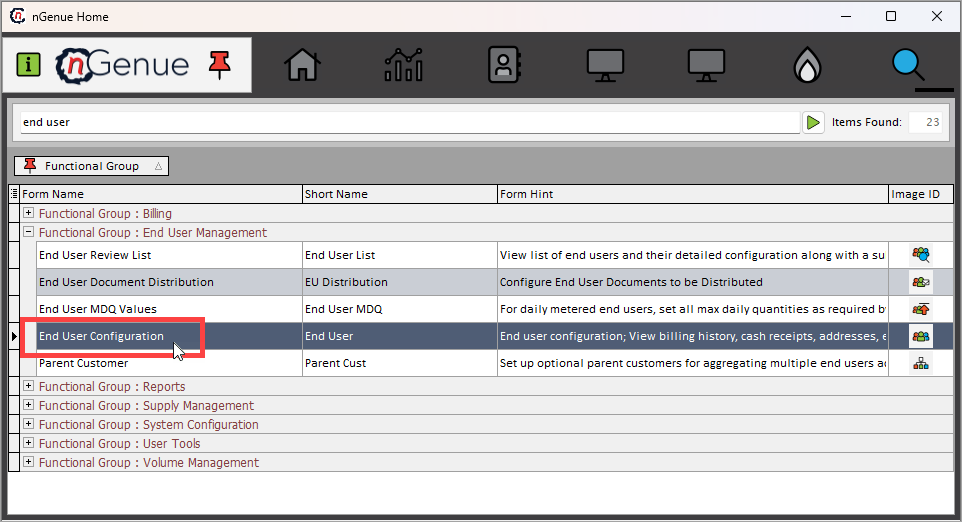

<!-- ---
hide: toc
--- -->

# How to navigate to the End user configuration screen

1.	Log in to the **nGenue** application.
2.	Click on the **Search** icon and enter *End user* into the search text bar.
3.	Double click on **End user configuration** to open the **End user configuration (End user management)** screen.
    

4.  The **End user configuration (End user management)** screen is divided into two sections: **End user query** and **End user configuration.**

    ### End user query section

    The **End user query** section provides a comprehensive set of filters that allow users to refine and retrieve precise inventory valuation data. These filters help narrow down results based on key attributes such as LDC, user id and end users types. By applying the appropriate filters, you can quickly access relevant data for specific transactions, locations, or business entities, ensuring accurate reporting and analysis. Additionally, the structured filtering system enhances data management by streamlining the process of querying and retrieving critical inventory valuation records.

    

    The table below list down the available filters available in this section:

    | Field | Description |
    |---|---|
    | LDC | Filters the query results based on the selected Local Distribution Company (LDC). LDCs are responsible for transporting and distributing natural gas to end users within a designated service area. |
    | Primary rep (Active only) | Filters the results to show only end users assigned to an active Primary Representative. The Primary Rep is the main contact responsible for managing the end user's account or service. |
    | Pool | Allows filtering by pool, which refers to a grouping of end users for operational or billing purposes, typically used by marketers or suppliers to manage gas distribution efficiently. |
    | Consultant | Filters the query based on the assigned consultant, who provides advisory services to the end user regarding natural gas procurement, contracts, or regulatory compliance. |
    | Rate/Rider | Enables filtering based on the rate structure or rider applicable to an end user’s contract. A rate plan defines pricing terms, while a rider specifies additional charges or conditions that modify the base rate. |
    | Parent customer  | Filters the results to show only end users associated with a specific parent customer. A parent customer represents a corporate entity or organization that manages multiple end-user accounts under its umbrella. |
    | Marketer | Allows filtering based on the marketer supplying natural gas to the end user. Marketers act as intermediaries between suppliers and customers, handling procurement, transportation, and pricing. |
    | Alt1 custom num| Enables filtering based on an alternative customer number assigned for identification or reference purposes. This number may be used for internal tracking or by external systems. |
    | End user ID | Filters the query results using a unique identifier assigned to each end user for record-keeping, tracking, and management within the system. |
    | Character search  | Allows searching for an end user by entering a specific character sequence. This helps locate users whose names or details contain the given characters. |
    | Search for character match in facilities | Filters results by searching for a character match within facility names, ensuring that the user can locate facilities based on partial or full text input. |
    | Master controlling end users only| Restricts the results to display only end users designated as **"Master Controlling End Users,"** meaning they oversee multiple sub-accounts or locations under a single administrative control. |
    | Load end users (active only)| Loads and displays only active end users in the query results, filtering out inactive or deactivated accounts for better data accuracy. |

    ### End user configuration section

    Contains a static panel with identifying counterparty information at the top with a series of tabs to capture detailed information including credit, risk limits, contracts, accounting information, etc.

    The table below describes the available icons and their functions:
        
    | Icons | Description |
    | --- | --- |
    |  | Add a new record |
    |  | Edit the record detail. |
    |  |  Save the record. |
    |  | Cancel the updates being made to the record. |
    |  | Delete a record. |

---