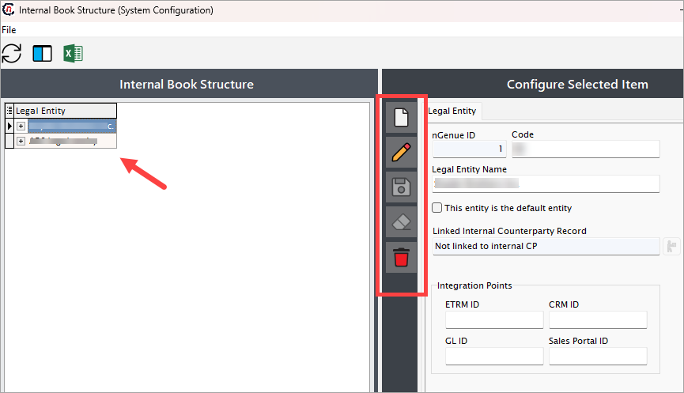

---
hide:
 - toc
---

# Understanding legal entity, business unit, strategy, and portfolio

The **legal entity, business unit, strategy,** and **portfolio** form the foundational building blocks of the organizational hierarchy for a trader. These elements help segment operational, financial, and strategic activities across different divisions. Proper configuration ensures compliance, accountability, and alignment with corporate goals. Adding one line

* **Legal entity:** The primary company entity engaging in contracts and transactions.
* **Business unit:** Sub-entities within the legal entity, managing specific operations (e.g., retail gas, industrial supply).
* **Strategy:** Defines goals like securing supply, managing costs, or maximizing revenue.
* **Portfolio:** Groups contracts, deals, and assets under a strategy to facilitate reporting and analytics.

    !!! question "Example"

        For a natural gas company, the Legal entity might be **"EnergyCorp LLC,"** with business units like **"Wholesale operations"** and **"Retail services."** A strategy could involve maximizing sales to industrial clients, while the portfolio includes contracts and pipelines supporting that goal.

## Procedure to configure

This guide outlines the steps to configure a legal entity, business unit, strategy, and portfolio within the application.

### Prerequisites

* You must have the necessary permissions to add or modify a book structure.
* A counterparty must be configured before setting up a book structure. For details, please refer to [how to create a counterparty.](./counterparty/create_counterparty.md)

### Procedure

#### Step 1: Navigate to Internal book structure screen

1.	Log in to the **nGenue** application.
2.	Click the **Search** icon and enter *book structure* in the search bar.  
3.	Double-click **Internal book structure** to open the respective screen.

4. The next screen is divided into two sections: **Internal book structure** and **Configure selected item.**
    
    1. The **Internal book structure** section lists existing configurations, including legal entities, business units, portfolios, or strategies.
    2. The **Configure selected item** section allows you to create, edit, or delete book structure records. The table below describes the available icons and their functions:
    
        | Icons      | Description                          |
        | ----------- | ------------------------------------ |
        |         | Add a new record |
        |     | Edit the record detail. |
        |         |  Save the record. |
        |   | Cancel the updates being made to the record. |
        |   | Delete a record. |

#### Step 2: Create a new legal entity

1. In the **Internal book structure** screen, click the **Add a record** button.

2. Enter a name for the legal entity and a unique identifier in the **Legal entity name** and **Code** fields, respectively.
    
    !!! example "Example"

        If the legal entity name is **"ABC legal entity,"** the code could be **"ABCL."**

3. To designate this entity as the default legal entity, select the **"This entity is the default entity"** checkbox. Once selected, this legal entity will automatically be pre-selected whenever a new deal is initiated in the **"Deal Management"** screen. This eliminates the need to manually select a legal entity for each deal, streamlining the deal creation process. Setting a default legal entity is particularly useful for traders that primarily operate under a single entity or have a high volume of transactions associated with a specific legal entity.

4. To link a counterparty to this entity, select the counterparty from the **Linked internal counterparty record** dropdown.

    !!!note "Integration points"
        The fields in the **Integration points** section are automatically populated when third-party tools are integrated with nGenue. These fields can be skipped when entering data manually.

5. Once all mandatory fields are filled, click the **Save** button to configure the legal entity.

#### Step 3: Add a business unit to the legal entity

1. Right-click the recently created legal entity and select **Add business unit.** 
    

2. In the **Business unit configure** screen, enter details like name, code and a short description. The **Business ID** is auto-generated once you save the configuration.

3. The **Legal entity** field will be auto-selected.

4. Select the **"Use this business unit as default"** checkbox designates the newly created business unit as the default choice for various operations. For instance, when users perform tasks such as creating deals, portfolios, or strategies, the default business unit will automatically populate in the relevant fields. This feature is particularly beneficial in scenarios where a specific business unit handles the majority of transactions or operational activities, reducing manual effort and minimizing the chances of incorrect selections.

    !!!note "Integration points"
        The fields in the **Integration points** section are automatically populated when third-party tools are integrated with nGenue. These fields can be skipped when entering data manually.

3. Click **Save.** 
    

4. The configured business unit will appear under the legal entity field on the left side of the screen. Expand the entity using the **(+)** button.
    

#### Step 4: Add a Portfolio

1. Right-click the configured business unit and select **Add portfolio.**
    

2. In the **Portfolio configure** screen, enter details such as name, code and a short description. The **Portfolio ID** will be auto-generated upon saving.
3. If not auto-selected, choose your business unit from the **Parent business group** dropdown.

    !!!note "Integration points"
        The fields in the **Integration points** section are automatically populated when third-party tools are integrated with nGenue. These fields can be skipped when entering data manually.

4. Click **Save.** 
    

5. The configured portfolio will appear under the business unit. Expand the unit using the **(+)** button to view it.

#### Step 5: Add a strategy

1. Right-click the newly created portfolio and select **Add strategy.** 
    

2. In the **Strategy configure** screen, provide details such as name, code, and a short description. The **Strategy ID** will be auto-generated upon saving.
3. If not auto-selected, choose your portfolio from the **Parent portfolio** dropdown.

    !!!note "Integration points"
        The fields in the **Integration points** section are automatically populated when third-party tools are integrated with nGenue. These fields can be skipped when entering data manually.

4. Click **Save.** 
    

5. Expand the legal entity, business unit, and portfolio using the **(+)** button to view the newly configured strategy.
     