# Understanding pipeline, pipeline locations, and pipeline zones  

Pipelines, pipeline locations, and pipeline zones are essential components for managing the transportation and distribution of gas. Below is an explanation of each term, why they are required, and how they differ from one another.

## Understanding pipeline

A **pipeline** is a physical infrastructure used to transport natural gas from one location to another. It is the backbone of the natural gas supply chain, connecting production fields, storage facilities, and end-users.

### Why it is required

- Facilitates the efficient transportation of natural gas over long distances.  
- Ensures the delivery of gas to markets, storage facilities, and distribution systems.  
- Reduces transportation costs compared to alternatives like trucking.  
- Supports regional and cross-border supply needs.

!!!example "Example"
    A pipeline such as **"Mainline 101"** transports gas from **State A** field to **State B** hubs.

## Understanding pipeline location

A **pipeline location** refers to a specific physical or operational point along a pipeline where gas is measured, transferred, or allocated. It could represent a receipt point (where gas enters the pipeline) or a delivery point (where gas exits the pipeline).

### Why it is required

- Identifies key points for gas transactions such as input (receipt) and output (delivery).  
- Tracks gas volumes for billing, reporting, and balancing purposes.  
- Ensures accurate measurement and allocation of transported gas.

!!!example "Example"
    * **Receipt location:** A production field where gas is introduced into the pipeline.
    * **Delivery location:** A city gate where gas is delivered to a local distribution company (LDC).

## Understanding pipeline zone

A **pipeline zone** is a segment or region of a pipeline defined for operational or commercial purposes. Pipelines are divided into zones to manage transportation contracts, pricing, and capacity allocation.

### Why it is required

- Helps in determining transportation rates and tariffs for specific pipeline segments.  
- Facilitates capacity management and ensures efficient use of the pipeline infrastructure.  
- Supports regulatory compliance and reporting based on geographic or operational boundaries.

!!!example "Example"
    A pipeline is divided into three zones: 
        1. **Zone 1:** Production field to the first compressor station.  
        2. **Zone 2:** Compressor station to the storage facility.  
        3. **Zone 3:** Storage facility to the end-user distribution hub.

## **Differences between pipeline, pipeline location, and pipeline zone**  

| **Aspect** | **Pipeline** | **Pipeline location** | **Pipeline zone** |
|---|---|---|---|
| **Definition** | Physical infrastructure for gas transport. | Specific points along the pipeline for receipt or delivery. | Segmented regions of the pipeline for operational or commercial purposes. |
| **Purpose** | Transport gas from one location to another. | Measure, transfer, or allocate gas. | Manage transportation rates, capacity, and contracts. |
| **Scope** | Entire pipeline network. | Individual points on the pipeline. | Sections or regions within the pipeline.  |
| **Example** | "Mainline 101" pipeline. | A receipt point at a production field. | "Zone 2" for the mid-section of the pipeline. |

## Configure pipeline, pipeline location, and pipeline zone

### Prerequisites

* You must have the necessary permissions to add or modify pipeline configuration screen.

### Procedure

#### Step 1: Navigate to PZL configuration screen

1.	Log in to the **nGenue** application.
2.	Click the **Search** icon and enter *PZL* in the search bar.  
3.	Double-click **PZL configuration** to open the respective screen.
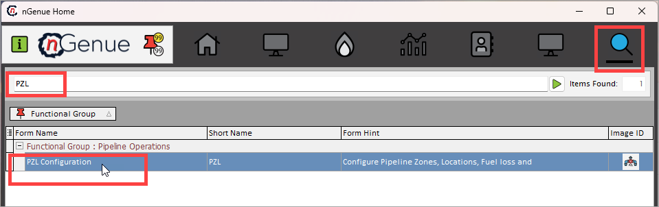
4. The next screen is divided into two sections: **Pipeline selection** and **Supporting pipeline configuration and rates.**
    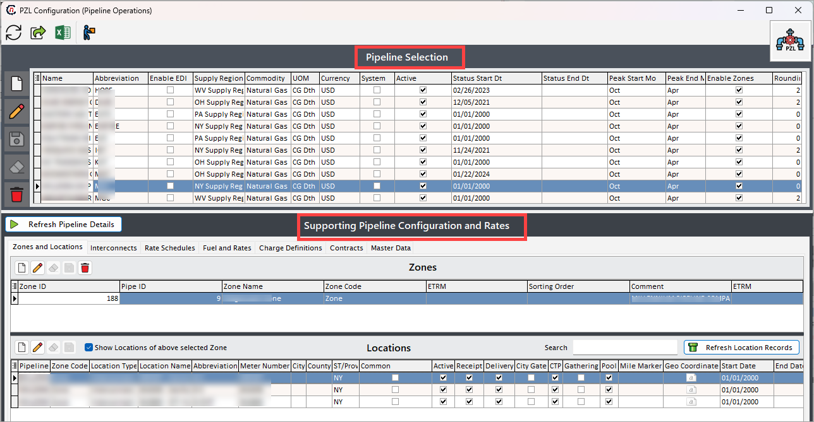
    1. The **Pipeline selection** section lists existing pipelines configured where you can either edit, delete the existing pipeline records or create a new one. The table below describes the available icons and their functions:
    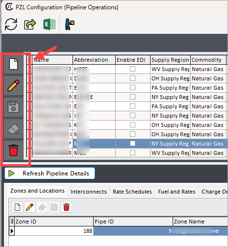

        | Icons      | Description                          |
        | ----------- | ------------------------------------ |
        |         | Add a new pipeline record |
        |     | Edit the pipeline record detail. |
        |         |  Save the pipeline record. |
        |   | Cancel the updates being made to the pipeline record. |
        |   | Delete a pipeline record. |

    2. The **Supporting pipeline configuration and rates** section allows you to perform additional pipeline configurations such as create, edit, or delete pipeline zones, interconnects, rates and pipeline locations.

#### Step 2: Create a new pipeline record

1. In the **PZL configuration** screen, click the **Add pipeline record** button.
2. Fill in the details as mentioned in the table below:
    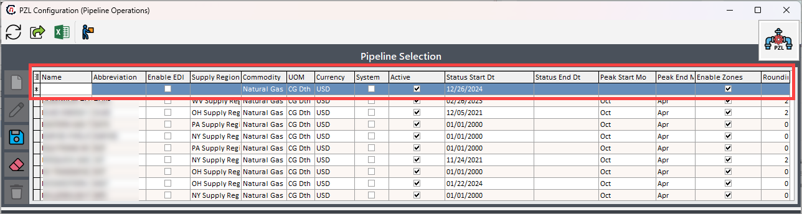

    |Fields |Description |
    |---|---|
    |Name | Enter the full name of the pipeline. This is a mandatory field. |
    |Abbreviation   | Enter an abbreviation for the pipeline name. For instance, if the pipeline is named **"ABC PIPELINE,"** you might use **"ABC"** as the code for easy reference.  |
    |Enable EDI | This checkbox enables EDI (Electronic Data Interchange) import when selected. |
    |Supply region | Select a supply region from the dropdown menu. The options in this dropdown are populated based on pre-created supply regions|
    |Commodity | Choose a commodity from the dropdown menu, such as **"Natural Gas."** |
    |UOM | Select the unit of measure (UOM) to standardize the measurement for pipeline-related transactions. |
    |Currency | Choose the currency for pipeline transactions to define the currency in which transactions will be conducted. |
    |System | This checkbox, when selected, indicates that the marketer is responsible for making nominations. |
    |Active | This checkbox indicates whether the pipeline is currently active. |
    |Status start dt. | Select the start date for the pipeline's active status from the date dropdown. |
    |Status end dt. | Choose the end date for the pipeline's active status from the date dropdown. |
    |Peak start month | Select the month when the peak season for the pipeline begins. |
    |Peak end month | Choose the month when the peak season for the pipeline concludes. |
    |Enable zone | This checkbox indicates whether the pipeline has designated zones. It is recommended to always select **"Yes" (Y)** and create a generic zone to maintain consistency across pipelines. |
    |Rounding decimal’s | Specify the number of decimal places to which the pipeline volumes should be rounded. |

3. Once the pipeline is configured and saved, the value will be displayed under the **Pipeline selection** section.

#### Step 3: Create a new pipeline zone

1. In the **Supporting pipeline configuration and rates** section and under the **Zone and locations** tab, click the **Add zone record** button.
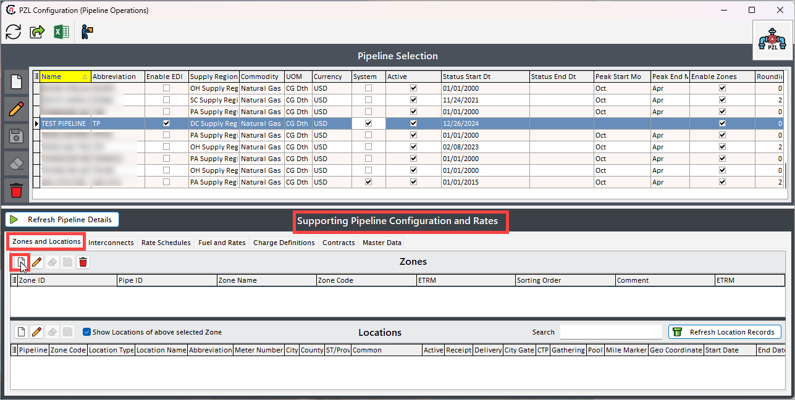
2. Enter a name for the pipeline zone being configured and a unique identifier in the **Name** and **Code** fields, respectively.
    
    !!! example "Example"

        If the pipeline zone name is **"ABC zone,"** the code could be **"ABCZ."**

3. The **Pipeline** field will be auto-selected. If not, select the pipeline for which the zone is being configured.
4. The **Sort order** field is used to determine the display or processing order of zones in a pipeline. This field allows you to assign a numerical value to each zone, defining its priority or sequence relative to other zones. For example, if you have three pipeline zones, **Zone A** with sort order 1, **Zone B** with sort order 2, **Zone C** with sort order 3, then the zones will appear or be processed in the order: **Zone A → Zone B → Zone C.**
5. Add any additional details in the **Comments** box.
6. Click **Save.**
    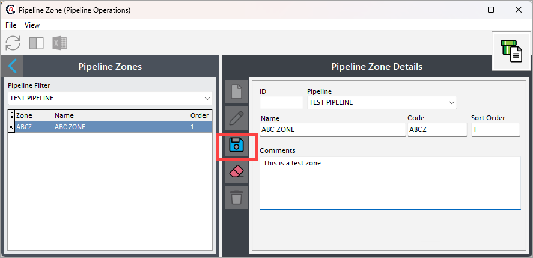
6. Once the zone is configured and saved, it will get displayed in the **Pipeline zones** and also under the **Supporting pipeline configuration and rates** section.
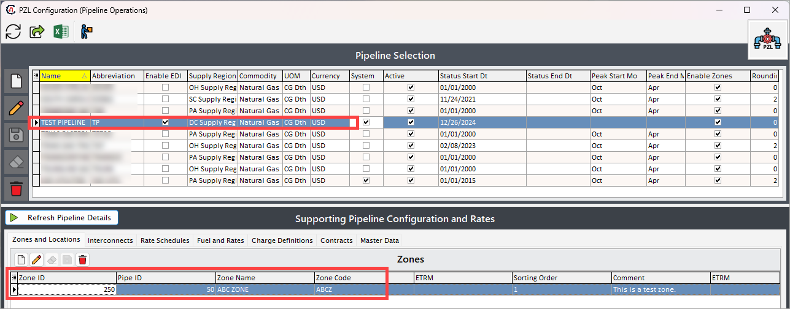

#### Step 4: Assign pipeline locations to a zone

1. In the **Supporting pipeline configuration and rates > Locations** section, click the **Add location record** button.
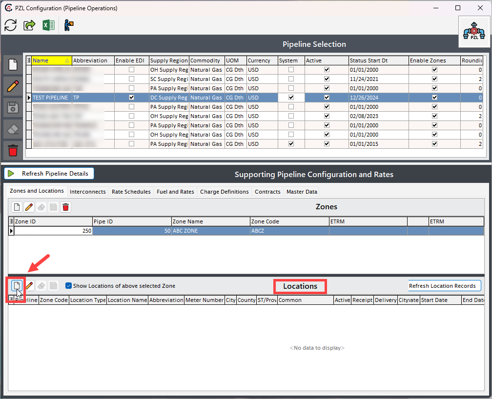
2. On the next screen, give a short name of the pipeline location for easier identification in the **Nick name** field.
3. Fill in other details as per the table below:

    |Fields |Description |
    |---|---|
    |Abbrev   | Enter an abbreviation to represent the pipeline location. |
    |Meter # | This displays the meter number associated with the pipeline, used for tracking and recording measurements. |
    |EBB Name | Electronic Bulletin Board (EBB) name for the location, used in pipeline communication and scheduling systems. |
    |Pipeline | Select the pipeline for which the location is being configured.  |
    |Pipeline zone | Select the pipeline zone for which the location is being configured. |
    |Up Down Name | Indicates the upstream and downstream identifiers for the location, representing the flow direction. |
    |Pipeline location types | Specify the type of pipeline location:  1. **Point-** A specific location on the pipeline where natural gas is injected or withdrawn.   2. **Pool-** A virtual location on the pipeline where gas from multiple sources is aggregated before being redistributed.  3. **Citygate-** The location where the pipeline delivers gas to a Local Distribution Company (LDC).  4. **Interconnect-** A location where two or more pipeline systems connect and exchange gas.  5. **Storage-** Facilities associated with the pipeline used to store natural gas temporarily, often underground.   6. **Gathering-** Locations at the start of the pipeline system where natural gas is collected from production sites.  7. **Virtual-** A non-physical location used for tracking transactions, nominations, or balancing gas flows. |
    |Pipeline Loc sub-group | This field categorizes pipeline locations into specific operational roles or characteristics, enabling precise management and reporting. |
    |LDC and LDC pool |This fields are available for pipeline location type as **"Citygate"** only.   Select the **LDC** to specify the local distribution company associated with the pipeline, and choose the **LDC pool** to designate the corresponding pooling point for gas aggregation and distribution. |
    |City | Shows the city where the pipeline location is based. |
    |Country | Displays the county of the pipeline location. |
    |State | Reiterates the state in which the pipeline location is located. |
    |Supply region | Select a supply region from the dropdown menu. Displays the specific geographical area from which natural gas is sourced or distributed at this location.|
    |Mile marker | Indicates the mile marker on the pipeline where the location is situated. |
    |Valuation pool | Specifies the valuation pool assigned to the location for pricing or financial purposes |
    |By default, include in Transport agmt valuations | to be added |
    |Start date | The start date when the pipeline location becomes active. |
    |End date | The end date indicating when the pipeline location is no longer in use. |
    |Market areas | A dropdown selection populated from the **PZL screen > Master data > Market areas** section, showing available market areas associated with the location |
    |Operational areas | A dropdown populated from the **PZL screen > Master data > Operational areas** section, displaying the operational regions relevant to the location.  |

3. Click **Save.**
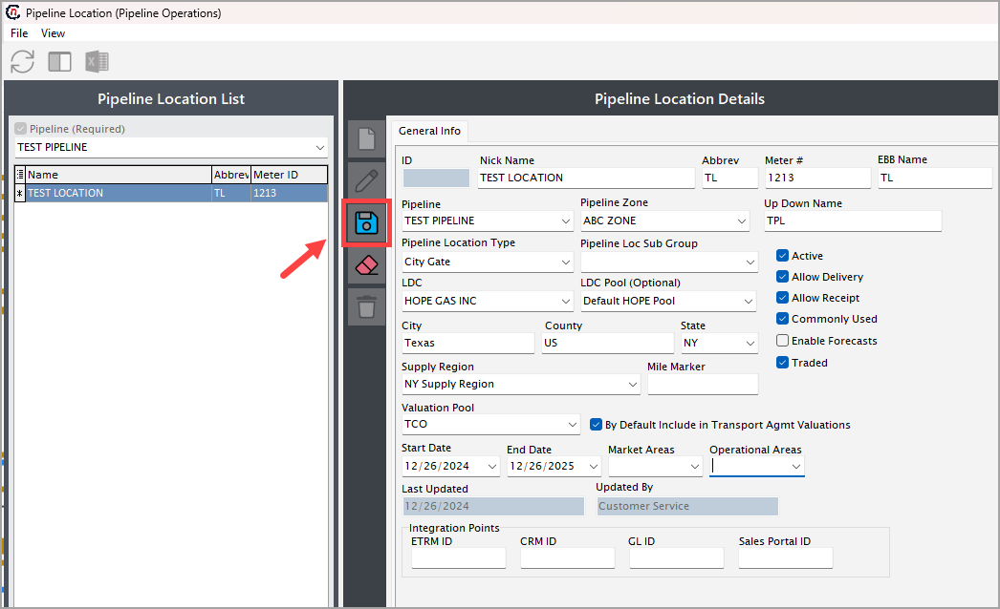
4. Once the location is configured and saved, it will get displayed in the **Pipeline location** and also under the **Supporting pipeline configuration and rates** section.
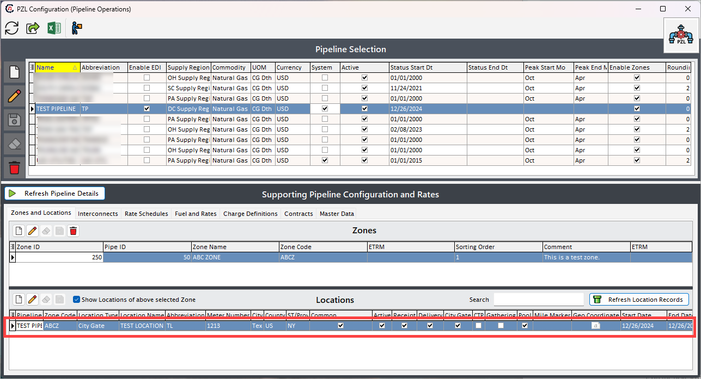

#### Step 5 (optional): Configure Interconnects

**Interconnects** are vital points in the natural gas pipeline infrastructure where multiple pipeline systems converge to transfer, exchange, or reroute gas. These connections enable seamless integration across regional or interstate networks, ensuring efficient gas transportation from producers to end-users.

1. Go to the **Interconnects** tab in the **Supporting pipeline configuration and rates** section.
2. Click on the **Add pipeline interconnect record** button.
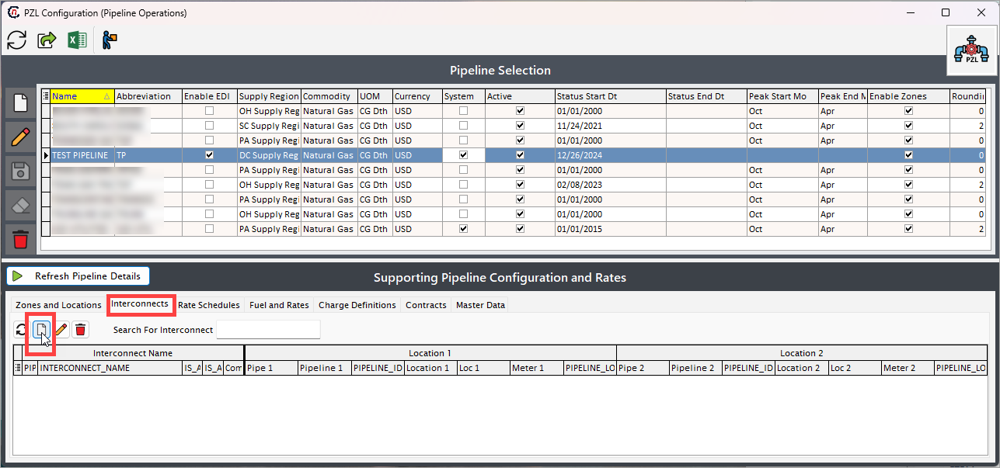
3. On the next screen, give a **name** of the interconnect.
4. Select the **pipeline** and the **pipeline locations** from the dropdown in **Location 1** and **Location 2** fields.
    
    !!! note "Note"
        To interconnect the pipeline, there should be two pipelines configured with zones and locations.

5. Additional checkboxes:
    1. **Interconnect allows receipts:** Select whether the interconnect location permits receiving natural gas into the pipeline system.
    2. **Interconnect allows delivery:** Select whether the interconnect location permits delivering natural gas out of the pipeline system.
    3. **Commonly used:** Indicate whether this pipeline location is frequently utilized for transactions or operations.

6. Click **Save.**
    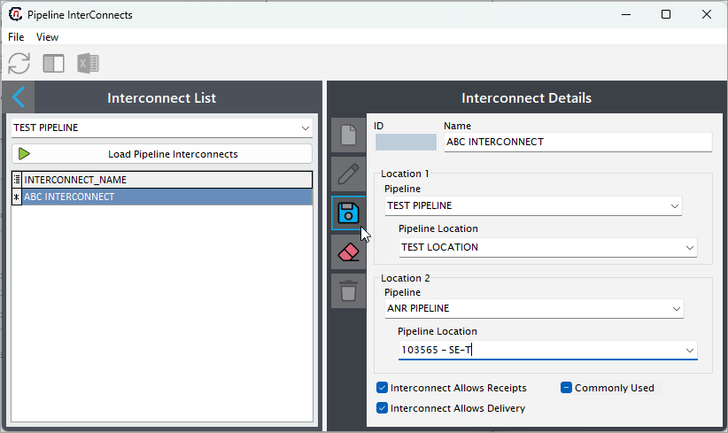

## Summary

- **Pipeline**: Represents the entire physical system for transporting natural gas.  
- **Pipeline Location**: Represents specific points where gas enters or exits the pipeline.  
- **Pipeline Zone**: Represents segments or regions within the pipeline for operational or commercial management.
- **Interconnects**: Represents pipeline location where natural gas is transferred between two or more pipeline systems.

Each of these elements plays a critical role in ensuring the efficient, accurate, and cost-effective transportation of natural gas.