# Understanding rates and tariff

**Rates and tariffs** are crucial for calculating settlements and nominations as they define the applicable charges and their corresponding rates. Rate schedules and rates are located within the **PZL configuration** screen and are used to determine fuel losses, commodity charges, pipeline fees, and other associated costs. It provides a comprehensive framework for defining charge components, calculating fuel usage, and establishing rate schedules tailored to different customer segments and service agreements. By leveraging this module, users can ensure accurate billing, streamline cost allocation, and maintain compliance with regulatory and contractual requirements.

## Prerequisites

Before configuring **rates and tariff**, ensure the following are in place:

* **Pipeline setup:** The associated pipeline, zones and its locations (e.g., points, interconnects, citygates) are correctly configured. For more information about how to setup a new pipeline in nGenue, see [configuring a pipeline, zones and pipeline locations.](./configure_pipeline.md)
* **Charge definitions:** All applicable charges (e.g., transportation, storage, and balancing fees) are clearly identified and outlined. [(Learn more)](rates_tariffs.md#step-1-define-the-charge-definitions)
* **Rate schedules:** The rate schedules defines the rate schedules and applicable charge types for the selected pipeline. These would include both firm and interruptive services for transportation, storage, park and loan and other pipeline services. [(Learn more)](./rates_tariffs.md#step-2-setup-rates-schedules) 

## Configuration steps

When building tariff information for a [new pipeline,](./pipeline.md) start by defining the charge definitions, including settlement types and parameters. Then, configure the rate schedule by adding charge definitions to specific rate schedules. Finally, populate the fuel and rates tab with the necessary fuel rates and associated rate schedule charges.

The **Rates and tariff** are defined in the **PZL configuration** screen on three rate related tabs:
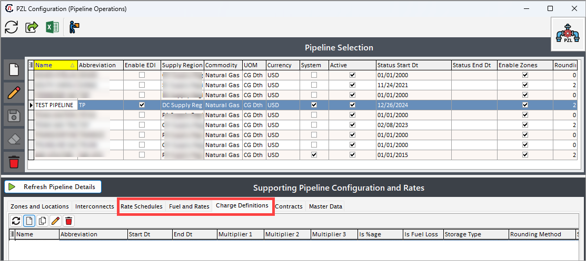

|Charge definitions | Rate schedules | Fuel and rates |
|--- |--- |---|
|1. Focuses on establishing charge parameters critical for settlement and nomination calculations.   2. Define the charge categories, such as commodity charges, pipeline fees, or additional tariffs charges.   3. Specify the settlement type to ensure proper allocation and calculation of charges. | 1. This tab is essential for defining rate schedules based on the pipeline services for transport, storage or other pipeline offerings.   2. Specify the rate schedule according to the applicable pipeline tariff and contract. Capture effective start and end dates. | 1. Captures the detailed fuel and rate information.  2. Input the applicable charges for each service offering or transaction.  3. Specify fuel rates to account for transportation losses or adjustments.  4. Enter rates for accurate settlement calculations. |

### Step 1: Define the charge definitions

The **Charge definitions** tab lists and defines the various charges applicable to a selected pipeline. The data captured in this tab is the basis for defining how a rate schedule is applied to nominations and settlements. The details help determine when a charge is applied: seasonally, against usage, as a fixed fee, as part of storage or transport, etc.

To add a new charge definition, follow the below steps:

1. In the **PZL configuration** screen, go to **Charge definition** tab within the **Supporting pipeline configuration and rates** section.
2. Click on the **Add new charge definition** button.
    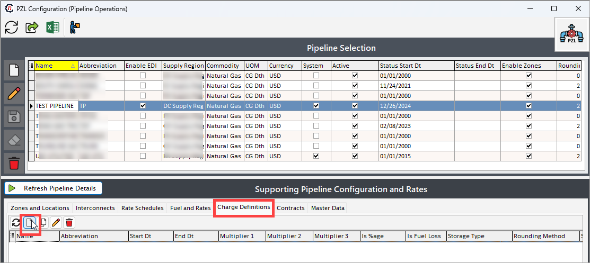
3. The next screen is divided into two sections: **Pipeline charge listing** and **Pipeline charge setting.**
    1. The **Pipeline charge listing** section enable you to quickly filter specific charges definition assigned to a pipeline.
    2. The **Pipeline charge setting** section supports a range of functionalities, including rate multipliers, seasonal adjustments, and account overrides. You can define settlement types and charge classifications, as well as configure complex charge structures like percentage-based rates, fuel loss adjustments, and fixed or daily charges.
    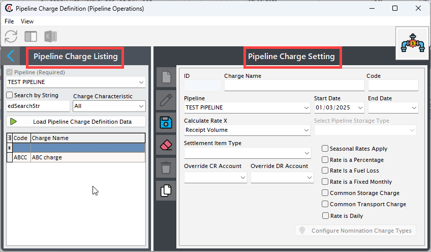

4. In the **Pipeline charge setting** section, enter a name for the charge definition and a unique identifier in the **Charge name** and **Code** fields, respectively.
    
    !!! example "Example"

        If the charge name is **"ABC charge,"** the code could be **"ABCC."**

5. The **ID** is auto-generated once you save the configuration.
6. Specifies the pipeline associated with the charge. The **Pipeline** dropdown is set to default to the pipeline chosen in the **PZL configuration** screen.
7. The start date/end date captures when the charge definition is used by the pipeline, not the time of a specific published rate.  This allows for charges to be added or deprecated if required by pipeline tariff rate case changes.
8. **Calculate rate X** allow you to define and configure a specific calculation formula for a charge. This feature enables the system to dynamically compute the rate based on predefined parameters such as volume, distance, percentage, or fixed values, ensuring accurate and automated billing for various transactions. The following multipliers are available in the dropdown:

    | Field                          | Description                                                                 |
    |----------------------------------------|-----------------------------------------------------------------------------|
    | Receipt volume                     | The total gas volume received into the pipeline at a receipt point.         |
    | Delivered volume                   | The total gas volume delivered out of the pipeline at a delivery point.     |
    | Fuel volume                        | The volume of gas used as fuel during transportation or operations.         |
    | Injected volume                    | The volume of gas injected into a storage facility.                         |
    | Withdrawn volume                   | The volume of gas withdrawn from a storage facility.                        |
    | Date-Based fuel rate               | A fuel rate that varies based on specific dates or time periods.            |
    | Maximum daily quantity             | The highest amount of gas allowed to be transported or delivered daily.     |
    | Maximum Daily storage quantity     | The maximum volume of gas that can be stored daily in a facility.           |
    | Date-Based pipeline rate value     | A pipeline rate value that changes depending on the date or period.         |
    | Storage balance                    | The current volume of gas stored in a facility.                             |
    | Cashout volume excess storage balance | The gas volume exceeding the agreed-upon storage balance, subject to financial settlement. |
    | Specific volume                    | A user-defined, specific gas volume for calculation purposes.               |
    | Applicable MDIQ                    | The highest volume of gas allowed to be injected into storage daily.        |
    | Applicable MDWQ                    | The highest volume of gas allowed to be withdrawn from storage daily.       |
    | Storage burn                       | The volume of gas used directly from storage for operations or deliveries.  |
    | Planned storage percentage         | A predefined percentage of the total storage capacity planned for use.      |
    | Authorized overrun                 | The amount of gas allowed to exceed contracted limits under agreed terms.   |
    | None/Use input amount              | A manual input option where no predefined parameter is used.                |
    | Storage transfer                   | The gas volume transferred between storage facilities or accounts.          |
    | Storage imbalance                  | The difference between planned and actual storage volumes.                  |
    | Used capacity release              | The portion of the pipeline's capacity utilized from a released capacity agreement. |
    | Purchased capacity release         | The pipeline capacity acquired from another party's released capacity.      |
    | Wellhead production                | The volume of natural gas produced directly at the wellhead.                |
    | Wellhead volume after fuel         | The volume of gas remaining after accounting for fuel usage at the wellhead.|

9. The **Selected pipeline storage type** option becomes relevant or applicable only when you are configuring a charge that pertains to storage operations.

    !!!example "Example"
        Charges like storage injection fees, withdrawal fees, or storage capacity charges fall under storage-related charges. If you are working with non-storage charges, such as transportation or fuel charges, this field will not have any impact or relevance.

10. Choose the **Settlement item type** from the dropdown:

| Field | Description |
|---|---|
| Physical sale | Represents the sale of physical natural gas or commodities delivered at a specified location. |
| Physical purchase | Represents the purchase of physical natural gas or commodities from a supplier at a specified location.|
| Pipeline charges | Charges incurred for the transportation of gas through a pipeline, such as fuel, demand, or reservation fees.|
| Broker fees | Fees charged by brokers for facilitating commodity trades or transactions. |
| Futures sale | Represents the sale of futures contracts for natural gas or related commodities on a trading platform.|
| Futures buy | Represents the purchase of futures contracts for natural gas or related commodities. |
| Swap buy | Represents entering into a swap agreement as a buyer to lock in a price for a commodity. |
| Swap sale | Represents entering into a swap agreement as a seller to lock in a price for a commodity.|
| Option buy| Represents the purchase of an options contract, giving the right to buy or sell a commodity at a set price.|
| Option sale | Represents the sale of an options contract, granting the buyer the right to buy or sell at a set price.|
| Fees | General charges or costs associated with transactions, such as service fees or transaction costs.|
| Triggers | Specific conditions or thresholds that initiate a predefined financial or operational action. |
| Production purchase | Represents the purchase of natural gas directly from production sources, such as wellhead gas. | 

11. The **Override CR/DR Account** field allows you to specify a custom credit (CR) or debit (DR) account for a particular transaction. This field is used when the default account assignment needs to be replaced with a specific account due to unique business requirements or scenarios. By overriding, you can ensure that the transaction is posted to the correct account as per their operational needs.
12. Additional checkboxes:
    * **Seasonal rates apply**: Indicates that the rate varies based on the season or specific time periods.  
    * **Rate is a percentage**: Specifies that the rate is calculated as a percentage, typically used for fuel-related charges.  
    * **Rate is a fuel loss**: Identifies the rate as related to fuel loss during transportation or operations.  
    * **Rate is fixed monthly**: Indicates that the rate remains constant on a monthly basis, irrespective of volume or other factors.  
    * **Common storage/transport charge**: Determines whether the charge appears in dropdowns for selection across storage or transportation categories.  
    * **Rate is daily**: Specifies that the rate is calculated and applied on a daily basis.  

13. Save the configuration.
14. Once configured, use the **Configure nomination charge types** button to assign relevant charge type codes (NAESB standard or otherwise) to the defined charge to determine when a charge will apply to a nomination. Use the **<** and **>** key to move the charge type from the list on the left to the selected list on the right or vice versa.
    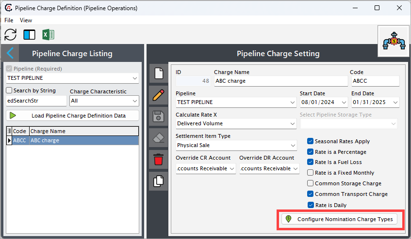
15. Accept the changes. 
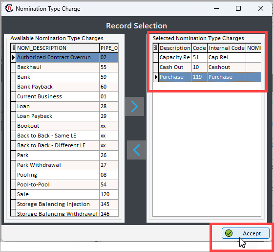
16. Upon completing the assignment process and saving the changes, the charge will be included in the listing panel of the **Charge definition** screen.

### Step 2: Setup rate schedules

**Rate schedules** simply defines the rate schedules and applicable charge types for the selected pipeline. These would include both firm and interruptive services for transportation, storage, park and loan and other pipeline services.

1. Go to the **Rate schedules** tab within the **Supporting pipeline configuration and rates** section.
2. Click on the **Add new rate schedule record** button.
    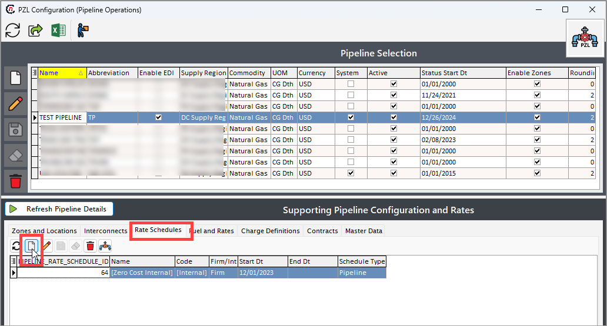
    
    !!! note "Note"

        Whenever you create or configure a new pipeline, a rate schedule is created by default. However, you can edit the details or delete the records as per your need.

3. Fill in the below details:
    1. **PIPELINE_RATE_SCHEDULE_ID:** This is auto-generated once you save the configuration.
    2. **Name:** Give a name to the rate schedule.
    3. **Code:** Give an abbreviation to the rate schedule name.
    4. **Firm/Int:** Drop-down to select firm or interruptible (IT).
    5. **Start dt/End tt:** Start and end date associated with the application of the schedule itself (not the individual rates).  End date is not mandatory.
    6. **Schedule type:** This is used for categorizing transport and storage.

4. Click on **Save** icon to save the changes.
5. Once the rate schedule is defined, use the **Pipeline charge ()** button to add applicable rate types defined in the previous section in the **Charge definition** screen.
    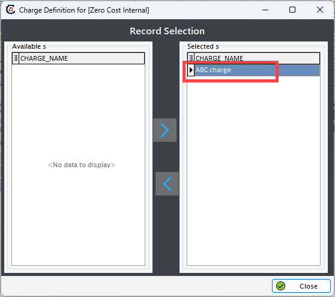

### Step 3: Setup fuels and rates

The **Fuel and rates** tab is the final step in building out the rate schedules. This tab captures the applicable charges (including in-kind fuel) that is updated each time a new rate is published by the pipeline. It allows users to input charges for various services or transactions, specify fuel rates to account for transportation losses, and applicable rates for precise settlement calculations.

The **Fuel and rates** tab contains three sub-tabs:

1. *Pipeline charges rate data*
2. *Test rate calculations*, and
3. *Rate matrix.*
    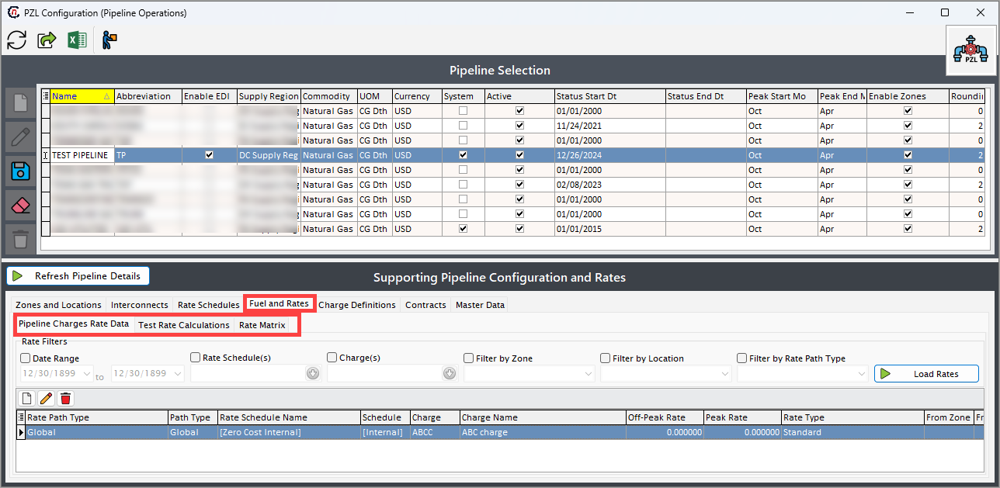

#### Pipeline charges rate data

This tab provides two core functionalities, filtering existing rates and manage rates. There are different filters available to refine the rate record. You can filter via:

1. **Date range:** Specify the period for rate applicability.
2. **Rate schedule(s):** Select one or multiple rate schedules.
3. **Charges:** Filter by specific charges.
4. **Filter by zone:** Narrow results based on zones.
5. **Filter by location:** Select specific locations for the rates. 
6. **Filter by rate path type:** Choose the rate path type for detailed filtering.
    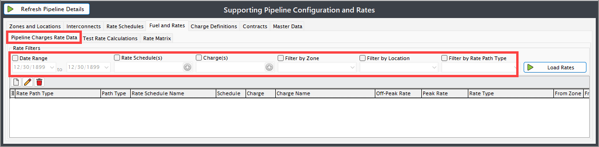

Once the desired filters are set, click on **Load rates** to display the filtered rates.

Use the **Add** or **Edit** button located under the filter section to manage rates. Configured rates are then displayed in the grid with relevant details.
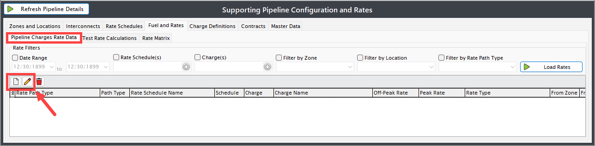

**To create a new rate:**

1. Click **Add** to create a new rate.
2. Choose the **Rate path type** from the dropdown list. The following fields are available in the dropdown:
    * **AllPts>DP: All points to one delivery point**
        * Indicates that charges apply for transporting natural gas from all receipt points to a single, specific delivery point.
        * **Use case**: When a system collects gas from multiple sources and delivers it to one endpoint.
    * **AllStgPnts:  All storage/pooling points**
        * Refers to charges or transactions associated with all designated storage or pooling points in the system.
        * **Use case**: When gas is temporarily stored or aggregated at specific points before delivery.
    * **AllZ>DZ: All zones to delivery zone**
        * Covers the transportation of gas from multiple zones (regions) to a single delivery zone.
        * **Use case**: Aggregating gas from various regions to deliver to a unified zone.
    * **Global**
        * A universal charge applied to all transactions in the system.
        * Includes charges like **ACA (Annual Charge Adjustment)** or other system-wide fees.
    * **P>P: Point to point**
        * A direct transaction or transportation charge for moving gas from one specific point to another.
        * **Use case**: Transporting gas between two fixed locations without intermediate stops.
    * **RP>AllPts: Receipt point to all points**
        * Indicates the transportation of gas from a single receipt point to all possible delivery points in the network.
        * **Use case**: Distribution from one entry point to multiple delivery destinations.
    * **PR>DZ: Receipt point to delivery zone**
        * Covers the transportation of gas from a specific receipt point to a designated delivery zone.
        * **Use case**: When gas from a single source is allocated to an entire delivery region.
    * **RP>AllZ: Receipt zone to all zones**
        * Charges apply for transporting gas from a receipt zone to all other zones in the network.
        * **Use case**: Broad distribution from one region to multiple other regions.

3. Define the category of rate from the **Rate types** dropdown:
    * **Standard:** Often called the maximum rate as defined by the tariff.
    * **Discounted:** Discounted rate off the maximum rate.  Often for a specific amount of time.
    * **Negotiated:** Applies to a specific contract
    * **Override:** Temporary rate to apply to a single rate path for a short amount of time.

4. **Start/end date:** Sets the effective period for the rate.

    !!! note "Note"
        End date should only be populated when a new rate applies.

5. **Peak/off-peak rate:** Rate applied during periods relating back to the periods defined for the pipeline.
6. **Rate schedule:** Lists [rate schedules](./rates_tariffs.md#step-2-setup-rates-schedules) defined for the selected pipeline.
7. **Charge type:** Lists defined [charge type definition](./rates_tariffs.md#step-1-define-the-charge-definitions) associated with the selected Rate Schedule.
8. **Receipt/delivery zone:** Specifies the zones for receipt and delivery if applicable.
9. **Receipt/delivery location:** Indicates specific locations for the transaction if applicable.
    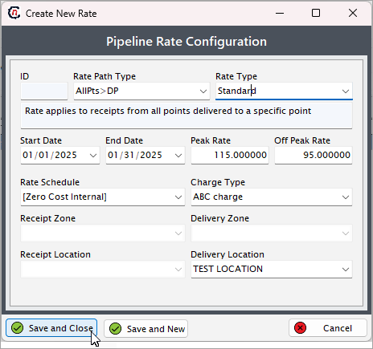

10. You can choose to save the defined rate and continue adding a new rate or simply save and close. Once closed the charge details are listed in the **Fuels and rates > Pipeline charges rate data** tab.
    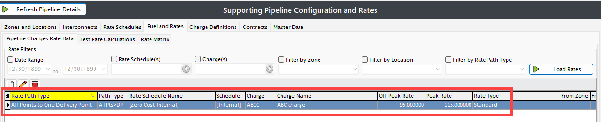

#### Test rate calculation

The **Test rate calculations** tab will allow you to verify the effective rates based on the charges configured in the Pipeline Charges Rate Data. You can input specific details and calculate the effective rate for accuracy before applying it to transactions.

Once you fill in the parameters like rate schedule, pipeline charges, etc., from the dropdown, click on the **Calculate effective rate** button to generate the results in the **Effective source** and **Effective rate** fields.

#### Rate matrix

The **Rate matrix** tab utilizes the required filters to quickly create rate records based on the receipt and delivery types (location, zone, etc.).  Please note that all filters must be selected to utilize this feature.
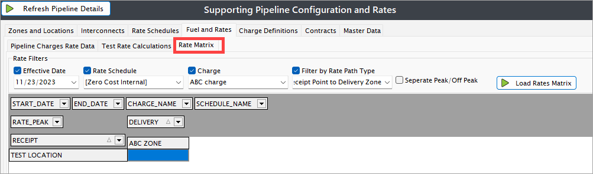

!!! note "Note"
    The **Rate path type** filter must align with the charge definition type in order to enter and save rates.must match the charge definition type to enter and save rates.

---