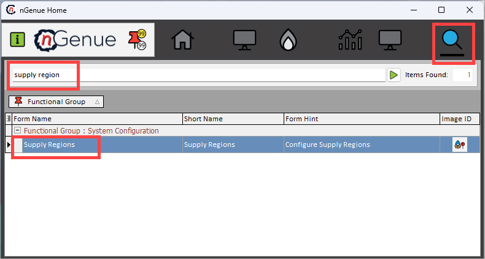
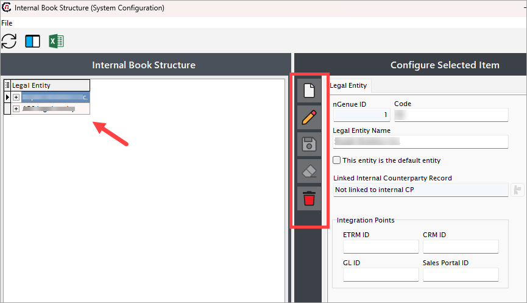

# Supply region

The Supply Region refers to the geographic areas where natural gas is extracted, processed, and made available for transportation to consumers. It encompasses all upstream and midstream activities involved in sourcing and delivering natural gas. The characteristics of a supply region can include the cost, availability, and efficiency of the natural gas supply.

!!!note "Example"
    For example, **ABC** can be a supply region, housing multiple supply points such as **X** and **Y.** This configuration helps aggregate volumes and pricing data for all resources from the region.

Configuring a supply region in the application impacts multiple screens, where users see a dropdown menu displaying the configured supply regions. This allows users to select a specific supply region from the dropdown. 

In some cases, a supply region is required.  Therefore, a minimum of one supply region should exist.

## Procedure to configure

This guide outlines the steps to configure a legal entity, business unit, strategy, and portfolio within the application.

### Prerequisites

* You must have the necessary permissions to add or modify supply region configuration in nGenue.

### Procedure

#### Step 1: Navigate to Supply region configuration screen

1.	Log in to the **nGenue** application.
2.	Click the **Search** icon and enter *supply region* in the search bar.  
3.	Double-click **Supply regions** to open the respective screen.

4. The next screen is divided into two sections: **Internal book structure** and **Configure selected item.**
    
    1. The **Internal book structure** section lists existing configurations, including legal entities, business units, portfolios, or strategies.
    2. The **Configure selected item** section allows you to create, edit, or delete book structure records. The table below describes the available icons and their functions:
    
        | Icons      | Description                          |
        | ----------- | ------------------------------------ |
        |         | Add a new record |
        |     | Edit the record detail. |
        |         |  Save the record. |
        |   | Cancel the updates being made to the record. |
        |   | Delete a record. |

#### Step 2: Create a new legal entity