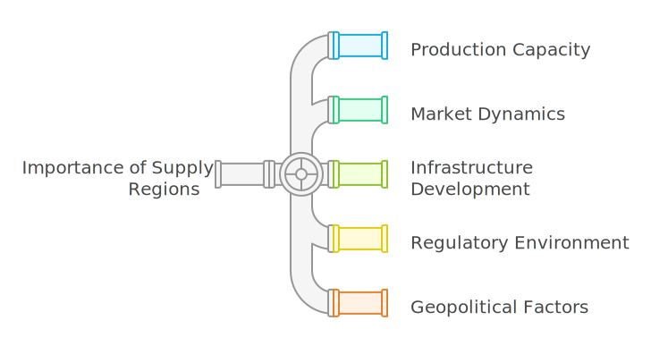

# Understanding supply region

The natural gas industry operates within a complex framework of supply and demand, where supply regions play a crucial role in determining the availability and pricing of natural gas. This document aims to elucidate the concept of supply regions, their significance, and how they impact the natural gas market.

## What is a supply region?

A **supply region** in the natural gas industry refers to a geographical area where natural gas is produced and made available for distribution to consumers and markets. These regions are characterized by the presence of natural gas reserves, production facilities, and infrastructure necessary for transportation and distribution. Supply regions can vary significantly in size and can encompass entire countries, states, or even specific fields or basins.

!!! example "Example of supply regions"
    The United States has several key supply regions, including the Appalachian Basin, the Permian Basin, and the Haynesville Shale, each contributing significantly to the country's natural gas production.

## Importance of supply regions

* **Production capacity:** Supply regions are critical for assessing the production capacity of natural gas. They indicate where the majority of natural gas is extracted and how much can be produced to meet demand.

* **Market dynamics:** The location of supply regions affects market dynamics, including pricing and availability. Regions with abundant natural gas reserves can influence global prices, while those with limited supply may experience higher costs.

* **Infrastructure development:** The development of pipelines, storage facilities, and processing plants is often concentrated in supply regions. This infrastructure is essential for transporting natural gas from production sites to consumers.

* **Regulatory environment:** Different supply regions may be subject to varying regulatory frameworks, which can impact production practices, environmental considerations, and market access.

* **Geopolitical factors:** Supply regions can also be influenced by geopolitical factors, such as trade agreements, conflicts, and international relations, which can affect the flow of natural gas across borders.

<!-- ## Why a supply region is required

1. **Efficient resource management**
    * Helps track the supply and demand for natural gas in a specific area or customer group.  
    * Facilitates planning for sourcing, storage, and distribution to meet regional needs.  

2. **Cost allocation**

    * Ensures accurate tracking and allocation of supply costs, such as transportation fees, storage costs, and operational expenses.
    * Supports precise calculation of the **Weighted Average Cost of Gas (WACOG)** for billing and profitability analysis.

3. **Operational segmentation**

    * Enables segmentation of supply operations by geography, market type, or customer segment.  
    * Simplifies management of multiple supply sources, transportation contracts, and storage facilities.

4. **Financial integration**

    * Links supply operations to financial accounts like **General Ledger (GL)**, **Accounts Payable (A/P)**, and **Accounts Receivable (A/R)** for accurate financial tracking and reporting.  
    * Supports compliance with accounting and regulatory standards.

5. **Strategic decision-making**

    * Provides a clear picture of gas supply and associated costs within a specific region.  
    * Assists in optimizing transportation routes, choosing storage locations, and negotiating supplier contracts.

6. **Customer segmentation and service**

    * Allows differentiation of services and pricing for customers within different regions.  
    * Tailors supply and transportation agreements based on regional customer needs. -->

### Example scenario

Suppose a natural gas company operates in two states: **State A** and **State B**.

* **State A** has industrial clients requiring high volumes, while **State B** serves residential customers.  
* By defining separate supply regions for each state:  
    * The company can manage contracts, transportation, and storage unique to each state.  
    * Supply costs can be accurately allocated, and customer pricing can be optimized based on regional needs.  

<!-- ## Procedure to configure a supply region

Configuring a supply region in the nGenue application impacts multiple screens. Users see a dropdown menu displaying the configured supply regions, which allows them to select a specific region from the dropdown.

In some cases, a supply region is required. Therefore, at least one supply region should exist.

The configuration process for the supply region captures key information about the defined supply region when used for accounting, reporting, or **WACOG** purposes.

### Prerequisites

* You must have the necessary permissions to *add* or *modify* supply region configuration in nGenue.

### Process steps

#### Step 1: Navigate to the Supply region configuration screen

1.	Log in to the **nGenue** application.
2.	Click the **Search** icon and enter *supply region* in the search bar.  
3.	Double-click **Supply regions** to open the respective screen.

4. The next screen is divided into two sections: **Supply region selection** and **Supply region configurations.**
    
    1. The **Supply region selection** section lists existing supply region configurations.
    2. The **Supply region configurations** section allows you to create, edit, or delete supply region records. The table below describes the available icons and their functions:
    
        | Icons      | Description                          |
        | ----------- | ------------------------------------ |
        |         | Add a supply region record |
        |     | Edit the supply region record detail. |
        |         |  Save the supply region record. |
        |   | Cancel the updates being made to the supply region record. |
        |   | Delete a supply region record. |

#### Step 2: Create a new supply region

1. In the **Supply region configurations** screen, click the **Add a supply region record** button.
2. Fill in the details as mentioned in the below table:

    | Fields | Description | Data type | Mandatory (Y/N) | Fetched from (UI screen) | Displayed on (UI screen)|
    | --- | --- |--- | --- |--- | --- |
    | Supply region Id | This field is auto-generated by the system and is created automatically when a new configuration is made | Auto-generated | Y | Auto-generated | N/A |
    | Code | A unique identifier that you can use for your supply region name.   For example: If the supply name name is **"ABC supply region,"** the code could be **"ABSR."** | Integer | Y | User input | Pipeline location |
    | Supply region name | Enter the name of the supply region that you wish to add during the configuration process. | Integer | Y | User input | Pipeline, Pipeline location, Deal creation and Deal management screen |
    | Business unit | Select the business unit that you want to link to your supply region. | Dropdown | N | Internal book structure screen | N/A |
    | Supply WACOG pool | Link a WACOG pool to the supply region for calculation.   If a supply region sources gas from multiple contracts, the WACOG pool calculates a blended rate, which becomes the reference for billing or further cost management. | Dropdown | N | Supply Wacog pool configuration screen | N/A |
    | GL Expense Account | Link the supply region’s operational expenses (e.g., transportation, storage) to the correct General Ledger (GL) account. | Dropdown | N | Chart of Accounts list screen | N/A |
    | GL A/P account and GL A/R account | Select the required account details for **GL A/P account** and **GL A/R account** respectively. These accounts are used either to track revenue generated or track payments owed to suppliers or vendors associated with the supply region. | Dropdown | N | Chart of Accounts list screen | N/A |
    | Description | Provide any additional details if any. | String | N | User input | Pipeline, and Deal creation screen |

    !!!note "Integration points"
        The fields in the **Integration points** section are automatically populated when third-party tools are integrated with nGenue. These fields can be skipped when entering data manually.

7. Once all mandatory fields are filled, click the **Save** button to configure the supply region.

## Conclusion

Supply regions are fundamental to the functioning of the natural gas industry, influencing production, pricing, and market dynamics. Understanding these regions helps stakeholders navigate the complexities of the natural gas market and make informed decisions regarding investments, infrastructure development, and energy policy. As the demand for natural gas continues to grow, the significance of supply regions will only increase, shaping the future of energy consumption worldwide.

---

## Related topics that you might be interested

-   :material-format-paint:{ .lg .middle } __Configuring a pipeline__

    ---

    Learn more about how to configure a pipeline within the nGenue application.

    [:octicons-arrow-right-24: Know more](./configure_pipeline.md)

-   :material-format-paint:{ .lg .middle } __Understanding ETRM__

    ---

    Understand the basics of ETRM and what are its key components.

    [:octicons-arrow-right-24: Know more](../etrm/addressing_etrm_aspects.md)    

-   :material-upload-network:{ .lg .middle } __Configuring a deal__

    ---

    Learn how to configure a deal in nGenue.

    [:octicons-arrow-right-24: Know more](../deal_management/overview.md)

-   :material-directions-fork:{ .lg .middle } __Understanding counterparties__

    ---

    Learn more about counterparties and their configuration steps within nGenue.

    [:octicons-arrow-right-24: Know more](../getting_started/counterparty/counterparty.md)

 -->