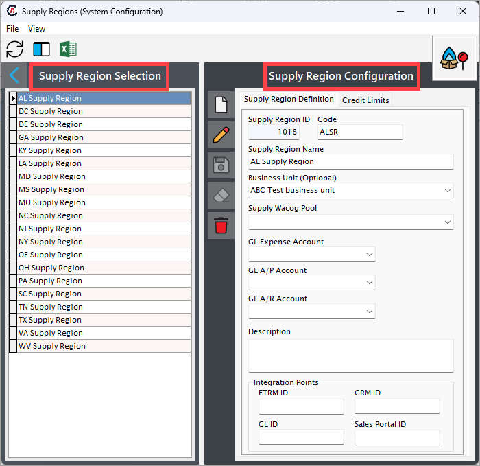

# Understanding supply region

The supply region refers to the geographic areas where natural gas is extracted, processed, and made available for transportation to consumers. It encompasses all upstream and midstream activities involved in sourcing and delivering natural gas. The characteristics of a supply region can include the cost, availability, and efficiency of the natural gas supply.

!!!example "Example"
    For example, **ABC** can be a supply region, housing multiple supply points such as **X** and **Y.** This configuration helps aggregate volumes and pricing data for all resources from the region.

## Why a supply region is required  

1. **Efficient resource management**
    * Helps track the supply and demand for natural gas in a specific area or customer group.  
    * Facilitates planning for sourcing, storage, and distribution to meet regional needs.  

2. **Cost allocation**

    * Ensures accurate tracking and allocation of supply costs, such as transportation fees, storage costs, and operational expenses.
    * Supports precise calculation of the **Weighted Average Cost of Gas (WACOG)** for billing and profitability analysis.

3. **Operational segmentation**

    * Enables segmentation of supply operations by geography, market type, or customer segment.  
    * Simplifies management of multiple supply sources, transportation contracts, and storage facilities.

4. **Financial integration**

    * Links supply operations to financial accounts like **General Ledger (GL)**, **Accounts Payable (A/P)**, and **Accounts Receivable (A/R)** for accurate financial tracking and reporting.  
    * Supports compliance with accounting and regulatory standards.

5. **Strategic decision-making**

    * Provides a clear picture of gas supply and associated costs within a specific region.  
    * Assists in optimizing transportation routes, choosing storage locations, and negotiating supplier contracts.

6. **Customer segmentation and service**

    * Allows differentiation of services and pricing for customers within different regions.  
    * Tailors supply and transportation agreements based on regional customer needs.

### Example Scenario

Suppose a natural gas company operates in two states: **State A** and **State B**.

- **State A** has industrial clients requiring high volumes, while **State B** serves residential customers.  
- By defining separate supply regions for each state:  
  - The company can manage contracts, transportation, and storage unique to each state.  
  - Supply costs can be accurately allocated, and customer pricing can be optimized based on regional needs.  

## Procedure to configure

Configuring a supply region in the application impacts multiple screens, where users see a dropdown menu displaying the configured supply regions. This allows users to select a specific supply region from the dropdown. 

In some cases, a supply region is required.  Therefore, a minimum of one supply region should exist.

The configuration process for the supply region captures key information about the defined supply region when used for accounting, reporting or weighted average cost of gas (WACOG) purposes.

### Prerequisites

* You must have the necessary permissions to add or modify supply region configuration in nGenue.

### Procedure

#### Step 1: Navigate to Supply region configuration screen

1.	Log in to the **nGenue** application.
2.	Click the **Search** icon and enter *supply region* in the search bar.  
3.	Double-click **Supply regions** to open the respective screen.

4. The next screen is divided into two sections: **Supply region selection** and **Supply region configurations.**
    
    1. The **Supply region selection** section lists existing supply region configurations.
    2. The **Supply region configurations** section allows you to create, edit, or delete supply region records. The table below describes the available icons and their functions:
    
        | Icons      | Description                          |
        | ----------- | ------------------------------------ |
        |         | Add a supply region record |
        |     | Edit the supply region record detail. |
        |         |  Save the supply region record. |
        |   | Cancel the updates being made to the supply region record. |
        |   | Delete a supply region record. |

#### Step 2: Create a new supply region

1. In the **Supply region configurations** screen, click the **Add a supply region record** button.
2. Enter a name for the legal entity and a unique identifier in the **Supply region name** and **Code** fields, respectively.
    
    !!! example "Example"

        If the supply name name is **"ABC supply region,"** the code could be **"ABSR."**

3. To link a business unit to this supply region, select the business unit from the **Business unit** dropdown. This is optional.
4. Similarly, to link a WACOG pool to this supply region for calculation, select from the **Supply WACOG pool** dropdown. 

    !!! note "Note"
        If a supply region sources gas from multiple contracts, the WACOG pool calculates a blended rate, which becomes the reference for billing or further cost management.

5. To links the supply region’s operational expenses (e.g., transportation, storage) to the correct General Ledger (GL) account, select the account from the **GL expenses account** from the dropdown.
6. Select the required account details for **GL A/P account** and **GL A/R account** respectively. This accounts are used either to tracks revenue generated or tracks payments owed to suppliers or vendors associated with the supply region.

7. Enter a short description in the **Description** field if required.

    !!!note "Integration points"
        The fields in the **Integration points** section are automatically populated when third-party tools are integrated with nGenue. These fields can be skipped when entering data manually.

7. Once all mandatory fields are filled, click the **Save** button to configure the supply region.
